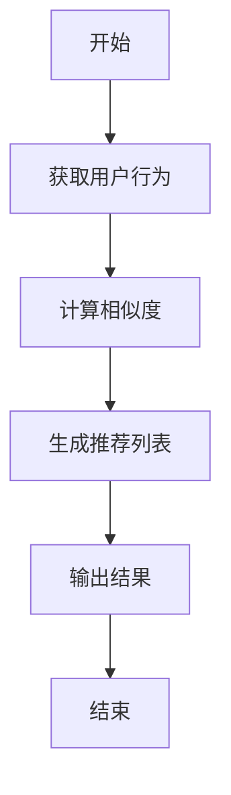
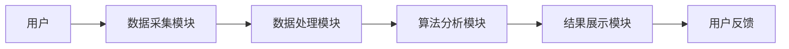
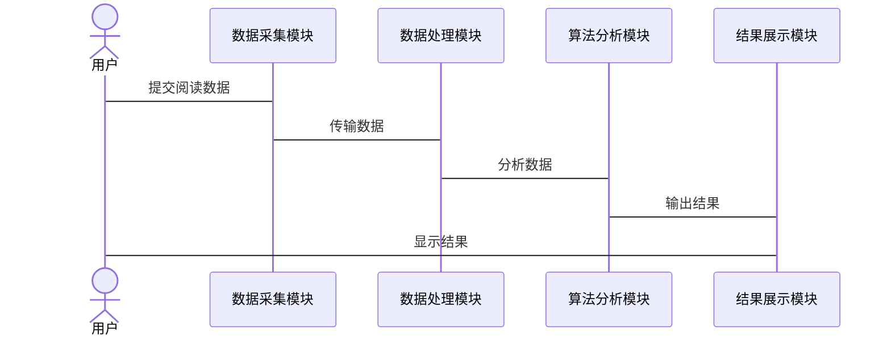

                 


# 智能书签：AI Agent的阅读进度追踪

> 关键词：AI Agent，阅读进度追踪，智能书签，知识管理，推荐算法，系统架构

> 摘要：本文探讨了AI Agent在阅读进度追踪中的应用，重点介绍了智能书签的概念、算法原理、系统架构及项目实现。通过详细的技术分析和实际案例，展示了如何利用AI技术提升阅读效率与知识管理能力。

---

## 第1章: 智能书签的背景与问题背景

### 1.1 阅读进度追踪的重要性

#### 1.1.1 阅读效率与知识管理的痛点
在信息爆炸的时代，阅读效率和知识管理成为个人和组织的核心竞争力。传统阅读进度追踪方法依赖手动记录，存在效率低、易遗忘、难以系统化等问题。

#### 1.1.2 AI技术在阅读追踪中的应用潜力
AI技术，尤其是自然语言处理和机器学习，为阅读进度追踪提供了新的可能性。通过分析阅读内容和用户行为，AI Agent能够实时记录、智能总结和个性化推荐，极大地提升了阅读效率。

#### 1.1.3 智能书签的核心价值与目标
智能书签的目标是通过AI技术实现阅读进度的智能化管理，帮助用户高效记录、理解和应用所读内容。其核心价值在于将阅读行为数据化、系统化，并通过AI算法提供个性化服务。

### 1.2 问题背景与问题描述

#### 1.2.1 阅读进度追踪的传统方法与局限性
传统方法依赖手工记录，存在以下问题：
1. **效率低下**：手动记录耗时，容易遗漏。
2. **缺乏深度分析**：无法对阅读内容进行深入分析和总结。
3. **难以个性化**：无法根据用户偏好提供个性化推荐。

#### 1.2.2 AI Agent在阅读追踪中的独特优势
AI Agent具备以下优势：
1. **实时性**：能够实时记录阅读进度。
2. **智能化**：通过自然语言处理和机器学习，提供智能摘要和推荐。
3. **个性化**：根据用户行为和偏好，提供定制化服务。

#### 1.2.3 智能书签的边界与外延
智能书签不仅记录阅读进度，还涵盖阅读内容的理解、总结和应用。其外延包括个性化推荐、知识网络构建等功能。

---

## 第2章: AI Agent与智能书签的核心概念

### 2.1 AI Agent的基本原理

#### 2.1.1 AI Agent的定义与分类
AI Agent是一种能够感知环境并采取行动以实现目标的智能体。根据智能水平，可分为简单反射型、基于模型的反射型、目标驱动型和实用驱动型。

#### 2.1.2 AI Agent的核心要素与属性
AI Agent的核心要素包括感知、决策、行动和学习能力。其属性包括能动性、智能性和适应性。

#### 2.1.3 AI Agent与传统软件的区别
AI Agent具备自主性、反应性和学习能力，而传统软件依赖于预定义规则，缺乏自主性和适应性。

### 2.2 智能书签的核心概念

#### 2.2.1 智能书签的功能与应用场景
智能书签的功能包括阅读进度记录、智能摘要、个性化推荐和知识网络构建。其应用场景广泛，如学术研究、知识管理、内容创作等。

#### 2.2.2 智能书签的实现原理与技术架构
智能书签的实现依赖于自然语言处理、机器学习和知识图谱等技术。其技术架构包括数据采集、处理、分析和展示四个阶段。

#### 2.2.3 智能书签与传统书签的对比分析
智能书签在功能、效率和智能化方面远超传统书签，能够实时记录、智能分析和个性化推荐。

### 2.3 AI Agent与智能书签的关系与联系

#### 2.3.1 核心概念原理
AI Agent作为智能书签的核心驱动力，负责数据采集、分析和推荐。智能书签则通过AI Agent实现其功能。

#### 2.3.2 核心概念属性对比表格
| 概念       | 能动性 | 智能性 | 适应性 |
|------------|--------|--------|--------|
| AI Agent   | 高     | 高     | 高     |
| 智能书签   | 中     | 中     | 中     |

#### 2.3.3 ER实体关系图
```mermaid
er
actor(AI Agent) -|> entity(阅读进度数据)
actor(AI Agent) -|> entity(用户偏好)
actor(AI Agent) -|> entity(书签信息)
```

---

## 第3章: AI Agent的核心算法与数学模型

### 3.1 推荐算法的原理与实现

#### 3.1.1 协同过滤算法
协同过滤通过分析用户行为和偏好，推荐相似内容。其公式为：
$$\text{相似度} = \frac{\sum (x_i - \mu)(y_i - \mu)}{\sqrt{\sum (x_i - \mu)^2} \sqrt{\sum (y_i - \mu)^2}}$$

#### 3.1.2 基于深度学习的推荐模型
深度学习模型通过神经网络提取特征，推荐公式为：
$$\hat{y} = Wx + b$$
其中，$W$是权重矩阵，$x$是输入向量，$b$是偏置项。

#### 3.1.3 算法流程图


#### 3.1.4 Python代码示例
```python
def collaborative_filtering(user_data):
    # 计算相似度
    similarities = {}
    for user in user_data:
        similarities[user] = []
        for other_user in user_data:
            if user != other_user:
                similarities[user].append(cosine_similarity(user_data[user], user_data[other_user]))
    return similarities

# 示例数据
user_data = {
    'user1': {'item1': 5, 'item2': 4},
    'user2': {'item1': 4, 'item2': 5}
}

# 调用函数
result = collaborative_filtering(user_data)
print(result)
```

---

## 第4章: 系统架构与实现方案

### 4.1 系统架构设计

#### 4.1.1 系统功能模块
系统主要功能模块包括数据采集、处理、分析和展示。

#### 4.1.2 系统架构图


#### 4.1.3 系统交互图


### 4.2 系统实现细节

#### 4.2.1 数据采集模块
实现用户阅读行为的实时采集，包括时间戳、阅读位置等信息。

#### 4.2.2 数据处理模块
对采集到的数据进行清洗、预处理和特征提取。

#### 4.2.3 算法分析模块
利用推荐算法生成个性化推荐列表。

#### 4.2.4 结果展示模块
将分析结果以可视化形式展示给用户。

---

## 第5章: 项目实战与应用案例

### 5.1 环境安装与配置

#### 5.1.1 安装Python与相关库
安装Python 3.x，以及numpy、pandas、scikit-learn等库。

#### 5.1.2 安装IDE与开发工具
推荐使用PyCharm或Jupyter Notebook进行开发。

### 5.2 核心代码实现

#### 5.2.1 数据处理代码
```python
import pandas as pd
import numpy as np

def preprocess_data(data):
    # 数据清洗
    data = data.dropna()
    # 特征提取
    features = data[['user_id', 'item_id', 'rating']]
    return features

# 示例数据
data = pd.DataFrame({
    'user_id': [1, 2, 3],
    'item_id': [101, 102, 101],
    'rating': [5, 4, 5]
})

processed_data = preprocess_data(data)
print(processed_data)
```

#### 5.2.2 推荐算法代码
```python
from sklearn.metrics.pairwise import cosine_similarity

def collaborative_filtering(train, test):
    # 计算余弦相似度
    similarities = cosine_similarity(train, test)
    # 生成推荐列表
    recommendations = []
    for i in range(len(test)):
        idx = np.argmax(similarities[i])
        recommendations.append(train.iloc[idx])
    return recommendations

# 示例数据
train = pd.DataFrame({'item_id': [101, 102], 'features': [[5,4], [4,5]]})
test = pd.DataFrame({'item_id': [103], 'features': [[3,4]]})

result = collaborative_filtering(train, test)
print(result)
```

### 5.3 项目小结与经验分享

#### 5.3.1 项目实现的关键点
- 数据预处理的准确性
- 推荐算法的选型与优化
- 系统架构的可扩展性

#### 5.3.2 实际案例分析
通过实际案例，展示智能书签在学术研究中的应用，分析其效果和改进方向。

---

## 第6章: 最佳实践与未来展望

### 6.1 最佳实践技巧

#### 6.1.1 数据处理的注意事项
- 数据清洗要彻底，避免噪声干扰。
- 特征提取要精准，选择合适的特征组合。

#### 6.1.2 算法优化的技巧
- 根据数据规模选择合适的算法。
- 调参时注意模型的泛化能力。

### 6.2 未来展望与发展趋势

#### 6.2.1 技术发展趋势
- 更加智能化的推荐算法。
- 结合知识图谱的深度学习模型。

#### 6.2.2 应用场景的扩展
- 领域知识管理的深化应用。
- 跨平台的智能书签服务。

---

## 总结与致谢

智能书签作为AI技术与阅读追踪的结合，为知识管理提供了新的思路。通过本文的详细讲解，读者可以深入了解其背后的技术原理和实现方法。未来，随着AI技术的不断发展，智能书签将发挥更大的作用。

---

以上是《智能书签：AI Agent的阅读进度追踪》的完整目录和内容概览，涵盖了从背景介绍到系统实现的全过程，帮助读者全面理解和掌握智能书签的技术细节。

