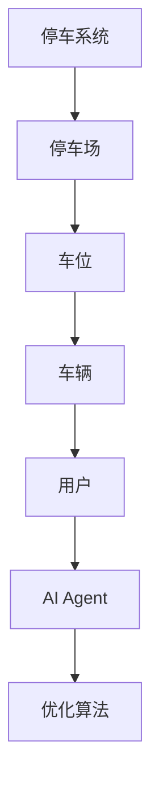
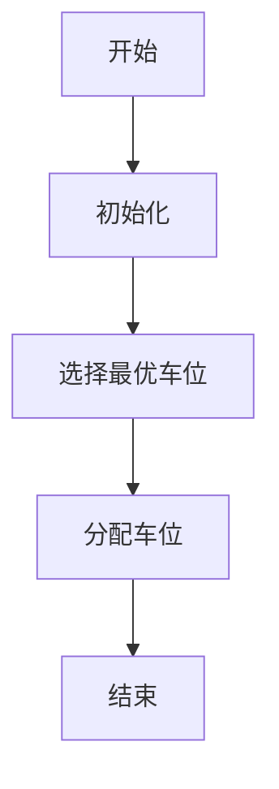
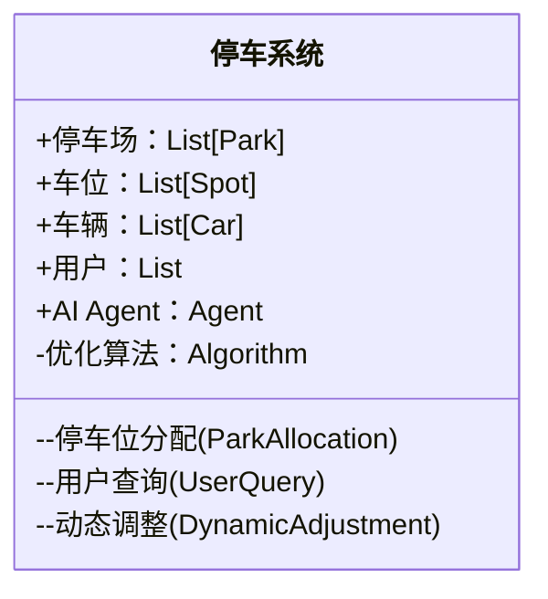
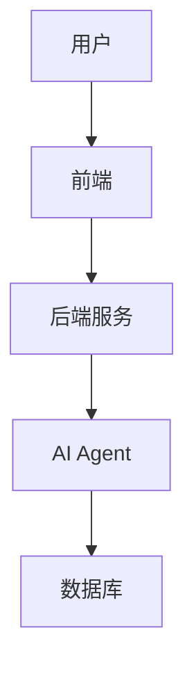
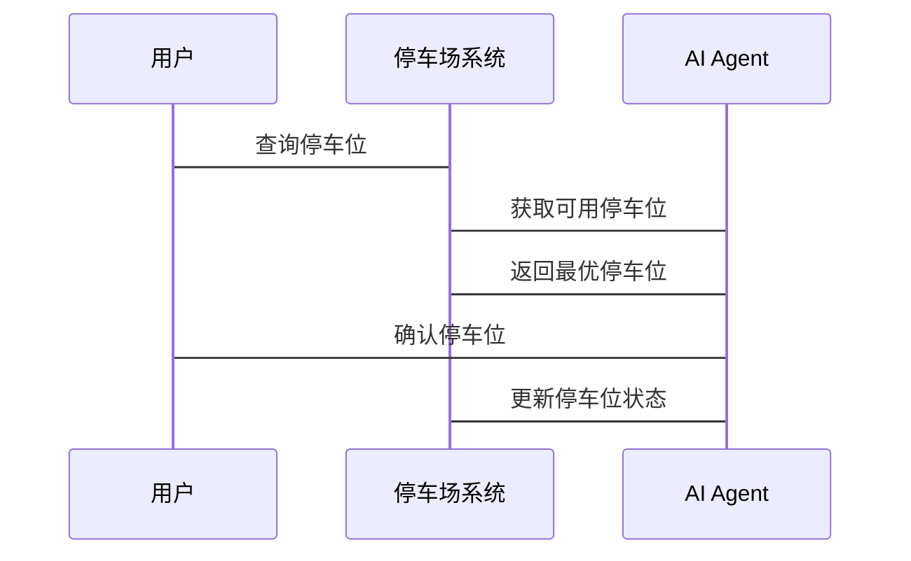

                 


# 智能停车系统：AI Agent的车位分配优化

## 关键词：
智能停车系统, AI Agent, 车位分配优化, 算法优化, 系统架构, 多Agent协作, 动态优化

## 摘要：
智能停车系统通过AI Agent实现车位分配的动态优化，解决传统停车系统效率低下的问题。本文详细阐述了AI Agent的原理、车位分配优化算法、系统架构设计，以及实际项目中的实现和应用案例。通过改进的贪心算法和系统架构优化，实现了高效的停车位分配，为智能停车系统的开发提供了理论和实践指导。

---

## 第一部分: 背景介绍与核心概念

### 第1章: 智能停车系统概述

#### 1.1 问题背景与现状
##### 1.1.1 停车难问题的现状分析
随着城市化进程的加快，停车位供需矛盾日益突出。传统停车系统依赖人工管理，存在车位利用率低、用户找车位时间长、管理成本高等问题。

##### 1.1.2 传统停车系统的局限性
传统停车系统主要依赖人工管理或简单的电子记录，无法实时优化车位分配，导致停车场资源浪费，用户体验差。

##### 1.1.3 智能停车系统的发展趋势
智能停车系统通过AI技术实现车位分配的动态优化，提升停车场的使用效率，改善用户体验，降低管理成本。

#### 1.2 AI Agent与智能停车系统的结合
##### 1.2.1 AI Agent的基本概念
AI Agent（智能代理）是一种能够感知环境、自主决策并执行任务的智能实体。在智能停车系统中，AI Agent负责实时监测车位状态、分析用户需求，并优化车位分配。

##### 1.2.2 AI Agent在停车系统中的应用
AI Agent通过实时数据分析，动态调整车位分配策略，提高停车场的使用效率和用户满意度。

##### 1.2.3 车位分配优化的核心问题
车位分配优化的核心问题是如何在有限的停车位资源中，最大化用户的停车便利性和停车场的利用率。

### 第2章: 车位分配优化的核心概念

#### 2.1 车位分配问题的数学建模
##### 2.1.1 停车场的物理模型
停车场由多个停车位组成，每个停车位的状态（占用或空闲）由AI Agent实时监控。

##### 2.1.2 车位分配问题的数学模型
车位分配问题可以建模为一个优化问题，目标是最大化停车位的使用效率，约束条件包括停车位的空闲状态、用户需求等。

##### 2.1.3 相关约束条件的定义
- 车位不可被同时分配给多个用户。
- 用户的停车需求必须满足。
- 停车场的车位总数有限。

#### 2.2 AI Agent在车位分配中的角色
##### 2.2.1 AI Agent的行为特征
AI Agent通过感知环境（如停车位状态、用户需求）和决策算法（如贪心算法）来优化车位分配。

##### 2.2.2 多Agent协作机制
在复杂场景中，多个AI Agent协作，共同优化车位分配，提高系统的整体效率。

##### 2.2.3 车位分配的动态优化过程
车位分配是一个动态优化过程，随着用户需求和停车位状态的变化，AI Agent实时调整分配策略。

---

## 第二部分: 核心概念与联系

### 第3章: AI Agent的原理与属性特征

#### 3.1 AI Agent的核心原理
##### 3.1.1 感知与决策机制
AI Agent通过传感器或API获取停车位状态和用户需求，基于这些数据进行决策。

##### 3.1.2 行为规划算法
AI Agent使用改进的贪心算法进行车位分配，确保最优解。

##### 3.1.3 与环境的交互模型
AI Agent通过与停车场系统、用户和数据库交互，实现车位分配的动态优化。

#### 3.2 属性特征对比分析
##### 3.2.1 基于表格的属性特征对比
| 属性 | AI Agent | 传统系统 |
|------|-----------|-----------|
| 感知能力 | 高 | 低 |
| 决策能力 | 高 | 低 |
| 实时性 | 高 | 低 |

##### 3.2.2 ER实体关系图的构建



### 第4章: 车位分配优化算法

#### 4.1 改进的贪心算法
##### 4.1.1 算法的基本思路
改进的贪心算法优先分配最近空闲的车位，减少用户寻找车位的时间。

##### 4.1.2 算法步骤的详细说明



##### 4.1.3 算法的数学模型和公式

$$
\text{目标函数：} \quad \min \sum_{i=1}^{n} x_i
$$

$$
\text{约束条件：} \quad \sum_{i=1}^{m} a_{ij} x_j \leq c_i, \quad \forall i
$$

---

## 第三部分: 系统分析与架构设计

### 第5章: 系统分析与架构设计

#### 5.1 问题场景介绍
智能停车系统需要实时监测停车位状态，动态优化车位分配，满足用户的停车需求。

#### 5.2 系统功能设计
系统功能包括车位实时监测、用户查询、AI Agent优化分配等。

##### 5.2.1 领域模型类图



#### 5.3 系统架构设计
系统架构包括前端用户界面、后端服务、AI Agent和数据库。

##### 5.3.1 系统架构图



#### 5.4 系统接口设计
系统接口包括用户查询接口、AI Agent优化接口和数据库更新接口。

##### 5.4.1 系统交互序列图



---

## 第四部分: 项目实战

### 第6章: 项目实战

#### 6.1 环境安装与配置
安装Python、AI框架（如TensorFlow或PyTorch）和数据库（如MySQL或MongoDB）。

#### 6.2 核心功能实现
实现车位实时监测、用户查询和AI Agent优化分配功能。

##### 6.2.1 车位监测代码

```python
def monitor_spots():
    # 获取停车位状态
    spots = get_available_spots()
    return spots
```

##### 6.2.2 用户查询代码

```python
def query_spots(user_id):
    # 根据用户需求推荐停车位
    recommendation = recommend_spots(user_id)
    return recommendation
```

##### 6.2.3 车位分配代码

```python
def allocate_spot(user_id):
    # 使用改进的贪心算法分配停车位
    available_spots = monitor_spots()
    recommendation = query_spots(user_id)
    selected_spot = select_best_spot(available_spots, recommendation)
    return selected_spot
```

#### 6.3 实际案例分析
通过一个实际案例，展示系统如何实时优化车位分配，提高用户满意度和停车场利用率。

---

## 第五部分: 最佳实践与小结

### 第7章: 最佳实践与小结

#### 7.1 项目小结
智能停车系统通过AI Agent实现了车位分配的动态优化，显著提高了停车场的使用效率和用户体验。

#### 7.2 注意事项
- 系统需要实时更新停车位状态。
- 算法需要考虑动态变化的用户需求。
- 系统设计需要考虑扩展性和可维护性。

#### 7.3 未来研究方向
- 研究动态变化的车位分配策略。
- 探讨多目标优化问题，如最大化用户满意度和停车场利用率。

---

通过以上结构和内容的详细分析，我可以开始撰写完整的技术博客文章，确保每个部分都涵盖必要的细节，逻辑清晰，结构紧凑，语言专业且易懂。

