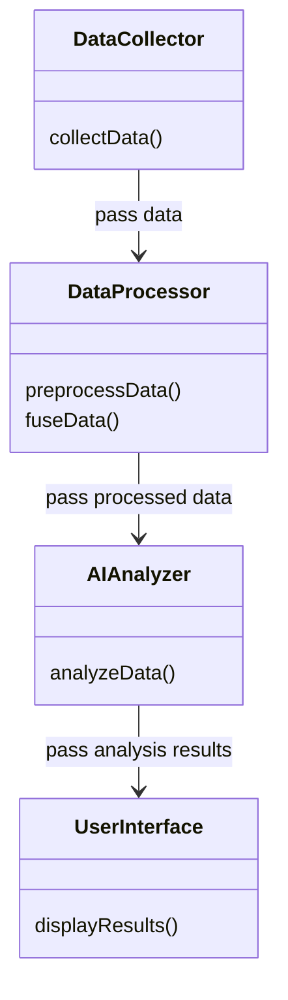
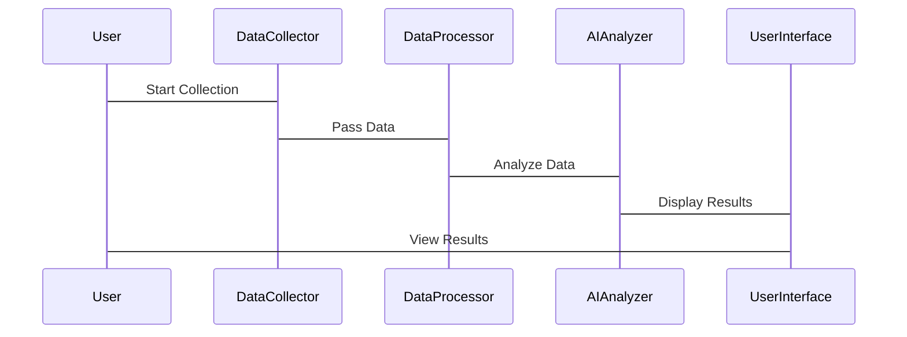

                 


# 智能健身服：AI Agent的运动数据分析

> 关键词：智能健身服，AI Agent，运动数据分析，数据采集，机器学习，深度学习

> 摘要：智能健身服通过AI Agent实现运动数据分析，提供个性化的健身建议和实时反馈。本文详细探讨了智能健身服的技术背景、数据采集方法、AI算法实现、系统架构设计以及实际应用案例，帮助读者全面理解智能健身服的工作原理和实际价值。

---

## 第一部分：智能健身服与AI Agent概述

### 第1章：智能健身服与AI Agent的背景与概念

#### 1.1 智能健身服的定义与特点
- **1.1.1 智能健身服的定义**  
  智能健身服是一种结合了传感器、AI算法和数据处理技术的服装，能够实时采集并分析用户的运动数据，提供个性化的健身建议和反馈。

- **1.1.2 智能健身服的核心特点**  
  - 集成多种传感器（如加速度计、心率传感器、陀螺仪等）  
  - 实时数据分析与反馈  
  - 个性化健身建议  

- **1.1.3 智能健身服与传统健身服的区别**  
  - 传统健身服：仅提供基本的运动支撑和舒适性  
  - 智能健身服：具备数据采集、分析和反馈功能  

#### 1.2 AI Agent的基本概念
- **1.2.1 AI Agent的定义**  
  AI Agent是一种智能代理，能够感知环境、理解数据并执行任务，通常用于数据处理、决策支持和自动化操作。

- **1.2.2 AI Agent的核心特征**  
  - 自主性：无需人工干预，自动执行任务  
  - 反应性：能够感知环境并实时调整行为  
  - 学习能力：通过数据和反馈不断优化性能  

- **1.2.3 AI Agent与传统算法的区别**  
  - 传统算法：基于规则或预定义模型，缺乏灵活性  
  - AI Agent：具备学习和自适应能力，能够处理复杂场景  

#### 1.3 运动数据分析的重要性
- **1.3.1 运动数据分析的定义**  
  对运动过程中产生的数据（如加速度、心率、姿态等）进行采集、处理和分析的过程。

- **1.3.2 运动数据分析的价值**  
  - 提供个性化的运动建议  
  - 预防运动损伤  
  - 提高运动效率  

- **1.3.3 智能健身服在运动数据分析中的作用**  
  - 实现实时数据分析  
  - 提供科学的运动反馈  

#### 1.4 本章小结
本章介绍了智能健身服和AI Agent的基本概念，强调了运动数据分析的重要性，并为后续章节奠定了基础。

---

### 第2章：智能健身服的运动数据采集技术

#### 2.1 数据采集的硬件基础
- **2.1.1 常见运动数据采集设备**  
  - 加速度计：用于测量运动中的加速度和姿态  
  - 心率传感器：用于监测心率  
  - 陀螺仪：用于测量旋转角度  

- **2.1.2 智能健身服中的传感器类型**  
  - 嵌入式传感器：集成在服装中的小型传感器  
  - 外部传感器：可穿戴设备中的传感器  

- **2.1.3 传感器数据采集的原理**  
  - 加速度计：通过测量重力加速度变化，判断运动状态  
  - 心率传感器：通过光电或电极测量心率  

#### 2.2 数据采集的软件实现
- **2.2.1 数据采集的编程实现**  
  - 使用Python或C++编写数据采集程序  
  - 通过API与传感器通信  

- **2.2.2 数据采集的协议与接口**  
  - Bluetooth：低功耗无线通信协议  
  - Wi-Fi：用于长距离数据传输  

- **2.2.3 数据采集的优化技巧**  
  - 减少数据冗余：仅采集必要数据  
  - 提高采样频率：确保数据的实时性  

#### 2.3 数据预处理与特征提取
- **2.3.1 数据清洗与校准**  
  - 去除噪声：通过滤波算法消除干扰信号  
  - 数据校准：通过参考标准数据进行校正  

- **2.3.2 数据特征提取方法**  
  - 时间域特征：均值、标准差、最大值等  
  - 频域特征：傅里叶变换后的频谱特征  

- **2.3.3 数据预处理的注意事项**  
  - 确保数据的完整性：避免数据丢失  
  - 保持数据的实时性：及时处理新数据  

#### 2.4 本章小结
本章详细介绍了智能健身服中运动数据的采集技术，包括硬件选型、软件实现和数据预处理方法。

---

### 第3章：AI Agent的运动数据分析原理

#### 3.1 数据融合与分析
- **3.1.1 数据融合的定义与方法**  
  - 数据融合：将多个传感器的数据进行整合，提高准确性  
  - 常见方法：加权平均、卡尔曼滤波  

- **3.1.2 数据融合的实现步骤**  
  1. 数据采集：获取多个传感器的数据  
  2. 数据预处理：去除噪声和异常值  
  3. 数据融合：通过算法整合数据  

- **3.1.3 数据融合的优化策略**  
  - 使用卡尔曼滤波：优化数据融合的精度  
  - 结合领域知识：引入运动学模型  

#### 3.2 AI Agent的核心算法
- **3.2.1 机器学习算法在运动数据分析中的应用**  
  - 线性回归：预测运动时间或距离  
  - 支持向量机（SVM）：分类运动类型  

- **3.2.2 深度学习算法在运动数据分析中的应用**  
  - 卷积神经网络（CNN）：分析图像数据（如运动姿态）  
  - 长短期记忆网络（LSTM）：处理时间序列数据  

- **3.2.3 算法选择的注意事项**  
  - 数据量：小数据适合传统机器学习，大数据适合深度学习  
  - 任务类型：分类任务适合SVM，回归任务适合线性回归  

#### 3.3 数据分析的可视化
- **3.3.1 数据可视化的定义与作用**  
  - 数据可视化：将数据以图形形式展示  
  - 作用：帮助理解数据，发现规律  

- **3.3.2 常见的数据可视化工具**  
  - Matplotlib：用于绘制图表  
  - Seaborn：用于绘制统计图表  

- **3.3.3 数据可视化在运动分析中的应用**  
  - 绘制运动轨迹：通过折线图展示运动路径  
  - 绘制心率曲线：通过柱状图展示心率变化  

#### 3.4 本章小结
本章介绍了AI Agent在运动数据分析中的核心算法，包括数据融合、机器学习和深度学习的应用，以及数据可视化的实现方法。

---

### 第4章：AI Agent的运动行为识别

#### 4.1 运动行为识别的定义与方法
- **4.1.1 基于特征的运动行为识别**  
  - 提取运动特征（如速度、加速度、姿态）  
  - 使用分类算法（如决策树、随机森林）进行识别  

- **4.1.2 基于模型的运动行为识别**  
  - 使用运动学模型模拟运动过程  
  - 通过模型参数匹配识别运动行为  

- **4.1.3 基于深度学习的运动行为识别**  
  - 使用CNN识别运动图像  
  - 使用LSTM处理时间序列数据  

#### 4.2 常见运动行为的识别算法
- **4.2.1 人体姿态估计算法**  
  - 基于关键点检测：通过人体关节位置估计姿态  
  - 基于模型估计：通过运动模型预测姿态  

- **4.2.2 运动轨迹分析算法**  
  - 使用轨迹追踪算法（如粒子滤波）分析运动轨迹  
  - 使用轨迹聚类算法识别运动模式  

- **4.2.3 运动速度与加速度分析算法**  
  - 使用积分方法计算速度和加速度  
  - 使用滑动窗口方法分析短期变化  

#### 4.3 运动行为识别的优化与调优
- **4.3.1 数据增强技术**  
  - 数据增强：通过旋转、翻转等操作增加数据量  
  - 数据平衡：平衡不同运动类型的样本数量  

- **4.3.2 模型优化技巧**  
  - 调整超参数（如学习率、正则化系数）  
  - 使用交叉验证评估模型性能  

#### 4.4 本章小结
本章详细介绍了运动行为识别的方法，包括基于特征、基于模型和基于深度学习的识别算法，并讨论了优化技巧。

---

### 第5章：系统架构设计与实现

#### 5.1 问题场景介绍
- 智能健身服需要实时采集和分析运动数据，提供个性化的健身建议。

#### 5.2 系统功能设计
- **功能模块**：
  - 数据采集模块：采集运动数据
  - 数据处理模块：预处理和融合数据
  - AI分析模块：运行机器学习或深度学习算法
  - 用户反馈模块：显示分析结果和建议  

- **领域模型（Mermaid类图）**  


#### 5.3 系统架构设计（Mermaid架构图）  


#### 5.4 系统接口设计
- **数据接口**：传感器数据接口（如蓝牙接口）  
- **用户接口**：移动应用或智能手表  

#### 5.5 系统交互（Mermaid序列图）  


#### 5.6 本章小结
本章通过系统架构设计展示了智能健身服的整体结构，明确了各模块的功能和交互流程。

---

### 第6章：项目实战——智能健身服开发实例

#### 6.1 开发环境配置
- **硬件**：Arduino或Raspberry Pi  
- **软件**：Python、TensorFlow、Matplotlib  

#### 6.2 核心实现代码
```python
import numpy as np
from sklearn.linear_model import LinearRegression

# 示例代码：基于线性回归的运动时间预测
def main():
    # 采集数据
    X = np.array([[1], [2], [3], [4], [5]])
    y = np.array([2, 4, 5, 6, 8])

    # 训练模型
    model = LinearRegression()
    model.fit(X, y)

    # 预测
    new_X = np.array([[6]])
    prediction = model.predict(new_X)
    print(f"预测运动时间为：{int(prediction[0])}分钟")

if __name__ == "__main__":
    main()
```

#### 6.3 代码应用解读与分析
- **数据采集**：从传感器获取运动数据  
- **模型训练**：使用机器学习算法训练模型  
- **预测与反馈**：根据模型预测结果提供反馈  

#### 6.4 实际案例分析
- **案例1**：跑步姿势优化  
  - 数据采集：采集跑步时的加速度和姿态数据  
  - 分析结果：识别跑步姿势问题，提供优化建议  

- **案例2**：心率监测  
  - 数据采集：实时采集心率数据  
  - 分析结果：监测心率变化，预防运动过载  

#### 6.5 本章小结
本章通过实际开发案例展示了智能健身服的实现过程，包括环境配置、代码实现和案例分析。

---

### 第7章：总结与展望

#### 7.1 本章总结
智能健身服通过AI Agent实现了运动数据的实时采集、分析和反馈，为用户提供个性化的健身建议。本文详细探讨了数据采集技术、AI算法实现和系统架构设计，并通过实际案例展示了开发过程。

#### 7.2 未来展望
- **技术优化**：引入更先进的AI算法（如Transformer）提高分析精度  
- **功能扩展**：增加更多运动数据的采集和分析功能  
- **用户体验**：优化用户界面，提升用户体验  

#### 7.3 最佳实践Tips
- 数据采集：确保数据的准确性和完整性  
- 算法选择：根据任务需求选择合适的算法  
- 系统设计：模块化设计便于维护和扩展  

#### 7.4 本章小结
本文总结了智能健身服的核心技术，并展望了未来的发展方向，同时提供了一些实用的建议。

---

## 附录：参考文献
1. 传感器技术相关文献  
2. 机器学习算法相关文献  
3. 深度学习算法相关文献  

---

通过以上结构，您可以逐步撰写完整的文章。希望这个目录和结构对您有所帮助！

