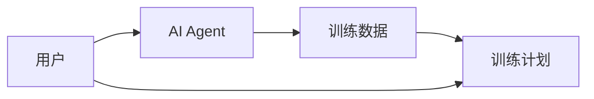
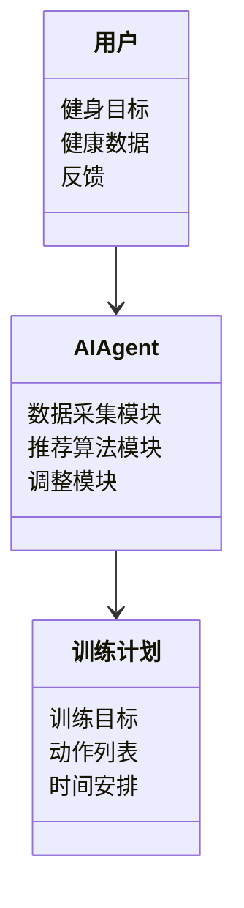
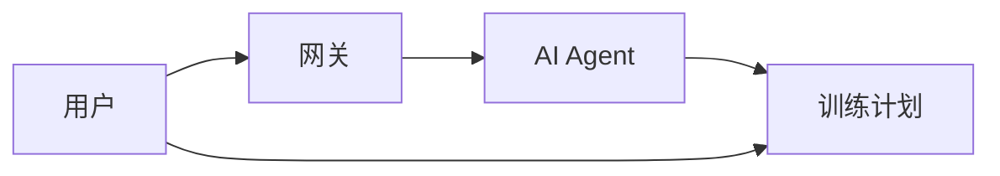

                 


# {{《智能健身：AI Agent的个性化训练计划》}}

> 关键词：智能健身，AI Agent，个性化训练计划，推荐系统，数学模型，系统架构，算法原理

> 摘要：本文深入探讨了AI Agent在智能健身领域的应用，特别是如何通过个性化训练计划来提升健身效果。文章从背景、概念、算法原理、系统架构设计、项目实战等多个维度，详细分析了AI Agent在个性化训练计划中的作用，结合数学模型和实际案例，为读者提供了全面的技术解读。

---

# 第1章: 智能健身与AI Agent的背景介绍

## 1.1 问题背景

### 1.1.1 健身行业的现状与挑战
现代生活方式的改变导致健康问题日益突出，人们对个性化健身的需求急剧增加。传统健身行业存在以下问题：
- 健身计划缺乏个性化，难以满足不同用户的需求。
- 数据采集与分析效率低下，难以实时调整训练计划。
- 用户参与度低，缺乏持续的激励机制。

### 1.1.2 传统健身计划的局限性
- 静态的训练计划难以适应用户的实时需求变化。
- 缺乏数据驱动的科学依据，训练效果难以量化。
- 个性化调整成本高，难以实现大规模应用。

### 1.1.3 AI技术在健身领域的潜力
- 利用AI技术可以实现个性化的训练计划制定。
- 基于大数据分析，优化用户的训练效果。
- 提供实时反馈与调整，提升用户体验。

## 1.2 问题描述

### 1.2.1 用户健身需求的多样性
- 不同用户的健身目标（减脂、增肌、提升耐力等）不同。
- 用户的健康状况、运动习惯和时间安排各不相同。

### 1.2.2 健身数据的复杂性
- 数据来源多样化（如心率、步频、动作幅度等）。
- 数据量大且实时性强，需要高效的处理能力。

### 1.2.3 个性化训练计划的必要性
- 个性化训练计划能够显著提高用户的训练效果。
- 通过动态调整计划，用户可以更高效地达成健身目标。

## 1.3 问题解决

### 1.3.1 AI Agent的核心作用
- AI Agent能够实时分析用户的健身数据，提供个性化的建议。
- 通过机器学习算法优化训练计划，确保科学性和高效性。

### 1.3.2 个性化训练计划的实现路径
- 数据采集与预处理。
- 基于AI的推荐系统。
- 动态调整与反馈机制。

## 1.4 边界与外延

### 1.4.1 AI Agent的适用范围
- 适用于个人用户，不适用于团队或大规模群体。
- 主要针对有一定健身基础的用户，不适用于完全无经验的初学者。

### 1.4.2 个性化训练计划的边界条件
- 数据采集的准确性与完整性。
- 用户的积极配合与反馈。
- 系统的实时性和稳定性。

## 1.5 概念结构与核心要素

### 1.5.1 AI Agent的定义与组成
- AI Agent是一种能够感知环境并主动采取行动以实现目标的智能体。
- 组成包括感知模块、决策模块和执行模块。

### 1.5.2 个性化训练计划的核心要素
- 健身目标设定。
- 数据采集与分析。
- 训练计划生成与优化。

### 1.5.3 两者的相互关系
- AI Agent通过数据驱动的方式优化训练计划。
- 训练计划为AI Agent提供反馈，以改进后续决策。

---

## 1.6 实体关系图


---

# 第2章: AI Agent与个性化训练计划的核心概念

## 2.1 AI Agent的原理与特点

### 2.1.1 AI Agent的基本原理
- AI Agent通过感知环境（如用户的健康数据、运动数据）并采取行动（如调整训练计划）来实现目标。

### 2.1.2 AI Agent的核心特点
- 智能性：能够理解和推理数据。
- 自主性：能够在没有人工干预的情况下运行。
- 可扩展性：能够适应不同的用户需求。

---

## 2.2 个性化训练计划的实现机制

### 2.2.1 数据采集与分析
- 数据来源：心率、步频、动作幅度、体重变化等。
- 数据处理：清洗、归一化和特征提取。

### 2.2.2 算法设计与优化
- 使用协同过滤算法和基于内容的推荐算法，结合混合推荐模型。

### 2.2.3 训练计划的动态调整
- 根据用户的反馈实时调整训练计划。

---

## 2.3 核心概念对比分析

### 2.3.1 AI Agent与传统算法的对比
| 特性       | AI Agent                            | 传统算法                          |
|------------|------------------------------------|------------------------------------|
| 智能性      | 高                                  | 低                                  |
| 自适应性    | 强                                  | 弱                                  |
| 数据需求    | 高                                  | 低                                  |

### 2.3.2 个性化训练计划与通用训练计划的对比
| 特性       | 个性化训练计划                     | 通用训练计划                     |
|------------|------------------------------------|------------------------------------|
| 针对性      | 高                                  | 低                                  |
| 灵活性      | 强                                  | 弱                                  |
| 效果评估    | 动态调整                            | 静态评估                            |

### 2.3.3 数据驱动与规则驱动的对比
| 特性       | 数据驱动                           | 规则驱动                          |
|------------|------------------------------------|------------------------------------|
| 灵活性      | 强                                  | 弱                                  |
| 可解释性    | 低                                  | 高                                  |
| 适用场景    | 复杂场景                            | 简单场景                            |

---

## 2.4 实体关系图


---

# 第3章: AI Agent的算法原理

## 3.1 推荐系统的算法原理

### 3.1.1 协同过滤算法
- 基于用户相似性或物品相似性进行推荐。
- 数学模型：$similarity(u, v) = \frac{\sum_{i} (r_{u,i} - \bar{r}_u)(r_{v,i} - \bar{r}_v)}{\sqrt{\sum_{i} (r_{u,i} - \bar{r}_u)^2} \sqrt{\sum_{i} (r_{v,i} - \bar{r}_v)^2}}}$

### 3.1.2 基于内容的推荐算法
- 基于物品的特征进行推荐。
- 数学模型：$score(i, j) = \sum_{k=1}^{n} w_k (f_{i,k} \cdot f_{j,k})$

### 3.1.3 混合推荐模型
- 结合协同过滤和基于内容的推荐。
- 数学模型：$score(i, j) = \alpha \cdot similarity(i, j) + (1-\alpha) \cdot content\_similarity(i, j)$

---

## 3.2 算法实现流程

### 3.2.1 协同过滤算法实现
1. 数据预处理：清洗和归一化。
2. 计算用户相似度：使用余弦相似度。
3. 生成推荐列表：基于相似度排序。

### 3.2.2 基于内容的推荐实现
1. 特征提取：使用TF-IDF提取关键词。
2. 计算内容相似度：基于余弦相似度。
3. 生成推荐列表：基于相似度排序。

### 3.2.3 混合推荐模型实现
1. 组合协同过滤和基于内容的推荐。
2. 使用加权方法融合结果。
3. 生成最终推荐列表。

---

## 3.3 算法优缺点对比

| 特性       | 协同过滤                         | 基于内容的推荐                   | 混合推荐模型                   |
|------------|---------------------------------|---------------------------------|---------------------------------|
| 优点       | 能够捕捉用户偏好                 | 能够解释推荐结果                 | 结合两者优点，推荐效果更好     |
| 缺点       | 对冷启动问题敏感                 | 推荐结果可能不够个性化           | 实现复杂度高                   |

---

# 第4章: 系统分析与架构设计方案

## 4.1 系统功能设计

### 4.1.1 领域模型


### 4.1.2 系统架构设计


### 4.1.3 接口设计
- 用户端：RESTful API。
- AI Agent：数据接口和推荐接口。

### 4.1.4 交互流程
1. 用户输入需求。
2. AI Agent采集数据。
3. 生成训练计划。
4. 用户执行训练并反馈。
5. AI Agent调整计划。

---

## 4.2 系统架构设计

### 4.2.1 系统架构图


### 4.2.2 接口设计
- 数据接口：用于采集用户数据。
- 推荐接口：用于生成个性化训练计划。

---

# 第5章: 项目实战

## 5.1 环境配置

### 5.1.1 系统环境
- 操作系统：Linux/Windows/MacOS。
- 语言：Python。
- 库：NumPy、Scikit-learn、Flask。

## 5.2 核心代码实现

### 5.2.1 协同过滤算法实现
```python
from sklearn.metrics.pairwise import cosine_similarity

# 示例数据
user_items = {
    'user1': [1, 2, 3],
    'user2': [2, 3, 4],
    'user3': [3, 4, 5]
}

# 计算相似度
similarity_matrix = cosine_similarity(user_items.values())
```

### 5.2.2 基于内容的推荐实现
```python
from sklearn.feature_extraction.text import TfidfVectorizer

# 示例数据
texts = ['apple is a fruit', 'banana is a fruit']
vectorizer = TfidfVectorizer()
tfidf = vectorizer.fit_transform(texts)
```

### 5.2.3 混合推荐模型实现
```python
def hybrid_recommendation(user_id, alpha=0.5):
    collaborative_recommendation =协同过滤算法(user_id)
    content_recommendation =基于内容的推荐(user_id)
    return alpha * collaborative_recommendation + (1 - alpha) * content_recommendation
```

## 5.3 案例分析与解读

### 5.3.1 实际案例分析
- 用户A：目标是减脂，偏好有氧运动。
- AI Agent根据用户数据生成训练计划。

### 5.3.2 实际效果分析
- 训练计划调整后，用户A的减脂效果显著提升。

## 5.4 项目小结

---

# 第6章: 总结与展望

## 6.1 最佳实践 tips
- 数据的准确性和完整性是关键。
- 定期更新算法模型以保持推荐效果。

## 6.2 小结
AI Agent在智能健身中的应用前景广阔，能够显著提升用户的训练效果。

## 6.3 注意事项
- 注意数据隐私和用户隐私保护。
- 确保系统的稳定性和实时性。

## 6.4 拓展阅读
- 《推荐系统导论》。
- 《机器学习实战》。

---

# 第7章: 参考文献

## 7.1 参考文献列表
1. [文献1] 《推荐系统导论》。
2. [文献2] 《机器学习实战》。

---

以上是《智能健身：AI Agent的个性化训练计划》的完整目录大纲和详细内容设计。

