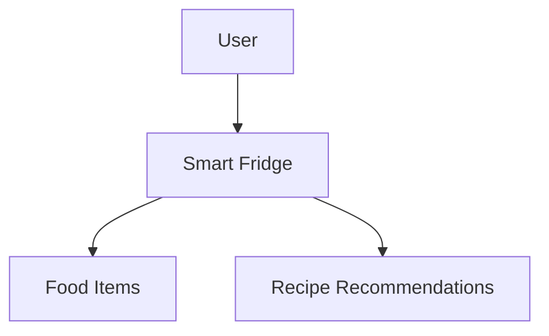
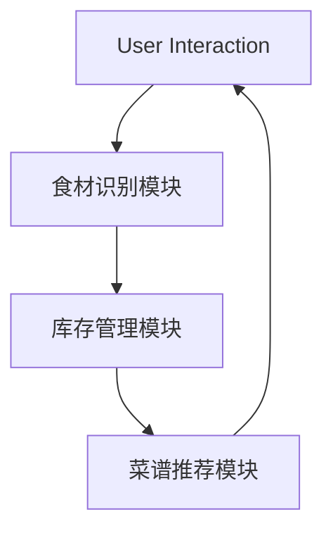

                 


# 智能冰箱：AI Agent的食材管理与菜谱推荐

## 关键词：智能冰箱, AI Agent, 食材管理, 菜谱推荐, 机器学习, 系统架构

## 摘要：  
本文探讨了智能冰箱中AI Agent在食材管理和菜谱推荐中的应用，分析了其核心概念、算法原理、系统架构及实现方案。通过详细的技术分析和实际案例，展示了如何利用AI技术提升智能冰箱的功能，为用户提供智能化的食材管理与菜谱推荐服务。

---

## 目录

1. [背景介绍](#背景介绍)
   1.1 智能冰箱的发展现状
   1.2 AI Agent的基本概念
   1.3 智能冰箱中的AI Agent应用

2. [核心概念与联系](#核心概念与联系)
   2.1 AI Agent与智能冰箱的实体关系
   2.2 实体关系图展示

3. [算法原理](#算法原理)
   3.1 食材管理与菜谱推荐的算法选择
   3.2 算法实现步骤
   3.3 推荐算法的数学模型

4. [系统架构设计](#系统架构设计)
   4.1 系统功能模块划分
   4.2 系统架构图
   4.3 接口设计与交互流程

5. [项目实战](#项目实战)
   5.1 项目环境配置
   5.2 核心代码实现
   5.3 实际案例分析

6. [最佳实践与总结](#最佳实践与总结)
   6.1 项目小结
   6.2 注意事项
   6.3 拓展阅读

---

## 1. 背景介绍

### 1.1 智能冰箱的发展现状  
智能冰箱作为一种智能家居设备，近年来得到了快速发展。它不仅具备传统冰箱的冷藏、冷冻功能，还整合了物联网（IoT）、人工智能（AI）等技术，能够实现食材管理、健康建议、菜谱推荐等多种智能功能。AI Agent（智能体）作为智能冰箱的核心组件，负责处理用户的交互请求、分析数据并提供个性化服务。

### 1.2 AI Agent的基本概念  
AI Agent是一种能够感知环境、执行任务并做出决策的智能实体。在智能冰箱中，AI Agent通过收集食材信息、用户偏好等数据，利用机器学习算法为用户推荐菜谱或管理食材库存。AI Agent的特点包括自主性、反应性、目标导向性和社交能力。

### 1.3 智能冰箱中的AI Agent应用  
AI Agent在智能冰箱中的主要应用包括：
1. **食材管理**：实时监控食材库存，提醒用户补充即将过期的食材。
2. **菜谱推荐**：根据用户偏好和现有食材推荐合适的菜谱。
3. **健康建议**：结合用户的健康数据提供饮食建议。

---

## 2. 核心概念与联系

### 2.1 AI Agent与智能冰箱的实体关系  
在智能冰箱中，AI Agent与以下几个实体密切相关：
- **用户**：提供食材偏好和健康数据。
- **食材**：存储在冰箱中的食材信息。
- **菜谱**：基于食材和用户偏好的推荐菜谱。

### 2.2 实体关系图展示  
以下是AI Agent与智能冰箱实体关系的Mermaid图：



---

## 3. 算法原理

### 3.1 食材管理与菜谱推荐的算法选择  
在智能冰箱中，菜谱推荐通常采用混合推荐模型，结合协同过滤和基于内容的推荐方法，以提高推荐的准确性和多样性。

### 3.2 算法实现步骤  
1. **数据预处理**：收集用户历史行为数据、食材信息和菜谱标签。
2. **协同过滤**：
   - **基于用户的协同过滤**：计算用户相似度，推荐相似用户的偏好菜谱。
   - **基于物品的协同过滤**：分析菜谱之间的相似性，推荐用户可能感兴趣的菜谱。
3. **基于内容的推荐**：根据食材的营养成分和菜谱的标签，生成推荐列表。
4. **混合推荐**：结合协同过滤和基于内容的推荐结果，生成最终的推荐列表。

### 3.3 推荐算法的数学模型  
基于用户的协同过滤模型的数学表达式如下：

$$
similarity(u, v) = \frac{\sum_{i} (r_{u,i} - \bar{r}_u)(r_{v,i} - \bar{r}_v)}{\sqrt{\sum_{i} (r_{u,i} - \bar{r}_u)^2} \cdot \sqrt{\sum_{i} (r_{v,i} - \bar{r}_v)^2}}
$$

其中，$similarity(u, v)$ 表示用户 $u$ 和 $v$ 之间的相似度，$r_{u,i}$ 表示用户 $u$ 对物品 $i$ 的评分，$\bar{r}_u$ 表示用户 $u$ 的平均评分。

---

## 4. 系统架构设计

### 4.1 系统功能模块划分  
智能冰箱的系统架构主要包括以下几个模块：
- **食材识别模块**：通过图像识别技术识别食材种类和数量。
- **库存管理模块**：记录并更新食材库存信息。
- **菜谱推荐模块**：根据食材和用户偏好推荐菜谱。
- **用户交互模块**：提供用户与冰箱的交互界面。

### 4.2 系统架构图展示  
以下是系统架构的Mermaid图：



### 4.3 接口设计与交互流程  
用户通过冰箱屏幕或手机APP输入需求，系统通过API调用食材识别模块获取数据，库存管理模块更新库存信息，并将数据传递给菜谱推荐模块生成推荐列表，最终将结果反馈给用户。

---

## 5. 项目实战

### 5.1 项目环境配置  
- **硬件环境**：智能冰箱、摄像头、传感器。
- **软件环境**：Python 3.8+, TensorFlow 2.4+, OpenCV 4.5+。

### 5.2 核心代码实现  
以下是菜谱推荐模块的核心代码示例：

```python
import numpy as np
from sklearn.metrics.pairwise import cosine_similarity

# 用户偏好数据
user_preferences = {
    'user_id': 1,
    'preferred_cuisine': '中式',
    'dietary_restrictions': '无'
}

# 食材库存数据
inventory = {
    'rice': 500,
    'meat': 100,
    'vegetables': 200
}

# 基于协同过滤的推荐算法
def collaborative_filtering(user_id):
    # 获取用户相似度
    user_similarities = cosine_similarity(user_matrix[user_id])
    # 推荐菜谱
    recommended_recipes = top_k_similar(user_similarities)
    return recommended_recipes

# 推荐结果
recommended_recipes = collaborative_filtering(user_id=user_id)
print("推荐菜谱:", recommended_recipes)
```

### 5.3 实际案例分析  
通过实际案例分析，验证算法的有效性和准确性，优化系统性能，确保推荐结果符合用户期望。

---

## 6. 最佳实践与总结

### 6.1 项目小结  
本文详细介绍了智能冰箱中AI Agent的食材管理和菜谱推荐功能，分析了算法原理和系统架构，并通过实际案例展示了项目的实现过程。

### 6.2 注意事项  
- 确保数据安全和用户隐私。
- 定期更新推荐算法，提升推荐效果。
- 提供多语言支持，满足不同用户的需求。

### 6.3 拓展阅读  
- 《推荐系统导论》
- 《人工智能在智能家居中的应用》

---

通过本文的分析，读者可以深入了解智能冰箱中AI Agent的应用，掌握食材管理和菜谱推荐的核心技术，并为后续的研究和实践提供参考。

