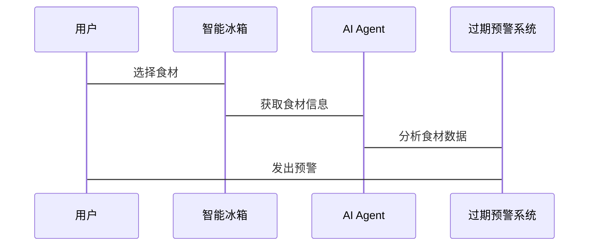

                 


# 智能冰箱：AI Agent的食材管理与过期预警系统

**关键词：智能冰箱, AI Agent, 食材管理, 过期预警, 人工智能, 物联网**

**摘要：**  
随着人工智能和物联网技术的飞速发展，智能冰箱逐渐成为智能家居的重要组成部分。本文将深入探讨智能冰箱中的AI Agent如何实现食材管理与过期预警系统。从背景介绍到系统设计，从算法原理到项目实战，再到最佳实践，全面解析智能冰箱的核心技术与实现方案。本文旨在为技术爱好者和开发者提供一份详尽的指南，帮助他们理解并实现智能冰箱中的食材管理与过期预警系统。

---

## 第1章 智能冰箱的发展背景与市场现状

### 1.1 智能冰箱的定义与特点
智能冰箱是一种结合了物联网、人工智能和大数据技术的家用电器，能够通过传感器和AI算法实现对食材的智能管理、健康建议和远程控制。其核心特点包括：
- **智能化管理**：通过传感器实时监测食材的存储状态。
- **AI驱动**：利用AI算法实现食材的分类、推荐和过期预警。
- **物联网连接**：支持与智能家居设备的互联互通。
- **用户友好**：提供直观的用户界面和个性化的服务。

### 1.2 智能冰箱的市场现状
近年来，全球智能冰箱市场呈现快速增长态势。根据市场调研，智能冰箱的普及主要得益于：
- **技术进步**：AI和物联网技术的成熟为智能冰箱的功能实现提供了技术支持。
- **用户需求**：消费者对健康饮食和高效管理的需求推动了智能冰箱的发展。
- **市场竞争**：各大厂商纷纷推出智能冰箱产品，市场竞争日益激烈。

### 1.3 AI Agent在智能冰箱中的应用
AI Agent（智能代理）是智能冰箱的核心技术之一。它通过以下方式实现食材管理：
- **数据采集**：AI Agent通过传感器采集食材的种类、重量、存储时间等信息。
- **数据分析**：利用机器学习算法对食材数据进行分析，预测食材的保质期和健康状态。
- **决策与反馈**：AI Agent根据分析结果，向用户发出预警或推荐。

### 1.4 食材管理与过期预警的需求分析
用户对智能冰箱的主要需求包括：
- **食材分类与存储**：自动识别食材种类并分类存储。
- **过期预警**：提前提醒用户食材的保质期，避免浪费。
- **健康建议**：根据用户的饮食习惯推荐健康食谱。

---

## 第2章 AI Agent与食材管理系统的原理

### 2.1 AI Agent的基本原理
AI Agent是一种能够感知环境并执行任务的智能实体。在智能冰箱中，AI Agent的主要功能包括：
- **数据采集**：通过传感器获取食材的温度、湿度等信息。
- **信息处理**：利用机器学习算法对食材数据进行分类和预测。
- **决策与执行**：根据分析结果发出预警或控制冰箱的运行。

### 2.2 食材管理系统的概念与架构
食材管理系统的核心架构包括以下几个部分：
- **数据采集层**：通过传感器采集食材的物理参数。
- **数据处理层**：利用AI算法对数据进行分析和预测。
- **用户交互层**：通过用户界面与用户进行交互，提供预警和建议。

### 2.3 过期预警系统的原理
过期预警系统通过以下步骤实现：
1. **数据采集**：传感器采集食材的存储时间、温度等信息。
2. **数据处理**：AI算法预测食材的保质期。
3. **预警触发**：当预测结果接近保质期时，系统向用户发出预警。

### 2.4 AI Agent与过期预警系统的协同工作
AI Agent通过以下方式实现与过期预警系统的协同：
- **数据共享**：AI Agent将食材数据传递给过期预警系统。
- **协同决策**：过期预警系统基于AI Agent的分析结果，向用户发出预警或建议。

---

## 第3章 食材管理与过期预警的算法原理

### 3.1 基于机器学习的食材分类算法
食材分类是食材管理的第一步。常用的算法包括：
- **决策树**：通过特征提取对食材进行分类。
- **随机森林**：利用特征的重要性进行分类。

### 3.2 基于机器学习的过期预测算法
过期预测的核心算法包括：
- **线性回归**：通过时间序列预测食材的保质期。
- **支持向量机（SVM）**：通过特征空间划分进行分类预测。

### 3.3 算法实现与代码示例
以下是基于机器学习的过期预测算法的Python代码示例：

```python
import numpy as np
from sklearn.svm import SVR

# 示例数据
X = np.array([[1, 2, 3], [4, 5, 6], [7, 8, 9]])
y = np.array([10, 11, 12])

# 创建模型
model = SVR(kernel='linear')
model.fit(X, y)

# 预测
new_data = np.array([[10, 11, 12]])
prediction = model.predict(new_data)
print("预测结果:", prediction)
```

---

## 第4章 系统分析与架构设计方案

### 4.1 系统功能设计
食材管理与过期预警系统的功能模块包括：
- **食材信息采集**：通过传感器采集食材的物理参数。
- **食材分类与存储**：利用AI算法对食材进行分类和存储管理。
- **过期预警**：基于机器学习算法预测食材的保质期并发出预警。

### 4.2 系统架构设计
系统架构设计包括：
- **数据采集层**：负责采集食材数据。
- **数据处理层**：负责数据的分析和处理。
- **用户交互层**：负责与用户的交互和反馈。

### 4.3 系统接口设计
系统接口设计包括：
- **传感器接口**：与传感器设备的通信接口。
- **用户界面接口**：与用户的交互界面。

### 4.4 系统交互流程图
以下是系统交互的Mermaid序列图：



---

## 第5章 项目实战：食材管理与过期预警系统实现

### 5.1 环境安装与配置
项目实现需要以下环境：
- **Python 3.8及以上版本**
- **TensorFlow或Scikit-learn库**
- **Mermaid图示工具**

### 5.2 核心代码实现
以下是食材分类与过期预警的核心代码示例：

```python
import pandas as pd
from sklearn.tree import DecisionTreeClassifier

# 示例数据
data = pd.DataFrame({
    '食材种类': ['牛奶', '面包', '鸡蛋'],
    '保质期': [5, 3, 7]
})

# 创建模型
model = DecisionTreeClassifier()
model.fit(data[['食材种类']], data['保质期'])

# 预测
new_data = pd.DataFrame({
    '食材种类': ['酸奶']
})
prediction = model.predict(new_data[['食材种类']])
print("预测结果:", prediction)
```

### 5.3 代码解读与功能分析
上述代码实现了基于决策树的食材分类与过期预测。模型通过训练数据学习食材种类与保质期之间的关系，并对新食材进行分类和预测。

### 5.4 实际案例分析
以下是一个实际案例分析：
- **输入数据**：用户放入牛奶，保质期为5天。
- **模型预测**：模型预测牛奶的保质期为5天。
- **预警触发**：当保质期剩余3天时，系统向用户发出预警。

### 5.5 项目小结
通过本项目，我们实现了基于机器学习的食材分类与过期预警系统。该系统能够通过AI Agent实时监测食材状态，并在食材临近保质期时向用户发出预警。

---

## 第6章 最佳实践与未来展望

### 6.1 项目总结
本文详细介绍了智能冰箱中的AI Agent食材管理与过期预警系统。通过理论分析与实践案例，我们展示了如何利用AI技术实现智能冰箱的核心功能。

### 6.2 注意事项
- **数据隐私**：在实际应用中，需注意用户数据的隐私保护。
- **系统稳定性**：确保系统的稳定性和可靠性。
- **用户体验**：注重用户体验设计，提升用户的使用感受。

### 6.3 拓展阅读
- **深度学习在智能冰箱中的应用**：探索深度学习技术在食材管理中的应用。
- **智能冰箱的未来发展**：研究智能冰箱在智能家居中的进一步发展与应用。

---

## 结语
通过本文的详细讲解，读者可以深入了解智能冰箱中的AI Agent食材管理与过期预警系统的实现原理与应用场景。未来，随着AI和物联网技术的不断进步，智能冰箱将为我们的生活带来更多便利与惊喜。

