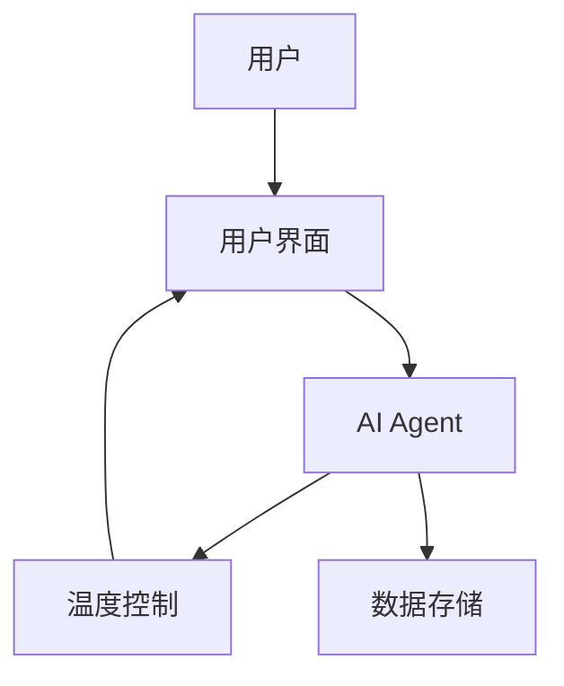
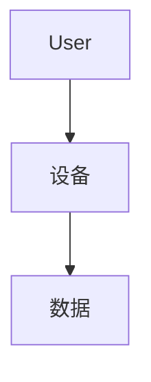
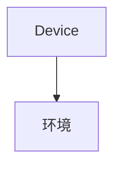
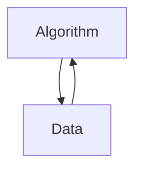

                 


# 《智能冷热敷眼罩：AI Agent的眼部护理定制》

> **关键词**：AI Agent，智能冷热敷眼罩，眼部护理，温度控制算法，个性化推荐，系统架构

> **摘要**：本文深入探讨了智能冷热敷眼罩的设计与实现，结合AI Agent技术，详细分析了其在眼部护理中的应用。文章从背景介绍、核心概念、算法原理、系统架构到项目实战，全面解析了智能冷热敷眼罩的技术细节，为读者提供了一套完整的解决方案。

---

# 第一部分: 背景介绍

## 第1章: 问题背景与需求分析

### 1.1 问题背景

#### 1.1.1 眼部健康问题的现状

现代社会，长时间使用电子设备导致的视力疲劳、干眼症等问题日益严重。根据世界卫生组织的统计，全球约有22亿人受到视力问题的影响，其中大部分与长时间用眼有关。传统的治疗方法包括滴眼液、休息等，但效果有限，且难以满足个性化需求。

#### 1.1.2 冷热敷在眼部护理中的作用

冷热敷是一种简单有效的物理治疗方法。热敷可以促进血液循环，缓解眼部疲劳；冷敷则能减轻炎症和肿胀。然而，传统冷热敷方法存在操作复杂、温度不稳定、缺乏个性化等问题。

#### 1.1.3 传统冷热敷的局限性

传统冷热敷设备通常需要手动操作，难以精确控制温度和时间，且无法根据个体差异调整方案。此外，传统设备缺乏智能化，无法与用户的使用习惯和健康数据相结合。

### 1.2 问题描述

#### 1.2.1 眼部护理的痛点分析

- 用户需求多样化：不同人的眼部问题不同，需要个性化的护理方案。
- 缺乏智能化：传统设备无法根据用户的实时数据调整温度和时间。
- 使用体验差：操作复杂，缺乏反馈机制。

#### 1.2.2 用户需求的多样性

用户可能需要不同的温度、时长和护理模式。例如，有些人可能需要长时间的热敷，而有些人则需要短时间的冷敷。

#### 1.2.3 传统冷热敷设备的不足

传统设备无法实时监测眼部温度和健康状况，无法与用户的数据结合，难以提供个性化的护理方案。

### 1.3 解决方案

#### 1.3.1 智能冷热敷眼罩的核心理念

通过AI技术实现智能化的冷热敷护理，实时监测眼部温度和健康状况，提供个性化的护理方案。

#### 1.3.2 AI Agent在眼部护理中的应用

AI Agent可以实时分析用户的健康数据，优化温度和时间，提供个性化的护理建议。

#### 1.3.3 智能冷热敷眼罩的功能特点

- 实时监测眼部温度和健康状况
- 智能调整温度和时间
- 提供个性化护理方案
- 与用户的健康数据同步

### 1.4 产品的边界与外延

#### 1.4.1 产品的功能边界

- 仅限于眼部护理，不涉及其他部位。
- 仅提供冷热敷功能，不涉及其他治疗方法。

#### 1.4.2 产品的使用场景

- 办公室、家庭、公共场所。
- 长时间用眼后的护理。

#### 1.4.3 产品的技术边界

- 基于AI算法，不涉及医疗诊断。
- 仅提供温度调节，不涉及药物治疗。

### 1.5 核心概念结构与组成

#### 1.5.1 系统组成模块

- 温度传感器
- AI Agent模块
- 用户界面

#### 1.5.2 模块之间的关系

- 温度传感器采集数据，传输给AI Agent模块进行分析。
- AI Agent模块根据分析结果调整温度和时间。
- 用户通过界面与系统互动。

#### 1.5.3 核心要素分析

- 温度控制：通过传感器和AI算法实现精确控制。
- 个性化推荐：根据用户数据优化护理方案。
- 实时反馈：系统实时监测并调整。

---

## 第2章: AI Agent与智能冷热敷眼罩的核心原理

### 2.1 AI Agent的基本原理

#### 2.1.1 AI Agent的定义与特点

AI Agent是一种智能代理系统，能够感知环境并执行任务。其特点是自主性、反应性、目标导向。

#### 2.1.2 AI Agent的核心算法

- 机器学习算法：用于分析用户数据。
- 自然语言处理：用于与用户交互。
- 规则引擎：用于制定护理方案。

#### 2.1.3 AI Agent与传统算法的对比

- AI Agent能够动态调整，而传统算法固定。
- AI Agent基于数据学习，传统算法基于规则。

### 2.2 智能冷热敷眼罩的工作原理

#### 2.2.1 热敷与冷敷的物理原理

- 热敷促进血液循环，冷敷减轻肿胀。
- 温度调节通过热电偶传感器实现。

#### 2.2.2 智能温控系统的实现

- 使用PID算法调节温度。
- 通过反馈机制保持恒温。

#### 2.2.3 眼罩的结构设计

- 内置温度传感器和加热元件。
- 可拆卸设计，便于清洁。

### 2.3 AI Agent与智能冷热敷眼罩的联系

#### 2.3.1 AI Agent在温度控制中的应用

- 通过历史数据优化温度调节。
- 实时调整温度以适应环境变化。

#### 2.3.2 AI Agent在用户个性化推荐中的作用

- 根据用户习惯推荐护理时间。
- 根据健康数据调整温度和时长。

#### 2.3.3 AI Agent与眼罩功能的结合

- 提供个性化护理方案。
- 实时反馈护理效果。

---

## 第3章: 核心概念对比与系统架构

### 3.1 核心概念对比

#### 3.1.1 AI Agent与传统算法对比

| 特性         | AI Agent                | 传统算法              |
|--------------|-------------------------|-----------------------|
| 自主性       | 高                      | 低                    |
| 反应性       | 高                      | 低                    |
| 可扩展性     | 高                      | 低                    |

#### 3.1.2 智能冷热敷与传统冷热敷对比

| 特性         | 智能冷热敷              | 传统冷热敷            |
|--------------|-------------------------|-----------------------|
| 温度控制     | 智能调整                | 手动调整              |
| 个性化       | 根据用户数据调整        | 固定模式              |
| 操作便捷性   | 高                      | 低                    |

#### 3.1.3 眼部护理产品的功能对比

| 特性         | 智能冷热敷眼罩          | 其他眼部护理产品      |
|--------------|-------------------------|-----------------------|
| 智能化       | 高                      | 低                    |
| 个性化       | 高                      | 低                    |
| 实时反馈     | 高                      | 低                    |

### 3.2 系统架构设计

#### 3.2.1 系统组成模块

- 用户界面模块：与用户交互。
- AI Agent模块：分析数据并制定方案。
- 温度控制模块：调节温度。
- 数据存储模块：存储用户数据和历史记录。

#### 3.2.2 模块之间的关系

- 用户界面模块接收用户的输入，传递给AI Agent模块。
- AI Agent模块分析数据，制定护理方案，传递给温度控制模块。
- 温度控制模块根据方案调节温度，并将数据反馈给AI Agent模块和用户界面模块。

#### 3.2.3 系统整体架构图



### 3.3 ER实体关系图

#### 3.3.1 用户与设备的关系



#### 3.3.2 设备与环境的关系



#### 3.3.3 算法与数据的关系



---

## 第4章: 温度控制算法

### 4.1 温度控制算法原理

#### 4.1.1 算法的基本原理

温度控制算法通过实时监测温度并调整加热元件的功率，保持温度在设定范围内。常用PID算法实现。

#### 4.1.2 算法的核心步骤

1. 采集当前温度。
2. 计算偏差（设定值-当前值）。
3. 根据偏差计算PID输出。
4. 调整加热元件功率。
5. 重复上述步骤。

#### 4.1.3 算法的数学模型

PID算法公式：

$$ u(t) = K_p \cdot e(t) + K_i \cdot \int e(t) dt + K_d \cdot \frac{de(t)}{dt} $$

其中：
- \( u(t) \)：控制输出
- \( e(t) \)：偏差
- \( K_p \)、\( K_i \)、\( K_d \)：比例、积分、微分系数

### 4.2 算法实现

#### 4.2.1 算法的Python实现代码

```python
def pid_control(setpoint, current_temp, Kp, Ki, Kd):
    error = setpoint - current_temp
    integral = integral + error * dt
    derivative = (error - previous_error) / dt
    output = Kp * error + Ki * integral + Kd * derivative
    return output
```

---

通过以上内容，我们详细解析了智能冷热敷眼罩的设计与实现，结合AI Agent技术，为读者提供了一套完整的解决方案。后续章节将围绕系统架构设计、项目实战和最佳实践展开，帮助读者进一步理解和应用这一技术。

