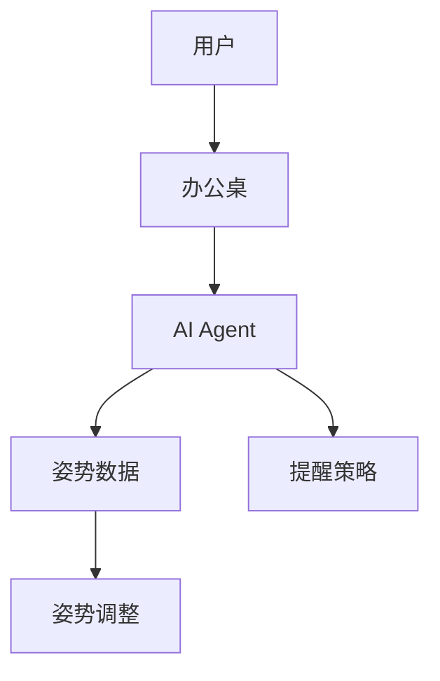
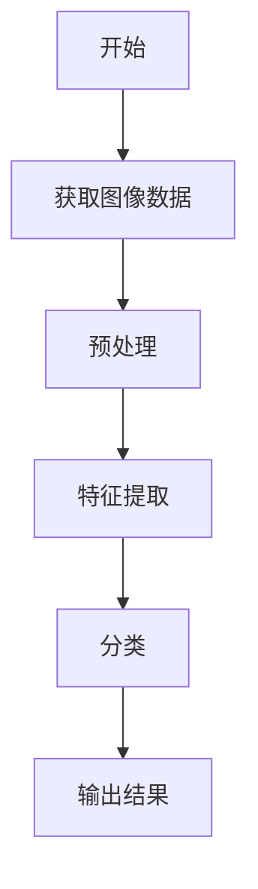
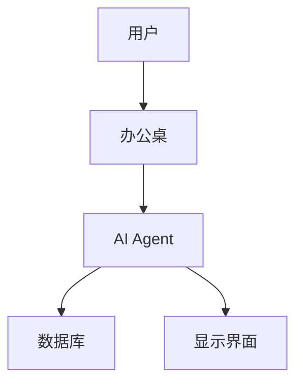
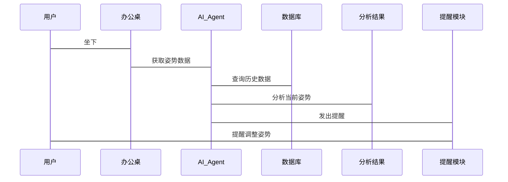

                 


# 智能办公桌：AI Agent的姿势调整提醒

## 关键词：智能办公桌，AI Agent，姿势调整，人体工程学，物联网，算法优化

## 摘要：  
随着人工智能和物联网技术的快速发展，智能办公桌逐渐成为现代办公环境的重要组成部分。本文深入探讨了AI Agent在智能办公桌中实现姿势调整提醒的功能，从背景介绍、核心概念、算法原理到系统设计和项目实战，详细解析了这一技术的实现过程和应用价值。通过本篇文章，读者可以全面了解如何利用AI技术优化办公环境，提升工作效率和健康水平。

---

## 第一部分：智能办公桌与AI Agent的背景介绍

### 第1章：智能办公桌与AI Agent概述

#### 1.1 问题背景与描述
- **1.1.1 办公环境中的姿势问题**  
  长期不良姿势会导致颈椎病、腰椎病等健康问题，影响工作效率和生活质量。  
- **1.1.2 长期不良姿势的影响**  
  不良姿势不仅影响身体健康，还可能导致疲劳、注意力下降等问题。  
- **1.1.3 AI Agent在办公环境中的应用潜力**  
  AI Agent可以通过实时监测和反馈，帮助用户保持良好的坐姿，提升办公效率和健康水平。

#### 1.2 智能办公桌的核心概念
- **1.2.1 智能办公桌的定义与特点**  
  智能办公桌是一种集成传感器、AI算法和物联网技术的办公设备，能够实时监测用户的行为并提供反馈。  
- **1.2.2 AI Agent在智能办公桌中的角色**  
  AI Agent作为智能办公桌的核心模块，负责数据采集、分析和决策，实现姿势调整提醒功能。  
- **1.2.3 姿势调整提醒的功能与目标**  
  姿势调整提醒通过实时监测用户的坐姿，主动发出提醒，帮助用户保持正确的姿势。

#### 1.3 问题解决与边界
- **1.3.1 姿势调整提醒的解决方案**  
  通过传感器采集用户姿势数据，结合AI算法进行分析，实时发出提醒。  
- **1.3.2 解决方案的边界与限制**  
  仅针对坐姿问题，不涉及其他办公环境优化功能。  
- **1.3.3 解决方案的外延与扩展**  
  可扩展到更多健康监测功能，如心率监测、压力监测等。

#### 1.4 概念结构与核心要素
- **1.4.1 智能办公桌的系统架构**  
  包括传感器模块、AI处理模块和提醒模块。  
- **1.4.2 AI Agent的核心功能模块**  
  数据采集、分析、决策和反馈。  
- **1.4.3 姿势调整提醒的实现要素**  
  传感器、算法模型和用户界面。

#### 1.5 本章小结
本章从背景、概念和实现要素三个方面介绍了智能办公桌与AI Agent的姿势调整提醒功能，为后续章节奠定了基础。

---

## 第二部分：核心概念与联系

### 第2章：AI Agent的姿势调整提醒原理

#### 2.1 核心概念原理
- **2.1.1 姿势识别的基本原理**  
  通过传感器采集人体姿势数据，结合AI算法进行分类识别。  
- **2.1.2 AI Agent的决策机制**  
  根据姿势识别结果，判断是否需要发出提醒。  
- **2.1.3 提醒策略的实现方式**  
  通过声音、震动或界面提示等方式通知用户调整姿势。

#### 2.2 概念属性特征对比
| **概念**       | **特征**             | **描述**                                                                 |
|----------------|---------------------|--------------------------------------------------------------------------|
| 姿势识别方法     | 精度                 | 基于深度学习的姿势识别精度更高。                                       |
| AI Agent算法     | 实时性               | 基于强化学习的AI Agent决策更迅速。                                     |
| 提醒策略         | 用户接受度           | 温和提醒策略更容易被用户接受。                                         |

#### 2.3 ER实体关系图


#### 2.4 本章小结
本章通过对比分析和实体关系图，详细解释了AI Agent在姿势调整提醒中的核心原理和实现方式。

---

## 第三部分：算法原理讲解

### 第3章：姿势识别算法

#### 3.1 算法原理
- **3.1.1 基于深度学习的姿势识别**  
  使用卷积神经网络（CNN）进行姿势分类，准确率高但计算复杂。  
- **3.1.2 基于传统计算机视觉的姿势识别**  
  使用特征提取和分类器进行姿势识别，计算简单但精度较低。  
- **3.1.3 姿势识别的数学模型**  
  通过概率计算和分类算法，建立姿势识别的数学模型。

#### 3.2 算法流程图


#### 3.3 Python源代码实现
```python
import cv2
import numpy as np

def pose_detection(image):
    # 图像预处理
    gray = cv2.cvtColor(image, cv2.COLOR_BGR2GRAY)
    # 特征提取
    features = cv2.HOGDescriptor().compute(gray)
    # 分类器预测
    prediction = model.predict(features)
    return prediction
```

#### 3.4 数学模型与公式
- **3.4.1 姿势分类的数学模型**  
  使用支持向量机（SVM）进行分类，公式如下：  
  $$ 
  y = \text{sign}(w \cdot x + b) 
  $$  
  其中，\( w \) 是权重向量，\( x \) 是输入特征，\( b \) 是偏置项。

---

## 第四部分：系统分析与架构设计

### 第4章：系统分析与架构设计

#### 4.1 系统功能设计
- **4.1.1 功能模块划分**  
  包括数据采集、数据处理、决策反馈和用户界面四个模块。  
- **4.1.2 领域模型类图**  
  ```mermaid
  classDiagram
      class 用户 {
          id: int
          name: str
      }
      class 办公桌 {
          desk_id: int
          status: str
      }
      class AI_Agent {
          sensors: list
          model: object
      }
      用户 --> 办公桌
      办公桌 --> AI_Agent
  ```

#### 4.2 系统架构设计


#### 4.3 系统接口设计
- **4.3.1 数据采集接口**  
  传感器数据通过蓝牙或Wi-Fi传输到AI Agent。  
- **4.3.2 决策反馈接口**  
  AI Agent根据姿势数据生成提醒信号，发送到显示界面或扬声器。

#### 4.4 系统交互流程


---

## 第五部分：项目实战

### 第5章：项目实战

#### 5.1 环境安装
- 安装Python和必要的库：  
  ```bash
  pip install opencv-python numpy scikit-learn
  ```

#### 5.2 系统核心实现源代码
```python
import cv2
import numpy as np
from sklearn import svm

class PoseAdjuster:
    def __init__(self, model):
        self.model = model

    def detect_pose(self, image):
        gray = cv2.cvtColor(image, cv2.COLOR_BGR2GRAY)
        features = cv2.HOGDescriptor().compute(gray)
        prediction = self.model.predict(features)
        return prediction

# 初始化模型
model = svm.SVC()
adjuster = PoseAdjuster(model)
```

#### 5.3 代码应用解读与分析
- **5.3.1 代码功能解读**  
  通过HOG特征提取和SVM分类器实现姿势识别。  
- **5.3.2 代码优化建议**  
  可以结合深度学习模型（如YOLO）提高识别精度。

#### 5.4 实际案例分析
- **5.4.1 案例描述**  
  用户长时间低头工作，AI Agent检测到不良姿势后发出提醒，用户调整姿势。  
- **5.4.2 数据分析**  
  统计用户姿势调整的频率和效果，优化提醒策略。

#### 5.5 本章小结
本章通过项目实战，详细展示了智能办公桌的实现过程，包括环境搭建、代码实现和案例分析。

---

## 第六部分：最佳实践与注意事项

### 第6章：最佳实践

#### 6.1 最佳实践 tips
- 定期校准传感器，确保姿势识别的准确性。  
- 根据用户习惯调整提醒频率，避免过度干扰。  
- 结合其他健康监测功能，提供更全面的健康解决方案。

#### 6.2 小结
智能办公桌的姿势调整提醒功能不仅提升了办公效率，还改善了用户的健康状况，具有广阔的应用前景。

#### 6.3 注意事项
- 数据隐私保护，避免用户数据泄露。  
- 系统稳定性优化，确保长时间运行无故障。  
- 提醒策略的多样性，满足不同用户的需求。

#### 6.4 拓展阅读
- 探索更多AI技术在办公环境中的应用，如智能灯光调节、空气质量监测等。

---

## 附录：参考文献与工具

- **参考文献**  
  1. LeCun, Y., Bengio, Y., & Hinton, G. (2015). Deep learning. Nature, 521(7555), 436-444.  
  2. Everingham, M., Eslam, S., & Mohamed, K. (2011). The PASCAL VOC challenge.  
- **工具推荐**  
  - OpenCV：图像处理库。  
  - TensorFlow/PyTorch：深度学习框架。  
  - ROS：机器人操作系统（可扩展到智能办公桌的更多功能）。

---

通过以上内容，您可以全面了解智能办公桌中AI Agent的姿势调整提醒功能，从理论到实践，逐步掌握其实现方法和应用价值。

