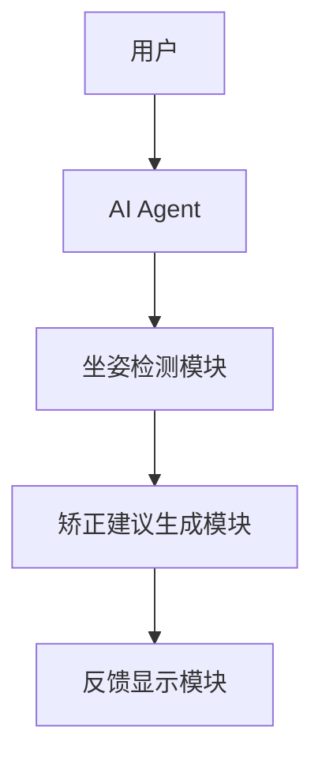
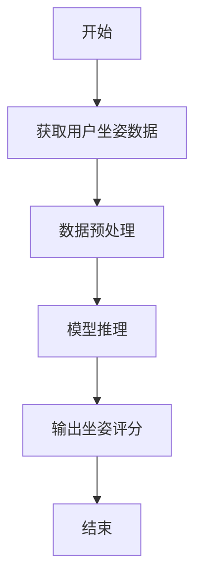
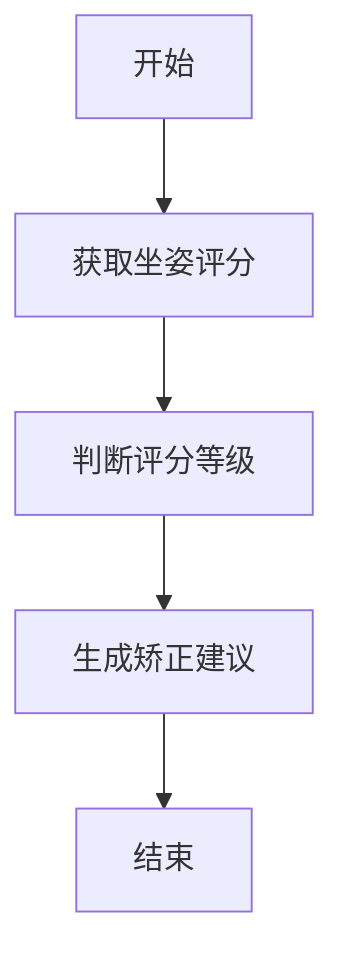
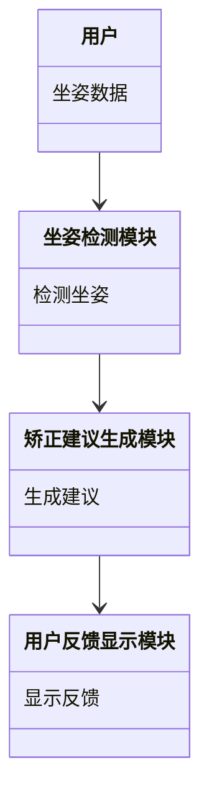
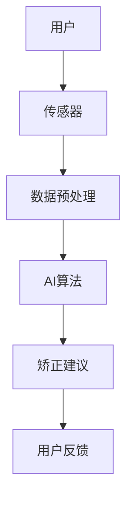
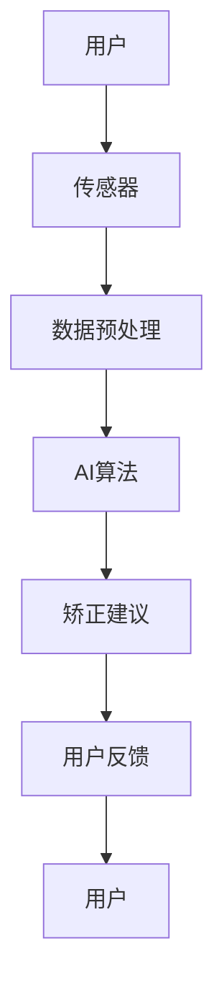

                 


# 智能办公椅：AI Agent的坐姿矫正系统

> 关键词：智能办公椅，AI Agent，坐姿矫正，算法原理，系统架构

> 摘要：本文详细介绍了智能办公椅的AI Agent坐姿矫正系统，涵盖背景介绍、核心概念、算法原理、系统架构、项目实战和最佳实践。通过深入分析，展示了如何利用AI技术解决现代办公环境中的坐姿问题，提供了一套完整的解决方案。

---

# 第一部分: 背景介绍与核心概念

## 第1章: 问题背景与描述

### 1.1 问题背景

#### 1.1.1 现代办公环境中的坐姿问题
现代办公环境逐渐趋向于久坐，长时间的不良坐姿容易引发健康问题，如颈椎病、腰椎病等。传统的办公椅无法主动识别和纠正用户的坐姿，这成为现代办公环境中的一大痛点。

#### 1.1.2 长期不良坐姿的危害
- 颈椎病：长期低头或前倾坐姿导致颈椎压力过大，容易引发颈椎病。
- 腰椎病：久坐且姿势不良会导致腰椎间盘突出。
- 肩膀僵硬：长时间单侧倾斜坐姿会导致肩膀僵硬和肌肉劳损。

#### 1.1.3 市场需求与痛点分析
市场上已有许多智能办公椅，但大多数仅具备基础的调节功能，缺乏智能化的坐姿矫正功能。用户对智能化、主动式的坐姿矫正需求日益增长，这成为智能办公椅发展的新方向。

### 1.2 问题描述

#### 1.2.1 坐姿矫正的目标与范围
目标：通过AI技术实时监测用户的坐姿，并提供矫正建议和反馈。
范围：涵盖坐姿监测、矫正建议生成、用户反馈显示等功能模块。

#### 1.2.2 系统功能需求分析
- 坐姿监测：实时监测用户的坐姿状态。
- 矫正建议生成：根据监测结果生成矫正建议。
- 用户反馈显示：通过视觉或语音方式反馈矫正建议。

#### 1.2.3 边界与外延
- 边界：仅关注坐姿矫正，不涉及其他功能（如椅子的调节功能）。
- 外延：可扩展至其他健康监测功能，如心率监测、压力监测等。

### 1.3 问题解决与系统架构

#### 1.3.1 系统设计目标
- 实现智能化的坐姿矫正功能。
- 提供实时反馈，帮助用户改善坐姿。

#### 1.3.2 核心功能模块划分
- 坐姿检测模块。
- 矫正建议生成模块。
- 用户反馈显示模块。

#### 1.3.3 系统架构初步设想
初步架构包括硬件部分（传感器、显示屏）和软件部分（AI算法、用户界面）。

---

## 第2章: 核心概念与联系

### 2.1 核心概念原理

#### 2.1.1 AI Agent的基本原理
AI Agent是一种智能体，能够感知环境并采取行动以实现目标。在坐姿矫正系统中，AI Agent负责数据处理、决策生成和用户反馈。

#### 2.1.2 坐姿矫正系统的实现原理
通过传感器获取用户的坐姿数据，AI算法分析数据并生成矫正建议，最终通过显示屏或语音反馈给用户。

#### 2.1.3 系统的核心要素组成
- 传感器：采集坐姿数据。
- AI算法：分析数据并生成矫正建议。
- 用户界面：显示反馈信息。

### 2.2 核心概念对比分析

#### 2.2.1 AI Agent与传统办公椅的对比
| 特性         | 传统办公椅       | 智能办公椅（AI Agent） |
|--------------|------------------|--------------------------|
| 功能         | 基础调节功能     | 智能坐姿矫正             |
| 交互方式     | 被动调节         | 主动反馈与建议           |
| 技术复杂度   | 低               | 高                       |

#### 2.2.2 不同坐姿矫正技术的优劣势分析
| 技术         | 优势             | 劣势             |
|--------------|------------------|------------------|
| 基于规则的矫正 | 实现简单           | 精度低           |
| 基于AI的矫正 | 精度高，自适应性强 | 开发复杂         |

#### 2.2.3 系统功能模块的属性特征对比表
| 功能模块         | 输入           | 输出             | 功能描述               |
|------------------|----------------|------------------|------------------------|
| 坐姿检测模块     | 坐姿数据       | 坐姿评分         | 评估坐姿健康程度       |
| 矫正建议生成模块 | 坐姿评分       | 矫正建议         | 提供坐姿矫正建议       |
| 用户反馈显示模块 | 矫正建议       | 用户反馈         | 显示矫正建议           |

### 2.3 实体关系图



---

# 第二部分: 算法原理与数学模型

## 第3章: 坐姿检测算法

### 3.1 算法原理

#### 3.1.1 基于AI的坐姿检测流程
1. 传感器采集坐姿数据。
2. 数据预处理（去噪、归一化）。
3. 深度学习模型推理。
4. 坐姿评分输出。

#### 3.1.2 深度学习模型的选择与训练
- 选择适合的姿态检测模型（如卷积神经网络）。
- 使用标注数据训练模型，优化模型参数。

#### 3.1.3 坐姿检测的数学模型
坐姿评分公式：
$$
\text{评分} = \sum_{i=1}^{n} w_i \cdot f_i
$$
其中，$w_i$是特征$f_i$的权重，$f_i$是特征的值。

### 3.2 姿态检测流程图



### 3.3 代码实现

```python
def pose_detection_model():
    # 简化版姿态检测模型
    import tensorflow as tf
    model = tf.keras.Sequential([
        tf.keras.layers.Conv2D(32, (3,3), activation='relu'),
        tf.keras.layers.MaxPooling2D((2,2)),
        tf.keras.layers.Conv2D(64, (3,3), activation='relu'),
        tf.keras.layers.MaxPooling2D((2,2)),
        tf.keras.layers.Flatten(),
        tf.keras.layers.Dense(128, activation='relu'),
        tf.keras.layers.Dense(1, activation='sigmoid')
    ])
    return model
```

---

## 第4章: 坐姿矫正算法

### 4.1 矫正建议生成

#### 4.1.1 基于坐姿评分的矫正策略
根据坐姿评分生成矫正建议：
$$
\text{矫正建议} = \begin{cases}
\text{调整背部} & \text{if 评分 < 60} \\
\text{放松肩部} & \text{if 评分 < 70} \\
\text{无需调整} & \text{otherwise}
\end{cases}
$$

#### 4.1.2 矫正建议生成流程
1. 获取坐姿评分。
2. 判断评分等级。
3. 生成相应矫正建议。

### 4.2 矫正建议生成流程图



---

# 第三部分: 系统分析与架构设计

## 第5章: 系统分析

### 5.1 项目介绍

#### 5.1.1 项目目标
实现一个基于AI的坐姿矫正系统，帮助用户改善坐姿健康。

### 5.2 系统功能设计

#### 5.2.1 领域模型



### 5.3 系统架构设计

#### 5.3.1 系统架构



---

## 第6章: 接口与交互设计

### 6.1 系统接口设计

#### 6.1.1 接口描述
- 输入接口：传感器数据。
- 输出接口：矫正建议、用户反馈。

### 6.2 交互流程图



---

## 第7章: 项目实战

### 7.1 环境安装

#### 7.1.1 安装Python
```bash
python --version
```

#### 7.1.2 安装TensorFlow
```bash
pip install tensorflow
```

### 7.2 系统核心实现

#### 7.2.1 坐姿检测模块实现
```python
import tensorflow as tf
def pose_detection_model():
    model = tf.keras.Sequential([
        # 网络结构
    ])
    return model
```

---

## 第8章: 最佳实践

### 8.1 小结
智能办公椅的AI Agent坐姿矫正系统通过实时监测和反馈，帮助用户改善坐姿健康。

### 8.2 注意事项
- 定期校准传感器，确保准确性。
- 保护用户隐私，避免数据泄露。

### 8.3 拓展阅读
- 探索更多AI在办公环境中的应用。
- 研究更先进的坐姿矫正算法。

---

通过以上步骤，我们详细分析了智能办公椅AI Agent坐姿矫正系统的背景、核心概念、算法原理、系统架构、项目实战和最佳实践，为读者提供了一套完整的解决方案。

