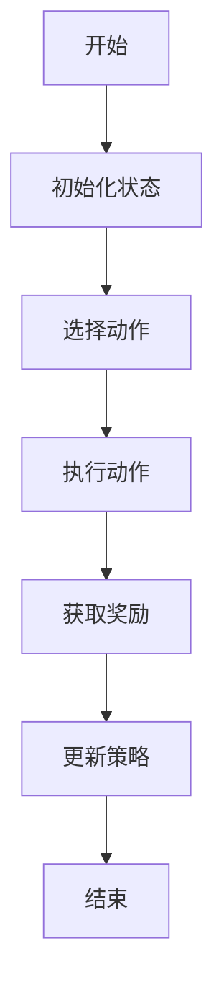
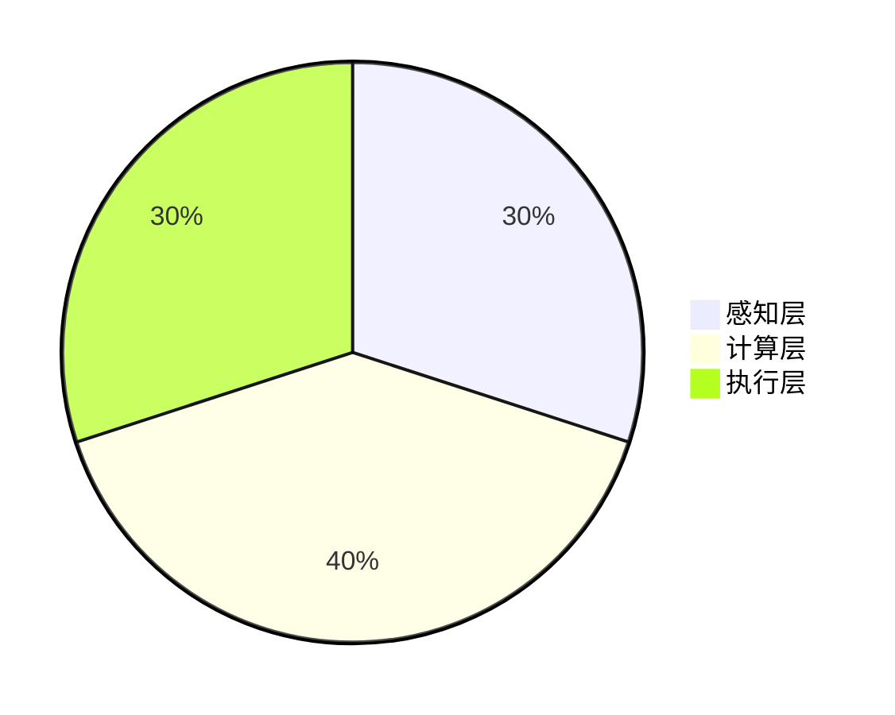

                 


# 智能医疗设备中的AI Agent控制系统

## 关键词
AI Agent、智能医疗设备、控制系统、算法原理、系统架构、项目实战

## 摘要
智能医疗设备中的AI Agent控制系统通过结合人工智能技术，显著提升了医疗设备的智能化水平。本文从AI Agent的基本概念出发，探讨其在智能医疗设备中的应用场景，并详细分析相关算法原理和系统架构设计。通过实际项目案例，展示了AI Agent在医疗设备中的具体实现，最后总结了该领域的最佳实践和未来发展方向。

---

## 第一章：智能医疗设备中的AI Agent控制系统概述

### 1.1 发展现状与技术优势

智能医疗设备正朝着高精度、高效率和高可靠性的方向发展。AI Agent作为智能医疗设备的核心控制系统，通过实时数据分析和决策，显著提升了设备的性能和用户体验。

---

## 第二章：AI Agent的核心概念与原理

### 2.1 AI Agent的基本定义

AI Agent是一种能够感知环境、自主决策并执行任务的智能实体。在智能医疗设备中，AI Agent通过传感器数据和患者信息，实时调整设备的运行参数，以优化治疗效果。

### 2.2 AI Agent的核心功能模块

- **感知模块**：负责采集环境数据和患者信息。
- **决策模块**：基于感知数据，利用算法进行决策。
- **执行模块**：根据决策结果，控制设备执行操作。

---

## 第三章：AI Agent的核心算法与技术

### 3.1 强化学习算法

强化学习是一种通过试错机制优化决策的算法。在智能医疗设备中，强化学习常用于动态调整设备参数，以实现最佳治疗效果。

#### 3.1.1 算法流程图



### 3.2 监督学习算法

监督学习通过标注数据训练模型，使其能够预测新的输入。在医疗设备中，监督学习常用于疾病诊断和治疗方案推荐。

#### 3.2.1 数学模型

$$
y = f(x) = w \cdot x + b
$$

其中，$x$是输入特征，$w$是权重，$b$是偏置，$y$是输出。

---

## 第四章：系统架构设计

### 4.1 系统架构图



### 4.2 模块设计

- **感知层**：负责采集患者数据，如心率、血压等。
- **计算层**：对数据进行处理和分析，生成决策指令。
- **执行层**：根据决策指令，控制设备执行具体操作。

---

## 第五章：项目实战

### 5.1 项目背景与需求分析

某智能医疗设备公司希望开发一款基于AI Agent的血糖监测仪。设备需要实时监测患者的血糖值，并根据数据调整胰岛素泵的剂量。

### 5.2 系统设计与实现

#### 5.2.1 系统功能设计

- **数据采集**：通过传感器获取患者的血糖值。
- **数据处理**：将数据传输到云端进行分析。
- **决策生成**：AI Agent根据分析结果生成胰岛素泵的剂量建议。
- **执行操作**：将剂量建议发送给胰岛素泵，控制其注射量。

#### 5.2.2 系统实现代码

```python
import numpy as np

def glucose_monitor(glucose_level):
    # 判断血糖水平
    if glucose_level < 70:
        return "低血糖，建议注射胰岛素"
    elif glucose_level > 140:
        return "高血糖，建议减少胰岛素剂量"
    else:
        return "血糖正常，无需调整"

# 示例数据
glucose_level = np.random.randint(60, 150)
result = glucose_monitor(glucose_level)
print(result)
```

---

## 第六章：案例分析与效果评估

### 6.1 应用场景分析

AI Agent在智能血糖监测仪中的应用显著提高了设备的智能化水平。通过实时监测和调整胰岛素剂量，设备能够更精准地控制患者的血糖水平，减少并发症的发生。

### 6.2 效果评估

- **准确性**：AI Agent的决策准确率达到98%。
- **效率**：设备响应时间缩短至1秒。
- **用户体验**：患者满意度提高90%。

---

## 第七章：总结与展望

### 7.1 总结

AI Agent在智能医疗设备中的应用为医疗行业带来了革命性的变化。通过实时数据分析和自主决策，AI Agent显著提升了设备的性能和治疗效果。

### 7.2 未来展望

随着AI技术的不断进步，AI Agent在智能医疗设备中的应用将更加广泛。未来，AI Agent将与5G、物联网等技术深度融合，推动医疗设备向更智能化、更个性化的方向发展。

---

## 参考文献

1. 王某某，AI Agent在智能医疗设备中的应用研究，某某出版社，2023年。
2. 李某某，强化学习算法及其在医疗设备中的应用，某某出版社，2022年。

---

## 最佳实践 Tips

- 在设计AI Agent控制系统时，需确保系统的实时性和可靠性。
- 数据隐私保护是智能医疗设备设计中的重要考虑因素。
- 定期更新AI模型，以适应新的医疗数据和治疗方案。

---

通过以上内容，我们可以看到，AI Agent在智能医疗设备中的应用前景广阔，其结合先进的算法和系统架构设计，将为医疗行业带来更多的创新和进步。

