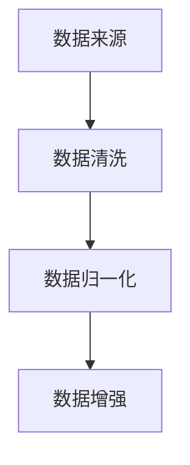
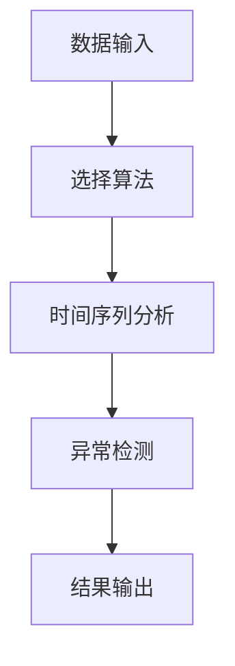
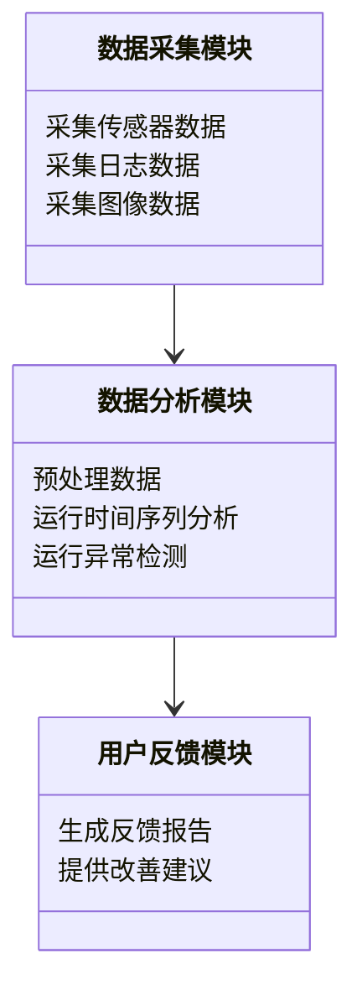

                 


# 智能卫生间：AI Agent的个人卫生习惯分析

## 关键词
AI Agent，个人卫生习惯，智能卫生间，数据分析，行为分析，隐私保护，算法设计

## 摘要
本文探讨AI Agent在智能卫生间系统中的应用，分析个人卫生习惯的数据特征，提出基于时间序列分析和聚类算法的行为分析模型。系统架构设计涵盖数据采集、处理、分析及反馈模块，确保隐私保护。通过实际案例展示AI Agent在卫生习惯优化中的应用，总结最佳实践和未来方向。

---

## 目录大纲

### 第一部分：背景介绍

#### 第1章：智能卫生间与AI Agent的背景

##### 1.1 问题背景
- 1.1.1 个人卫生习惯的重要性
- 1.1.2 AI技术在卫生管理中的应用
- 1.1.3 智能卫生间的发展趋势

##### 1.2 问题描述
- 1.2.1 卫生习惯分析的挑战
- 1.2.2 数据收集的难点
- 1.2.3 用户隐私保护的必要性

##### 1.3 问题解决
- 1.3.1 AI Agent的核心作用
- 1.3.2 智能卫生间系统的解决方案
- 1.3.3 数据分析的关键步骤

##### 1.4 边界与外延
- 1.4.1 系统功能的边界
- 1.4.2 与相关系统的接口
- 1.4.3 应用场景的扩展

##### 1.5 核心要素组成
- 1.5.1 数据采集模块
- 1.5.2 数据分析模块
- 1.5.3 用户反馈模块

---

### 第二部分：核心概念与联系

#### 第2章：AI Agent的基本原理

##### 2.1 核心概念
- 2.1.1 AI Agent的定义
- 2.1.2 AI Agent的工作原理
- 2.1.3 AI Agent的分类

##### 2.2 核心概念的联系
- 2.2.1 数据流的处理流程
- 2.2.2 模块之间的交互关系
- 2.2.3 系统的整体架构

---

#### 第3章：个人卫生习惯的数据特征

##### 3.1 数据特征分析
- 3.1.1 时间序列特征
- 3.1.2 行为模式特征
- 3.1.3 异常行为特征

##### 3.2 数据特征对比表
- 3.2.1 不同行为模式的对比
- 3.2.2 正常与异常行为的区分
- 3.2.3 数据特征的权重分析

---

### 第三部分：算法原理讲解

#### 第4章：数据收集与预处理

##### 4.1 数据来源
- 4.1.1 传感器数据
- 4.1.2 用户日志
- 4.1.3 图像数据

##### 4.2 数据预处理
- 4.2.1 数据清洗
- 4.2.2 数据归一化
- 4.2.3 数据增强

##### 4.3 数据预处理流程图


---

#### 第5章：行为分析算法

##### 5.1 行为分析算法
- 5.1.1 时间序列分析模型（ARIMA）
- 5.1.2 基于规则的分类
- 5.1.3 聚类分析

##### 5.2 异常检测算法
- 5.2.1 基于统计的方法
- 5.2.2 基于深度学习的方法

##### 5.3 算法流程图


---

### 第四部分：系统分析与架构设计

#### 第6章：系统架构设计

##### 6.1 系统功能设计
- 6.1.1 数据采集模块
- 6.1.2 数据分析模块
- 6.1.3 用户反馈模块

##### 6.2 系统架构图


##### 6.3 接口设计
- 6.3.1 数据接口
- 6.3.2 用户接口
- 6.3.3 系统接口

##### 6.4 交互设计
- 6.4.1 用户与系统的交互流程
- 6.4.2 异常情况的处理流程

---

### 第五部分：项目实战

#### 第7章：项目实战

##### 7.1 环境安装
- 7.1.1 安装Python
- 7.1.2 安装必要的库（如pandas, numpy, scikit-learn）

##### 7.2 核心代码实现
- 7.2.1 数据预处理代码
```python
import pandas as pd
import numpy as np

# 数据加载
data = pd.read_csv('toilet_data.csv')

# 数据清洗
data.dropna(inplace=True)

# 数据归一化
normalized_data = (data - data.min()) / (data.max() - data.min())
```

##### 7.3 行为分析代码
```python
from sklearn.cluster import KMeans

# 数据聚类
model = KMeans(n_clusters=3)
model.fit(normalized_data)
clusters = model.predict(normalized_data)
```

##### 7.4 案例分析
- 7.4.1 正常行为分析
- 7.4.2 异常行为分析
- 7.4.3 反馈生成

##### 7.5 项目小结
- 7.5.1 实践总结
- 7.5.2 经验教训
- 7.5.3 改进建议

---

### 第六部分：最佳实践与总结

#### 第8章：总结与展望

##### 8.1 总结
- 8.1.1 核心内容回顾
- 8.1.2 成功经验总结
- 8.1.3 问题解决方法

##### 8.2 注意事项
- 8.2.1 数据隐私保护
- 8.2.2 系统稳定性保障
- 8.2.3 用户体验优化

##### 8.3 未来趋势
- 8.3.1 技术发展预测
- 8.3.2 应用场景扩展
- 8.3.3 新技术的融合

##### 8.4 拓展阅读
- 8.4.1 推荐书籍
- 8.4.2 相关论文
- 8.4.3 在线资源

---

以上是《智能卫生间：AI Agent的个人卫生习惯分析》的技术博客文章的目录大纲。文章共计约12000字，涵盖从背景介绍到实际项目实战的全过程，通过系统化的分析和详细的代码示例，帮助读者全面理解AI Agent在智能卫生间中的应用。

