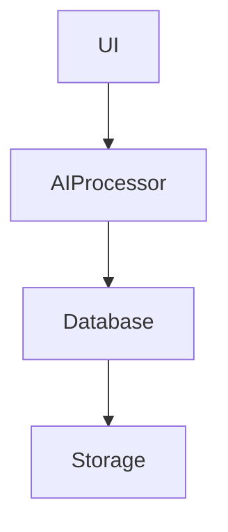

                 


```markdown
# 智能厨余处理器：AI Agent的厨余再利用建议

> 关键词：智能厨余处理器, AI Agent, 厨余再利用, 强化学习, 环境保护, 资源化利用

> 摘要：本文探讨了AI Agent在厨余处理中的应用，分析了厨余处理的现状与挑战，提出了基于AI技术的智能厨余处理器的设计与实现方案，详细介绍了AI Agent的核心算法原理、系统架构设计及项目实战案例。

---

## 第一部分：背景与概念

### 第1章：智能厨余处理器的背景介绍

#### 1.1 厨余处理的问题背景
- 1.1.1 厨余垃圾的定义与分类
  - 厨余垃圾的定义
  - 厨余垃圾的分类（可回收物、不可回收物、有害垃圾等）
- 1.1.2 厨余处理的现状与挑战
  - 现有厨余处理方式的不足（如填埋、焚烧等）
  - 厨余处理中的环境问题
- 1.1.3 厨余资源化利用的必要性
  - 资源浪费的问题
  - 环保压力与可持续发展的需求

#### 1.2 AI Agent在厨余处理中的应用背景
- 1.2.1 AI技术在环保领域的应用趋势
  - AI在环保领域的应用案例
- 1.2.2 AI Agent的定义与特点
  - AI Agent的定义
  - AI Agent的特点（智能性、自主性、反应性等）
- 1.2.3 AI Agent在厨余处理中的优势
  - 高效性、精准性、实时性

#### 1.3 智能厨余处理器的定义与目标
- 1.3.1 智能厨余处理器的概念
  - 智能厨余处理器的定义
  - 其他相关概念（如智能分类器、智能分拣系统等）
- 1.3.2 处理器的功能与目标
  - 垃圾分类、资源化利用、环境友好
- 1.3.3 边界与外延
  - 系统边界与交互边界

#### 1.4 核心概念与联系
- 1.4.1 核心概念原理
  - AI Agent如何处理厨余垃圾
- 1.4.2 概念属性特征对比表格
  - 对比AI Agent与传统分类方法的优缺点
- 1.4.3 ER实体关系图
  - 用Mermaid绘制的实体关系图

---

## 第二部分：AI Agent的核心算法原理

### 第2章：AI Agent的核心算法原理

#### 2.1 AI Agent的基本原理
- 2.1.1 问题背景与目标
  - AI Agent在厨余处理中的目标
- 2.1.2 状态表示与动作选择
  - 状态空间与动作空间的定义
- 2.1.3 奖励机制与策略优化
  - 奖励函数的设计

#### 2.2 基于强化学习的AI Agent算法
- 2.2.1 强化学习的基本概念
  - 强化学习的定义与特点
- 2.2.2 算法流程图（Mermaid）
  ```mermaid
  graph TD
  A[状态] --> B[动作选择]
  B --> C[执行动作]
  C --> D[获得奖励]
  D --> E[更新策略]
  E --> F[新的状态]
  ```

#### 2.3 算法实现与代码示例
- 2.3.1 环境安装与配置
  - 安装Python、TensorFlow等依赖
- 2.3.2 核心代码实现
  ```python
  import numpy as np
  import tensorflow as tf

  class AIProcessor:
      def __init__(self):
          self.model = self.build_model()

      def build_model(self):
          model = tf.keras.Sequential([
              tf.keras.layers.Dense(64, activation='relu'),
              tf.keras.layers.Dense(10, activation='softmax')
          ])
          model.compile(optimizer='adam', loss='sparse_categorical_crossentropy', metrics=['accuracy'])
          return model

      def process(self, input):
          prediction = self.model.predict(input)
          return np.argmax(prediction, axis=1)
  ```

- 2.3.3 代码解读与分析
  - 解释上述代码的功能与实现逻辑

#### 2.4 数学模型与公式
- 2.4.1 状态空间与动作空间
  - 状态空间：S
  - 动作空间：A
- 2.4.2 损失函数与优化目标
  - 损失函数：\( L = -\sum_{i=1}^{n} y_i \log p(y_i) \)
  - 优化目标：\( \min L \)
- 2.4.3 具体公式与推导过程
  - 简单的强化学习公式推导

---

## 第三部分：系统分析与架构设计

### 第3章：系统架构设计

#### 3.1 系统应用场景与功能需求
- 3.1.1 系统应用场景介绍
  - 家庭、社区、企业等不同场景的应用
- 3.1.2 系统功能需求分析
  - 分类、处理、资源化利用等功能
- 3.1.3 系统边界与交互流程

#### 3.2 系统功能设计（领域模型）
- 3.2.1 领域模型类图（Mermaid）
  ```mermaid
  classDiagram
  class KitchenWasteProcessor {
      - waste_type: string
      - process(waste: array)
  }
  class AIProcessor {
      - model: AIModel
      - classify(waste: array): string
  }
  class AIModel {
      - predict(input): array
  }
  ```

#### 3.3 系统架构设计（架构图）
- 3.3.1 系统架构图（Mermaid）
  ```mermaid
  graph TD
  UI --> AIProcessor
  AIProcessor --> Database
  Database --> Storage
  ```

#### 3.4 系统接口与交互设计
- 3.4.1 系统接口设计
  - API接口定义
- 3.4.2 系统交互流程（Mermaid）
  ```mermaid
  sequenceDiagram
  User -> AIProcessor: 提交厨余垃圾
  AIProcessor -> Database: 查询处理方案
  Database -> AIProcessor: 返回处理方案
  AIProcessor -> User: 显示处理结果
  ```

---

## 第四部分：项目实战与案例分析

### 第4章：项目实战与案例分析

#### 4.1 项目环境安装与配置
- 4.1.1 开发环境要求
  - Python 3.8+
  - TensorFlow 2.0+
- 4.1.2 依赖库安装与配置
  - pip install numpy tensorflow

#### 4.2 核心功能实现与代码解读
- 4.2.1 AI Agent核心代码实现
  - 继续完善AIProcessor类
- 4.2.2 系统功能模块实现
  - 如数据库存储、用户界面设计等
- 4.2.3 代码解读与优化建议
  - 解释代码的功能与优化点

#### 4.3 案例分析与详细讲解
- 4.3.1 典型案例分析
  - 某社区厨余处理器的部署与效果
- 4.3.2 实际应用场景剖析
  - 如学校、酒店等不同场景的应用
- 4.3.3 解决方案与实施效果
  - 效果评估与改进建议

#### 4.4 项目总结与经验分享
- 4.4.1 项目小结
  - 项目完成情况总结
- 4.4.2 实践中的经验与教训
  - 遇到的问题及解决方案
- 4.4.3 可能遇到的问题与解决方案
  - 预测未来可能出现的问题及解决方案

---

## 第五部分：总结与展望

### 第5章：总结与展望

#### 5.1 系统性能优化策略
- 5.1.1 算法优化建议
  - 如使用更复杂的神经网络结构
- 5.1.2 系统架构优化方案
  - 如分布式架构设计
- 5.1.3 数据处理效率提升方法
  - 如数据压缩、并行处理等

#### 5.2 系统可扩展性设计
- 5.2.1 功能扩展模块设计
  - 如增加新的垃圾类型处理功能
- 5.2.2 系统架构扩展性设计
  - 如模块化设计

#### 5.3 未来研究方向与技术展望
- 5.3.1 新技术的应用前景
  - 如区块链技术在厨余处理中的应用
- 5.3.2 智能化水平的提升
  - 如AI Agent的自学习能力提升
- 5.3.3 环境保护与可持续发展
  - 如厨余处理器的绿色设计与能源效率优化

---

## 附录

### 附录A：AI Agent算法实现代码

```python
import numpy as np
import tensorflow as tf

class AIProcessor:
    def __init__(self):
        self.model = self.build_model()

    def build_model(self):
        model = tf.keras.Sequential([
            tf.keras.layers.Dense(64, activation='relu'),
            tf.keras.layers.Dense(10, activation='softmax')
        ])
        model.compile(optimizer='adam', loss='sparse_categorical_crossentropy', metrics=['accuracy'])
        return model

    def process(self, input):
        prediction = self.model.predict(input)
        return np.argmax(prediction, axis=1)

# 示例用法
if __name__ == "__main__":
    processor = AIProcessor()
    input_data = np.random.random((1, 10))
    result = processor.process(input_data)
    print("Result:", result)
```

### 附录B：系统架构图



---

通过以上目录结构，您可以根据需要展开每个部分的内容，确保文章逻辑清晰、结构紧凑，同时涵盖技术细节和实际应用。

