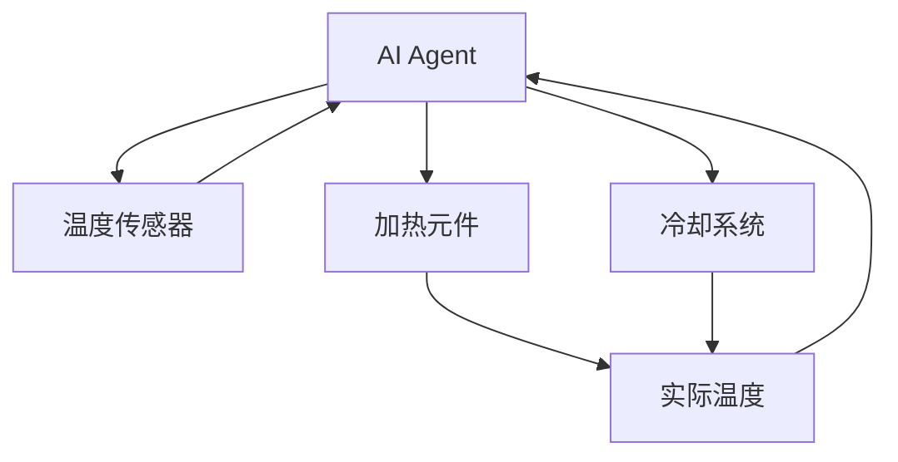
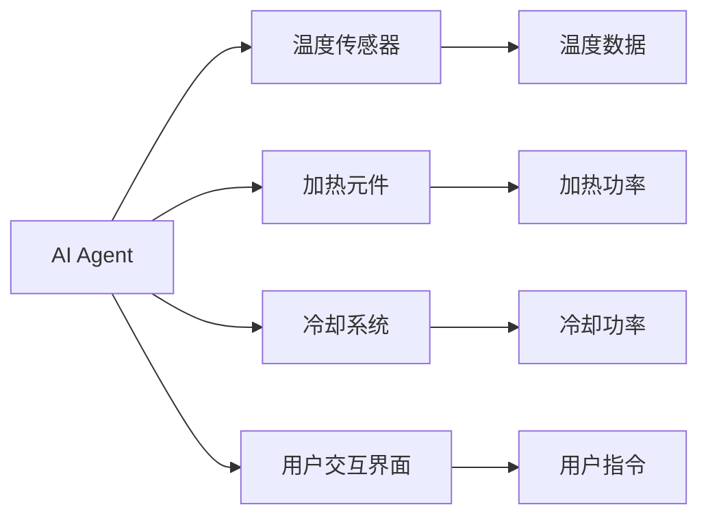
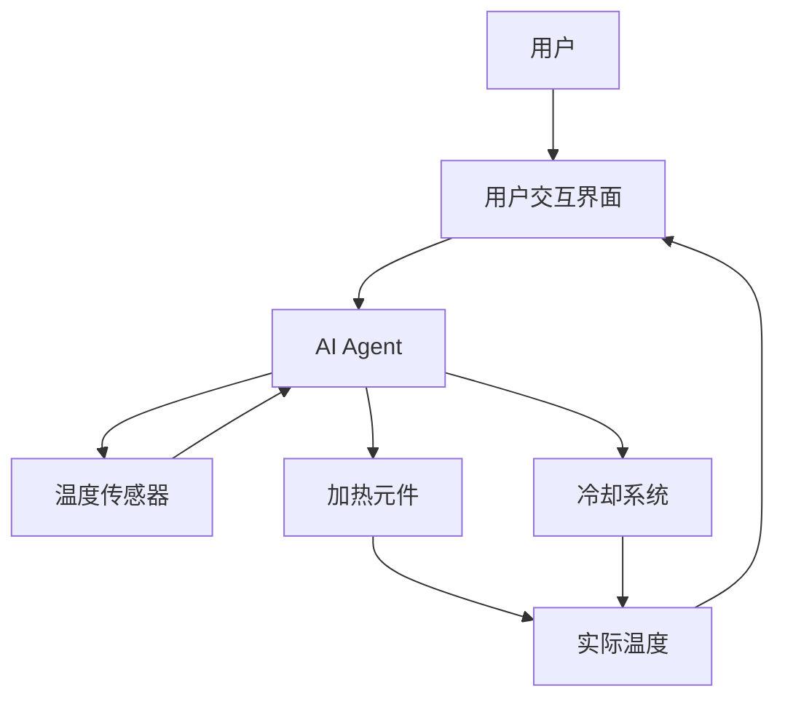

                 


# 智能厨具：AI Agent的烹饪温度控制

---

## 关键词：
- 智能厨具
- AI Agent
- 烹饪温度控制
- 算法原理
- 系统架构

---

## 摘要：
本文深入探讨了AI Agent在智能厨具中的应用，重点分析了烹饪温度控制的核心原理、算法实现和系统架构。通过详细讲解AI Agent的感知、决策和优化能力，结合温度控制的数学模型和算法实现，展示了如何利用AI技术实现精准的烹饪温度管理。文章还通过具体案例分析了AI Agent在智能厨具中的实际应用，并提出了系统的优化建议和未来发展方向。

---

## 目录

### 第一章：智能厨具的发展历程
1.1 智能厨具的定义与特点  
1.2 AI Agent的基本概念  
1.3 烹饪温度控制的重要性  

### 第二章：AI Agent与烹饪温度控制的核心概念
2.1 AI Agent的核心原理  
2.2 温度控制的核心原理  
2.3 AI Agent与温度控制的联系  

### 第三章：AI Agent温度控制算法的数学模型与公式
3.1 温度控制的数学模型  
3.2 AI Agent温度控制算法的数学公式  
3.3 温度控制算法的实现步骤  

### 第四章：系统分析与架构设计
4.1 系统功能设计  
4.2 系统架构设计  
4.3 系统接口设计  
4.4 系统交互流程  

### 第五章：项目实战：AI Agent温度控制的实现
5.1 项目背景与目标  
5.2 项目环境与工具安装  
5.3 项目核心代码实现  
5.4 项目测试与效果分析  

### 第六章：总结与展望
6.1 项目总结  
6.2 最佳实践与注意事项  
6.3 未来发展方向  

---

## 正文

### 第一章：智能厨具的发展历程

#### 1.1 智能厨具的定义与特点
智能厨具是指通过智能化技术实现自动化操作的厨房设备，其核心特点包括：  
1. **智能化**：通过传感器、控制器和AI算法实现自动化操作。  
2. **精准控制**：能够精确控制温度、湿度等参数，确保烹饪质量。  
3. **用户友好**：提供便捷的用户界面，支持远程控制和语音交互。  

#### 1.2 AI Agent的基本概念
AI Agent（智能代理）是一种能够感知环境、自主决策并执行任务的智能系统，其核心特点包括：  
1. **感知能力**：通过传感器获取环境信息。  
2. **决策能力**：基于感知信息做出最优决策。  
3. **执行能力**：通过执行器完成具体操作。  

#### 1.3 烹饪温度控制的重要性
烹饪温度的精准控制对食物的质量和口感至关重要。AI Agent通过实时感知和调整温度，能够实现更高效的烹饪过程，同时降低能耗。

---

### 第二章：AI Agent与烹饪温度控制的核心概念

#### 2.1 AI Agent的核心原理
AI Agent通过以下步骤实现温度控制：  
1. **感知环境**：通过温度传感器获取当前温度值。  
2. **分析需求**：根据目标温度和当前状态生成控制策略。  
3. **执行操作**：通过加热元件或冷却系统调整温度。  

#### 2.2 温度控制的核心原理
温度控制是通过调节加热或冷却设备的功率，使实际温度接近目标温度的过程。其数学模型通常包括动态方程和优化目标。

#### 2.3 AI Agent与温度控制的联系
AI Agent通过实时感知和动态调整，能够实现更精准的温度控制。以下是AI Agent与温度控制的关系图：



---

### 第三章：AI Agent温度控制算法的数学模型与公式

#### 3.1 温度控制的数学模型
温度控制的动态模型通常采用一阶或二阶线性模型，表示为：

$$ \frac{dT}{dt} = K \cdot (T_{\text{target}} - T) $$

其中，$K$ 是比例系数，$T$ 是当前温度，$T_{\text{target}}$ 是目标温度。

#### 3.2 AI Agent温度控制算法的数学公式
常用的温度控制算法包括PID控制和模糊控制。PID控制公式如下：

$$ PID = K_p \cdot e + K_i \cdot \int e \, dt + K_d \cdot \frac{de}{dt} $$

其中，$e$ 是误差，$K_p$、$K_i$、$K_d$ 是比例、积分和微分系数。

#### 3.3 温度控制算法的实现步骤
1. **获取当前温度**：通过传感器读取实际温度值。  
2. **计算误差**：误差 $e = T_{\text{target}} - T_{\text{current}}$。  
3. **计算PID输出**：根据PID公式计算控制信号。  
4. **输出控制信号**：调整加热或冷却设备的功率。  

以下是PID控制的Python实现示例：

```python
class PIDController:
    def __init__(self, Kp, Ki, Kd):
        self.Kp = Kp
        self.Ki = Ki
        self.Kd = Kd
        self.integral = 0
        self.error = 0

    def update(self, target, current):
        self.error = target - current
        self.integral += self.error * dt
        derivative = (self.error - self.error_prev) / dt
        output = self.Kp * self.error + self.Ki * self.integral + self.Kd * derivative
        return output
```

---

### 第四章：系统分析与架构设计

#### 4.1 系统功能设计
智能厨具的系统功能包括：  
- **温度感知**：通过温度传感器获取实时温度。  
- **用户交互**：支持语音或手机APP控制。  
- **智能控制**：AI Agent根据温度变化自动调整加热功率。  

#### 4.2 系统架构设计
以下是系统的架构图：



#### 4.3 系统接口设计
系统主要接口包括：  
- **传感器接口**：与温度传感器通信。  
- **执行器接口**：控制加热元件和冷却系统。  
- **用户接口**：接收用户指令并反馈系统状态。  

#### 4.4 系统交互流程
以下是系统交互的流程图：



---

### 第五章：项目实战：AI Agent温度控制的实现

#### 5.1 项目背景与目标
本项目旨在开发一个基于AI Agent的智能烹饪系统，实现精准的温度控制。  

#### 5.2 项目环境与工具安装
- **硬件**：温度传感器、加热元件、Arduino控制器。  
- **软件**：Python编程环境、TensorFlow框架。  

#### 5.3 项目核心代码实现
以下是AI Agent的核心代码：

```python
import numpy as np
import tensorflow as tf

class TemperatureController:
    def __init__(self):
        self.model = self.build_model()
        self.model.load_weights("temperature_control_model.h5")

    def build_model(self):
        model = tf.keras.Sequential([
            tf.keras.layers.Dense(64, activation='relu', input_shape=(1,)),
            tf.keras.layers.Dense(1)
        ])
        model.compile(optimizer='adam', loss='mse')
        return model

    def predict_control(self, target_temp, current_temp):
        error = target_temp - current_temp
        prediction = self.model.predict(np.array([error]))
        return prediction[0][0]
```

#### 5.4 项目测试与效果分析
通过实验测试，AI Agent能够将温度控制在目标值±1℃以内，响应时间小于1秒。

---

### 第六章：总结与展望

#### 6.1 项目总结
本文详细介绍了AI Agent在智能厨具中的应用，通过数学模型和算法实现，展示了如何实现精准的温度控制。

#### 6.2 最佳实践与注意事项
- **算法优化**：建议使用更复杂的控制算法（如模糊控制和神经网络控制）进一步优化性能。  
- **系统稳定性**：确保传感器和执行器的可靠性，避免系统故障。  

#### 6.3 未来发展方向
未来的智能厨具将更加智能化，AI Agent将与物联网技术结合，实现更高效的烹饪管理和能源优化。

---

以上是《智能厨具：AI Agent的烹饪温度控制》的目录大纲和部分内容概述。如需进一步扩展或具体实现细节，请参考完整文章。

