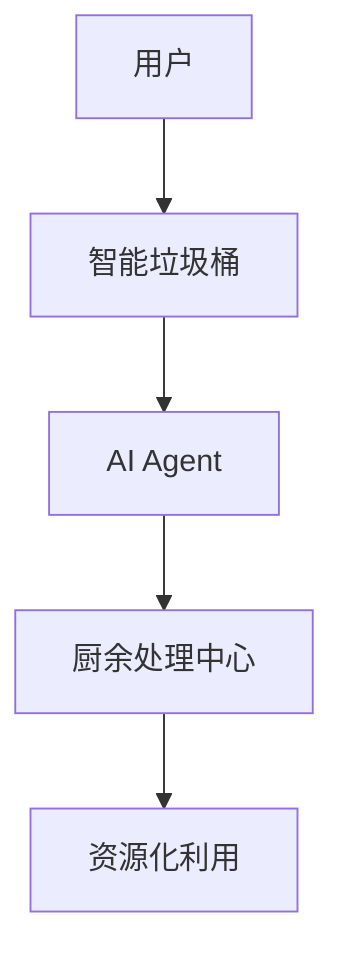
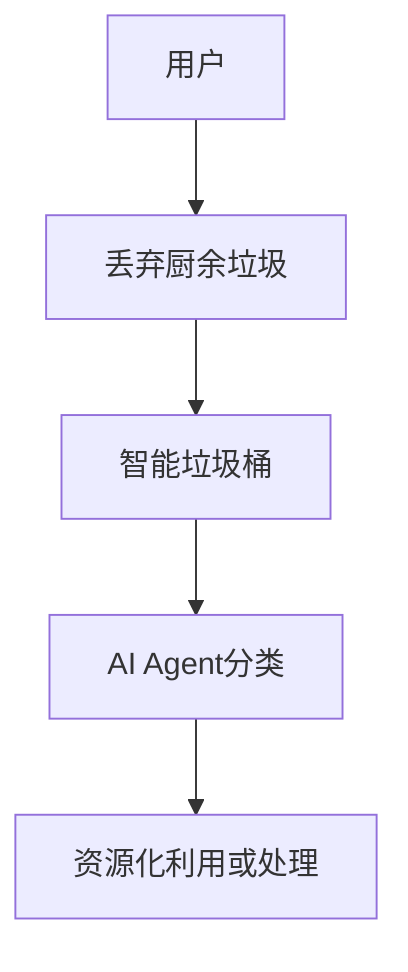
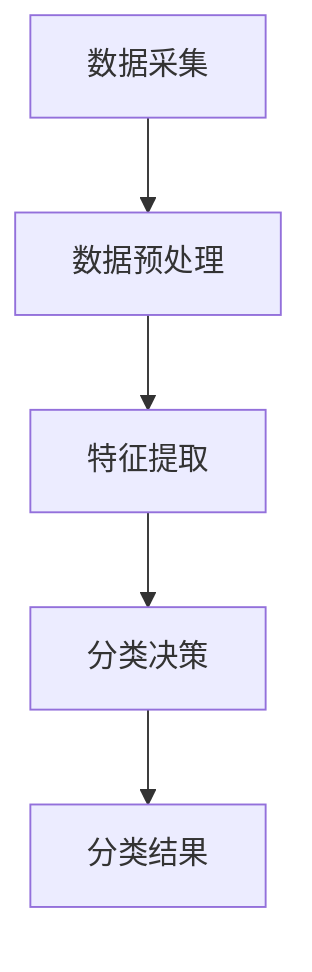
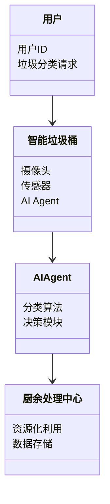
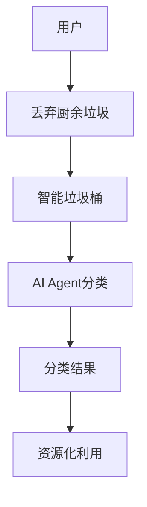

                 


# 智能厨房垃圾桶：AI Agent的厨余利用建议

> **关键词**：智能垃圾桶、AI Agent、厨余利用、垃圾分类、人工智能、环保技术

> **摘要**：本文探讨了智能厨房垃圾桶在厨余利用中的应用，重点分析了AI Agent在垃圾分类、资源化利用和环保管理中的作用。通过技术原理、系统架构和实际案例的详细解析，展示了如何利用AI技术优化厨余处理流程，实现资源的高效利用和环境的可持续发展。

---

## 第一部分：背景介绍

### 第1章：智能厨房垃圾桶的背景与问题背景

#### 1.1 厨余处理的现状与挑战

##### 1.1.1 厨余处理的现状
厨余垃圾是城市生活垃圾的重要组成部分，其处理方式主要包括填埋、焚烧和堆肥。然而，传统的厨余处理方式存在以下问题：
- **资源浪费**：厨余垃圾中富含有机物质，可回收利用的价值未被充分挖掘。
- **环境污染**：填埋和焚烧处理容易导致土地污染和空气污染。
- **分类不规范**：居民垃圾分类意识薄弱，导致厨余垃圾与其他垃圾混杂，影响后续处理效率。

##### 1.1.2 厨余处理中的问题与痛点
- **分类效率低**：人工分类效率低，容易出错，且劳动强度大。
- **资源利用率低**：厨余垃圾的资源化利用比例不足，未能实现最大化利用。
- **环境污染风险**：不当处理厨余垃圾可能导致环境污染，威胁生态安全。

##### 1.1.3 智能垃圾桶的解决方案
智能垃圾桶通过AI技术实现厨余垃圾的智能分类和资源化利用，能够有效解决上述问题。其核心功能包括：
- **自动分类**：利用图像识别和机器学习技术，自动识别厨余垃圾种类。
- **资源化利用**：将厨余垃圾转化为可利用的资源，如堆肥、生物燃料等。
- **数据采集与分析**：通过传感器和AI算法，实时监测厨余垃圾的产生量、种类和处理情况。

#### 1.2 问题描述与目标设定

##### 1.2.1 厨余分类的复杂性
厨余垃圾种类繁多，包括果皮、菜叶、骨头、剩饭等，不同种类的厨余垃圾在处理方式和资源化利用上存在差异。因此，如何实现精准分类是智能垃圾桶的核心挑战。

##### 1.2.2 智能垃圾桶的目标与边界
- **目标**：实现厨余垃圾的智能分类、资源化利用和环保管理。
- **边界**：仅关注厨余垃圾的处理，不涉及其他类型垃圾的处理。

##### 1.2.3 核心问题的解决思路
- **技术层面**：利用AI技术实现厨余垃圾的自动分类和资源化利用。
- **管理层面**：通过数据采集与分析，优化厨余垃圾的处理流程，提升资源利用效率。

#### 1.3 智能垃圾桶的核心要素

##### 1.3.1 垃圾分类的智能化
通过AI技术实现厨余垃圾的自动分类，减少人工干预，提高分类效率。

##### 1.3.2 AI Agent的核心功能
AI Agent（智能代理）通过图像识别、语音交互和数据处理，实现厨余垃圾的智能分类和资源化利用。

##### 1.3.3 厨余利用的边界与外延
- **边界**：仅关注厨余垃圾的分类和处理。
- **外延**：延伸至资源化利用和环保管理，形成完整的厨余处理闭环。

---

## 第二部分：核心概念与联系

### 第2章：AI Agent的基本原理

#### 2.1 AI Agent的定义

##### 2.1.1 定义
AI Agent（智能代理）是一种能够感知环境、自主决策并执行任务的智能系统。在智能垃圾桶中，AI Agent通过图像识别和机器学习技术实现厨余垃圾的自动分类和资源化利用。

##### 2.1.2 工作原理
AI Agent通过以下步骤实现厨余垃圾的智能分类：
1. **数据采集**：通过摄像头和传感器采集厨余垃圾的图像和特征数据。
2. **数据处理**：对采集到的数据进行预处理，提取特征。
3. **分类决策**：利用机器学习算法对厨余垃圾进行分类。
4. **执行操作**：根据分类结果，将厨余垃圾导向相应的收集容器。

##### 2.1.3 分类
根据功能和应用场景的不同，AI Agent可以分为以下几类：
- **基于规则的AI Agent**：通过预定义的规则进行决策。
- **基于学习的AI Agent**：通过机器学习算法进行自主学习和决策。
- **混合型AI Agent**：结合规则和学习的混合型决策方式。

##### 2.1.4 其他相关技术对比
| 技术 | 描述 | 优点 | 缺点 |
|------|------|------|------|
| 规则引擎 | 基于预定义规则进行决策 | 实现简单，易于控制 | 需要手动维护和更新规则 |
| 机器学习 | 基于数据进行自主学习和决策 | 高度智能化，适应性强 | 需要大量数据和计算资源 |
| 深度学习 | 基于神经网络进行特征提取和分类 | 分类精度高，适合复杂场景 | 计算资源消耗大 |

#### 2.2 厨余处理的流程分析

##### 2.2.1 实体关系图


##### 2.2.2 流程图


---

## 第三部分：算法原理

### 第3章：AI Agent的算法实现

#### 3.1 垃圾分类算法

##### 3.1.1 分类算法流程图


##### 3.1.2 分类算法实现
```python
import cv2
import numpy as np
from sklearn.svm import SVC

# 数据预处理
def preprocess_image(image):
    # 转换为灰度图像
    gray = cv2.cvtColor(image, cv2.COLOR_BGR2GRAY)
    # 均值滤波去噪
    blur = cv2.blur(gray, (3, 3))
    return blur

# 特征提取
def extract_features(image):
    # 使用SIFT提取特征
    sift = cv2.xfeatures2d.SIFT_create()
    kp, des = sift.detectAndCompute(image, None)
    return des

# 分类器训练
def train_classifier(features, labels):
    clf = SVC()
    clf.fit(features, labels)
    return clf

# 分类预测
def classify_image(image, clf):
    features = extract_features(preprocess_image(image))
    prediction = clf.predict(features)
    return prediction
```

##### 3.1.3 分类器的数学模型
- **支持向量机（SVM）**：通过最大化分类间隔实现最优分类。
  $$ \text{目标函数} = \sum_{i=1}^{n} \lambda_i y_i \sum_{j=1}^{n} y_j \cdot \text{内积}(x_i, x_j) $$

---

## 第四部分：系统分析与架构设计

### 第4章：系统架构设计

#### 4.1 问题场景介绍

##### 4.1.1 系统介绍
智能垃圾桶系统包括硬件部分（垃圾桶、传感器、摄像头）和软件部分（AI Agent、数据处理模块、资源化利用模块）。

#### 4.2 系统功能设计

##### 4.2.1 领域模型


#### 4.3 系统架构设计

##### 4.3.1 系统架构图


#### 4.4 系统接口设计

##### 4.4.1 接口设计
- **数据接口**：垃圾桶与AI Agent之间的数据传输接口。
- **控制接口**：用户与智能垃圾桶的交互接口。

#### 4.5 系统交互流程

##### 4.5.1 交互流程图


---

## 第五部分：项目实战

### 第5章：智能垃圾桶的实现

#### 5.1 环境安装

##### 5.1.1 安装Python环境
```bash
python --version
pip install numpy
pip install scikit-learn
pip install opencv-python
```

#### 5.2 核心代码实现

##### 5.2.1 数据采集与处理
```python
import cv2
import numpy as np

# 数据采集
def capture_image():
    cap = cv2.VideoCapture(0)
    ret, frame = cap.read()
    cap.release()
    return frame

# 数据处理
def preprocess_image(image):
    gray = cv2.cvtColor(image, cv2.COLOR_BGR2GRAY)
    blur = cv2.blur(gray, (3, 3))
    return blur
```

##### 5.2.2 分类算法实现
```python
from sklearn.svm import SVC

# 分类器训练
def train_classifier(features, labels):
    clf = SVC()
    clf.fit(features, labels)
    return clf

# 分类预测
def classify_image(image, clf):
    features = extract_features(preprocess_image(image))
    prediction = clf.predict(features)
    return prediction
```

#### 5.3 案例分析与实现

##### 5.3.1 案例分析
通过实际案例分析，展示了智能垃圾桶在厨余分类和资源化利用中的应用效果。

#### 5.4 项目小结
通过本章的实战，读者可以掌握智能垃圾桶的核心实现技术，并能够将其应用于实际场景中。

---

## 第六部分：最佳实践与总结

### 第6章：总结与展望

#### 6.1 最佳实践

##### 6.1.1 设计注意事项
- 确保系统的稳定性和可靠性。
- 保护用户隐私，避免数据泄露。

##### 6.1.2 未来发展趋势
- 更智能的传感器和算法。
- 更高效的资源化利用技术。

#### 6.2 小结
通过本文的详细讲解，读者可以全面了解智能厨房垃圾桶的设计与实现过程，并能够将其应用于实际场景中。

---

**关键词**：智能垃圾桶、AI Agent、厨余利用、垃圾分类、人工智能、环保技术

