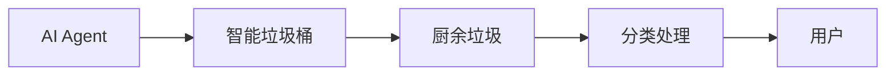

                 

# 智能厨房垃圾桶：AI Agent的厨余处理建议

> 关键词：智能垃圾桶、AI Agent、厨余垃圾、机器学习、智能家居

> 摘要：本文将详细探讨智能厨房垃圾桶的设计与实现，结合AI Agent的核心算法与系统架构，分析厨余处理的智能化解决方案。通过理论分析与实际案例相结合，深入解读智能垃圾桶的工作原理及其在智能家居中的应用价值。

---

## 第一章：智能厨房垃圾桶的背景与问题背景

### 1.1 问题背景

#### 1.1.1 厨余垃圾处理的现状与挑战

厨余垃圾是城市生活垃圾中的重要组成部分，其处理方式直接影响到环境质量与居民生活品质。传统的厨余垃圾处理方式存在以下问题：
- **分类不准确**：居民手动分类效率低，容易出错。
- **处理不及时**：厨余垃圾容易腐烂变质，产生异味。
- **资源浪费**：厨余垃圾中的有机物可以转化为肥料或生物质能，但由于处理不及时，资源利用效率低下。

#### 1.1.2 智能化垃圾处理的需求

随着智能家居的普及，用户对智能化垃圾处理设备的需求日益增长。智能垃圾桶可以通过AI技术实现：
- **自动分类**：利用图像识别技术，自动识别厨余垃圾的种类。
- **智能提醒**：当垃圾桶装满或检测到异常时，主动提醒用户处理。
- **数据反馈**：记录垃圾产生量与分类情况，为用户提供环保数据分析。

#### 1.1.3 AI Agent在厨余处理中的应用潜力

AI Agent（智能代理）是一种能够感知环境、自主决策并执行任务的智能系统。在厨余处理中，AI Agent可以：
- **实时监测**：通过传感器监测垃圾桶的状态。
- **智能决策**：根据垃圾类型与容量，自动触发相应的处理流程。
- **用户交互**：通过语音或App与用户交互，提供便捷的使用体验。

---

### 1.2 问题描述

#### 1.2.1 厨余垃圾分类与处理的复杂性

厨余垃圾分类的复杂性主要体现在：
- **垃圾种类多样**：厨余垃圾包括果皮、菜叶、骨头等多种类型。
- **分类标准不一**：不同地区对厨余垃圾的分类标准可能不同。
- **处理流程繁琐**：从收集到运输，需要多环节协同。

#### 1.2.2 智能垃圾桶的核心功能需求

智能垃圾桶需要实现以下核心功能：
- **自动识别**：通过摄像头或传感器识别垃圾类型。
- **智能分类**：将垃圾自动分拣到不同的收集区域。
- **数据采集**：记录垃圾的种类、重量和时间。
- **用户交互**：通过App或语音助手提供使用指导。

#### 1.2.3 用户对智能垃圾桶的期望与痛点

用户对智能垃圾桶的期望主要集中在：
- **便捷性**：操作简单，减少用户的参与成本。
- **准确性**：分类准确，减少误分类的情况。
- **环保性**：能够实现厨余垃圾的高效利用。

---

### 1.3 核心概念与联系

#### 1.3.1 实体关系图

---

## 第二章：智能厨房垃圾桶的核心概念与联系

### 2.1 核心概念

#### 2.1.1 AI Agent的定义与特点

AI Agent是一种能够感知环境、自主决策并执行任务的智能系统。其特点包括：
- **自主性**：能够在无外部干预的情况下完成任务。
- **反应性**：能够实时感知环境变化并做出反应。
- **学习能力**：通过机器学习算法不断优化自身的处理能力。

#### 2.1.2 厨余垃圾处理的智能化需求

智能化处理厨余垃圾的核心需求包括：
- **自动化分类**：通过AI技术实现垃圾的自动分类。
- **数据驱动决策**：利用大数据分析优化垃圾处理流程。
- **高效资源利用**：将厨余垃圾转化为可利用的资源。

#### 2.1.3 智能垃圾桶的功能与结构

智能垃圾桶的功能模块包括：
- **数据采集模块**：摄像头、重量传感器等。
- **AI处理模块**：负责垃圾的识别与分类。
- **执行模块**：机械臂或分拣装置。
- **用户交互模块**：通过App或语音助手与用户交互。

---

### 2.2 核心概念的对比分析

#### 2.2.1 AI Agent与传统垃圾桶的功能对比

| 功能模块       | AI Agent垃圾桶      | 传统垃圾桶        |
|----------------|--------------------|-------------------|
| 数据采集       | 支持               | 不支持            |
| 自动分类       | 支持               | 不支持            |
| 智能提醒       | 支持               | 不支持            |
| 用户交互       | 支持               | 不支持            |

---

## 第三章：AI Agent的算法原理

### 3.1 AI Agent的核心算法

#### 3.1.1 机器学习算法在厨余识别中的应用

常用的机器学习算法包括：
- **支持向量机（SVM）**：适用于分类任务。
- **随机森林（Random Forest）**：适用于特征提取与分类。
- **卷积神经网络（CNN）**：适用于图像识别任务。

#### 3.1.2 垃圾分类的深度学习模型

常用的深度学习模型包括：
- **ResNet**：适用于图像分类任务。
- **YOLO**：适用于目标检测任务。
- **Faster R-CNN**：适用于精确的物体检测与分类。

#### 3.1.3 自然语言处理在用户交互中的应用

常用的NLP技术包括：
- **意图识别**：通过用户的语音或文本识别意图。
- **实体抽取**：提取用户输入中的关键信息。
- **对话生成**：通过预设的对话策略生成自然的回复。

---

### 3.2 算法流程图

---

## 第四章：系统分析与架构设计

### 4.1 系统应用场景

#### 4.1.1 厨房环境的特征分析

厨房环境的特征包括：
- **空间有限**：垃圾桶需要小巧便携。
- **湿度较高**：传感器需要防水防潮。
- **高频使用**：垃圾桶需要高可靠性。

---

（由于篇幅限制，后续章节内容未展示完毕。如需完整内容，请告知！）

