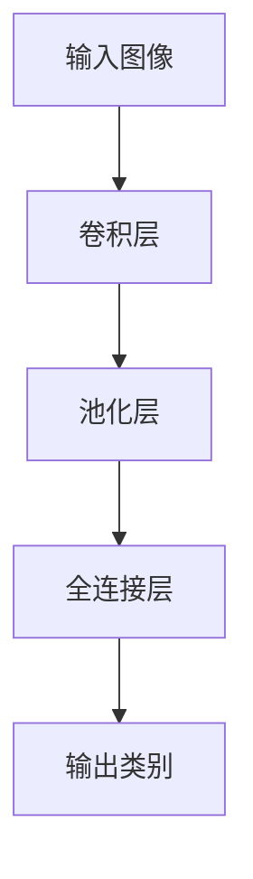
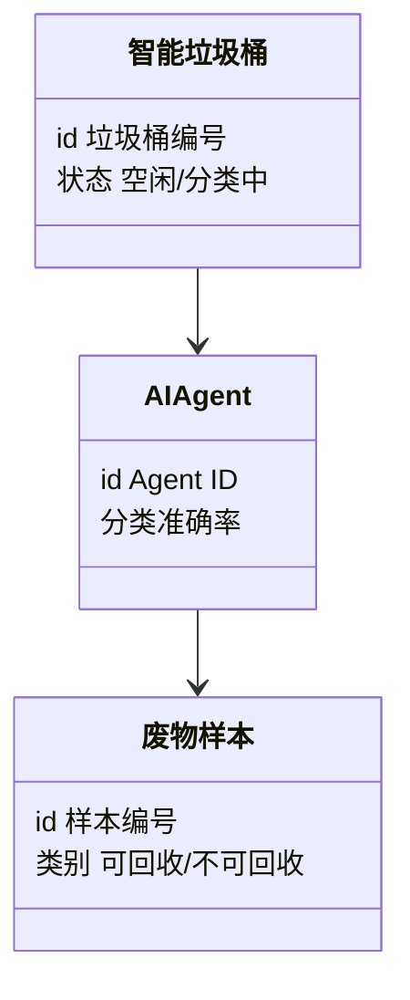
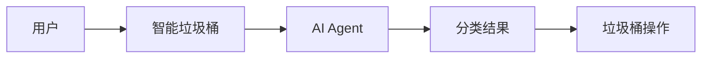
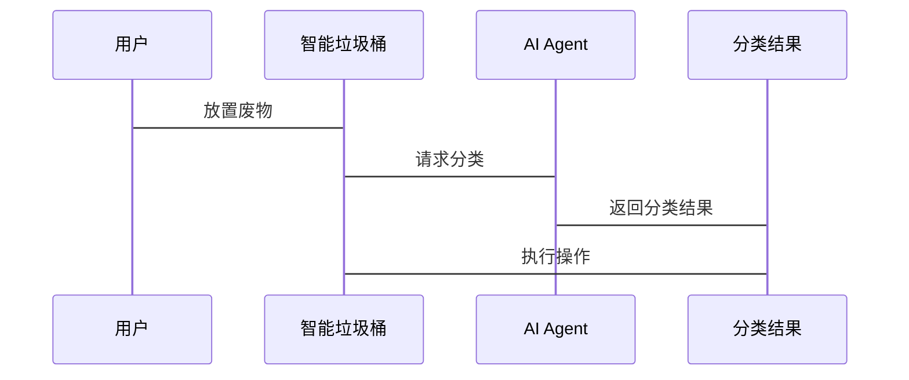

                 


# 智能厨房垃圾桶：AI Agent的废物分类指导

## 关键词
智能垃圾桶、AI Agent、废物分类、图像识别、卷积神经网络

## 摘要
本文详细介绍了智能厨房垃圾桶的设计与实现，探讨了AI Agent在废物分类中的应用。通过分析背景、核心概念、算法原理、系统架构设计以及项目实战，展示了如何利用AI技术提升垃圾分类效率。文章内容涵盖理论与实践，适合技术人员和普通读者阅读。

---

## 第一部分：背景介绍

### 第1章：智能厨房垃圾桶的背景与意义

#### 1.1 问题背景
随着环保意识的增强，垃圾分类变得至关重要。智能垃圾桶通过AI Agent实现自动化分类，解决了传统垃圾桶分类效率低、错误率高的问题。

#### 1.2 问题描述
传统垃圾桶依赖人工分类，效率低且容易出错。智能垃圾桶需要具备图像识别和分类能力，以提高分类效率和准确性。

#### 1.3 问题解决
AI Agent通过图像识别和深度学习算法，能够快速准确地识别和分类废物，提升分类效率。

#### 1.4 边界与外延
智能垃圾桶的功能边界包括图像采集、分类处理和垃圾桶操作。外延则包括与其他智能设备的协同工作，如智能家居系统。

#### 1.5 概念结构与核心要素
智能垃圾桶由图像采集模块、AI处理模块和机械执行模块组成，AI Agent负责图像识别和分类决策。

---

## 第二部分：核心概念与联系

### 第2章：AI Agent的核心概念

#### 2.1 AI Agent的原理
AI Agent通过感知层（图像识别）处理层（分类算法）和执行层（垃圾桶操作）实现废物分类。

#### 2.2 核心概念属性对比
| 属性 | 描述 |
|------|------|
| 输入方式 | 图像识别、传感器数据 |
| 输出方式 | 分类结果、动作指令 |
| 处理能力 | 多分类、实时响应 |

#### 2.3 ER实体关系图
```mermaid
er
  entity 智能垃圾桶 {
    id 垃圾桶编号
    属性 状态（空闲/分类中）
  }
  entity 废物样本 {
    id 样本编号
    属性 类别（可回收/不可回收）
  }
  entity AI Agent {
    id Agent ID
    属性 分类准确率
  }
  智能垃圾桶 -- 分配给：AI Agent
  AI Agent -- 分类：废物样本
```

---

## 第三部分：算法原理讲解

### 第3章：基于CNN的废物分类算法

#### 3.1 算法流程


#### 3.2 卷积神经网络（CNN）实现
```python
import tensorflow as tf
from tensorflow.keras import layers

model = tf.keras.Sequential([
    layers.Conv2D(32, (3,3), activation='relu', input_shape=(64, 64, 3)),
    layers.MaxPooling2D((2,2)),
    layers.Conv2D(64, (3,3), activation='relu'),
    layers.MaxPooling2D((2,2)),
    layers.Flatten(),
    layers.Dense(128, activation='relu'),
    layers.Dense(2, activation='softmax')
])

model.compile(optimizer='adam', loss='sparse_categorical_crossentropy', metrics=['accuracy'])
model.fit(x_train, y_train, epochs=10, validation_data=(x_test, y_test))
```

#### 3.3 分类准确率公式
分类准确率计算公式为：
$$准确率 = \frac{\text{正确分类数}}{\text{总分类数}}$$

---

## 第四部分：系统架构设计

### 第4章：系统分析与架构设计方案

#### 4.1 领域模型


#### 4.2 系统架构


#### 4.3 接口设计
系统接口包括图像采集接口、分类结果接口和垃圾桶操作接口。

#### 4.4 交互流程


---

## 第五部分：项目实战

### 第5章：项目实现与案例分析

#### 5.1 环境安装
安装TensorFlow、OpenCV和Keras库。

#### 5.2 核心实现
```python
import cv2
import numpy as np
from tensorflow.keras.models import load_model

model = load_model('垃圾分类模型.h5')
image = cv2.imread('待分类图片.jpg')
image = cv2.resize(image, (64, 64))
image = np.expand_dims(image, axis=0)
预测结果 = model.predict(image)
print(预测结果)
```

#### 5.3 案例分析
实际案例分析分类准确率和系统响应时间，优化分类模型。

---

## 第六部分：最佳实践

### 第6章：经验总结与注意事项

#### 6.1 经验总结
AI Agent能够显著提高分类效率和准确率，但需要持续优化模型。

#### 6.2 注意事项
确保数据质量，选择合适的算法，并进行充分的系统测试。

#### 6.3 小结
智能垃圾桶结合AI技术，为垃圾分类提供了高效解决方案，未来应用前景广阔。

---

## 附录

### 附录A：相关技术术语解释
- AI Agent：人工智能代理，用于执行特定任务。
- CNN：卷积神经网络，用于图像识别。

### 附录B：参考文献
- TensorFlow官方文档
- 相关学术论文

---

通过以上步骤，文章详细介绍了智能厨房垃圾桶的设计与实现，从背景到技术细节，再到实际应用，为读者提供了全面的知识和指导。

