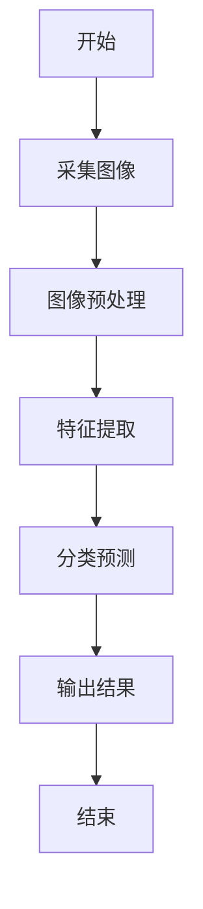
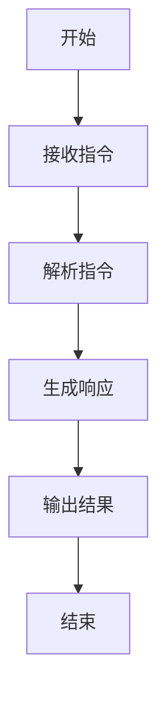
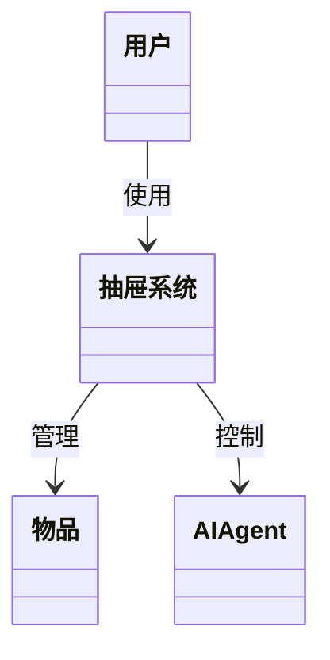

                 


# 智能厨房抽屉：AI Agent的物品管理系统

## 关键词：智能厨房抽屉，AI Agent，物品管理，智能家居，人工智能

## 摘要：本文介绍了一种基于AI Agent的智能厨房抽屉物品管理系统，探讨了其背景、核心概念、算法原理、系统架构设计及实际应用，旨在为读者提供全面的技术解析。

---

## 第1章：背景介绍

### 1.1 问题背景

#### 1.1.1 厨房物品管理的传统方式及其局限性

传统厨房抽屉管理依赖人工记录和查找，存在物品杂乱、查找效率低的问题。用户常因遗忘位置而浪费时间，尤其在多人共享的情况下，管理效率更低下。

#### 1.1.2 智能家居的发展趋势与AI技术的应用

智能家居技术的发展推动了厨房智能化，AI Agent的应用使物品管理更高效。通过图像识别和自然语言处理，系统能自动识别物品并响应用户指令。

#### 1.1.3 智能厨房抽屉的市场需求与潜在用户群体

现代家庭对高效厨房管理的需求增加，智能抽屉适用于各类用户，尤其适合忙碌的上班族和多人口家庭，帮助提升生活效率。

### 1.2 问题描述

#### 1.2.1 厨房物品管理中的常见问题

物品摆放无序、查找困难、管理混乱，尤其是多人使用时，容易出现物品丢失或重复购买的情况。

#### 1.2.2 物品查找效率低下与管理混乱的具体表现

用户常因找不到物品而耽误时间，物品管理混乱导致重复购买，增加经济负担。

#### 1.2.3 不同家庭成员使用习惯的差异性带来的挑战

不同人的使用习惯差异导致管理混乱，难以统一管理物品，影响系统效率。

### 1.3 问题解决与系统目标

#### 1.3.1 智能厨房抽屉系统的功能目标

实现物品自动识别、分类管理、高效查找和提醒功能，优化厨房管理效率。

#### 1.3.2 AI Agent在物品管理中的作用与优势

AI Agent能自动识别物品，学习用户习惯，提供智能化建议，显著提升管理效率。

#### 1.3.3 系统设计的核心理念与用户需求的匹配

以用户需求为中心，结合AI技术，提供智能化解决方案，提升用户体验。

### 1.4 系统的边界与外延

#### 1.4.1 系统功能的边界划分

明确系统功能边界，如不涉及烹饪过程监控，专注于物品管理。

#### 1.4.2 与其他智能家居设备的协同工作

与智能冰箱、智能垃圾桶等设备协同，构建完整的厨房生态系统。

#### 1.4.3 系统扩展性与未来可能的功能增强

未来可能增加健康数据分析、食材推荐等功能，进一步提升系统价值。

### 1.5 核心概念与组成要素

#### 1.5.1 AI Agent的基本概念与功能模块

AI Agent包括图像识别模块、自然语言处理模块和决策模块，协同工作实现智能化管理。

#### 1.5.2 物品管理系统的组成要素与相互关系

系统由传感器、摄像头、AI模块和数据库组成，各部分协同完成物品识别、存储和管理。

#### 1.5.3 系统的核心组件及其作用

传感器负责数据采集，摄像头用于图像识别，AI模块处理数据，数据库存储信息，用户交互界面供操作。

---

## 第2章：AI Agent与物品管理系统的原理

### 2.1 AI Agent的核心原理

#### 2.1.1 AI Agent的基本工作原理

AI Agent通过传感器和摄像头采集数据，结合预训练模型识别物品，根据用户指令执行操作。

#### 2.1.2 基于AI的物品识别与分类技术

采用深度学习模型，如卷积神经网络，训练模型识别不同物品，分类管理。

#### 2.1.3 自然语言处理在用户交互中的应用

通过NLP技术解析用户指令，生成自然语言反馈，提升用户体验。

### 2.2 核心概念的属性特征对比

| 特性 | AI Agent | 传统自动化设备 |
|------|-----------|----------------|
| 智能性 | 高 | 低 |
| 交互性 | 支持自然语言 | 无 |
| 学习能力 | 可自适应 | 无 |

### 2.3 系统架构的ER实体关系图

```mermaid
er
actor(用户) -|> 抽屉系统 : 使用
抽屉系统 -|> 物品 : 管理
抽屉系统 -|> AI Agent : 控制
AI Agent -|> 感知器 : 采集数据
AI Agent -|> 决策器 : 处理数据
```

---

## 第3章：算法原理讲解

### 3.1 基于图像识别的物品分类算法

#### 3.1.1 算法流程图



#### 3.1.2 算法实现代码

```python
import tensorflow as tf
from tensorflow.keras import layers

# 加载预训练模型
model = tf.keras.models.load_model('物品分类模型.h5')

# 图像预处理
def preprocess_image(image):
    image = tf.image.resize(image, (128, 128))
    image = tf.keras.layers.experimental.preprocessing.Rescaling(1.0/255)(image)
    return image

# 分类预测
def classify_image(image_path):
    image = tf.io.read_file(image_path)
    image = tf.image.decode_jpeg(image, channels=3)
    image = preprocess_image(image)
    image = tf.expand_dims(image, axis=0)
    prediction = model.predict(image)
    return prediction

# 示例使用
classify_image('apple.jpg')
```

#### 3.1.3 数学模型和公式

分类模型采用卷积神经网络，损失函数为交叉熵：

$$ L = -\sum_{i} y_i \log(p_i) $$

其中，$y_i$ 是真实标签，$p_i$ 是预测概率。

### 3.2 自然语言处理的交互算法

#### 3.2.1 算法流程图



#### 3.2.2 算法实现代码

```python
import transformers

# 加载预训练模型
tokenizer = transformers.BertTokenizer.from_pretrained('bert-base')
model = transformers.TFModel.from_pretrained('bert-base')

# 解析指令
def process_command(command):
    inputs = tokenizer(command, return_tensors='tf')
    outputs = model(inputs.input_ids)
    return outputs

# 示例使用
process_command('我需要找一个苹果。')
```

---

## 第4章：系统分析与架构设计

### 4.1 项目场景介绍

智能厨房抽屉系统用于管理厨房物品，帮助用户高效查找和管理物品。

### 4.2 系统功能设计

#### 4.2.1 领域模型



#### 4.2.2 系统架构

```mermaid
graph TD
    UI --> API Gateway
    API Gateway --> AI Agent
    AI Agent --> 数据库
    数据库 --> 物品传感器
```

#### 4.2.3 接口设计

- 用户界面（UI）：提供交互入口
- API网关：处理外部请求
- AI Agent：处理数据和逻辑
- 数据库：存储物品信息

#### 4.2.4 交互流程

用户通过UI发送指令，API网关转发给AI Agent，处理后反馈结果。

---

## 第5章：项目实战

### 5.1 环境安装

安装Python、TensorFlow、Keras和相关库。

### 5.2 核心代码实现

#### 5.2.1 物品识别模块

```python
import cv2
import numpy as np

# 初始化摄像头
cap = cv2.VideoCapture(0)

while True:
    ret, frame = cap.read()
    cv2.imshow('摄像头预览', frame)
    if cv2.waitKey(1) & 0xFF == ord('q'):
        break

cap.release()
cv2.destroyAllWindows()
```

#### 5.2.2 自然语言处理模块

```python
from transformers import pipeline

# 初始化NLP pipeline
nlp = pipeline('text-classification', model='bert-base')

# 处理用户指令
response = nlp('我需要找一个苹果。')
print(response)
```

### 5.3 实际案例分析

用户输入“我需要找一个苹果”，系统识别并指引用户位置，完成查找。

### 5.4 项目小结

通过实战，展示了系统的功能实现和实际应用效果。

---

## 第6章：最佳实践与总结

### 6.1 小结

系统结合AI技术，有效提升了厨房物品管理效率，优化了用户体验。

### 6.2 使用建议

建议家庭用户安装，多人共享提高效率。

### 6.3 注意事项

确保系统安全，保护用户隐私。

### 6.4 拓展阅读

推荐相关书籍和论文，深入学习AI和智能家居技术。

---

## 总结

本文详细介绍了智能厨房抽屉系统的背景、原理、架构设计及实际应用，为读者提供了全面的技术解析。通过系统化的分析和实际案例，展示了AI技术在智能家居中的潜力和价值。

