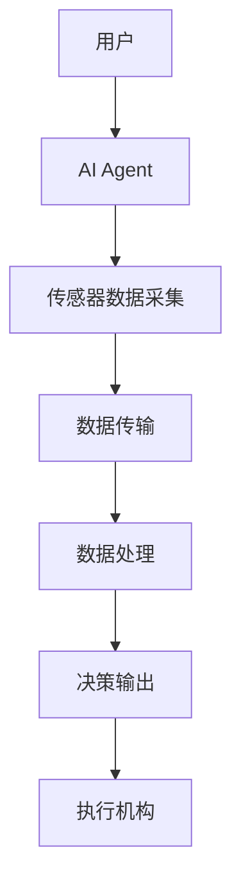
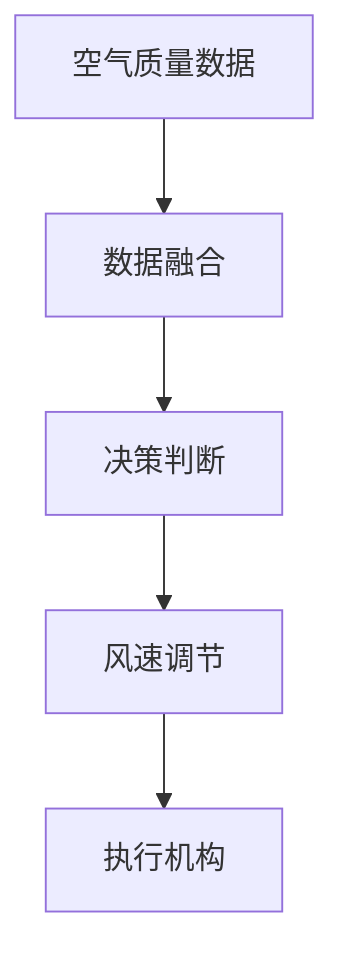
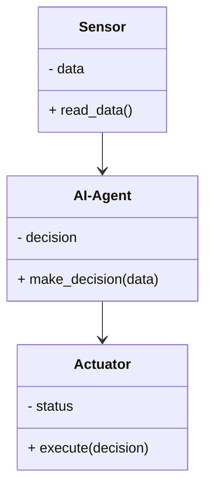
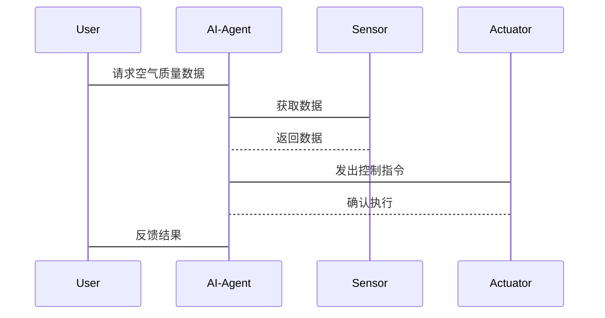
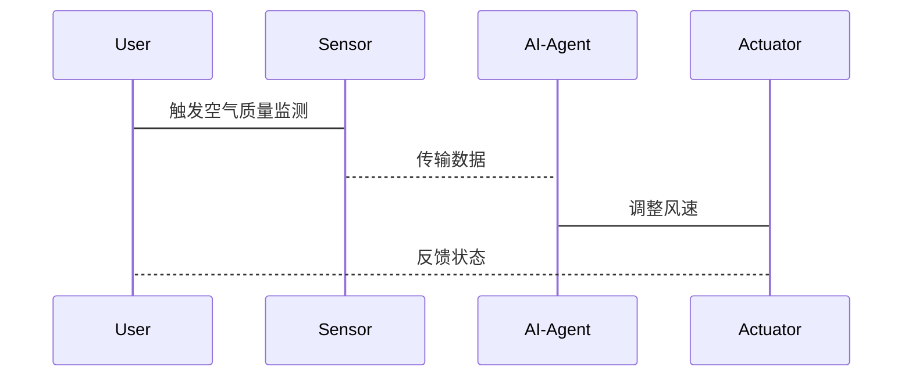

                 


# 第一部分: 智能厨房抽油烟机的背景与核心概念

## 第1章: 问题背景与需求分析

### 1.1 问题背景

#### 1.1.1 厨房空气质量问题的现状
- 现代厨房中油烟、异味、颗粒物等问题对健康的严重影响
- 传统抽油烟机功能的局限性
- 健康意识提升对智能厨房设备的需求

#### 1.1.2 传统抽油烟机的局限性
- 功能单一，仅能抽风
- 无法智能调节风速
- 无法感知和反馈空气质量
- 无法与其他智能设备联动

#### 1.1.3 智能化的需求驱动
- 用户对智能、便捷生活的追求
- 物联网技术的快速发展
- 人工智能在家电领域的广泛应用

### 1.2 问题描述

#### 1.2.1 空气质量监测的必要性
- 烹饪过程中产生的油烟、异味、PM2.5等污染物
- 不同烹饪方式对空气质量的影响
- 实时监测空气质量的必要性

#### 1.2.2 智能控制的核心目标
- 自动调节抽油烟机的风速
- 智能识别和处理异常空气质量
- 提供健康、舒适的厨房环境

#### 1.2.3 用户需求与痛点分析
- 用户需求：便捷操作、健康保障、智能联动
- 痛点：传统设备功能单一、无法智能调节、无法实时监测

### 1.3 问题解决思路

#### 1.3.1 引入AI Agent的必要性
- AI Agent能够实时感知和分析空气质量
- 能够自主决策并执行控制策略
- 可以实现设备间的智能联动

#### 1.3.2 智能控制的实现路径
- 传感器数据采集与传输
- AI Agent的数据分析与决策
- 执行机构的智能控制

#### 1.3.3 技术实现的可行性分析
- 现有技术的成熟度
- 设备的兼容性与集成性
- 用户接受度与市场潜力

### 1.4 边界与外延

#### 1.4.1 系统的边界定义
- 系统的定义与范围
- 与其他系统的接口关系
- 功能的限定与扩展

#### 1.4.2 功能的外延范围
- 核心功能：空气质量监测、智能控制
- 可选功能：联动其他智能设备、远程控制
- 边界条件：设备兼容性、网络连接要求

#### 1.4.3 与其他系统的接口关系
- 与智能家居平台的接口
- 与传感器模块的接口
- 与执行机构的接口

### 1.5 核心概念结构

#### 1.5.1 核心概念的组成要素
- AI Agent
- 传感器模块
- 执行机构
- 数据传输与分析

#### 1.5.2 概念之间的关系
- AI Agent通过传感器获取数据
- AI Agent分析数据并决策
- 执行机构根据决策执行动作

#### 1.5.3 系统的整体架构
- 传感器层
- 数据处理层
- 应用层

---

## 第2章: 核心概念与联系

### 2.1 AI Agent的核心原理

#### 2.1.1 AI Agent的基本定义
- AI Agent的定义
- AI Agent的核心特征

#### 2.1.2 AI Agent的核心特征对比表
| 特征                | 描述                                      |
|---------------------|-----------------------------------------|
| 自主性              | 能够自主决策和执行                      |
| 反应性              | 能够实时感知环境变化并做出反应          |
| 目标驱动            | 以特定目标为导向                        |
| 学习能力            | 能够通过数据学习和优化                  |

#### 2.1.3 AI Agent的ER实体关系图
```mermaid
er
  actor: 用户
  agent: AI Agent
  sensor: 传感器
  actuator: 执行机构
  environment: 环境
  relation: 用户通过AI Agent控制执行机构，AI Agent通过传感器感知环境
```

---

## 第3章: 算法原理讲解

### 3.1 传感器数据采集

#### 3.1.1 传感器类型与功能
- PM2.5传感器
- CO2传感器
- VOC传感器
- 温湿度传感器

#### 3.1.2 数据采集流程


### 3.2 AI Agent的决策算法

#### 3.2.1 数据融合算法
- 模糊逻辑算法
- 加权平均算法
- 卡尔曼滤波算法

#### 3.2.2 决策逻辑


#### 3.2.3 算法实现
- 使用Python编写数据融合算法
- 使用机器学习模型进行空气质量预测

### 3.3 反馈机制

#### 3.3.1 反馈数据采集
- 实时采集空气质量数据
- 采集用户反馈

#### 3.3.2 反馈数据处理
- 数据分析与优化
- 模型优化与调整

---

## 第4章: 数学模型与公式

### 4.1 空气质量监测模型

#### 4.1.1 传感器数据融合模型
$$ y = a_1x_1 + a_2x_2 + ... + a_nx_n $$

#### 4.1.2 空气质量指数计算公式
$$ AQI = w_1PM2.5 + w_2CO2 + w_3VOC $$

### 4.2 智能控制模型

#### 4.2.1 PID控制算法
$$ u(t) = K_p e(t) + K_i \int e(t) dt + K_d \frac{de(t)}{dt} $$

#### 4.2.2 基于机器学习的预测模型
$$ y = f(x) $$

---

## 第5章: 系统分析与架构设计

### 5.1 问题场景介绍

#### 5.1.1 系统目标
- 实现智能厨房抽油烟机的空气质量控制
- 提供健康、舒适的厨房环境

#### 5.1.2 系统范围
- 空气质量监测
- AI Agent决策控制
- 执行机构

### 5.2 系统功能设计

#### 5.2.1 功能模块划分
- 传感器数据采集模块
- 数据处理模块
- AI Agent决策模块
- 执行机构控制模块

#### 5.2.2 功能流程


### 5.3 系统架构设计

#### 5.3.1 架构风格
- 分层架构：传感器层、数据处理层、应用层

#### 5.3.2 架构图


### 5.4 接口设计

#### 5.4.1 接口定义
- 传感器接口
- 数据处理接口
- 执行机构接口

#### 5.4.2 接口交互


### 5.5 系统交互流程

#### 5.5.1 交互流程


---

## 第6章: 项目实战

### 6.1 环境安装

#### 6.1.1 硬件环境
- 传感器模块
- AI Agent硬件
- 执行机构

#### 6.1.2 软件环境
- Python编程环境
- 数据处理工具

### 6.2 核心代码实现

#### 6.2.1 数据采集代码
```python
import serial

ser = serial.Serial('COM3', 9600)

def read_sensor_data():
    while True:
        data = ser.readline().decode('utf-8')
        return data
```

#### 6.2.2 AI Agent算法代码
```python
import numpy as np

class AI-Agent:
    def __init__(self):
        self.Kp = 1
        self.Ki = 0.5
        self.Kd = 0.2

    def make_decision(self, error):
        u = self.Kp * error + self.Ki * sum(error) + self.Kd * (error - prev_error)
        return u
```

#### 6.2.3 执行机构代码
```python
import RPi.GPIO as GPIO

class Actuator:
    def __init__(self, pin):
        self.pin = pin
        GPIO.setup(pin, GPIO.OUT)

    def set_speed(self, speed):
        GPIO.output(self.pin, speed)
```

### 6.3 案例分析

#### 6.3.1 数据采集与处理
- 采集PM2.5、CO2、VOC等数据
- 数据融合与分析

#### 6.3.2 决策与控制
- AI Agent根据数据做出决策
- 执行机构调整风速

### 6.4 项目小结

#### 6.4.1 项目成果
- 成功实现智能厨房抽油烟机的空气质量控制
- 实现了AI Agent的实时监测与智能控制

#### 6.4.2 经验总结
- 数据采集的准确性与实时性
- 算法的优化与调整
- 系统的稳定性和可靠性

---

## 第7章: 最佳实践与拓展

### 7.1 最佳实践 tips

#### 7.1.1 传感器校准
- 定期校准传感器，确保数据准确性

#### 7.1.2 数据隐私保护
- 加强数据传输加密
- 遵守数据隐私法规

### 7.2 小结

#### 7.2.1 系统的整体回顾
- 系统的功能实现
- 系统的性能表现
- 系统的用户反馈

### 7.3 注意事项

#### 7.3.1 系统维护
- 定期检查硬件设备
- 更新软件和算法

#### 7.3.2 系统安全
- 防止网络攻击
- 数据备份与恢复

### 7.4 拓展阅读

#### 7.4.1 相关技术
- 智能家居
- 物联网
- 人工智能

#### 7.4.2 应用领域
- 智能家电
- 智慧城市
- 健康监测

---

## 结语

智能厨房抽油烟机的空气质量控制是一个结合了物联网、人工智能和智能家居的复杂系统。通过引入AI Agent，我们能够实现更智能、更高效的空气质量控制，为用户提供更健康、更舒适的厨房环境。未来，随着技术的不断发展，智能厨房设备将更加智能化和人性化，为我们的生活带来更多的便利。

---

**关键词**：智能厨房，抽油烟机，AI Agent，空气质量，智能家居，物联网，人工智能，传感器，数据处理，智能控制，健康生活。

**摘要**：本文详细探讨了智能厨房抽油烟机结合AI Agent实现空气质量控制的技术实现。从问题背景到解决方案，从核心概念到算法实现，从系统设计到项目实战，全面分析了智能厨房抽油烟机的空气质量控制系统的各个方面。通过传感器数据采集、AI Agent决策算法、执行机构控制等技术手段，实现厨房空气质量的智能监测与控制，为用户提供健康、舒适的厨房环境。

