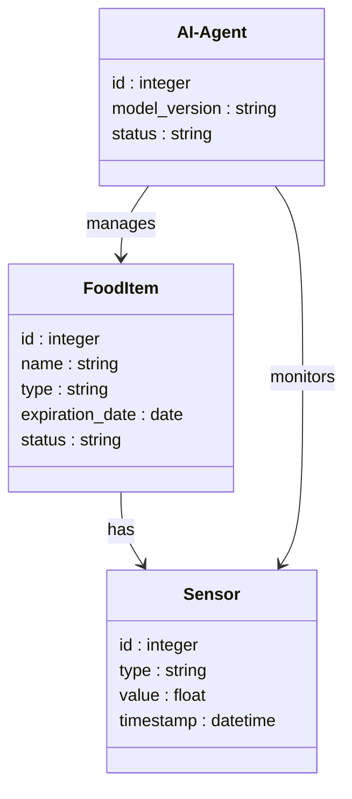

                 


# 智能厨房案板：AI Agent的食品安全监测

---

## 关键词

- 智能厨房案板
- AI Agent
- 食品安全监测
- 算法原理
- 系统架构设计
- 项目实战

---

## 摘要

本文将深入探讨AI Agent在智能厨房案板中的应用，特别是其在食品安全监测中的作用。通过分析AI Agent的基本原理、食品安全监测的背景与挑战、以及AI Agent与智能厨房案板的结合，本文将详细阐述如何利用AI技术实现食品的智能化监测与管理。从算法原理到系统架构设计，再到实际项目实战，本文旨在为读者提供一个全面且系统的技术视角，帮助其理解并掌握智能厨房案板中AI Agent的核心技术与应用场景。

---

# 第1章 智能厨房案板与AI Agent概述

## 1.1 智能厨房案板的定义与特点

### 1.1.1 智能厨房案板的定义

智能厨房案板是一种集成AI技术的厨房工具，能够通过传感器、摄像头和AI算法实现对食材的识别、分类、保鲜状态监测等功能。

### 1.1.2 智能厨房案板的核心特点

- **智能化**：通过AI技术实现食材的自动识别和管理。
- **实时监测**：能够实时监测食材的状态，如新鲜度、保质期等。
- **交互性**：用户可以通过语音或触控方式与案板交互，获取相关信息。

## 1.2 AI Agent的基本概念

### 1.2.1 AI Agent的定义

AI Agent是一种能够感知环境、自主决策并执行任务的智能实体，能够在复杂环境中完成特定目标。

### 1.2.2 AI Agent的核心特点

- **自主性**：能够在没有人工干预的情况下独立运行。
- **反应性**：能够根据环境变化实时调整行为。
- **学习能力**：通过数据学习和优化自身算法。

## 1.3 AI Agent与智能厨房案板的结合

### 1.3.1 AI Agent在厨房环境中的作用

- **食材识别**：通过视觉识别技术识别食材种类和状态。
- **数据采集**：采集食材的重量、温度、湿度等数据。
- **智能推荐**：根据食材状态推荐食谱或购物清单。

### 1.3.2 AI Agent如何实现食品安全监测

- **实时监测**：通过传感器和AI算法实时监测食材的新鲜度和保质期。
- **异常检测**：当检测到食材异常时，及时发出警报。

---

# 第2章 食品安全监测的背景与问题

## 2.1 食品安全的重要性

### 2.1.1 食品安全的定义

食品安全是指食品在种植、加工、运输、销售和消费等环节中符合国家标准，对人体健康不造成危害。

### 2.1.2 食品安全问题的现状

- **食品污染**：包括化学污染、生物污染和物理污染。
- **食品欺诈**：如假冒伪劣食品、过期食品的销售。
- **食品储存不当**：导致食品变质或营养流失。

## 2.2 食品安全监测的挑战

### 2.2.1 食品安全监测的主要问题

- **数据获取困难**：食材的状态受多种因素影响，数据采集复杂。
- **算法复杂性**：需要处理大量异构数据，算法开发难度大。
- **实时性要求高**：需要快速响应，确保食品的安全性。

### 2.2.2 食品安全监测的技术难点

- **多模态数据融合**：需要整合视觉、嗅觉、温度等多种数据。
- **算法的鲁棒性**：在复杂环境下保证算法的稳定性和准确性。

---

# 第3章 AI Agent在食品安全监测中的应用

## 3.1 AI Agent在厨房环境中的作用

### 3.1.1 AI Agent在厨房中的功能

- **食材识别**：通过图像识别技术识别食材种类和状态。
- **数据采集与分析**：采集食材的温度、湿度等数据，并进行分析。
- **异常检测**：当检测到食材异常时，及时发出警报。

### 3.1.2 AI Agent如何实现食品安全监测

- **实时监测**：通过传感器和AI算法实时监测食材的新鲜度和保质期。
- **异常检测**：当检测到食材异常时，及时发出警报。

---

## 3.2 AI Agent与智能厨房案板的结合

### 3.2.1 AI Agent如何与智能厨房案板交互

- **数据传输**：AI Agent通过传感器和摄像头获取食材数据。
- **决策与执行**：AI Agent根据数据做出决策，并通过案板执行相应的操作，如发出警报、调整存储条件等。

### 3.2.2 AI Agent如何通过智能厨房案板实现食品安全监测

- **食材状态监测**：AI Agent实时监测食材的状态，如新鲜度、温度、湿度等。
- **异常处理**：当检测到食材异常时，AI Agent通过智能厨房案板发出警报，并建议用户采取相应的措施。

---

## 3.3 AI Agent在智能厨房案板中的优势

### 3.3.1 提高食品安全性

- AI Agent能够实时监测食材的状态，及时发现并处理异常情况，确保食品的安全性。

### 3.3.2 提高用户体验

- AI Agent能够根据食材的状态和用户的饮食习惯，推荐合适的食谱或购物清单，提升用户体验。

### 3.3.3 提高管理效率

- AI Agent能够自动记录食材的使用情况和保质期，帮助用户更好地管理食材，避免浪费。

---

## 第4章 核心概念与联系

### 4.1 AI Agent与食品安全监测的核心原理

#### 4.1.1 AI Agent的基本工作原理

AI Agent通过感知环境、分析数据、做出决策并执行任务来实现其功能。在智能厨房案板中，AI Agent通过传感器和摄像头获取食材数据，利用算法进行分析，判断食材的状态，并根据结果执行相应的操作，如发出警报或调整存储条件。

#### 4.1.2 AI Agent的学习与推理机制

AI Agent通过机器学习算法（如卷积神经网络、支持向量机等）对食材数据进行学习和训练，建立食材状态的分类模型。在推理阶段，AI Agent利用训练好的模型对新的食材数据进行分析，判断食材的状态。

#### 4.1.3 AI Agent的决策与执行过程

AI Agent在分析食材数据后，根据预设的规则或模型做出决策，并通过智能厨房案板执行相应的操作，如发出警报、调整存储条件等。

---

### 4.2 食品安全监测的核心原理

#### 4.2.1 食品安全监测的主要方法

- **感官检测**：通过视觉、嗅觉等方式判断食材的新鲜度。
- **理化检测**：通过实验室检测食材的理化指标，如pH值、水分含量等。
- **AI算法检测**：通过AI算法分析食材的图像和传感器数据，判断食材的状态。

#### 4.2.2 食品安全监测的数学模型

AI Agent在食品安全监测中通常采用分类模型，如支持向量机（SVM）、随机森林（Random Forest）等。这些模型通过对食材的特征数据进行分析，判断食材的状态。

#### 4.2.3 食品安全监测的算法实现

AI Agent通过图像识别、传感器数据融合等技术，实现对食材的实时监测和异常检测。具体步骤包括：

1. **数据采集**：通过传感器和摄像头获取食材的温度、湿度、颜色等数据。
2. **数据预处理**：对采集到的数据进行清洗、归一化等预处理。
3. **特征提取**：提取食材的关键特征，如颜色特征、纹理特征等。
4. **模型训练**：利用训练好的分类模型对食材状态进行分类。
5. **决策与执行**：根据分类结果，AI Agent做出相应的决策，并通过智能厨房案板执行操作。

---

### 4.3 AI Agent与食品安全监测的对比分析

#### 4.3.1 属性特征对比

| 属性 | AI Agent | 食品安全监测 |
|------|----------|--------------|
| 功能 | 自主决策与执行 | 数据采集与分析 |
| 输入 | 多模态数据（图像、传感器数据） | 单一类型数据 |
| 输出 | 执行操作（警报、调整存储条件） | 分类结果（食材状态） |

---

### 4.4 ER实体关系图架构

```mermaid
erDiagram
    case FoodItem {
        id : integer
        name : string
        type : string
        expiration_date : date
        status : string
    }
    case Sensor {
        id : integer
        type : string
        value : float
        timestamp : datetime
    }
    case AI-Agent {
        id : integer
        model_version : string
        status : string
    }
    FoodItem -- Sensor : has
    AI-Agent -- Sensor : monitors
    AI-Agent -- FoodItem : manages
```

---

## 第5章 算法原理讲解

### 5.1 算法原理

AI Agent在食品安全监测中通常采用图像识别和传感器数据融合的技术。以下是具体的算法流程：

1. **图像采集与预处理**：
   - 使用摄像头采集食材的图像。
   - 对图像进行去噪、增强等预处理。

2. **特征提取**：
   - 提取食材的颜色、纹理、形状等特征。

3. **分类模型训练**：
   - 使用训练数据训练分类模型（如SVM、随机森林）。

4. **模型推理**：
   - 对新的食材图像进行分类，判断其状态（新鲜、变质等）。

5. **传感器数据融合**：
   - 结合温度、湿度等传感器数据，进一步优化分类结果。

### 5.2 算法实现

以下是Python代码实现：

```python
import cv2
import numpy as np
from sklearn.svm import SVC
from sklearn.model_selection import train_test_split

# 数据预处理
def preprocess_image(image):
    gray = cv2.cvtColor(image, cv2.COLOR_BGR2GRAY)
    blurred = cv2.GaussianBlur(gray, (5, 5), 0)
    return blurred

# 特征提取
def extract_features(image):
    hist = cv2.calcHist([image], [0], None, [16], [0, 256])
    hist = cv2.normalize(hist).flatten()
    return hist

# 数据集准备
X = []
y = []
for food_item in food_items:
    img = cv2.imread(food_item.image_path)
    preprocessed = preprocess_image(img)
    features = extract_features(preprocessed)
    X.append(features)
    y.append(food_item.status)

# 模型训练
X_train, X_test, y_train, y_test = train_test_split(X, y, test_size=0.2)
model = SVC()
model.fit(X_train, y_train)

# 模型推理
test_img = cv2.imread("test_image.jpg")
preprocessed_test = preprocess_image(test_img)
features_test = extract_features(preprocessed_test)
predicted_status = model.predict([features_test])[0]

print(predicted_status)
```

---

## 第6章 系统分析与架构设计

### 6.1 问题场景介绍

智能厨房案板需要实时监测食材的状态，包括新鲜度、温度、湿度等，并能够在检测到异常时及时发出警报。

### 6.2 系统功能设计

- **食材识别**：通过图像识别技术识别食材种类和状态。
- **数据采集**：采集食材的温度、湿度等数据。
- **异常检测**：检测食材是否变质或过期。
- **警报系统**：当检测到异常时，发出警报并建议用户采取相应的措施。

### 6.3 领域模型设计



### 6.4 系统架构设计


### 6.5 系统接口设计

- **输入接口**：传感器数据输入、用户操作输入。
- **输出接口**：显示食材状态、警报信息输出。

### 6.6 交互流程设计

```mermaid
sequenceDiagram
    user -> AI-Agent : 选择食材
    AI-Agent -> Sensor : 获取食材数据
    Sensor --> AI-Agent : 返回食材数据
    AI-Agent -> AI-Agent : 分析数据，判断食材状态
    AI-Agent -> Display : 显示食材状态
    Display -> user : 显示食材状态
    if (食材异常) {
        AI-Agent -> Display : 发出警报
        Display -> user : 显示警报信息
    }
```

---

## 第7章 项目实战

### 7.1 环境安装

- **硬件**：摄像头、温度传感器、湿度传感器、智能案板。
- **软件**：Python、OpenCV、Scikit-learn、TensorFlow。

### 7.2 核心代码实现

```python
import cv2
import numpy as np
from sklearn.svm import SVC
from sklearn.model_selection import train_test_split

# 数据预处理
def preprocess_image(image):
    gray = cv2.cvtColor(image, cv2.COLOR_BGR2GRAY)
    blurred = cv2.GaussianBlur(gray, (5, 5), 0)
    return blurred

# 特征提取
def extract_features(image):
    hist = cv2.calcHist([image], [0], None, [16], [0, 256])
    hist = cv2.normalize(hist).flatten()
    return hist

# 数据集准备
X = []
y = []
for food_item in food_items:
    img = cv2.imread(food_item.image_path)
    preprocessed = preprocess_image(img)
    features = extract_features(preprocessed)
    X.append(features)
    y.append(food_item.status)

# 模型训练
X_train, X_test, y_train, y_test = train_test_split(X, y, test_size=0.2)
model = SVC()
model.fit(X_train, y_train)

# 模型推理
test_img = cv2.imread("test_image.jpg")
preprocessed_test = preprocess_image(test_img)
features_test = extract_features(preprocessed_test)
predicted_status = model.predict([features_test])[0]

print(predicted_status)
```

### 7.3 代码解读与分析

- **数据预处理**：对图像进行灰度化和模糊处理，以去除噪声。
- **特征提取**：计算图像的直方图特征，用于分类。
- **模型训练**：使用支持向量机（SVM）进行分类模型的训练。
- **模型推理**：对新的食材图像进行分类，判断其状态。

### 7.4 实际案例分析

假设我们有一个苹果的图像，通过上述代码进行分类，模型预测其状态为“新鲜”。

### 7.5 项目小结

通过实际项目实战，我们可以看到AI Agent在智能厨房案板中的应用潜力。通过图像识别和传感器数据融合，AI Agent能够实现对食材的实时监测和异常检测，为用户提供高效、智能的食品安全解决方案。

---

## 第8章 最佳实践

### 8.1 小结

本文详细介绍了AI Agent在智能厨房案板中的应用，特别是其在食品安全监测中的作用。通过算法原理、系统架构设计和项目实战，我们展示了如何利用AI技术实现食材的智能化监测与管理。

### 8.2 注意事项

- 在实际应用中，需要注意传感器的精度和算法的鲁棒性，确保监测的准确性。
- 需要定期更新模型，以应对食材种类和环境条件的变化。

### 8.3 未来趋势

- **多模态数据融合**：结合更多类型的传感器数据，提高监测的准确性。
- **边缘计算**：在案板端进行数据处理和分析，减少对云端的依赖。
- **自适应学习**：模型能够自适应地学习新的食材种类和状态。

### 8.4 拓展阅读

- 《机器学习实战》
- 《深度学习入门：基于Python》
- 《传感器原理与应用》

---

通过以上章节的内容，我们全面探讨了AI Agent在智能厨房案板中的应用，从理论到实践，帮助读者深入理解并掌握相关技术。希望本文能够为智能厨房案板的开发和食品安全监测的研究提供有价值的参考和启示。

