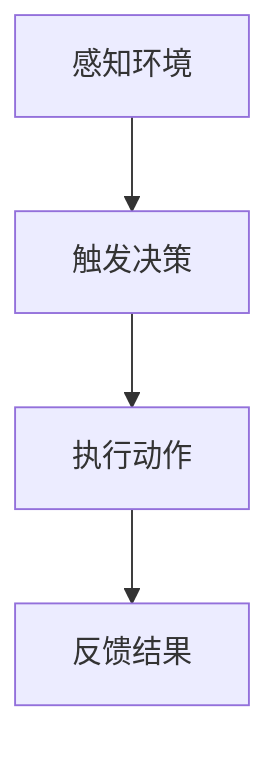
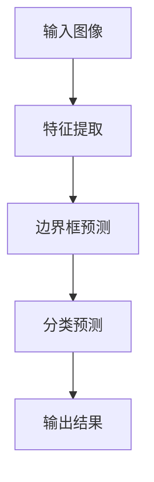
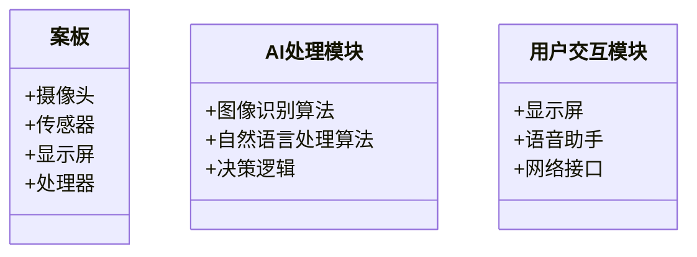
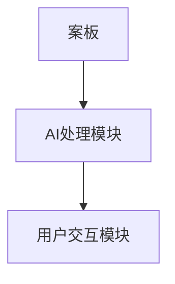
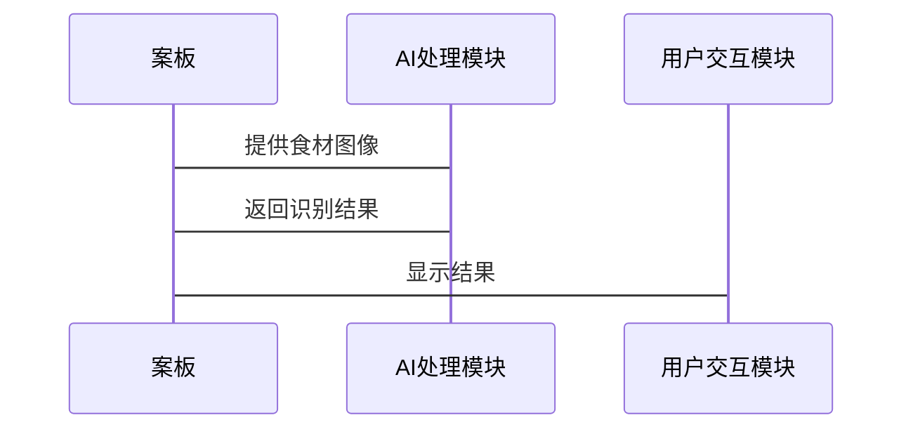

                 


# 智能厨房案板：AI Agent的食材识别系统

> **关键词**：智能厨房、AI Agent、食材识别、图像识别、自然语言处理  
> **摘要**：本文探讨了AI Agent在智能厨房中的应用，重点分析了食材识别系统的实现原理与技术细节。通过详细讲解系统架构、算法原理及项目实战，本文为读者提供了一套完整的解决方案。

---

# 第1章 背景介绍

## 1.1 智能厨房案板的定义与应用场景

### 1.1.1 传统厨房案板的功能与局限性

传统厨房案板主要用于切割、准备食材，但存在以下问题：
- **功能单一**：仅用于物理操作，无法提供智能化辅助。
- **效率低下**：用户需要手动识别食材，耗时且易出错。
- **缺乏交互性**：无法与厨房设备联动，无法提供智能化建议。

### 1.1.2 智能厨房案板的定义

智能厨房案板是在传统案板基础上，集成传感器、摄像头和AI技术的智能设备，能够自动识别食材并提供相关建议。

### 1.1.3 智能厨房案板的主要应用场景

- **食材分类与管理**：帮助用户快速识别食材并归类。
- **烹饪辅助**：提供食谱建议和步骤指导。
- **健康管理**：根据用户健康状况推荐食材和饮食计划。

## 1.2 AI Agent在食材识别中的作用

### 1.2.1 AI Agent的基本概念

AI Agent（智能体）是指能够感知环境、自主决策并执行任务的智能系统，通常由传感器、处理器和执行器组成。

### 1.2.2 AI Agent在智能厨房中的应用价值

- **自动化识别**：通过摄像头和传感器，AI Agent能够快速识别食材。
- **智能决策**：根据识别结果，AI Agent可以推荐食谱或调整烹饪参数。
- **实时反馈**：与厨房设备联动，实时调整烹饪过程。

### 1.2.3 食材识别系统的核心目标与边界

核心目标：准确识别食材种类和数量，提供智能化建议。  
边界：不涉及烹饪过程的物理操作，如切割、搅拌等。

## 1.3 食材识别系统的组成与核心要素

### 1.3.1 系统组成模块分析

- **传感器模块**：用于采集食材图像和物理属性。
- **AI处理模块**：负责食材识别和决策。
- **交互模块**：与用户和厨房设备进行信息交互。

### 1.3.2 核心要素的定义与属性

| 核心要素 | 定义 | 属性 |
|----------|------|------|
| 食材图像 | 食材的视觉数据 | 分辨率、颜色、形状 |
| AI算法 | 用于识别食材的算法 | 精准率、处理速度 |
| 决策逻辑 | AI Agent的决策规则 | 灵活性、可扩展性 |

### 1.3.3 系统功能的外延与扩展

- **扩展功能**：食材保鲜、库存管理。
- **未来趋势**：与智能家居、物联网设备联动。

---

# 第2章 AI Agent与食材识别系统的核心概念

## 2.1 AI Agent的基本原理

### 2.1.1 AI Agent的定义与分类

AI Agent分为两类：
- **反应式AI Agent**：实时感知环境并做出反应。
- **认知式AI Agent**：具备推理和规划能力。

### 2.1.2 AI Agent的核心算法与技术

- **感知技术**：图像识别、语音识别。
- **决策技术**：规则引擎、机器学习模型。

### 2.1.3 AI Agent的决策机制与执行流程



---

# 第3章 图像识别算法原理

## 3.1 基于卷积神经网络的食材识别

### 3.1.1 CNN网络结构

CNN由卷积层、池化层和全连接层组成，用于提取图像特征。

### 3.1.2 AlexNet、VGGNet、ResNet等经典网络的优缺点

- **AlexNet**：适用于大规模数据，但参数过多。
- **VGGNet**：结构简单，但计算效率较低。
- **ResNet**：通过残差连接减少梯度消失问题。

### 3.1.3 食材图像的预处理与数据增强

- **预处理**：归一化、调整尺寸。
- **数据增强**：旋转、翻转、裁剪。

---

## 3.2 基于目标检测的食材识别

### 3.2.1 常见目标检测算法

- **Faster R-CNN**：精度高，但速度较慢。
- **YOLO**：速度快，适合实时检测。

### 3.2.2 目标检测的实现流程



### 3.2.3 使用YOLO进行食材识别的代码实现

```python
import tensorflow as tf
from tensorflow.keras import layers

# 定义模型
model = tf.keras.Sequential([
    layers.Conv2D(32, (3,3), activation='relu'),
    layers.MaxPooling2D((2,2)),
    layers.Conv2D(64, (3,3), activation='relu'),
    layers.MaxPooling2D((2,2)),
    layers.Flatten(),
    layers.Dense(128, activation='relu'),
    layers.Dense(10, activation='softmax')
])
```

---

## 3.3 基于图像分割的食材识别

### 3.3.1 图像分割的定义与优势

图像分割将图像划分为多个区域，便于精准识别食材位置。

### 3.3.2 使用U-Net进行图像分割

U-Net是一种广泛应用于医学图像分割的网络结构，适用于食材分割任务。

---

# 第4章 自然语言处理在食材识别中的应用

## 4.1 食材名称的自然语言处理

### 4.1.1 基于词嵌入的食材名称表示

- **Word2Vec**：通过上下文生成词向量。
- **BERT**：提供上下文相关的表示。

### 4.1.2 食材名称匹配与分类

- **相似度计算**：余弦相似度、欧氏距离。
- **分类模型**：SVM、随机森林、神经网络。

---

## 4.2 食材描述的自然语言处理

### 4.2.1 基于序列标注的食材属性提取

- **CRF**：用于序列标注任务，如命名实体识别。
- **BERT**：通过预训练模型提取上下文信息。

---

## 4.3 基于问答系统的食材信息查询

### 4.3.1 常见问答模型

- **DRAGNET**：基于规则的问答系统。
- **BERT**：基于预训练模型的问答系统。

### 4.3.2 使用BERT进行食材信息查询的代码实现

```python
import transformers

tokenizer = transformers.BertTokenizer.from_pretrained('bert-base-uncased')
model = transformers.BertForQuestionAnswering.from_pretrained('bert-base-uncased')
```

---

# 第5章 系统分析与架构设计方案

## 5.1 系统功能设计

### 5.1.1 领域模型设计



### 5.1.2 系统架构设计



### 5.1.3 系统接口设计

- **输入接口**：摄像头、传感器。
- **输出接口**：显示屏、语音助手。
- **网络接口**：与厨房设备联动。

### 5.1.4 系统交互流程



---

# 第6章 项目实战

## 6.1 环境安装与配置

### 6.1.1 安装Python库

```bash
pip install tensorflow keras opencv-python transformers
```

### 6.1.2 配置开发环境

- **IDE**：PyCharm、VS Code。
- **框架**：TensorFlow、Keras。

## 6.2 系统核心实现

### 6.2.1 图像识别实现

```python
import cv2

def recognize_food(image_path):
    # 加载模型
    model = load_model('food_model.h5')
    # 预处理图像
    image = cv2.imread(image_path)
    image = preprocess_image(image)
    # 预测结果
    prediction = model.predict(image)
    return get_label(prediction)
```

### 6.2.2 自然语言处理实现

```python
from transformers import pipeline

qa_pipeline = pipeline("question-answering", model="bert-base-uncased")
def answer_question(question):
    return qa_pipeline(question, "context")[0]['answer']
```

## 6.3 项目小结

通过项目实战，我们实现了食材识别的核心功能，并验证了系统的可行性。未来可以进一步优化算法和扩展功能。

---

# 第7章 最佳实践

## 7.1 小结

- **数据预处理**：确保数据质量，增加数据多样性。
- **模型调优**：使用迁移学习和数据增强提高准确率。
- **系统优化**：优化算法效率，减少延迟。

## 7.2 注意事项

- **数据隐私**：保护用户数据不被滥用。
- **系统兼容性**：确保兼容不同设备和接口。
- **用户体验**：优化交互设计，提升用户体验。

## 7.3 拓展阅读

- 《深度学习入门：基于Python》
- 《人工智能：现代方法》
- 《自然语言处理实战》

---

# 附录

## 附录A：常用算法与框架

- **图像识别**：TensorFlow、Keras、OpenCV。
- **自然语言处理**：BERT、spaCy、NLTK。

---

通过以上结构，我们可以系统地分析和实现智能厨房案板的食材识别系统，从理论到实践，层层深入，为读者提供全面的技术指导。

