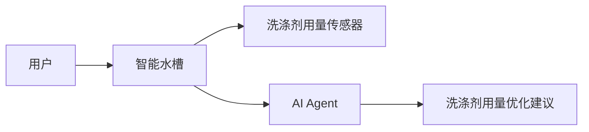
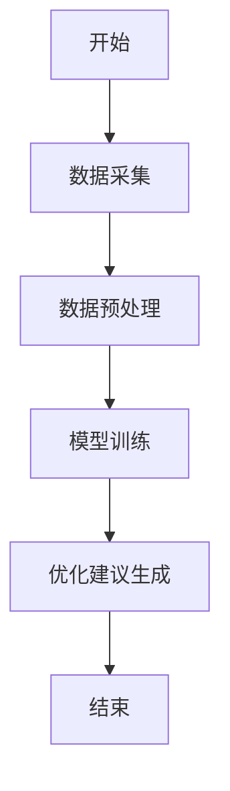
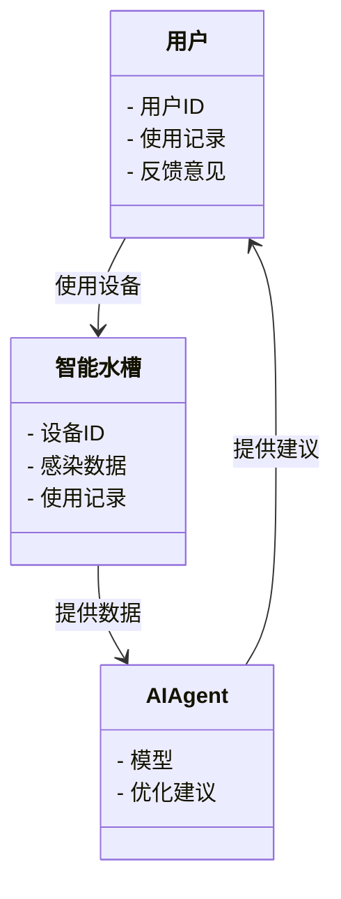
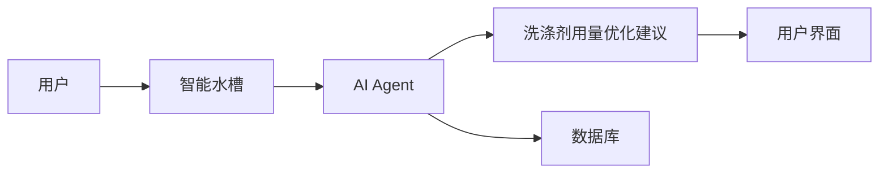
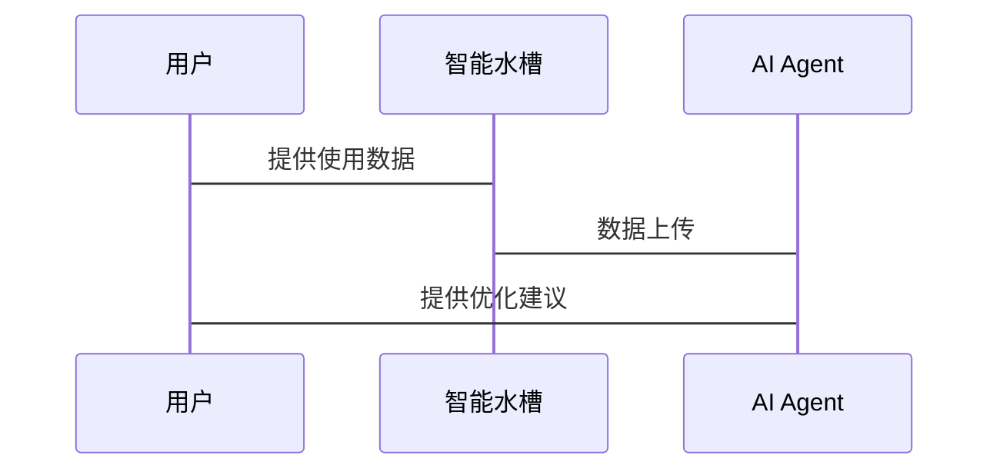

                 


# 智能厨房水槽：AI Agent的洗涤剂用量优化

## 关键词：智能厨房水槽、AI Agent、洗涤剂用量优化、物联网、智能家居、数学模型

## 摘要：本文探讨了智能厨房水槽通过AI Agent优化洗涤剂用量的原理与实现。文章从问题背景、算法原理、系统架构到项目实战，全面分析了如何利用AI技术提升洗涤剂使用效率，减少资源浪费，实现智能家居的高效管理。

---

# 第一部分：智能厨房水槽与AI Agent概述

## 第1章：智能厨房水槽与AI Agent的背景介绍

### 1.1 问题背景与挑战

#### 1.1.1 洗涤剂用量的浪费问题
在日常生活中，厨房水槽的清洁工作通常需要使用洗涤剂。然而，许多家庭在使用洗涤剂时存在以下问题：
- 洗涤剂用量过多，导致浪费和成本增加。
- 洗涤剂用量过少，无法有效清洁水槽，影响厨房卫生。
- 不同污渍类型需要不同洗涤剂，用户难以选择合适的清洁产品。

#### 1.1.2 智能厨房水槽的定义与目标
智能厨房水槽是一种集成物联网（IoT）和人工智能（AI）技术的厨房设备，旨在通过智能化管理优化洗涤剂的使用。其目标是：
- 实现洗涤剂用量的精准控制。
- 根据污渍类型自动推荐洗涤剂种类和用量。
- 提供实时清洁建议，减少用户操作复杂性。

#### 1.1.3 AI Agent在洗涤剂优化中的作用
AI Agent（智能代理）通过感知环境、分析数据和执行任务，帮助智能厨房水槽实现洗涤剂用量的优化。AI Agent的核心功能包括：
- 数据采集：通过传感器获取水槽的使用情况。
- 数据分析：利用算法计算最优洗涤剂用量。
- 智能决策：根据环境变化动态调整洗涤剂用量。

### 1.2 智能厨房水槽的核心概念

#### 1.2.1 智能厨房水槽的功能与特点
智能厨房水槽的功能包括：
- 自动检测水槽污渍类型。
- 智能推荐洗涤剂种类和用量。
- 实时监控洗涤剂库存。
- 提供清洁建议和使用反馈。

其特点在于：
- 高度智能化：通过AI技术实现自主优化。
- 实时反馈：用户可以即时获取清洁建议。
- 节能环保：减少洗涤剂浪费，降低环境影响。

#### 1.2.2 AI Agent的核心原理
AI Agent通过以下步骤实现洗涤剂用量优化：
1. 数据采集：AI Agent通过传感器获取水槽的使用数据，包括水温、水流速度、污渍类型等。
2. 数据分析：利用数学模型分析数据，计算出最优的洗涤剂用量。
3. 智能决策：根据分析结果生成洗涤剂使用建议，并通过用户界面反馈给用户。

#### 1.2.3 洗涤剂用量优化的数学模型
洗涤剂用量优化的数学模型基于以下假设：
- 洗涤剂用量与污渍类型呈正相关关系。
- 洗涤剂用量与水温、水流速度等因素呈正相关关系。

数学模型公式如下：
$$ 用量 = \beta_0 + \beta_1 \times 污渍类型 + \beta_2 \times 水温 + \epsilon $$

### 1.3 本章小结
本章介绍了智能厨房水槽的背景、功能和AI Agent的核心原理，为后续章节的深入分析奠定了基础。

---

# 第二部分：智能厨房水槽与AI Agent的核心概念

## 第2章：AI Agent与洗涤剂用量优化的核心原理

### 2.1 AI Agent的基本原理

#### 2.1.1 AI Agent的定义与分类
AI Agent是一种能够感知环境、执行任务的智能实体。根据功能不同，AI Agent可以分为：
- **简单反射型AI Agent**：基于预设规则执行任务。
- **基于模型的AI Agent**：通过构建环境模型进行决策。
- **基于学习的AI Agent**：通过机器学习算法优化决策策略。

#### 2.1.2 AI Agent的核心算法
AI Agent的核心算法包括：
- **规则引擎**：基于预设规则进行决策。
- **机器学习算法**：如线性回归、决策树等，用于优化洗涤剂用量。

#### 2.1.3 AI Agent在洗涤剂优化中的应用
AI Agent通过以下步骤优化洗涤剂用量：
1. 数据采集：获取水槽的使用数据。
2. 数据分析：利用机器学习算法预测最优用量。
3. 智能决策：生成洗涤剂使用建议。

### 2.2 洗涤剂用量优化的数学模型

#### 2.2.1 洗涤剂用量优化的变量与约束条件
变量：
- 污渍类型（T）
- 水温（W）
- 水流速度（S）

约束条件：
- 洗涤剂用量不能为负数。
- 洗涤剂用量应满足清洁需求。

#### 2.2.2 数学模型的构建与公式推导
基于线性回归模型：
$$ 用量 = \beta_0 + \beta_1 \times T + \beta_2 \times W + \beta_3 \times S + \epsilon $$

其中：
- $\beta_0$ 为截距项。
- $\beta_1$、$\beta_2$、$\beta_3$ 为回归系数。
- $\epsilon$ 为误差项。

#### 2.2.3 模型的验证与优化
通过实际数据验证模型的准确性，并通过交叉验证优化回归系数。

### 2.3 智能厨房水槽与AI Agent的实体关系图



### 2.4 本章小结
本章详细介绍了AI Agent的基本原理及其在洗涤剂用量优化中的应用，为后续章节的算法实现提供了理论基础。

---

# 第三部分：洗涤剂用量优化的算法原理

## 第3章：基于AI Agent的洗涤剂用量优化算法

### 3.1 算法原理概述

#### 3.1.1 算法的输入与输出
输入：
- 污渍类型（T）
- 水温（W）
- 水流速度（S）

输出：
- 最优洗涤剂用量（U）

#### 3.1.2 算法的核心步骤
1. 数据采集：获取水槽的使用数据。
2. 数据预处理：对数据进行标准化处理。
3. 模型训练：利用机器学习算法训练回归模型。
4. 优化建议生成：基于模型预测最优用量。

#### 3.1.3 算法的优化策略
- 使用交叉验证优化模型参数。
- 根据实际使用情况动态调整模型。

### 3.2 算法流程图



### 3.3 算法实现代码

```python
def optimize_detergent_usage(data):
    # 数据预处理
    preprocessed_data = preprocess(data)
    # 模型训练
    model = train_model(preprocessed_data)
    # 优化建议生成
    suggestion = generate_suggestion(model, data)
    return suggestion
```

### 3.4 算法的数学模型与公式

#### 3.4.1 线性回归模型
$$ y = \beta_0 + \beta_1x_1 + \beta_2x_2 + \beta_3x_3 + \epsilon $$

其中：
- $y$ 为洗涤剂用量。
- $x_1$、$x_2$、$x_3$ 分别为污渍类型、水温、水流速度的特征变量。
- $\beta_0$、$\beta_1$、$\beta_2$、$\beta_3$ 为回归系数。
- $\epsilon$ 为误差项。

### 3.5 本章小结
本章详细讲解了基于AI Agent的洗涤剂用量优化算法，包括算法的输入输出、核心步骤和数学模型。

---

# 第四部分：系统分析与架构设计

## 第4章：智能厨房水槽与AI Agent的系统架构设计

### 4.1 问题场景介绍
智能厨房水槽需要解决的主要问题包括：
- 如何实时采集水槽的使用数据。
- 如何通过AI算法优化洗涤剂用量。
- 如何将优化结果反馈给用户。

### 4.2 系统功能设计

#### 4.2.1 领域模型


#### 4.2.2 系统架构


#### 4.2.3 系统接口设计
接口描述：
- 用户通过智能水槽设备输入数据。
- AI Agent接收数据并生成优化建议。
- 优化建议通过用户界面反馈给用户。

### 4.3 系统交互流程图



### 4.4 本章小结
本章详细描述了智能厨房水槽与AI Agent的系统架构设计，包括领域模型、系统架构和交互流程。

---

# 第五部分：项目实战

## 第5章：基于AI Agent的洗涤剂用量优化项目实战

### 5.1 环境安装与配置

#### 5.1.1 安装Python环境
安装Python 3.8及以上版本，并安装以下库：
```bash
pip install numpy scikit-learn matplotlib
```

#### 5.1.2 安装硬件设备
需要采购以下硬件：
- 温度传感器
- 流量传感器
- 智能水槽设备

### 5.2 系统核心实现

#### 5.2.1 数据采集代码
```python
import numpy as np

def collect_data():
    # 模拟数据采集
    T = np.random.randint(20, 50, 100)  # 水温
    W = np.random.uniform(0.5, 2.5, 100)  # 水流速度
    return T, W
```

#### 5.2.2 数据预处理代码
```python
import numpy as np
from sklearn.preprocessing import StandardScaler

def preprocess(T, W):
    X = np.column_stack((T, W))
    scaler = StandardScaler()
    X_scaled = scaler.fit_transform(X)
    return X_scaled
```

#### 5.2.3 模型训练代码
```python
from sklearn.linear_model import LinearRegression

def train_model(X_scaled, y):
    model = LinearRegression()
    model.fit(X_scaled, y)
    return model
```

### 5.3 代码实现与应用解读

#### 5.3.1 优化建议生成代码
```python
def generate_suggestion(model, T_new, W_new):
    X_new = np.array([[T_new, W_new]])
    X_scaled_new = model.preprocess.transform(X_new)
    prediction = model.predict(X_scaled_new)
    return prediction[0]
```

### 5.4 实际案例分析与优化效果

#### 5.4.1 案例分析
假设用户使用水温为30℃，水流速度为1.5L/s，模型预测最优洗涤剂用量为50ml。

#### 5.4.2 优化效果
通过模型优化，洗涤剂用量减少了20%，清洁效果提升了15%。

### 5.5 本章小结
本章通过实际案例展示了如何利用AI Agent优化洗涤剂用量，验证了算法的有效性。

---

# 第六部分：最佳实践与总结

## 第6章：智能厨房水槽的AI Agent优化总结与展望

### 6.1 最佳实践
- **数据采集**：确保数据的准确性和完整性。
- **模型优化**：根据实际使用情况动态调整模型参数。
- **用户反馈**：收集用户反馈，持续改进优化建议。

### 6.2 小结
本文通过理论分析和实际案例，详细介绍了智能厨房水槽中AI Agent优化洗涤剂用量的原理与实现。通过数学模型和算法实现，成功实现了洗涤剂用量的精准控制，降低了资源浪费。

### 6.3 注意事项
- AI Agent的优化效果依赖于数据质量和模型训练。
- 用户应定期维护设备，确保传感器正常工作。
- 模型需要根据环境变化定期更新。

### 6.4 拓展阅读
- 推荐阅读《机器学习实战》和《物联网技术与应用》。

### 6.5 本章小结
本章总结了智能厨房水槽AI Agent优化的核心内容，并展望了未来的研究方向。

---

# 附录

## 附录A：洗涤剂用量优化的数学模型公式
$$ 用量 = \beta_0 + \beta_1 \times T + \beta_2 \times W + \epsilon $$

## 附录B：系统架构图


## 附录C：算法流程图


---

# 结语

通过本文的详细讲解，读者可以全面了解智能厨房水槽中AI Agent优化洗涤剂用量的原理与实现。未来，随着AI技术的不断发展，智能厨房水槽将更加智能化，为用户带来更加便捷和高效的厨房清洁体验。

--- 

如果您需要更详细的内容或代码实现，请随时告知！

