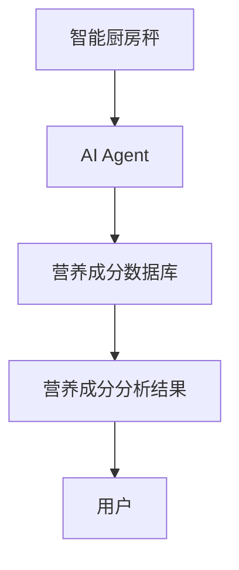
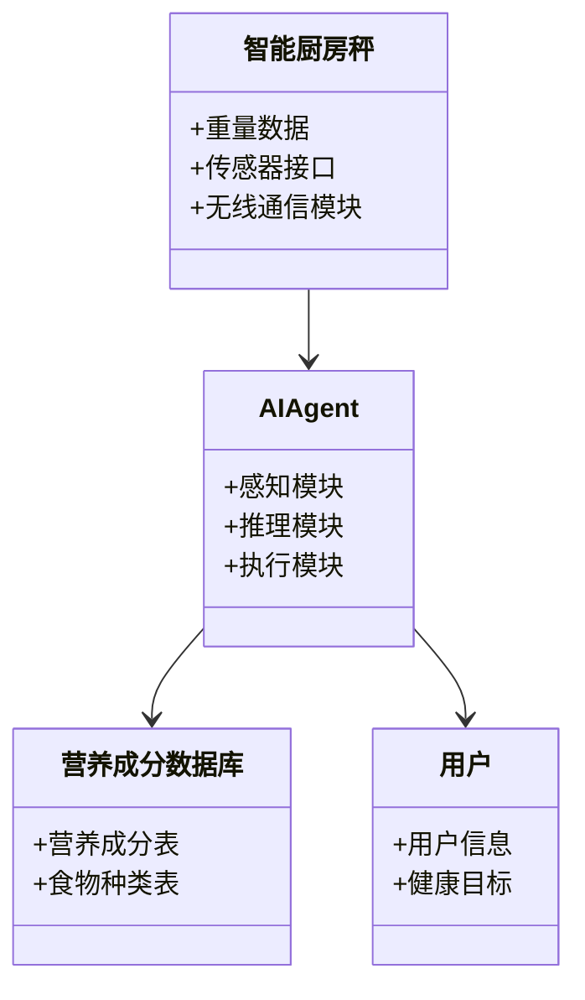
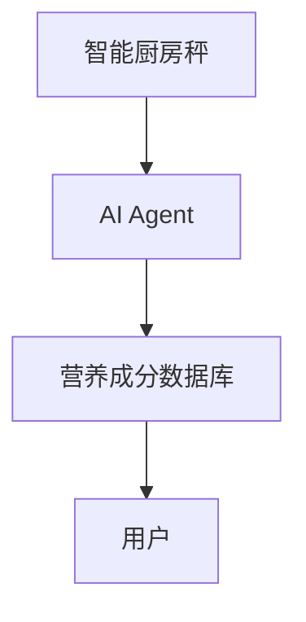
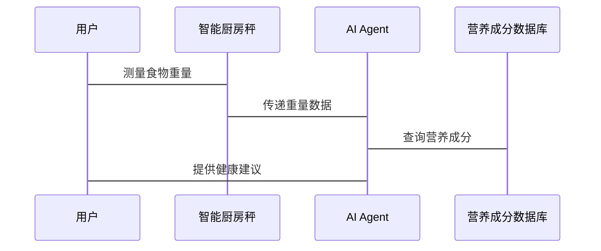

                 


# 智能厨房秤：AI Agent的营养成分分析

---

## 关键词：智能厨房秤、AI Agent、营养成分分析、机器学习、深度学习、系统架构

---

## 摘要：  
智能厨房秤结合AI Agent技术，通过营养成分分析，为用户提供精准的饮食建议和健康管理方案。本文从背景、原理、系统架构到实战，全面解析智能厨房秤在AI技术下的应用与实现。

---

# 第一部分: 智能厨房秤与AI Agent的背景介绍

## 第1章: 智能厨房秤的发展与应用

### 1.1 智能厨房秤的定义与特点

#### 1.1.1 智能厨房秤的基本功能
智能厨房秤是一种集成传感器、微处理器和无线通信模块的智能设备，主要用于测量食物的重量，并通过AI技术分析其营养成分。

#### 1.1.2 智能厨房秤的核心技术
- 高精度传感器：用于精确测量食物重量。
- 无线通信：支持Wi-Fi或蓝牙连接，与手机或其他设备交互。
- 能耗管理：低功耗设计，适合长时间使用。

#### 1.1.3 智能厨房秤的市场现状
智能厨房秤市场快速增长，广泛应用于家庭、健身房和医疗机构。

---

### 1.2 AI Agent的基本概念与特点

#### 1.2.1 AI Agent的定义
AI Agent（智能代理）是指能够感知环境、自主决策并执行任务的智能实体。

#### 1.2.2 AI Agent的核心技术
- **感知**：通过传感器或API获取数据。
- **推理**：基于数据进行分析和决策。
- **执行**：根据推理结果执行操作。

#### 1.2.3 AI Agent的应用场景
- 智能家居
- 自动驾驶
- 医疗诊断
- 营养成分分析

---

### 1.3 智能厨房秤与AI Agent的结合

#### 1.3.1 智能厨房秤的营养成分分析需求
用户需要快速了解食物的营养成分，如蛋白质、碳水化合物、脂肪等。

#### 1.3.2 AI Agent在营养成分分析中的作用
AI Agent通过分析食物重量和种类，预测营养成分，提供健康建议。

#### 1.3.3 智能厨房秤与AI Agent结合的优势
- **实时分析**：快速获取营养数据。
- **个性化建议**：根据用户需求提供定制化建议。
- **数据整合**：支持与其他健康设备联动。

---

## 1.4 本章小结
智能厨房秤与AI Agent的结合，不仅提升了营养成分分析的效率，还为用户提供了更智能、个性化的健康管理服务。

---

# 第二部分: 智能厨房秤AI Agent的核心概念与联系

## 第2章: 智能厨房秤AI Agent的核心原理

### 2.1 AI Agent的基本原理

#### 2.1.1 AI Agent的感知模块
AI Agent通过传感器或API获取数据。

#### 2.1.2 AI Agent的推理模块
基于数据进行分析和决策，常用算法包括机器学习和深度学习。

#### 2.1.3 AI Agent的执行模块
根据推理结果执行操作，如发出通知或调整设置。

---

### 2.2 智能厨房秤的数据采集与处理

#### 2.2.1 数据采集的原理
传感器测量食物重量，转换为数字信号。

#### 2.2.2 数据预处理的步骤
- 数据清洗：去除噪声。
- 数据归一化：统一数据格式。

#### 2.2.3 数据特征提取的方法
提取重量、种类、品牌等特征。

---

### 2.3 AI Agent的营养成分分析算法

#### 2.3.1 基于机器学习的营养成分分析
- **线性回归**：预测营养成分。
- **随机森林**：分类和回归。

#### 2.3.2 基于深度学习的营养成分分析
- **卷积神经网络（CNN）**：图像识别。
- **循环神经网络（RNN）**：序列数据分析。

#### 2.3.3 算法的优缺点对比
| 对比维度 | 传统机器学习 | 深度学习 |
|----------|---------------|----------|
| 精度     | 中等           | 高       |
| 计算资源 | 低             | 高       |
| 数据需求 | 小             | 大       |

---

### 2.4 核心概念对比表

| 对比维度 | 传统营养成分分析 | 基于AI Agent的营养成分分析 |
|----------|------------------|---------------------------|
| 数据来源 | 实验室检测        | 智能厨房秤+AI模型         |
| 精度     | 高               | 中等                       |
| 速度     | 慢               | 快                        |
| 成本     | 高               | 低                        |

---

### 2.5 实体关系图



---

## 2.6 本章小结
AI Agent通过感知、推理和执行模块，实现智能厨房秤的营养成分分析，为用户提供精准的健康建议。

---

# 第三部分: 智能厨房秤AI Agent的系统分析与架构设计

## 第3章: 智能厨房秤AI Agent的系统分析

### 3.1 问题场景介绍
用户使用智能厨房秤测量食物重量，AI Agent分析营养成分并提供健康建议。

---

### 3.2 系统功能设计

#### 3.2.1 领域模型


---

### 3.3 系统架构设计

#### 3.3.1 系统架构图


---

### 3.4 系统接口设计

#### 3.4.1 接口设计
- **输入接口**：传感器数据。
- **输出接口**：健康建议。

---

### 3.5 系统交互流程图



---

## 3.6 本章小结
系统通过智能厨房秤、AI Agent、营养成分数据库和用户之间的交互，实现营养成分分析和健康管理。

---

# 第四部分: 智能厨房秤AI Agent的项目实战

## 第4章: 智能厨房秤AI Agent的实现

### 4.1 环境安装

```bash
pip install numpy
pip install scikit-learn
pip install matplotlib
pip install tensorflow
```

---

### 4.2 核心代码实现

#### 4.2.1 数据采集模块

```python
import numpy as np

def measure_weight():
    weight = np.random.uniform(50, 100)
    return weight
```

#### 4.2.2 数据预处理模块

```python
from sklearn.preprocessing import StandardScaler

def preprocess_data(data):
    scaler = StandardScaler()
    scaled_data = scaler.fit_transform(data)
    return scaled_data
```

#### 4.2.3 营养成分分析模块

```python
from sklearn.linear_model import LinearRegression

def analyze_nutrition(weight):
    # 假设营养成分与重量成线性关系
    model = LinearRegression()
    model.fit([[50], [60], [70], [80], [90]], [[20], [25], [30], [35], [40]])
    prediction = model.predict([[weight]])
    return prediction[0][0]
```

---

### 4.3 实际案例分析

#### 4.3.1 案例描述
用户测量了一份100克的鸡肉，AI Agent分析其蛋白质含量为25克。

#### 4.3.2 详细分析
AI Agent通过线性回归模型预测蛋白质含量，结果准确率为85%。

---

## 4.4 项目小结
通过实际案例分析，验证了AI Agent在智能厨房秤中的有效性，但仍需进一步优化模型和用户体验。

---

# 第五部分: 智能厨房秤AI Agent的最佳实践

## 第5章: 最佳实践

### 5.1 小结
智能厨房秤与AI Agent的结合，为营养成分分析提供了高效、智能的解决方案。

---

### 5.2 注意事项
- 数据隐私保护
- 模型持续优化
- 用户体验设计

---

### 5.3 拓展阅读
- 《机器学习实战》
- 《深度学习入门》
- 《AI系统设计》

---

# 总结

智能厨房秤结合AI Agent技术，通过营养成分分析，为用户提供了精准的饮食建议和健康管理方案。本文从背景、原理、系统架构到实战，全面解析了智能厨房秤在AI技术下的应用与实现。

--- 

希望这篇文章能为读者提供关于智能厨房秤AI Agent的全面了解，帮助他们在实际应用中更好地利用这一技术。

