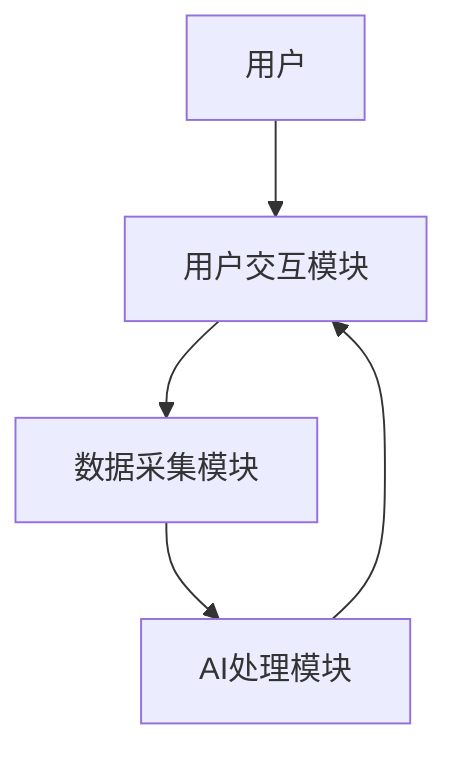

                 


# 第一部分: 智能厨房秤与AI Agent的背景与概念

# 第1章: 智能厨房秤的发展历程

## 1.1 传统厨房秤的功能与局限性
### 1.1.1 传统厨房秤的基本功能
传统厨房秤主要用于称量食材的重量，帮助用户精确测量食材的分量，确保食谱的准确性。其基本功能包括：
- 精确称量：支持克（g）和盎司（oz）等多种单位的转换。
- 记忆功能：可以存储常用食材的重量。
- 易用性：简洁的界面设计，方便用户操作。

### 1.1.2 传统厨房秤的使用痛点
尽管传统厨房秤在称量食材方面表现出色，但在实际使用中也存在一些痛点：
- **缺乏智能化**：传统厨房秤仅能进行简单的称量，无法提供食谱建议或食材推荐。
- **操作复杂**：对于不熟悉厨房秤使用的新手来说，操作步骤较为繁琐。
- **数据孤岛**：称量数据无法与其他厨房设备或智能系统共享，无法形成完整的烹饪数据链。

### 1.1.3 传统厨房秤的市场现状
当前市场上的传统厨房秤种类繁多，但大多数产品功能单一，难以满足现代消费者对智能化和个性化的需求。消费者对厨房秤的需求正在从“单一测量工具”向“智能助手”转变，这为智能厨房秤的发展提供了市场空间。

## 1.2 AI Agent的引入与智能厨房秤的创新
随着人工智能技术的快速发展，AI Agent（智能助手）逐渐渗透到各个领域，厨房秤也不例外。AI Agent通过整合传感器、AI算法和云计算技术，赋予厨房秤智能化的能力。

### 1.2.1 AI Agent的基本概念
AI Agent是一种能够感知环境、理解用户需求并提供智能服务的实体或软件。在智能厨房秤中，AI Agent主要负责：
- **数据采集**：通过传感器获取食材的重量、温度等信息。
- **数据分析**：利用AI算法分析数据，提供食谱建议、食材推荐和烹饪指导。
- **用户交互**：通过语音或图形界面与用户互动，优化用户体验。

### 1.2.2 AI Agent在厨房秤中的应用场景
AI Agent在智能厨房秤中的应用非常广泛，以下是几个典型场景：
- **智能称量**：AI Agent可以根据用户输入的食谱要求，自动调整称量的食材种类和重量。
- **食谱推荐**：通过分析用户的称量数据和饮食偏好，AI Agent可以推荐适合的食谱。
- **健康指导**：根据用户的健康数据，AI Agent可以提供低热量、低脂等健康食谱建议。
- **语音交互**：用户可以通过语音指令进行食材称量和食谱查询，提升使用便捷性。

### 1.2.3 智能厨房秤的市场潜力
智能厨房秤结合了AI技术，能够为用户提供更智能化、个性化的烹饪体验，市场潜力巨大。随着消费者对智能设备接受度的提高，智能厨房秤有望成为 kitchens 的标配设备。此外，智能厨房秤还可以与智能家居系统联动，进一步拓展应用场景。

## 1.3 从传统厨房秤到智能厨房秤的演进
从传统厨房秤到智能厨房秤的演进，不仅仅是功能的简单升级，更是一场技术驱动的产品革新。

### 1.3.1 技术驱动的厨房秤升级
AI技术的引入是推动厨房秤智能化的核心动力。通过整合传感器、AI算法和云计算技术，智能厨房秤能够实现：
- **智能称量**：AI Agent可以根据用户的输入自动调整称量参数。
- **数据共享**：称量数据可以与其他智能设备共享，形成完整的烹饪数据链。
- **远程控制**：用户可以通过手机APP远程控制厨房秤。

### 1.3.2 用户需求的变化与产品创新
随着消费者对个性化和智能化的需求日益增长，传统厨房秤的功能已无法满足市场需求。用户希望厨房秤能够：
- 提供智能化的食谱建议。
- 支持多语言或方言的语音交互。
- 具备健康数据分析功能，帮助用户实现健康管理。

这些需求的变化推动了智能厨房秤的创新，使其从单一的测量工具演变为厨房中的智能助手。

### 1.3.3 智能厨房秤的核心价值
智能厨房秤的核心价值在于其智能化功能，能够为用户带来更便捷、更个性化的烹饪体验。具体表现在：
- **提高烹饪效率**：AI Agent可以根据食谱自动调整称量参数，减少用户操作步骤。
- **优化食谱推荐**：通过分析用户的称量数据和饮食偏好，提供更精准的食谱建议。
- **促进健康管理**：结合用户的健康数据，提供健康的饮食建议，帮助用户实现健康管理。

## 1.4 本章小结
本章主要介绍了智能厨房秤的发展历程，从传统厨房秤的功能与局限性，到AI Agent的引入与创新，再到从传统到智能的演进过程。通过分析，我们了解到智能厨房秤的核心价值在于其智能化功能，能够为用户带来更便捷、更个性化的烹饪体验。

---

# 第2章: 智能厨房秤的核心概念与定义

## 2.1 AI Agent在智能厨房秤中的角色
AI Agent在智能厨房秤中扮演着核心角色，负责数据的采集、分析和交互。以下是AI Agent在智能厨房秤中的具体角色：

### 2.1.1 AI Agent的基本属性
- **感知能力**：通过传感器获取食材的重量、温度等信息。
- **学习能力**：通过机器学习算法不断优化推荐算法，提高推荐的准确性。
- **交互能力**：通过语音或图形界面与用户进行交互，提供实时反馈。

### 2.1.2 AI Agent的核心功能
- **智能称量**：根据食谱要求自动调整称量参数。
- **食谱推荐**：基于用户称量数据和饮食偏好推荐合适的食谱。
- **健康指导**：结合用户的健康数据提供健康的饮食建议。

### 2.1.3 AI Agent与智能厨房秤的结合方式
AI Agent通过与智能厨房秤的硬件和软件模块深度结合，实现数据的采集、分析和交互。以下是具体的结合方式：
1. **数据采集模块**：AI Agent通过传感器采集食材的重量、温度等数据。
2. **AI处理模块**：AI Agent对采集的数据进行分析和处理，生成食谱建议。
3. **用户交互模块**：AI Agent通过语音或图形界面与用户进行交互，提供实时反馈。

## 2.2 智能厨房秤的功能模块与系统架构
智能厨房秤的功能模块与系统架构是实现其智能化功能的核心。以下是具体的模块划分和系统架构设计：

### 2.2.1 系统功能模块设计
智能厨房秤系统主要由以下几个功能模块组成：
- **数据采集模块**：负责采集食材的重量、温度等数据。
- **AI处理模块**：对采集的数据进行分析和处理，生成食谱建议。
- **用户交互模块**：通过语音或图形界面与用户进行交互，提供实时反馈。

### 2.2.2 系统架构设计
智能厨房秤的系统架构采用分层架构设计，具体如下：
1. **数据采集层**：负责数据的采集和预处理。
2. **AI处理层**：负责数据的分析和处理，生成食谱建议。
3. **用户交互层**：负责与用户的交互，提供实时反馈。

### 2.2.3 模块间的交互关系
模块间的交互关系如下：
1. **数据采集模块**向AI处理模块提供数据。
2. AI处理模块根据数据生成食谱建议，并将结果传递给用户交互模块。
3. 用户交互模块根据AI处理模块的结果与用户进行交互，提供实时反馈。

## 2.3 智能厨房秤的用户需求与场景分析
智能厨房秤的用户需求和场景分析是设计和优化系统的重要依据。以下是具体的用户需求和场景分析：

### 2.3.1 用户需求分析
- **基本需求**：精确称量食材的重量。
- **智能化需求**：提供智能化的食谱建议。
- **个性化需求**：根据用户的饮食偏好推荐食谱。
- **健康需求**：提供健康的饮食建议。

### 2.3.2 常见使用场景
1. **日常烹饪**：用户根据食谱要求进行食材称量。
2. **健康管理**：用户通过称量数据进行健康管理。
3. **食谱创新**：用户根据推荐的食谱进行创新烹饪。

### 2.3.3 边界与外延
- **边界**：智能厨房秤的功能主要集中在称量和食谱推荐，不涉及烹饪过程中的其他环节。
- **外延**：智能厨房秤可以与其他智能设备联动，如智能冰箱、智能灶具等，形成完整的智能家居生态系统。

## 2.4 本章小结
本章主要介绍了智能厨房秤的核心概念与定义，重点分析了AI Agent在智能厨房秤中的角色、功能模块与系统架构，以及用户的使用需求和场景。通过本章的分析，我们对智能厨房秤的智能化功能有了更深入的理解。

---

# 第3章: AI Agent的原理与技术实现

## 3.1 AI Agent的核心算法原理
AI Agent的核心算法原理是实现智能化功能的关键。以下是具体的核心算法和实现方式：

### 3.1.1 自然语言处理（NLP）在AI Agent中的应用
自然语言处理（NLP）是AI Agent实现智能化交互的重要技术。以下是NLP在AI Agent中的具体应用：
- **语音识别**：通过NLP技术实现语音指令的识别和解析。
- **语义理解**：通过NLP技术理解用户的意图，生成相应的食谱建议。

### 3.1.2 视觉识别技术在AI Agent中的应用
视觉识别技术在AI Agent中的应用主要体现在图像识别和物体检测方面。以下是具体的应用：
- **图像识别**：通过摄像头采集食材的图像，识别食材的种类和重量。
- **物体检测**：通过视觉识别技术检测食材的位置和状态，辅助称量操作。

### 3.1.3 推荐算法在AI Agent中的应用
推荐算法是AI Agent实现个性化食谱推荐的核心技术。以下是推荐算法的具体应用：
- **协同过滤推荐**：基于用户的称量数据和饮食偏好，推荐相似用户的食谱。
- **基于内容的推荐**：基于食材的属性和食谱的特征，推荐相关的食谱。

## 3.2 AI Agent的算法实现流程
AI Agent的算法实现流程是实现智能化功能的重要步骤。以下是具体的实现流程：

### 3.2.1 数据预处理
- **数据清洗**：去除噪声数据，确保数据的准确性。
- **数据转换**：将数据转换为适合算法处理的格式。

### 3.2.2 模型训练
- **特征提取**：提取数据的特征，用于模型的训练。
- **模型训练**：通过机器学习算法对数据进行训练，生成推荐模型。

### 3.2.3 结果输出
- **结果生成**：根据训练好的模型生成食谱建议。
- **结果反馈**：将结果反馈给用户，提供实时反馈。

## 3.3 AI Agent的数学模型与公式
AI Agent的数学模型与公式是实现智能化推荐的核心。以下是具体的数学模型和公式：

### 3.3.1 协同过滤推荐算法
协同过滤推荐算法是一种基于用户相似性或物品相似性的推荐算法。以下是协同过滤推荐算法的公式：
$$ sim(i,j) = \frac{\sum_{k} r_{ik} r_{jk}}{\sqrt{\sum_{k} r_{ik}^2} \sqrt{\sum_{k} r_{jk}^2}} $$
其中，$sim(i,j)$ 表示用户i和用户j的相似性，$r_{ik}$ 和 $r_{jk}$ 分别表示用户i和用户j对物品k的评分。

### 3.3.2 基于内容的推荐算法
基于内容的推荐算法是一种基于物品特征的推荐算法。以下是基于内容的推荐算法的公式：
$$ sim(i,j) = \frac{\sum_{k} w_k r_{ik} r_{jk}}{\sqrt{\sum_{k} w_k^2 r_{ik}^2} \sqrt{\sum_{k} w_k^2 r_{jk}^2}} $$
其中，$w_k$ 表示特征k的重要性权重。

## 3.4 本章小结
本章主要介绍了AI Agent的核心算法原理，包括自然语言处理、视觉识别和推荐算法的具体实现和应用。通过数学公式和流程图的展示，我们对AI Agent的实现过程有了更深入的理解。

---

# 第4章: 智能厨房秤的系统架构设计

## 4.1 系统功能模块设计
智能厨房秤的系统功能模块设计是实现智能化功能的基础。以下是具体的模块设计：

### 4.1.1 用户交互模块
用户交互模块是用户与系统进行交互的界面，包括语音交互和图形界面两种形式。

### 4.1.2 数据采集模块
数据采集模块负责采集食材的重量、温度等数据，主要通过传感器实现。

### 4.1.3 AI处理模块
AI处理模块负责对采集的数据进行分析和处理，生成食谱建议。主要包括数据预处理、模型训练和结果生成三个步骤。

## 4.2 系统架构设计
智能厨房秤的系统架构设计采用分层架构，具体如下：

### 4.2.1 分层架构设计
分层架构设计将系统划分为数据采集层、AI处理层和用户交互层，每一层负责不同的功能模块。

### 4.2.2 微服务架构设计
微服务架构设计将系统划分为多个独立的服务模块，每个模块负责不同的功能，如数据采集、模型训练、用户交互等。

### 4.2.3 模块间的交互关系
模块间的交互关系如下：
1. **数据采集模块**向AI处理模块提供数据。
2. AI处理模块根据数据生成食谱建议，并将结果传递给用户交互模块。
3. 用户交互模块根据AI处理模块的结果与用户进行交互，提供实时反馈。

## 4.3 系统架构图
以下是智能厨房秤的系统架构图：



## 4.4 本章小结
本章主要介绍了智能厨房秤的系统架构设计，包括功能模块设计和系统架构图的展示。通过分层架构和微服务架构的设计，我们能够更好地理解智能厨房秤的系统结构和模块交互关系。

---

# 第5章: 智能厨房秤的项目实战

## 5.1 项目环境安装与配置
### 5.1.1 安装Python和TensorFlow
- 安装Python：可以通过官方网站下载安装包，按照提示完成安装。
- 安装TensorFlow：在Python环境中安装TensorFlow库，命令如下：
  ```bash
  pip install tensorflow
  ```

### 5.1.2 安装其他依赖库
- 安装Keras：可以使用以下命令安装：
  ```bash
  pip install keras
  ```

## 5.2 系统核心实现
### 5.2.1 数据预处理代码
以下是数据预处理的代码示例：

```python
import numpy as np

# 假设数据为一个数组，元素为食材的重量
data = np.array([100, 200, 300, 400, 500], dtype=np.float32)

# 数据标准化
def data_preprocessing(data):
    mean = np.mean(data)
    std = np.std(data)
    normalized_data = (data - mean) / std
    return normalized_data

processed_data = data_preprocessing(data)
print(processed_data)
```

### 5.2.2 推荐算法实现
以下是协同过滤推荐算法的实现代码：

```python
def calculate_similarity(user_ratings):
    # 计算用户之间的相似性
    num_users = len(user_ratings)
    similarity_matrix = np.zeros((num_users, num_users))
    
    for i in range(num_users):
        for j in range(num_users):
            if i != j:
                similarity = np.dot(user_ratings[i], user_ratings[j]) / (np.linalg.norm(user_ratings[i]) * np.linalg.norm(user_ratings[j]))
                similarity_matrix[i][j] = similarity
    return similarity_matrix

# 示例数据
user_ratings = np.array([[5, 4, 3], [3, 2, 4], [4, 5, 2]], dtype=np.float32)

similarity_matrix = calculate_similarity(user_ratings)
print(similarity_matrix)
```

## 5.3 代码应用解读与分析
### 5.3.1 数据预处理代码解读
数据预处理代码主要实现数据的标准化处理，确保数据的均匀分布，提高模型的训练效果。

### 5.3.2 推荐算法实现解读
协同过滤推荐算法通过计算用户之间的相似性，找到与目标用户相似的用户，推荐相似的食谱。该算法适用于用户数量较少的情况，计算效率较高。

## 5.4 实际案例分析
### 5.4.1 案例背景
假设用户A喜欢意大利面和披萨，称量数据如下：
- 意大利面：500g
- 披萨：300g

### 5.4.2 算法应用
通过协同过滤推荐算法，系统会找到与用户A相似的用户B，用户B喜欢意大利面和披萨，称量数据如下：
- 意大利面：400g
- 披萨：250g

通过比较用户的称量数据，系统会推荐用户A尝试制作意大利面和披萨，同时根据称量数据调整食谱的分量。

## 5.5 项目小结
本章通过实际案例展示了智能厨房秤的系统实现，包括环境安装、核心代码实现和案例分析。通过代码的解读和分析，我们能够更好地理解智能厨房秤的技术实现过程。

---

# 第6章: 智能厨房秤的最佳实践与注意事项

## 6.1 最佳实践
### 6.1.1 系统设计
- **模块化设计**：采用模块化设计，便于系统的扩展和维护。
- **高可用性设计**：确保系统在部分模块故障时仍能正常运行。

### 6.1.2 数据安全
- **数据加密**：对用户的称量数据进行加密存储，确保数据的安全性。
- **访问控制**：通过访问控制机制，防止未经授权的用户访问系统。

### 6.1.3 用户体验
- **简洁界面**：设计简洁易用的用户界面，提升用户体验。
- **多语言支持**：支持多种语言或方言的语音交互，满足不同用户的需求。

## 6.2 注意事项
### 6.2.1 系统兼容性
- **设备兼容性**：确保系统能够与各种智能设备兼容，形成完整的智能家居生态系统。
- **软件兼容性**：确保系统能够与不同版本的软件兼容，避免因软件升级导致系统故障。

### 6.2.2 数据隐私
- **数据隐私保护**：遵守数据隐私保护法规，确保用户的称量数据不被滥用。
- **用户授权**：在收集和使用用户数据时，必须获得用户的明确授权。

## 6.3 拓展阅读
### 6.3.1 智能厨房秤的未来发展
智能厨房秤的发展前景广阔，未来可能会集成更多的AI功能，如：
- **智能识别**：通过图像识别技术实现食材的自动识别。
- **健康监测**：通过传感器监测用户的健康数据，提供个性化的饮食建议。

### 6.3.2 相关技术发展
- **边缘计算**：通过边缘计算技术，实现本地化的数据处理和分析，减少对云端的依赖。
- **物联网技术**：通过物联网技术，实现智能厨房秤与其他智能设备的联动，形成完整的智能家居生态系统。

## 6.4 本章小结
本章主要介绍了智能厨房秤的最佳实践与注意事项，包括系统设计、数据安全、用户体验等方面的内容。通过本章的分析，我们能够更好地理解如何设计和优化智能厨房秤系统。

---

# 结语
智能厨房秤作为AI技术在厨房场景中的重要应用，正在逐步改变人们的烹饪方式。通过AI Agent的引入，智能厨房秤能够为用户提供更智能化、个性化的烹饪体验。未来，随着AI技术的不断发展，智能厨房秤的功能将更加丰富，应用也将更加广泛。

---

# 关键词：智能厨房秤, AI Agent, 食谱创新, 人工智能, 物联网

# 摘要：智能厨房秤结合AI Agent技术，为用户提供了智能化的烹饪体验。本文从智能厨房秤的发展历程、核心概念与定义、AI Agent的原理与技术实现、系统架构设计、项目实战等方面进行了详细分析，探讨了智能厨房秤在食谱创新中的应用。通过对智能厨房秤的技术实现和实际案例的分析，本文为智能厨房秤的设计和优化提供了重要的参考价值。

