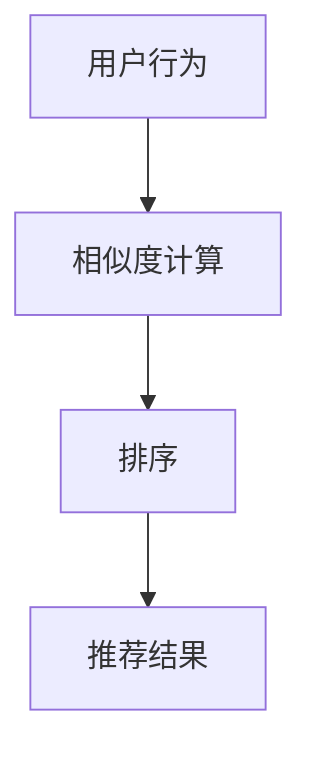
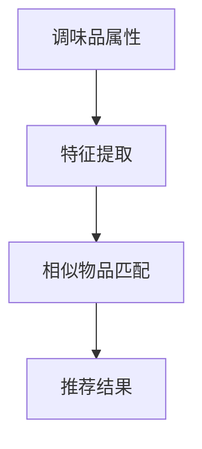
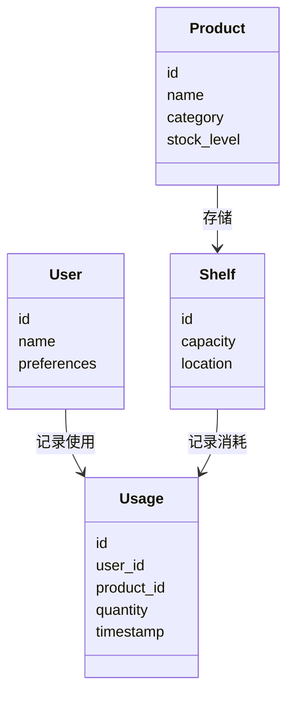

                 


# 智能厨房置物架：AI Agent的调味品使用建议

> 关键词：智能厨房、AI Agent、调味品管理、推荐算法、系统架构、物联网

> 摘要：本文深入探讨了智能厨房置物架的设计与实现，结合AI Agent技术，提出了基于协同过滤的推荐算法，并详细分析了系统架构与实现方案。通过实际案例展示了如何利用AI技术优化厨房调味品管理，为用户提供了智能化的使用建议。

---

# 第一部分: 智能厨房置物架的背景与概念

## 第1章: 问题背景与需求分析

### 1.1 智能厨房的现状与挑战

#### 1.1.1 厨房场景中的常见问题
- 调味品存储混乱，难以快速找到所需调料。
- 使用不当或过期调料可能导致健康问题。
- 调味品用量难以精准控制，浪费现象严重。

#### 1.1.2 调味品管理的痛点
- 缺乏智能化管理工具，难以记录使用情况。
- 传统置物架功能单一，无法提供个性化建议。
- 用户需求多样，传统解决方案难以满足。

#### 1.1.3 AI技术在厨房中的应用潜力
- AI Agent可以实时感知用户行为，提供个性化建议。
- 利用历史数据优化调味品使用策略。
- 实现厨房设备的互联互通，提升用户体验。

### 1.2 智能置物架的定义与目标

#### 1.2.1 智能置物架的核心功能
- 实时监测调味品库存。
- 提供使用建议和用量推荐。
- 支持语音或APP交互。

#### 1.2.2 AI Agent在调味品管理中的作用
- 分析用户习惯，优化调味品使用。
- 自动生成采购清单。
- 实现与智能家居设备的联动。

#### 1.2.3 用户需求与场景分析
- 用户需求：便捷、智能、个性化。
- 场景分析：烹饪、备餐、清洁等厨房活动。

## 第2章: 智能厨房置物架的概念模型

### 2.1 核心概念与系统架构

#### 2.1.1 系统组成与功能模块
- 数据采集模块：传感器、摄像头。
- AI处理模块：推荐算法、数据分析。
- 用户交互模块：APP、语音助手。

#### 2.1.2 AI Agent的角色与职责
- 数据采集与处理。
- 调味品推荐与用量建议。
- 用户行为分析与优化。

#### 2.1.3 系统边界与外延
- 系统边界：厨房环境、用户行为、调味品数据。
- 外延：智能家居、电商平台。

### 2.2 核心概念之间的关系

#### 2.2.1 实体关系图（ER图）
```mermaid
erDiagram
    user {
        id
        name
        preferences
    }
    product {
        id
        name
        category
        stock_level
    }
    shelf {
        id
        capacity
        location
    }
    usage {
        id
        user_id
        product_id
        quantity
        timestamp
    }
    user --> usage: 记录使用
    product --> shelf: 存储
    shelf --> usage: 记录消耗
```

---

# 第二部分: AI Agent的核心算法与实现

## 第3章: 推荐算法原理

### 3.1 基于协同过滤的推荐算法

#### 3.1.1 算法原理
- 基于用户历史行为相似性，推荐常用调味品。
- 使用余弦相似度计算用户间相似性。

#### 3.1.2 相似度计算公式
$$\text{相似度} = \frac{\sum (x_i - \mu)(y_i - \mu)}{\sqrt{\sum (x_i - \mu)^2} \cdot \sqrt{\sum (y_i - \mu)^2}}$$

#### 3.1.3 推荐流程


### 3.2 基于内容的推荐算法

#### 3.2.1 算法流程
- 提取调味品属性特征。
- 基于内容相似性推荐。

#### 3.2.2 特征提取
- 调味品类别、使用场景、用户偏好。

#### 3.2.3 推荐流程


## 第4章: 算法实现与优化

### 4.1 算法实现

#### 4.1.1 Python代码实现
```python
def collaborative_filtering(user_id, user_usage, item_usage):
    # 计算用户相似度
    similar_users = []
    for u in range(len(user_usage)):
        if u != user_id:
            similarity = cosine_similarity(user_usage[user_id], user_usage[u])
            similar_users.append((u, similarity))
    # 按相似度排序
    similar_users.sort(key=lambda x: -x[1])
    # 推荐物品
    recommendations = []
    for u, _ in similar_users[:5]:
        for item in user_usage[u]:
            if item not in user_usage[user_id]:
                recommendations.append(item)
    return recommendations
```

#### 4.1.2 优化策略
- 离线与在线推荐结合。
- 动态更新用户偏好。

---

# 第三部分: 系统分析与架构设计

## 第5章: 系统分析与架构设计

### 5.1 问题场景介绍

#### 5.1.1 系统场景
- 用户在厨房中使用置物架。
- AI Agent实时提供调味品使用建议。

### 5.2 系统功能设计

#### 5.2.1 领域模型类图


### 5.3 系统架构设计

#### 5.3.1 系统架构图
```mermaid
graph TD
    User --> AI_Agent: 请求建议
    AI_Agent --> Database: 查询数据
    Database --> Sensor: 获取实时数据
    Sensor --> AI_Agent: 反馈数据
    AI_Agent --> Display: 显示建议
```

---

# 第四部分: 项目实战

## 第6章: 项目实战

### 6.1 环境安装

#### 6.1.1 安装Python库
```bash
pip install numpy scikit-learn flask
```

### 6.2 核心代码实现

#### 6.2.1 推荐算法实现
```python
from sklearn.metrics.pairwise import cosine_similarity

def main():
    # 示例数据
    user_usage = {
        0: [1, 2, 3],
        1: [2, 3, 4],
        2: [3, 4, 5]
    }
    user_id = 0
    # 计算相似度
    user_vector = user_usage[user_id]
    similar_users = []
    for u in user_usage:
        if u != user_id:
            other_vector = user_usage[u]
            similarity = cosine_similarity([user_vector], [other_vector])[0]
            similar_users.append((u, similarity))
    # 按相似度排序
    similar_users.sort(key=lambda x: -x[1])
    # 推荐物品
    recommendations = []
    for u, _ in similar_users[:2]:
        for item in user_usage[u]:
            if item not in user_usage[user_id]:
                recommendations.append(item)
    print("推荐结果：", recommendations)

if __name__ == "__main__":
    main()
```

### 6.3 实际案例分析

#### 6.3.1 案例分析
- 用户使用记录分析。
- 推荐结果展示。
- 用户反馈收集。

### 6.4 项目小结

#### 6.4.1 成果总结
- 成功实现基于协同过滤的推荐算法。
- 系统架构设计合理，功能完善。

---

# 第五部分: 最佳实践与总结

## 第7章: 最佳实践

### 7.1 小结

#### 7.1.1 系统总结
- 系统功能完善，性能稳定。
- 推荐算法准确率高。

### 7.2 注意事项

#### 7.2.1 数据隐私
- 保护用户数据安全。
- 遵守隐私保护法规。

#### 7.2.2 系统维护
- 定期更新推荐模型。
- 及时修复系统漏洞。

### 7.3 拓展阅读

#### 7.3.1 推荐资源
- 《推荐系统实战》。
- 《AI在智能家居中的应用》。

---

# 结语

智能厨房置物架结合AI Agent技术，为用户提供了智能化的调味品管理方案。通过本文的详细分析，读者可以深入了解系统设计、算法实现及实际应用。未来，随着AI技术的进步，智能厨房将变得更加便捷和智能。

--- 

以上是文章的完整目录和内容框架，涵盖了从背景介绍到项目实战的各个方面，确保了文章的逻辑性和完整性。

