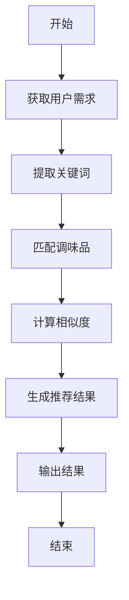
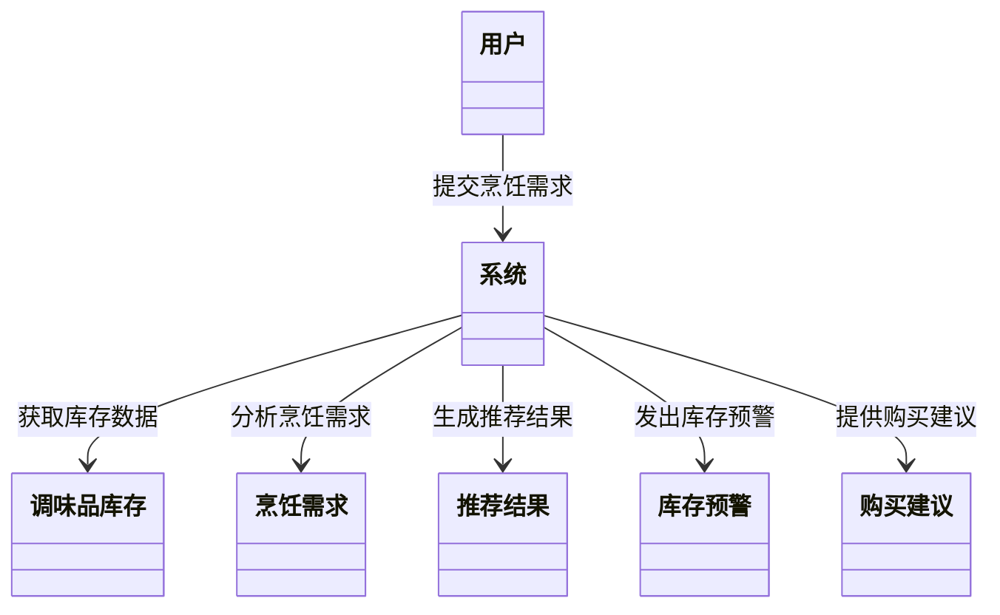
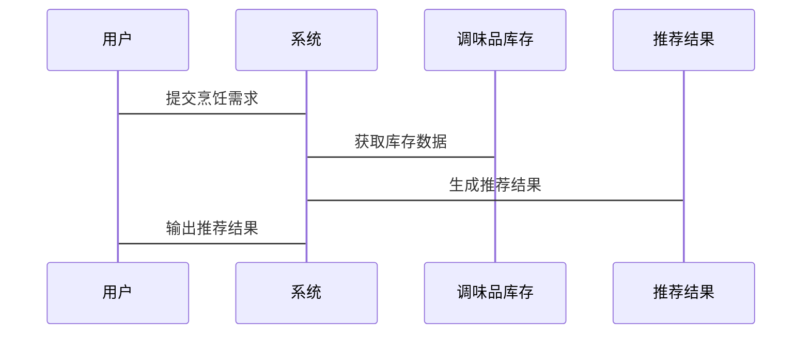

                 


# 智能厨房置物架：AI Agent的调味品使用指导

## 关键词：智能厨房置物架、AI Agent、调味品管理、自然语言处理、推荐算法、系统架构

## 摘要：  
本文详细探讨了智能厨房置物架结合AI Agent技术在调味品使用指导中的应用。通过分析AI Agent的核心原理、系统架构设计、算法实现及项目实战，展示了如何利用人工智能技术提升厨房调味品的智能化管理水平。文章从背景介绍、技术原理到实际应用，层层深入，为读者提供了全面的技术解读。

---

## 第一部分：智能厨房置物架与AI Agent的背景与概述

### 第1章：智能厨房置物架与AI Agent概述

#### 1.1 智能厨房置物架的背景与意义
##### 1.1.1 厨房置物架的演变历程
传统的厨房置物架主要用于存储调味品、厨具等厨房用品，功能单一，仅起到物理存储的作用。随着智能家居的兴起，置物架的功能逐渐向智能化方向延伸，开始具备信息采集、数据处理和智能交互的能力。

##### 1.1.2 AI技术在厨房场景中的应用潜力
AI技术的快速发展为厨房场景带来了新的可能性。通过结合计算机视觉、自然语言处理和推荐算法，AI Agent能够实时感知厨房环境，理解用户需求，并提供个性化的调味品使用建议。

##### 1.1.3 智能厨房置物架的创新价值
智能厨房置物架的创新在于它不仅仅是一个存储工具，更是一个智能的信息处理和交互平台。它能够帮助用户优化调味品的使用效率，减少浪费，提升烹饪体验。

#### 1.2 AI Agent的核心概念与特点
##### 1.2.1 什么是AI Agent
AI Agent（智能体）是一种能够感知环境、自主决策并执行任务的智能系统。它通过传感器、摄像头等设备获取环境信息，利用算法进行分析和推理，并通过执行器完成特定任务。

##### 1.2.2 AI Agent的核心属性与特征
| 特性       | 描述                                         |
|------------|--------------------------------------------|
| 感知能力   | 能够通过传感器或摄像头获取环境信息           |
| 自主决策   | 基于获取的信息，通过算法做出决策             |
| 可交互性   | 能够与用户进行自然语言交互或通过界面交互     |
| 学习能力   | 能够通过数据反馈不断优化自身的算法和决策模型 |

##### 1.2.3 AI Agent在调味品管理中的应用前景
AI Agent在调味品管理中的应用前景广阔。它可以通过自然语言处理技术解析用户的烹饪需求，结合库存数据推荐最优的调味品使用方案，并通过学习用户的偏好不断优化推荐结果。

### 第2章：智能厨房置物架与调味品管理系统的背景

#### 2.1 调味品管理的现状与痛点
##### 2.1.1 调味品管理的传统方式及其局限性
传统的调味品管理方式主要依赖于人工记录和记忆，这种方式效率低下，容易出错，且无法提供个性化的使用建议。

##### 2.1.2 智能化调味品管理的需求分析
随着智能家居的普及，用户对智能化调味品管理的需求日益增长。用户希望系统能够实时监控调味品的库存状态，提供智能化的使用建议，并与智能厨房设备无缝集成。

##### 2.1.3 智能厨房置物架的市场定位与目标用户
智能厨房置物架的目标用户是注重生活品质、追求智能化家居体验的中高端用户群体。其市场定位主要集中在智能家居市场、厨房家电市场和科技爱好者市场。

#### 2.2 AI Agent在调味品管理中的问题背景
##### 2.2.1 调味品使用中的常见问题
- 调味品过期或浪费：由于无法及时获取调味品的使用建议，导致部分调味品过期或被遗忘。
- 使用不当：用户在烹饪时可能因为缺乏指导而使用错误的调味品，影响烹饪效果。
- 库存管理混乱：传统管理方式难以实时掌握调味品的库存状态。

##### 2.2.2 AI Agent如何解决这些痛点
AI Agent通过实时感知环境、分析数据并提供个性化建议，能够有效解决调味品管理中的痛点。它可以通过传感器监控库存，利用自然语言处理技术提供使用建议，并通过学习优化推荐结果。

##### 2.2.3 调味品管理系统的边界与外延
调味品管理系统的边界主要集中在厨房场景内，其外延则包括与智能家居设备的集成、与电商平台的联动等。

### 第3章：AI Agent与调味品管理系统的概念结构

#### 3.1 调味品管理系统的功能模块
##### 3.1.1 调味品库存管理
- 实时监控调味品的库存状态。
- 提供库存预警和补货建议。

##### 3.1.2 调味品使用建议
- 根据用户的烹饪需求推荐最优的调味品使用方案。
- 提供替代方案和用量建议。

##### 3.1.3 调味品购买推荐
- 根据用户的使用习惯推荐购买的调味品。
- 提供优惠信息和购买渠道。

#### 3.2 AI Agent在调味品管理系统中的角色与功能
##### 3.2.1 AI Agent的核心功能
- 数据采集与处理：通过传感器和摄像头获取环境信息。
- 信息分析与推理：利用算法分析数据并做出决策。
- 智能交互：通过自然语言处理技术与用户进行交互。

##### 3.2.2 AI Agent与调味品管理系统的实体关系
```mermaid
er
    actor 用户
    actor 系统
    actor 调味品库存
    actor 烹饪需求
    actor 推荐结果
    actor 库存预警
    actor 购买建议
    action --> 调味品库存: 监控库存状态
    烹饪需求 --> 系统: 提交烹饪需求
    系统 --> 推荐结果: 提供调味品使用建议
    系统 --> 库存预警: 发出库存预警
    系统 --> 购买建议: 提供购买建议
```

---

## 第二部分：AI Agent与调味品管理系统的核心概念与联系

### 第4章：AI Agent的核心原理与技术实现

#### 4.1 AI Agent的核心原理
AI Agent的核心原理包括感知、决策和执行三个主要环节。通过感知环境获取信息，利用算法进行决策，并通过执行器完成任务。

#### 4.2 自然语言处理技术在调味品管理中的应用
自然语言处理技术（NLP）在调味品管理中的应用主要体现在以下几个方面：
- 用户需求解析：通过NLP技术理解用户的烹饪需求。
- 信息提取：从烹饪需求中提取关键信息，如所需调味品的种类和用量。
- 交互优化：通过NLP技术优化用户与系统之间的交互体验。

#### 4.3 推荐算法在调味品管理中的应用
推荐算法是调味品管理系统的核心技术之一。常见的推荐算法包括协同过滤、基于内容的推荐和混合推荐。

##### 4.3.1 协同过滤算法
协同过滤算法通过分析用户的使用历史和偏好，找到与当前用户相似的用户群体，并基于相似用户的使用行为推荐调味品。

##### 4.3.2 基于内容的推荐算法
基于内容的推荐算法通过分析调味品的属性（如口味、用途等）和用户的偏好，推荐与当前需求最匹配的调味品。

##### 4.3.3 混合推荐算法
混合推荐算法结合协同过滤和基于内容的推荐算法，利用两者的优势提高推荐的准确性和多样性。

### 第5章：调味品管理系统的算法实现

#### 5.1 算法实现的数学模型
推荐算法的核心数学模型是基于相似度计算的。以下是协同过滤算法的一个简单示例：
$$ sim(i,j) = \frac{\sum_{k} (r_{ik} - \bar{r}_i)(r_{jk} - \bar{r}_j)}{\sqrt{\sum_{k} (r_{ik} - \bar{r}_i)^2} \cdot \sqrt{\sum_{k} (r_{jk} - \bar{r}_j)^2}} $$
其中，$sim(i,j)$ 表示用户i和用户j之间的相似度，$r_{ik}$ 表示用户i对物品k的评分，$\bar{r}_i$ 表示用户i的平均评分。

#### 5.2 算法实现的流程图


#### 5.3 算法实现的代码示例
```python
def calculate_similarity(user_profile, item_profile):
    # 计算用户i和用户j的相似度
    numerator = sum((user_profile[k] - user_avg[user_profile['id']]) * (item_profile[k] - item_avg[item_profile['id']]) for k in range(len(user_profile)))
    denominator = (sqrt(sum((user_profile[k] - user_avg[user_profile['id']])**2 for k in range(len(user_profile)))) ) * (sqrt(sum((item_profile[k] - item_avg[item_profile['id']])**2 for k in range(len(item_profile)))) )
    return numerator / denominator

def recommend(user_id):
    # 找到与用户i最相似的用户j
    max_similarity = -1
    best_recommendation = None
    for j in range(len(users)):
        if j != user_id:
            similarity = calculate_similarity(users[user_id], users[j])
            if similarity > max_similarity:
                max_similarity = similarity
                best_recommendation = j
    return best_recommendation
```

---

## 第三部分：系统分析与架构设计

### 第6章：智能厨房置物架与调味品管理系统的架构设计

#### 6.1 系统架构的总体设计
系统架构主要包括以下几个部分：
- 数据采集层：负责采集调味品的库存数据和用户的烹饪需求。
- 数据处理层：对采集的数据进行清洗、分析和处理。
- 业务逻辑层：根据处理后的数据生成推荐结果。
- 用户交互层：将推荐结果以用户友好的方式展示出来。

#### 6.2 系统架构的详细设计


#### 6.3 系统接口设计
系统接口设计主要包括以下几个部分：
- 用户接口：用户通过手机APP或语音助手提交烹饪需求。
- 数据接口：系统通过传感器和数据库获取调味品的库存数据。
- 推荐接口：系统通过算法生成推荐结果并返回给用户。

#### 6.4 系统交互流程


---

## 第四部分：项目实战与优化

### 第7章：智能厨房置物架的项目实战

#### 7.1 环境安装与配置
为了运行本项目，需要安装以下环境：
- Python 3.6及以上版本
- Flask框架
- NLTK库
- Scikit-learn库

#### 7.2 系统核心功能的实现
##### 7.2.1 调味品库存管理
```python
from flask import Flask
from datetime import datetime

app = Flask(__name__)

@app.route('/update_inventory', methods=['POST'])
def update_inventory():
    data = request.json
    inventory[data['name']] = data['quantity']
    return jsonify({'status': 'success'})
```

##### 7.2.2 调味品使用建议
```python
from sklearn.metrics.pairwise import cosine_similarity

def generate_recommendations(user_id):
    user_profile = get_user_profile(user_id)
    item_profiles = get_item_profiles()
    similarities = cosine_similarity(user_profile, item_profiles)
    return top_matches(similarities)
```

##### 7.2.3 调味品购买推荐
```python
import requests

def get_purchase_recommendations():
    recommendations = requests.get('http://recommendation_service/purchase').json()
    return recommendations
```

#### 7.3 项目实战的代码解读与分析
##### 7.3.1 调味品库存管理的代码解读
上述代码展示了如何通过Flask框架实现调味品库存的更新。用户可以通过发送POST请求更新库存数据，系统将数据存储在inventory字典中。

##### 7.3.2 调味品使用建议的代码解读
上述代码展示了如何利用Scikit-learn库中的余弦相似度算法生成调味品使用建议。系统根据用户的烹饪需求和调味品的属性生成相似度评分，并返回最匹配的推荐结果。

##### 7.3.3 调味品购买推荐的代码解读
上述代码展示了如何通过RESTful API调用推荐服务获取购买建议。系统将推荐结果返回给用户，帮助用户优化采购决策。

#### 7.4 实际案例分析与优化建议
##### 7.4.1 实际案例分析
以一个家庭用户为例，假设用户需要制作一道意大利面，系统会根据用户的需求推荐盐、胡椒粉和意大利香草等调味品，并根据库存情况给出用量建议。

##### 7.4.2 系统优化建议
- 提高推荐算法的准确性：通过引入更多的用户数据和特征，优化协同过滤和基于内容的推荐算法。
- 增强系统的交互性：通过语音交互和可视化界面提升用户体验。
- 实现多设备联动：与智能灶台、智能冰箱等设备联动，提供更加智能化的厨房管理方案。

---

## 第五部分：系统应用与优化

### 第8章：智能厨房置物架的系统应用

#### 8.1 系统的实际应用场景
智能厨房置物架的实际应用场景包括：
- 家庭厨房：帮助用户优化调味品的使用和管理。
- 餐饮行业：为餐厅提供智能化的调味品管理解决方案。
- 智能家居：与智能家居设备联动，提供更加智能化的厨房管理体验。

#### 8.2 系统应用的优化建议
##### 8.2.1 提高系统的响应速度
通过优化算法和引入缓存技术，可以有效提高系统的响应速度，减少用户的等待时间。

##### 8.2.2 增强系统的容错能力
通过引入冗余设计和错误处理机制，可以增强系统的容错能力，确保系统在复杂环境下的稳定运行。

##### 8.2.3 提升系统的安全性
通过引入加密技术和访问控制机制，可以有效提升系统的安全性，防止数据泄露和恶意攻击。

### 第9章：智能厨房置物架的未来展望

#### 9.1 未来的技术发展趋势
随着人工智能和物联网技术的不断发展，智能厨房置物架的功能将更加智能化和个性化。未来的系统将能够实现更加复杂的任务，如自动调整调味品的用量、优化烹饪流程等。

#### 9.2 未来的产品发展方向
未来的产品发展方向包括：
- 与更多智能设备联动：实现厨房场景的全自动化管理。
- 提供更加个性化的服务：根据用户的健康状况和饮食偏好提供定制化的调味品使用建议。
- 引入更多智能化功能：如自动识别调味品的种类和保质期、智能调节调味品的用量等。

#### 9.3 对行业的潜在影响
智能厨房置物架的普及将对厨房设备行业、调味品行业和智能家居行业产生深远影响。它将推动厨房设备的智能化转型，促进调味品行业的个性化发展，并为智能家居行业提供新的增长点。

---

## 总结

智能厨房置物架结合AI Agent技术的应用，不仅提升了厨房管理的智能化水平，也为用户带来了更加便捷和高效的烹饪体验。通过本文的详细解读，读者可以全面了解智能厨房置物架的技术实现和实际应用，为未来的智能化厨房管理提供了有益的参考和借鉴。

