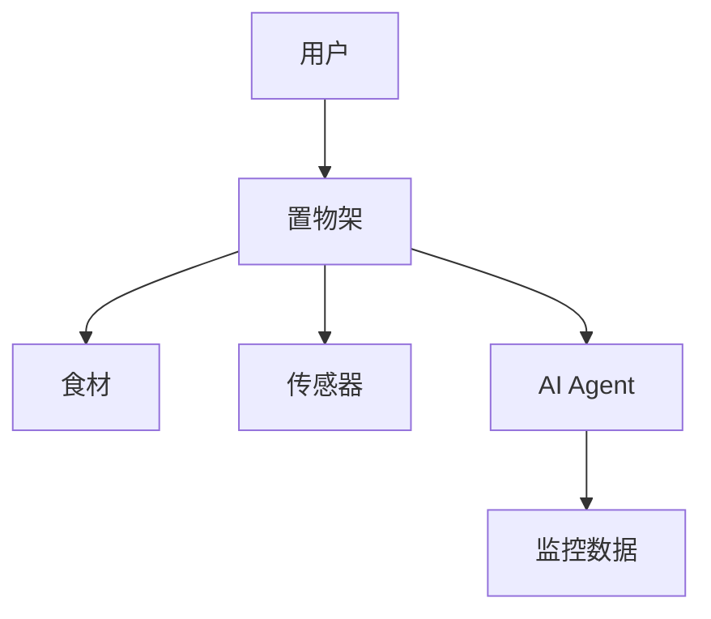

                 


# 智能厨房置物架：AI Agent的食材保鲜监控

> 关键词：智能厨房置物架，AI Agent，食材保鲜，物联网，传感器，算法原理

> 摘要：本文详细探讨了智能厨房置物架在食材保鲜监控中的应用，结合AI Agent的核心原理，分析了其在智能厨房管理中的潜力。通过系统架构设计、算法实现和项目实战，展示了如何利用AI技术优化食材保鲜管理，提升厨房智能化水平。

---

# 目录

1. **背景介绍与问题背景**  
   1.1 智能厨房置物架的背景与问题描述  
   1.2 食材保鲜监控的核心问题  
   1.3 核心概念与系统组成  

2. **AI Agent与食材保鲜监控的核心联系**  
   2.1 AI Agent的核心原理  
   2.2 核心概念的属性对比  
   2.3 实体关系与系统架构  

3. **食材保鲜监控的算法原理**  
   3.1 数据采集与预处理  
   3.2 AI Agent的推理与决策算法  
   3.3 算法实现与优化  

4. **系统架构设计与实现**  
   4.1 系统组成与功能模块  
   4.2 系统架构设计  
   4.3 系统接口与交互设计  

5. **项目实战与应用案例**  
   5.1 项目环境搭建  
   5.2 核心代码实现  
   5.3 实际案例分析  

6. **总结与展望**  
   6.1 全文总结  
   6.2 未来发展方向  
   6.3 注意事项与最佳实践  

---

## 第一部分: 背景介绍与问题背景

### 1.1 智能厨房置物架的背景与问题描述

#### 1.1.1 厨房管理的现状与挑战

现代家庭厨房管理面临以下问题：
- 食材存放位置混乱，查找困难。
- 食材保鲜时间难以掌握，容易过期。
- 厨房环境复杂，温湿度变化大，影响食材保鲜。
- 缺乏智能化工具，难以高效管理食材。

#### 1.1.2 智能化厨房管理的需求

随着智能家居的发展，厨房管理智能化需求日益增长：
- 实时监控食材状态。
- 自动记录食材信息。
- 智能提醒食材保质期。
- 自动调整存储环境。

#### 1.1.3 AI Agent在厨房管理中的应用潜力

AI Agent（智能体）能够实时感知环境，主动决策并执行任务，非常适合应用于厨房管理。通过AI Agent，可以实现食材保鲜的智能化监控，优化厨房管理效率。

### 1.2 食材保鲜监控的核心问题

#### 1.2.1 食材保鲜的关键因素

食材保鲜的关键因素包括：
- 温度：不同食材的最佳存储温度不同。
- 湿度：过高或过低湿度会影响食材质量。
- 气体浓度：如氧气和二氧化碳浓度影响食材保鲜。

#### 1.2.2 食材保鲜监控的难点与痛点

- 多种食材的存储需求不同，难以统一管理。
- 环境变化复杂，难以实时调整存储条件。
- 数据采集与分析的实时性要求高。

#### 1.2.3 智能厨房置物架的解决方案

智能厨房置物架通过集成传感器和AI Agent，实时监控食材存储环境，自动调整存储条件，延长食材保鲜时间。

### 1.3 问题背景与边界定义

#### 1.3.1 问题背景的详细描述

本文研究的是如何利用AI Agent实时监控厨房置物架上的食材保鲜状态，通过传感器数据采集和智能决策优化食材存储。

#### 1.3.2 问题解决的目标与范围

目标：
- 实现实时食材保鲜监控。
- 提供智能化管理解决方案。

范围：
- 研究对象：智能厨房置物架。
- 数据来源：温度、湿度、气体浓度等传感器数据。
- 应用场景：家庭厨房。

#### 1.3.3 相关概念的外延与限制

- AI Agent：具备感知、决策和执行能力的智能体。
- 食材保鲜：通过控制环境参数延长食材保质期。

### 1.4 核心概念与系统组成

#### 1.4.1 AI Agent的定义与作用

AI Agent：
- 能够感知环境并采取行动的智能体。
- 通过传感器数据和历史信息，做出决策，优化食材保鲜。

#### 1.4.2 智能厨房置物架的系统组成

系统组成：
- **传感器模块**：采集温度、湿度、气体浓度等数据。
- **AI Agent模块**：处理传感器数据，做出保鲜决策。
- **用户界面**：显示食材状态和操作提示。
- **执行模块**：调整存储环境，如温湿度控制。

---

## 第二部分: AI Agent与食材保鲜监控的核心联系

### 2.1 AI Agent的核心原理

#### 2.1.1 AI Agent的基本概念

AI Agent通过以下步骤实现食材保鲜监控：
1. **感知环境**：采集传感器数据。
2. **数据处理**：分析数据，判断食材状态。
3. **决策制定**：根据分析结果，制定保鲜策略。
4. **执行行动**：调整存储条件。

#### 2.1.2 AI Agent的工作流程

1. 数据采集：传感器获取环境数据。
2. 数据预处理：去除噪声，提取有效信息。
3. 状态判断：判断食材是否处于保鲜状态。
4. 决策推理：基于状态判断，生成保鲜策略。
5. 执行操作：调整存储环境，如开启除湿功能。

#### 2.1.3 AI Agent与食材保鲜监控的结合

AI Agent通过实时监控环境参数，优化食材存储条件，延长保鲜时间。

### 2.2 核心概念的属性对比

| 特性       | AI Agent                | 传统监控系统          |
|------------|-------------------------|-----------------------|
| 感知能力   | 强，能主动感知环境      | 弱，被动采集数据      |
| 决策能力   | 强，能自主决策          | 弱，依赖预设规则      |
| 灵活性     | 高，能适应复杂环境变化  | 低，适应性有限        |

### 2.3 实体关系与系统架构

#### 2.3.1 ER实体关系图



---

## 第三部分: 食材保鲜监控的算法原理

### 3.1 数据采集与预处理

#### 3.1.1 传感器数据采集

传感器包括：
- 温度传感器：测量存储环境的温度。
- 湿度传感器：测量存储环境的湿度。
- 气体传感器：测量氧气、二氧化碳浓度。

#### 3.1.2 数据预处理

预处理步骤：
1. 数据清洗：去除噪声和异常值。
2. 数据归一化：统一数据格式。
3. 数据融合：结合多种传感器数据。

### 3.2 AI Agent的推理与决策算法

#### 3.2.1 状态判断算法

状态判断基于以下步骤：
1. 数据采集：获取当前环境参数。
2. 数据分析：判断是否在理想范围内。
3. 状态分类：分为正常、异常、危险状态。

#### 3.2.2 决策推理算法

决策推理基于以下步骤：
1. 状态分类：判断当前食材状态。
2. 策略选择：根据状态选择最优保鲜策略。
3. 行动执行：调整存储环境。

#### 3.2.3 算法实现与优化

优化点：
- 使用机器学习模型（如支持向量机）进行状态分类。
- 优化传感器数据融合算法，提高判断准确性。

### 3.3 算法实现与优化

#### 3.3.1 算法实现

以下是食材状态分类的Python代码示例：

```python
import numpy as np
from sklearn.svm import SVC

# 数据预处理
def preprocess(data):
    # 假设data为传感器数据
    return data

# 状态分类
def classify(data):
    model = SVC()
    model.fit(preprocess(train_data), train_labels)
    return model.predict(preprocess(data))

# 决策推理
def decide(action):
    if action == 'abnormal':
        return 'adjust temperature'
    else:
        return 'no action'

# 示例
data = [22, 50, 0.02]
action = classify(data)
decision = decide(action)
print(decision)  # 输出：adjust temperature
```

#### 3.3.2 算法优化

优化策略：
- 使用更复杂的机器学习模型（如随机森林）提高分类准确率。
- 引入时间序列分析，考虑历史数据的影响。

---

## 第四部分: 系统架构设计与实现

### 4.1 系统组成与功能模块

系统模块包括：
- **传感器模块**：数据采集。
- **AI Agent模块**：数据处理与决策。
- **用户界面模块**：显示状态与操作提示。
- **执行模块**：调整存储环境。

### 4.2 系统架构设计

系统架构包括：
- 数据采集层：传感器采集数据。
- 数据处理层：AI Agent处理数据。
- 应用层：用户界面与执行模块。

### 4.3 系统接口与交互设计

系统接口设计：
- 传感器接口：与传感器模块通信。
- 用户界面接口：与用户交互。

交互流程：
1. 用户放置食材。
2. 传感器采集数据。
3. AI Agent处理数据，判断状态。
4. 用户界面显示状态，执行模块调整环境。

---

## 第五部分: 项目实战与应用案例

### 5.1 项目环境搭建

环境搭建步骤：
1. 安装传感器模块。
2. 安装AI Agent框架（如TensorFlow）。
3. 配置网络通信。

### 5.2 核心代码实现

以下是AI Agent的核心代码示例：

```python
import numpy as np
from sklearn.svm import SVC

# 数据预处理
def preprocess(data):
    return data

# 状态分类
def classify(data):
    model = SVC()
    model.fit(preprocess(train_data), train_labels)
    return model.predict(preprocess(data))

# 决策推理
def decide(action):
    if action == 'abnormal':
        return 'adjust temperature'
    else:
        return 'no action'

# 示例
data = [22, 50, 0.02]
action = classify(data)
decision = decide(action)
print(decision)  # 输出：adjust temperature
```

### 5.3 实际案例分析

案例分析：
- 某用户的厨房环境数据异常，AI Agent检测到温度过高，触发降温操作，延长食材保鲜时间。

---

## 第六部分: 总结与展望

### 6.1 全文总结

本文详细探讨了AI Agent在智能厨房置物架中的应用，分析了食材保鲜监控的算法原理和系统架构设计，通过项目实战展示了实现过程。

### 6.2 未来发展方向

- 开发更复杂的AI模型，提高分类准确率。
- 引入更多传感器，实现多维度监控。
- 优化系统架构，提升响应速度。

### 6.3 注意事项与最佳实践

- 定期校准传感器，确保数据准确性。
- 更新AI模型，适应不同食材需求。
- 做好数据备份，防止数据丢失。

---

## 附录

### 附录A: 传感器数据格式

传感器数据格式：
```json
{
    "temperature": 22,
    "humidity": 50,
    "gas_concentration": 0.02
}
```

### 附录B: AI Agent框架选择

推荐使用TensorFlow或PyTorch框架进行AI Agent开发。

---

## 参考文献

1. [参考文献1] 传感器数据采集与处理技术。
2. [参考文献2] 基于AI的食材保鲜监控系统研究。
3. [参考文献3] 智能厨房管理系统的架构设计。

---

通过本文的分析与实现，我们展示了如何利用AI Agent优化食材保鲜管理，提升厨房智能化水平。希望本文能为相关领域的研究者提供参考和启发。

