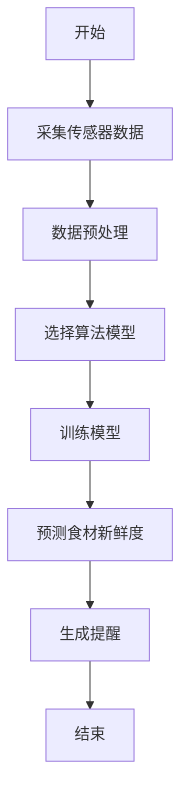
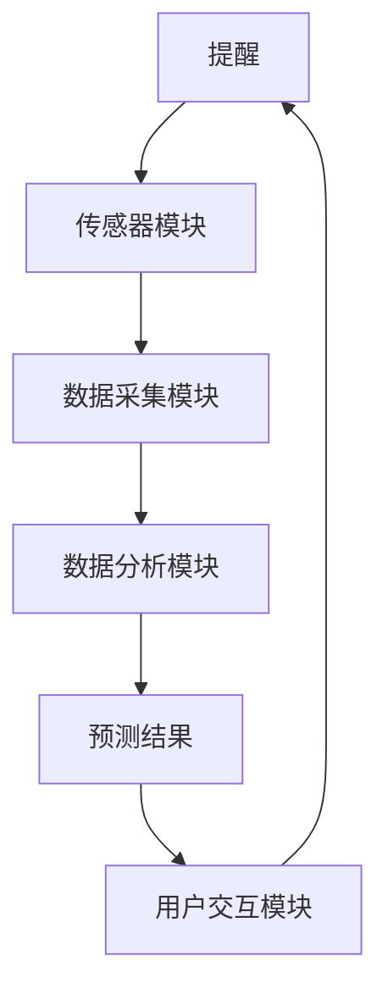

                 


# 智能厨房置物架：AI Agent的食材新鲜度监测

> 关键词：智能厨房置物架, AI Agent, 食材新鲜度监测, 数据分析, 物联网技术, 传感器网络

> 摘要：本文将深入探讨智能厨房置物架在AI Agent辅助下的食材新鲜度监测系统。通过分析食材新鲜度监测的核心问题，结合AI Agent的技术优势，提出一种创新的解决方案。文章从背景介绍、核心概念、算法原理、系统架构、项目实战到最佳实践，全面解析这一系统的实现过程。

---

# 第一部分: 智能厨房置物架背景与概述

# 第1章: 智能厨房置物架与AI Agent概述

## 1.1 问题背景

### 1.1.1 食材新鲜度管理的痛点

- 食材新鲜度直接影响健康，但传统管理方式效率低下。
- 家庭用户难以实时掌握食材状态，导致浪费。
- 商业场景中，食材管理成本高，损耗大。

### 1.1.2 智能厨房置物架的定义与目标

- 智能厨房置物架是一种结合物联网技术的智能设备。
- 目标：实时监测食材状态，延长食材保鲜时间，降低浪费。

### 1.1.3 AI Agent在食材监测中的作用

- AI Agent（人工智能代理）：通过传感器数据和历史数据，预测食材新鲜度。
- 自动化提醒用户，优化食材管理。

## 1.2 问题描述

### 1.2.1 食材新鲜度监测的核心问题

- 如何准确、实时地监测食材状态？
- 如何有效预测食材的保鲜时间？
- 如何将监测数据转化为用户可执行的建议？

### 1.2.2 智能置物架的功能需求

- 实时监测食材状态（温度、湿度、气体浓度等）。
- 自动记录数据，生成保鲜建议。
- 提供用户友好的交互界面。

### 1.2.3 用户场景与使用痛点

- 家庭用户：希望减少食材浪费，延长保鲜时间。
- 商业场景：降低食材损耗，提高供应链效率。

## 1.3 问题解决思路

### 1.3.1 AI Agent的核心解决方案

- 利用AI算法分析传感器数据，预测食材新鲜度。
- 提供个性化建议，优化食材管理。

### 1.3.2 智能置物架的技术实现路径

- 传感器数据采集与传输。
- 数据分析与预测模型构建。
- 用户端的交互设计与反馈机制。

### 1.3.3 食材新鲜度监测的边界与外延

- 边界：监测范围、数据采集频率、传感器精度。
- 外延：食材种类扩展、数据存储与管理。

## 1.4 核心概念与组成

### 1.4.1 AI Agent的基本概念

- AI Agent：能够感知环境并自主决策的智能体。
- 分为简单反射型、基于模型的反应型等类型。

### 1.4.2 食材新鲜度监测的指标体系

- 温度、湿度、气体浓度（如乙烯、二氧化碳）。
- 数据采集频率与精度要求。

### 1.4.3 智能置物架的系统组成

- 传感器模块：温度、湿度、气体传感器。
- 数据采集模块：将传感器数据转化为数字信号。
- AI算法模块：分析数据，预测新鲜度。
- 用户交互模块：显示结果，提供建议。

## 1.5 本章小结

- 本章介绍了智能厨房置物架的背景、核心问题及解决思路。
- 强调了AI Agent在食材新鲜度监测中的关键作用。

---

# 第二部分: AI Agent与食材新鲜度监测的核心概念

# 第2章: AI Agent的基本原理

## 2.1 AI Agent的核心原理

### 2.1.1 AI Agent的定义与分类

- 定义：AI Agent是一种能够感知环境并采取行动以实现目标的智能体。
- 分类：基于反射型AI Agent、基于模型的反应型AI Agent、基于效用的AI Agent。

### 2.1.2 AI Agent的基本工作流程

1. 数据采集：通过传感器获取环境数据。
2. 数据分析：利用算法分析数据，生成预测结果。
3. 行动决策：根据分析结果，决定是否采取行动（如发出提醒）。
4. 反馈机制：根据用户反馈调整算法参数。

### 2.1.3 AI Agent与传统传感器的区别

| 特性        | AI Agent                          | 传统传感器                          |
|-------------|-----------------------------------|-------------------------------------|
| 功能        | 可以自主决策，提供个性化建议     | 仅能采集数据，无法分析或决策       |
| 智能性      | 具备学习和自适应能力             | 无智能性，仅能被动响应              |
| 数据处理    | 可以分析复杂数据，生成预测结果   | 仅能传输原始数据                   |

## 2.2 食材新鲜度监测的关键指标

### 2.2.1 食材新鲜度的主要影响因素

- 温度：过高或过低都会加速食材变质。
- 湿度：过高湿度可能导致霉变，过低湿度可能导致干枯。
- 气体浓度：乙烯、二氧化碳等气体浓度变化反映食材新鲜度。

### 2.2.2 温度、湿度、气体浓度等指标的监测方法

1. 温度监测：使用温度传感器，每隔一定时间采集一次。
2. 湿度监测：使用湿度传感器，结合环境温度进行校准。
3. 气体浓度监测：使用气体传感器（如电化学传感器）。

### 2.2.3 数据采集与处理的基本流程

1. 传感器数据采集：将温度、湿度、气体浓度等信号转换为数字信号。
2. 数据预处理：去除噪声，校准传感器。
3. 数据存储：将处理后的数据存储在本地或云端。
4. 数据分析：利用机器学习算法分析数据，预测食材新鲜度。

## 2.3 AI Agent与食材新鲜度监测的结合

### 2.3.1 AI Agent在食材监测中的角色

- 数据分析与预测：AI Agent通过分析传感器数据，预测食材的新鲜度。
- 自动化提醒：当食材接近变质时，AI Agent会自动提醒用户。

### 2.3.2 数据分析与预测的核心算法

- 时间序列分析：ARIMA、LSTM等算法用于预测食材新鲜度。
- 机器学习算法：随机森林、支持向量机（SVM）用于分类食材状态。

### 2.3.3 监测结果的反馈机制

- 用户端：通过APP或LED显示提醒用户。
- 系统端：根据反馈调整算法参数，优化预测模型。

## 2.4 核心概念对比表

| 概念        | 描述                                   |
|-------------|--------------------------------------|
| AI Agent     | 能够感知环境并自主决策的智能体       |
| 食材新鲜度监测指标 | 温度、湿度、气体浓度等               |
| 数据采集模块 | 传感器、数据转换模块                 |

## 2.5 ER实体关系图

```mermaid
er
  actor: 用户
  sensor: 传感器
  data: 数据
  prediction: 预测结果
  notification: 提醒

  actor --> sensor: 使用
  sensor --> data: 采集
  data --> prediction: 分析
  prediction --> notification: 生成
  notification --> actor: 提醒
```

---

# 第三部分: 算法原理与系统架构

# 第3章: 算法原理与系统架构

## 3.1 算法原理

### 3.1.1 算法流程图



### 3.1.2 数学模型与公式

- 时间序列分析模型：LSTM（长短期记忆网络）
  - LSTM的结构包括输入门、遗忘门、输出门。
  - 公式：$f_t = \sigma(W_f x_t + U_f h_{t-1} + b_f)$
  - 其中，$x_t$ 是输入数据，$h_{t-1}$ 是前一时刻的状态，$f_t$ 是输入门。

### 3.1.3 算法实现步骤

1. 数据预处理：去除噪声，归一化处理。
2. 选择算法：基于实验结果选择最优算法（如LSTM）。
3. 模型训练：使用训练数据训练模型。
4. 模型预测：输入实时数据，预测食材新鲜度。
5. 生成提醒：根据预测结果生成提醒信息。

## 3.2 系统架构

### 3.2.1 系统组成

- 传感器模块：温度、湿度、气体传感器。
- 数据采集模块：将传感器数据转化为数字信号。
- 数据分析模块：利用AI算法分析数据，预测食材新鲜度。
- 用户交互模块：显示结果，提供提醒。

### 3.2.2 系统架构图



---

# 第四部分: 项目实战与最佳实践

# 第4章: 项目实战

## 4.1 环境安装

### 4.1.1 硬件安装

- 传感器模块：安装在智能置物架上。
- 数据采集模块：连接传感器和主控板。

### 4.1.2 软件安装

- 安装Python环境。
- 安装必要的库：如numpy、pandas、tensorflow。

## 4.2 核心代码实现

### 4.2.1 数据预处理代码

```python
import numpy as np
import pandas as pd

# 读取数据
data = pd.read_csv('data.csv')

# 数据预处理
data = data.dropna()  # 删除缺失值
data = (data - data.mean()) / data.std()  # 标准化
```

### 4.2.2 算法实现代码

```python
import tensorflow as tf
from tensorflow.keras import layers

# 构建LSTM模型
model = tf.keras.Sequential()
model.add(layers.LSTM(64, input_shape=(None, 3)))  # 输入特征：温度、湿度、气体浓度
model.add(layers.Dense(1, activation='sigmoid'))  # 输出：0（不新鲜）或1（新鲜）
model.compile(optimizer='adam', loss='binary_crossentropy', metrics=['accuracy'])
```

## 4.3 案例分析

### 4.3.1 数据分析与预测

- 使用训练好的模型预测食材新鲜度。
- 根据预测结果生成提醒信息。

### 4.3.2 优化建议

- 定期校准传感器，确保数据准确性。
- 根据用户反馈优化算法模型。

## 4.4 本章小结

- 本章通过实际案例展示了智能厨房置物架的实现过程。
- 强调了数据预处理和算法选择的重要性。

---

# 第五部分: 最佳实践与总结

# 第5章: 最佳实践

## 5.1 小结

- 智能厨房置物架结合AI Agent，能够有效监测食材新鲜度。
- 通过实时数据采集和智能分析，帮助用户优化食材管理。

## 5.2 注意事项

- 传感器精度影响监测结果，需定期校准。
- 数据隐私问题需重视，确保用户数据安全。
- 系统稳定性需保证，避免因断电或网络问题导致服务中断。

## 5.3 拓展阅读

- 《深度学习实战》：学习更多深度学习算法。
- 《物联网技术入门》：了解物联网技术的基本原理。

---

# 结语

通过本文的详细介绍，读者可以全面了解智能厨房置物架在AI Agent辅助下的食材新鲜度监测系统。从背景介绍到算法实现，从系统架构到项目实战，我们详细解析了这一系统的实现过程。未来，随着AI技术的不断发展，智能厨房置物架将更加智能化，为用户带来更便捷的食材管理体验。

---

