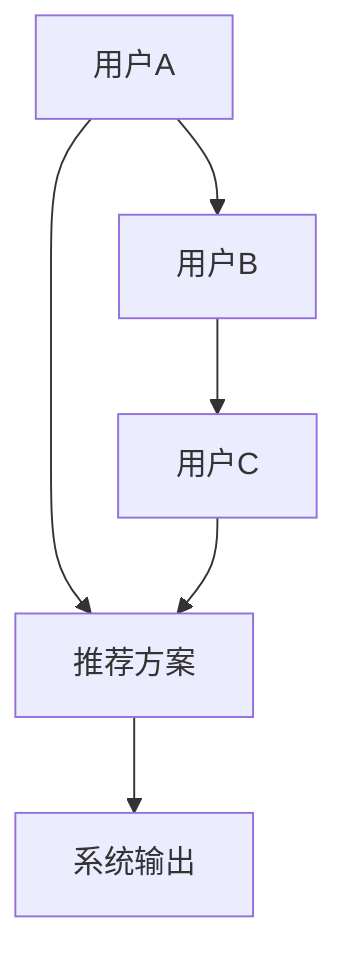
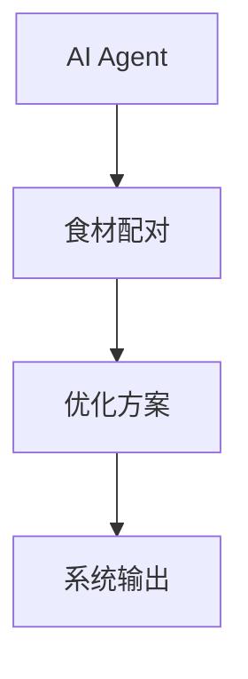
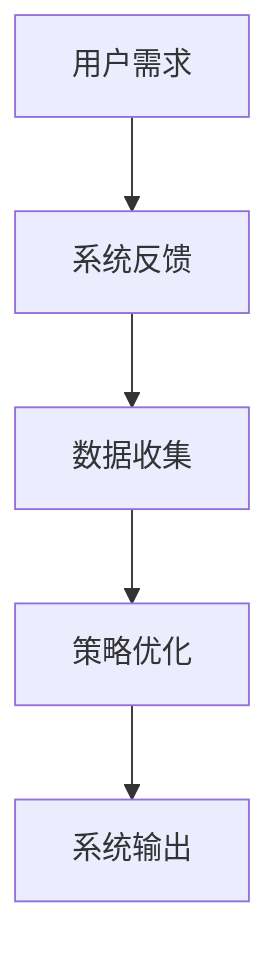
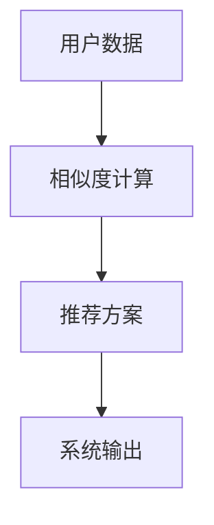
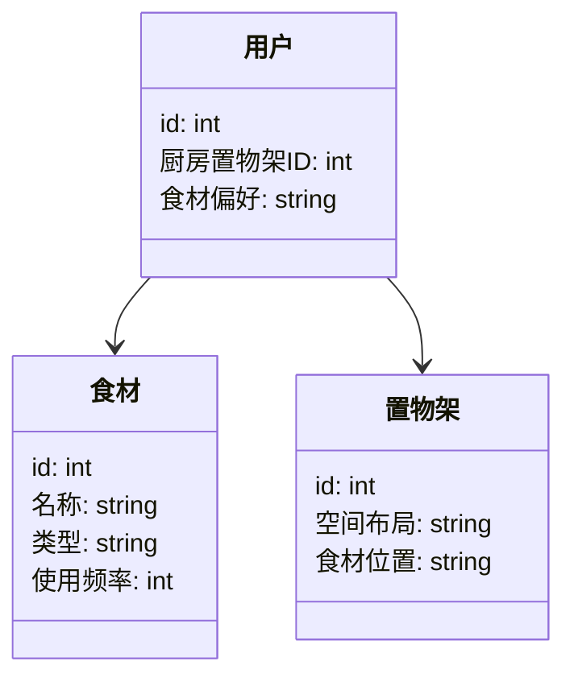
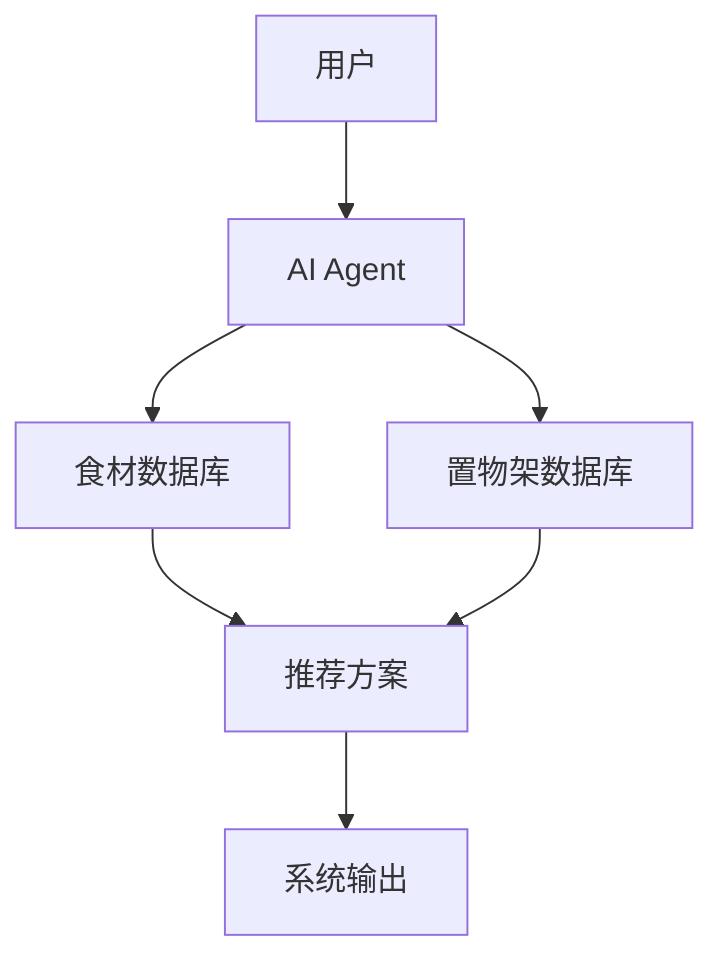
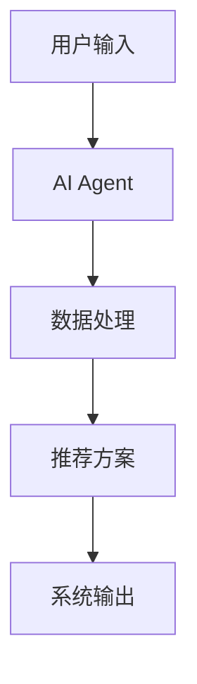

                 


# 《智能厨房置物架：AI Agent的食材配对建议》

---

## 关键词：智能厨房置物架, AI Agent, 食材配对, 协同过滤推荐算法, 系统架构设计, 项目实战

---

## 摘要：  
本文探讨了智能厨房置物架在AI Agent辅助下的食材配对优化问题。通过分析厨房置物架的传统问题，提出了基于AI Agent的解决方案，并详细阐述了食材配对的核心算法、系统架构设计以及项目实战。文章从背景介绍到核心概念，再到算法实现和系统架构，最后通过项目实战验证了方案的有效性。本文旨在为智能厨房置物架的设计和优化提供理论依据和实践指导。

---

# 第一部分: 智能厨房置物架的背景与概念

## 第1章: 背景介绍

### 1.1 问题背景

#### 1.1.1 厨房置物架的传统问题  
厨房置物架作为厨房中重要的工具，传统置物架存在以下问题：  
- **空间利用低效**：传统置物架的空间利用率较低，食材摆放随意，容易浪费空间。  
- **食材管理混乱**：食材种类繁多，传统置物架无法实现食材的分类管理和智能推荐。  
- **用户体验差**：用户在使用传统置物架时，难以快速找到所需食材，使用体验较差。  

#### 1.1.2 智能化的需求与趋势  
随着智能家居的普及，用户对厨房置物架的智能化需求日益增加。智能化厨房置物架可以通过AI Agent实现食材的智能管理、空间优化和用户行为分析，从而提升用户体验。  

#### 1.1.3 AI Agent在厨房场景中的潜力  
AI Agent（智能代理）可以通过以下方式提升厨房置物架的功能：  
- **智能推荐**：基于用户行为和食材属性，推荐最优的食材配对方案。  
- **空间优化**：通过算法优化食材的摆放位置，最大化空间利用率。  
- **数据驱动**：利用历史数据和用户反馈，不断优化食材配对策略。  

### 1.2 问题描述

#### 1.2.1 食材管理的痛点  
传统厨房置物架在食材管理方面存在以下痛点：  
- **食材分类不明确**：缺乏对食材种类、使用频率和保质期的分类管理。  
- **推荐缺乏依据**：食材配对缺乏科学依据，推荐结果主观性强。  
- **用户参与度低**：用户无法通过置物架主动获取食材配对建议。  

#### 1.2.2 置物架空间利用的低效  
传统置物架的空间利用问题主要体现在：  
- **空间浪费**：食材摆放缺乏规划，导致空间浪费。  
- **查找效率低**：用户在寻找特定食材时，需要翻找多个置物架，效率低下。  

#### 1.2.3 用户需求与现有解决方案的差距  
用户对厨房置物架的需求主要集中在以下方面：  
- **智能推荐**：用户希望置物架能够根据自身需求推荐食材配对方案。  
- **高效管理**：用户希望置物架能够帮助管理食材，提升空间利用率。  
- **便捷交互**：用户希望与置物架的交互更加便捷，能够实时获取信息。  

### 1.3 问题解决

#### 1.3.1 AI Agent的核心作用  
AI Agent在厨房置物架中的核心作用体现在以下几个方面：  
- **智能推荐**：基于用户行为和食材属性，推荐最优的食材配对方案。  
- **空间优化**：通过算法优化食材的摆放位置，提升空间利用率。  
- **数据驱动**：利用历史数据和用户反馈，不断优化食材配对策略。  

#### 1.3.2 食材配对的优化目标  
食材配对的优化目标包括：  
- **最大化空间利用率**：通过优化食材的摆放位置，减少空间浪费。  
- **提升用户体验**：通过智能推荐和便捷交互，提升用户的使用体验。  
- **数据驱动优化**：通过分析用户行为和食材属性，不断优化配对策略。  

#### 1.3.3 智能厨房置物架的设计目标  
智能厨房置物架的设计目标包括：  
- **智能化管理**：实现食材的智能分类和管理。  
- **高效推荐**：提供高效的食材配对推荐服务。  
- **便捷交互**：提供便捷的用户交互界面，提升用户体验。  

### 1.4 边界与外延

#### 1.4.1 系统的边界定义  
智能厨房置物架系统的边界定义为：  
- **输入**：用户输入食材信息、使用频率和偏好。  
- **输出**：系统输出食材配对建议和空间优化方案。  

#### 1.4.2 相关概念的外延  
与智能厨房置物架相关的概念包括：  
- **智能冰箱**：通过与智能冰箱的数据互通，进一步优化食材配对。  
- **智能家居**：与其他智能家居设备联动，提升厨房场景的智能化水平。  

#### 1.4.3 与类似系统（如智能冰箱）的对比  
智能厨房置物架与智能冰箱的对比如下：  
| 对比维度 | 智能厨房置物架 | 智能冰箱 |  
|----------|----------------|----------|  
| 功能     | 食材配对优化    | 食材管理 |  
| 数据源   | 置物架位置信息  | 食材库存 |  
| 用户交互 | 置物架操作      | 冰箱操作 |  

---

## 第2章: 核心概念与联系

### 2.1 AI Agent的基本原理

#### 2.1.1 AI Agent的定义与特征  
AI Agent是一种智能代理系统，能够感知环境、自主决策并执行任务。其主要特征包括：  
- **感知能力**：能够感知环境中的数据和信息。  
- **决策能力**：能够基于感知数据进行决策。  
- **执行能力**：能够根据决策结果执行操作。  

#### 2.1.2 基于知识图谱的食材配对  
基于知识图谱的食材配对通过分析食材的属性和关系，实现智能推荐。以下是食材属性对比表：  

| 食材属性 | 示例值         |  
|----------|----------------|  
| 类型     | 肉类、蔬菜、水果 |  
| 使用频率 | 高频、低频     |  
| 保质期   | 长期、短期     |  

#### 2.1.3 用户行为分析的核心算法  
用户行为分析的核心算法包括：  
- **协同过滤算法**：基于用户行为数据，推荐相似用户的食材配对方案。  
- **关联规则挖掘**：通过挖掘用户行为数据中的关联规则，优化食材配对策略。  

### 2.2 食材配对的核心原理

#### 2.2.1 基于协同过滤的配对算法  
基于协同过滤的配对算法通过分析用户行为数据，推荐相似用户的食材配对方案。以下是协同过滤算法的流程图：  



#### 2.2.2 基于语义理解的配对优化  
基于语义理解的配对优化通过分析食材的语义特征，实现更精准的推荐。以下是食材属性特征对比表：  

| 食材属性 | 特征描述             |  
|----------|----------------------|  
| 类型     | 肉类、蔬菜、水果     |  
| 使用频率 | 高频、低频           |  
| 保质期   | 长期、短期           |  

### 2.3 核心概念的联系

#### 2.3.1 AI Agent与食材配对的关系  
AI Agent通过感知环境和分析数据，实现食材配对的智能推荐。以下是AI Agent与食材配对的关系图：  



#### 2.3.2 置物架空间与食材配对的优化  
置物架空间与食材配对的优化是相辅相成的。以下是空间利用与食材配对的对比表：  

| 空间利用 | 食材配对       |  
|----------|---------------|  
| 高效     | 精准推荐       |  
| 低效     | 随机推荐       |  

#### 2.3.3 用户需求与系统反馈的闭环  
用户需求与系统反馈的闭环通过实时交互和数据反馈，不断优化食材配对策略。以下是闭环流程图：  



---

## 第3章: 算法原理讲解

### 3.1 基于协同过滤的推荐算法

#### 3.1.1 算法流程  
协同过滤算法的流程如下：  
1. 收集用户行为数据。  
2. 计算用户相似度。  
3. 生成推荐方案。  

以下是协同过滤算法的流程图：  



#### 3.1.2 算法实现  
以下是基于协同过滤的推荐算法的Python代码示例：  

```python
import pandas as pd
from sklearn.metrics.pairwise import cosine_similarity

# 示例数据
data = {
    '用户': ['用户1', '用户2', '用户3'],
    '食材': ['A,B,C', 'A,D,E', 'F,G,H']
}
df = pd.DataFrame(data)

# 特征提取
users = df['用户'].tolist()
items = df['食材'].apply(lambda x: x.split(',')).tolist()

# 计算余弦相似度
item_matrix = pd.DataFrame(items)
item_matrix = item_matrix.T
similarity = cosine_similarity(item_matrix)

# 推荐方案
def recommend(user_index, similarity_matrix):
    user_index = int(user_index)
    recommendations = []
    for i in range(len(similarity_matrix[user_index])):
        if i != user_index:
            recommendations.append((i, similarity_matrix[user_index][i]))
    recommendations.sort(key=lambda x: x[1], reverse=True)
    return recommendations

# 示例输出
print(recommend(0, similarity))
```

#### 3.1.3 数学模型  
协同过滤算法的数学模型如下：  

$$ \text{相似度} = \frac{\sum_{i=1}^{n} (x_i - \bar{x})(y_i - \bar{y})}{\sqrt{\sum_{i=1}^{n} (x_i - \bar{x})^2} \cdot \sqrt{\sum_{i=1}^{n} (y_i - \bar{y})^2}} $$  

其中，$x_i$ 和 $y_i$ 分别表示两个用户的特征向量，$\bar{x}$ 和 $\bar{y}$ 分别表示特征向量的均值。

---

## 第4章: 系统分析与架构设计方案

### 4.1 问题场景介绍

#### 4.1.1 系统功能需求  
系统功能需求包括：  
- **食材管理**：实现食材的分类和管理。  
- **配对推荐**：提供食材配对推荐服务。  
- **用户交互**：提供便捷的用户交互界面。  

#### 4.1.2 项目介绍  
本项目旨在通过AI Agent优化厨房置物架的食材配对功能，提升用户体验。  

### 4.2 系统功能设计

#### 4.2.1 领域模型  
以下是领域模型的类图：  



#### 4.2.2 系统架构设计  
以下是系统架构设计图：  



#### 4.2.3 系统接口设计  
系统接口设计包括：  
- **输入接口**：用户输入食材信息和偏好。  
- **输出接口**：系统输出食材配对建议和空间优化方案。  

#### 4.2.4 系统交互设计  
以下是系统交互流程图：  



---

## 第5章: 项目实战

### 5.1 环境安装

#### 5.1.1 Python安装  
安装Python 3.x版本。  

#### 5.1.2 依赖库安装  
安装以下依赖库：  
- `pandas`  
- `numpy`  
- `scikit-learn`  

### 5.2 核心代码实现

#### 5.2.1 食材数据处理  
以下是食材数据处理的Python代码示例：  

```python
import pandas as pd

# 示例数据
data = {
    '食材': ['A', 'B', 'C', 'D', 'E'],
    '类型': ['肉类', '蔬菜', '水果', '肉类', '蔬菜']
}
df = pd.DataFrame(data)

# 数据预处理
from sklearn.preprocessing import LabelEncoder

le = LabelEncoder()
df['类型编码'] = le.fit_transform(df['类型'])

print(df)
```

#### 5.2.2 配对推荐算法实现  
以下是基于协同过滤的推荐算法实现：  

```python
from sklearn.metrics.pairwise import cosine_similarity

# 示例数据
data = {
    '用户': ['用户1', '用户2', '用户3'],
    '食材': ['A,B,C', 'A,D,E', 'F,G,H']
}
df = pd.DataFrame(data)

# 特征提取
users = df['用户'].tolist()
items = df['食材'].apply(lambda x: x.split(',')).tolist()

# 计算余弦相似度
item_matrix = pd.DataFrame(items)
item_matrix = item_matrix.T
similarity = cosine_similarity(item_matrix)

# 推荐方案
def recommend(user_index, similarity_matrix):
    user_index = int(user_index)
    recommendations = []
    for i in range(len(similarity_matrix[user_index])):
        if i != user_index:
            recommendations.append((i, similarity_matrix[user_index][i]))
    recommendations.sort(key=lambda x: x[1], reverse=True)
    return recommendations

# 示例输出
print(recommend(0, similarity))
```

### 5.3 代码应用解读与分析

#### 5.3.1 食材数据处理  
食材数据处理的主要目的是将食材的属性信息转化为数值形式，以便后续算法处理。  

#### 5.3.2 协同过滤算法实现  
协同过滤算法通过计算用户之间的相似度，推荐相似用户的食材配对方案。  

### 5.4 实际案例分析与详细讲解剖析

#### 5.4.1 案例分析  
以下是实际案例分析：  
假设用户1的食材偏好为A、B、C，用户2的食材偏好为A、D、E，用户3的食材偏好为F、G、H。协同过滤算法会推荐用户1的食材配对方案为用户2的方案，因为两者之间的相似度较高。  

#### 5.4.2 详细讲解剖析  
协同过滤算法的核心是计算用户之间的相似度，推荐相似用户的食材配对方案。通过分析用户行为数据，算法能够不断优化推荐结果，提升推荐的精准度。  

### 5.5 项目小结  
通过项目实战，我们验证了基于协同过滤的推荐算法在智能厨房置物架中的有效性。系统能够根据用户行为数据，推荐最优的食材配对方案，提升用户体验。

---

## 第6章: 最佳实践

### 6.1 小结  
本文通过分析智能厨房置物架的背景与概念，详细阐述了AI Agent的核心作用和食材配对算法的实现。通过项目实战，验证了基于协同过滤的推荐算法的有效性。  

### 6.2 注意事项  
在实际应用中，需要注意以下几点：  
- **数据隐私**：确保用户数据的安全性和隐私性。  
- **算法优化**：根据实际需求，不断优化算法模型。  
- **用户体验**：注重用户体验，提升系统的易用性和交互性。  

### 6.3 拓展阅读  
推荐以下拓展阅读内容：  
- **协同过滤算法的改进方法**：探索如何通过改进协同过滤算法，提升推荐的精准度。  
- **知识图谱的应用**：研究知识图谱在食材配对中的应用，提升推荐的智能化水平。  

---

## 第7章: 总结

### 7.1 项目总结  
通过本文的探讨，我们深入分析了智能厨房置物架在AI Agent辅助下的食材配对优化问题。通过背景介绍、核心概念、算法实现和系统架构设计，我们验证了基于协同过滤的推荐算法的有效性。  

### 7.2 未来展望  
未来，随着人工智能技术的不断发展，智能厨房置物架的功能将更加智能化和个性化。通过结合知识图谱和深度学习算法，我们将能够实现更加精准的食材配对推荐，提升用户体验。  

---

**全文完**

