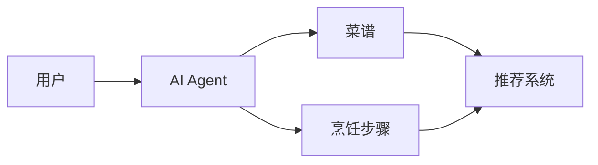
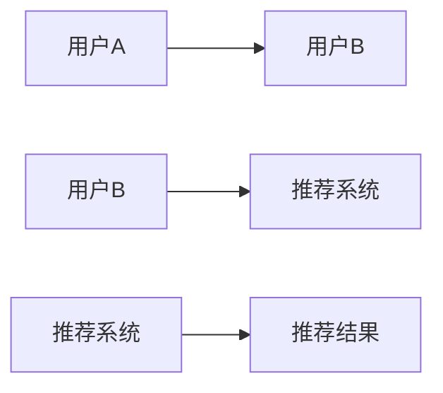
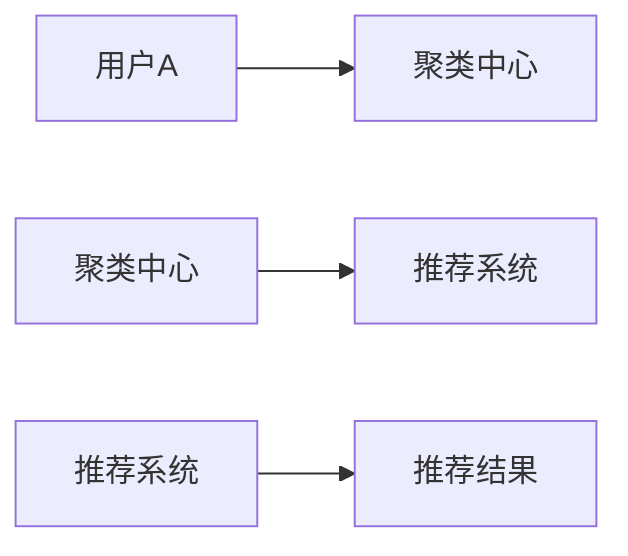
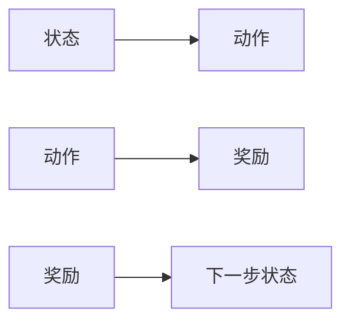
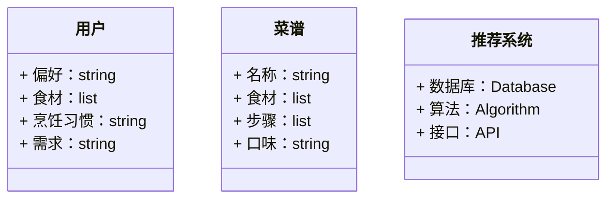
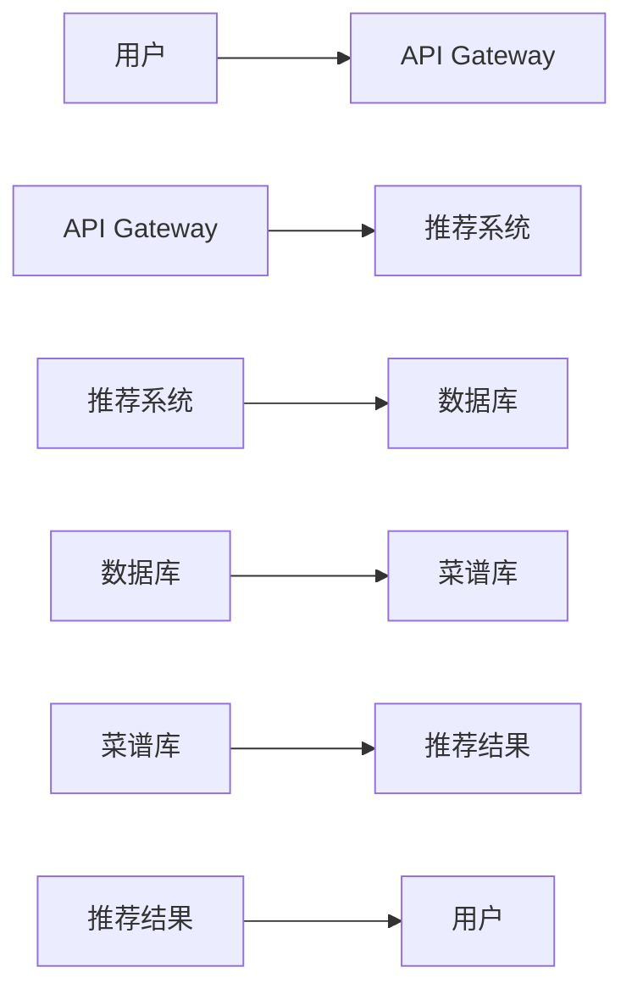
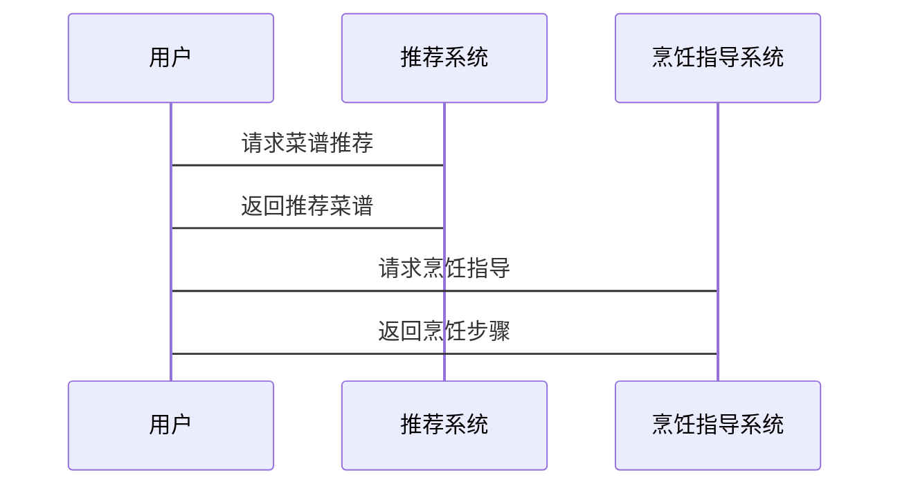

                 


# 智能厨房：AI Agent的菜谱推荐与烹饪指导

---

## 关键词

- AI Agent
- 菜谱推荐
- 烹饪指导
- 智能厨房
- 算法原理
- 系统架构
- 项目实战

---

## 摘要

随着人工智能技术的快速发展，智能厨房逐渐成为现代生活的重要组成部分。AI Agent（人工智能代理）在菜谱推荐与烹饪指导中的应用，能够显著提升用户的烹饪体验，帮助用户更高效地完成烹饪任务。本文将从智能厨房的背景出发，深入探讨AI Agent的核心概念、菜谱推荐与烹饪指导的算法原理，以及智能厨房系统的架构设计与项目实战。通过详细的分析与实例，本文将展示如何利用AI技术实现智能厨房的高效运作，为用户提供个性化的烹饪解决方案。

---

## 目录

### 第一部分: 智能厨房与AI Agent的背景介绍

#### 第1章: 背景与问题背景

##### 1.1 智能厨房的背景与发展

###### 1.1.1 智能厨房的定义与特点

智能厨房是指通过物联网、人工智能和大数据等技术，将厨房设备、食材、菜谱和烹饪过程智能化、自动化和个性化的厨房环境。其特点包括：

- **智能化**：通过AI技术实现自动化操作和个性化推荐。
- **便捷性**：用户可以通过语音、手势或APP进行操作，减少人为干预。
- **数据驱动**：基于用户行为和偏好，提供精准的菜谱推荐和烹饪指导。
- **安全性**：具备智能监控和安全预警功能，确保烹饪过程的安全。

###### 1.1.2 AI Agent在智能厨房中的作用

AI Agent（人工智能代理）是一种能够感知环境并采取行动以实现目标的智能系统。在智能厨房中，AI Agent主要负责以下任务：

- **菜谱推荐**：根据用户的口味、饮食习惯和食材偏好，推荐适合的菜谱。
- **烹饪指导**：提供实时的烹饪步骤、技巧和注意事项，帮助用户顺利完成烹饪。
- **智能交互**：通过自然语言处理技术，与用户进行对话，了解需求并提供解决方案。

###### 1.1.3 智能厨房的现状与发展趋势

当前，智能厨房技术正在快速发展，但仍然面临一些挑战，例如：

- **数据隐私**：用户数据的安全性和隐私保护问题。
- **技术整合**：如何将多种AI技术（如NLP、计算机视觉、机器学习）有机结合，实现高效的烹饪指导。
- **用户体验**：如何设计友好的交互界面，提升用户的使用体验。

未来，随着AI技术的不断进步，智能厨房将更加智能化、个性化和便捷化。

##### 1.2 菜谱推荐与烹饪指导的背景

###### 1.2.1 菜谱推荐的定义与挑战

菜谱推荐是指根据用户的偏好和需求，推荐适合的菜谱的过程。其主要挑战包括：

- **数据稀疏性**：用户数据量不足可能导致推荐效果不佳。
- **个性化需求**：不同用户有不同的口味和饮食习惯，如何满足个性化需求是关键。
- **动态变化**：用户的偏好可能会随时间变化，推荐系统需要动态更新。

###### 1.2.2 烹饪指导的定义与需求

烹饪指导是指通过提供烹饪步骤、技巧和建议，帮助用户顺利完成烹饪的过程。其主要需求包括：

- **实时性**：烹饪指导需要在用户烹饪过程中实时提供，不能滞后。
- **准确性**：指导步骤必须准确无误，避免用户因错误操作导致失败。
- **个性化**：根据用户的技能水平和食材情况，提供个性化的指导。

###### 1.2.3 AI Agent在菜谱推荐与烹饪指导中的优势

AI Agent在菜谱推荐和烹饪指导中的优势主要体现在以下几个方面：

- **智能化推荐**：通过机器学习算法，分析用户的偏好和行为，提供精准的菜谱推荐。
- **实时互动**：通过自然语言处理技术，与用户进行实时对话，提供个性化的烹饪指导。
- **动态调整**：根据用户的反馈和烹饪过程中的实时数据，动态调整推荐和指导策略。

##### 1.3 问题背景与目标

###### 1.3.1 当前菜谱推荐与烹饪指导的主要问题

- **推荐精准度低**：传统推荐算法难以满足个性化需求。
- **指导缺乏实时性**：烹饪指导通常基于固定的菜谱，无法根据实际情况动态调整。
- **用户体验差**：复杂的操作流程和不友好的界面降低了用户的使用体验。

###### 1.3.2 AI Agent如何解决这些问题

AI Agent通过以下方式解决这些问题：

- **精准推荐**：利用机器学习算法，分析用户数据，提供个性化的菜谱推荐。
- **实时互动**：通过自然语言处理技术，实时响应用户的烹饪需求，提供动态的烹饪指导。
- **提升用户体验**：设计友好的交互界面和简洁的操作流程，提升用户的使用体验。

###### 1.3.3 本书的研究目标与意义

本书的研究目标是通过AI Agent技术，实现智能厨房中的精准菜谱推荐和实时烹饪指导。其意义在于：

- **提升烹饪效率**：通过智能化推荐和指导，减少用户的烹饪时间和精力。
- **提高用户体验**：为用户提供个性化的烹饪解决方案，提升用户的满意度。
- **推动智能厨房的发展**：通过技术创新，推动智能厨房行业的快速发展。

##### 1.4 本章小结

本章从智能厨房的背景出发，介绍了AI Agent在菜谱推荐和烹饪指导中的作用，分析了当前存在的问题和挑战，并提出了本书的研究目标与意义。

---

### 第二部分: 核心概念与联系

#### 第2章: 核心概念与联系

##### 2.1 AI Agent的核心概念

###### 2.1.1 AI Agent的定义与特征

AI Agent是一种能够感知环境并采取行动以实现目标的智能系统。其主要特征包括：

- **自主性**：能够在没有人为干预的情况下自主运行。
- **反应性**：能够根据环境的变化调整自身的行为。
- **学习性**：能够通过学习不断提升自身的智能水平。
- **交互性**：能够与用户或其他系统进行有效的交互。

###### 2.1.2 AI Agent的分类与应用场景

AI Agent可以根据功能和应用场景分为以下几类：

- **信息检索Agent**：用于帮助用户快速找到所需信息。
- **推荐系统Agent**：用于根据用户偏好推荐相关内容。
- **决策支持Agent**：用于辅助用户做出决策。
- **执行任务Agent**：用于执行特定的任务。

在智能厨房中，AI Agent主要用于菜谱推荐和烹饪指导，属于推荐系统Agent和决策支持Agent的结合体。

###### 2.1.3 AI Agent在智能厨房中的角色

在智能厨房中，AI Agent主要扮演以下几个角色：

- **数据收集者**：收集用户的饮食偏好、食材库存和烹饪习惯等数据。
- **推荐者**：根据收集到的数据，推荐适合的菜谱。
- **指导者**：在烹饪过程中提供实时的步骤和技巧，帮助用户顺利完成烹饪。

##### 2.2 菜谱推荐的核心概念

###### 2.2.1 菜谱推荐的定义与目标

菜谱推荐是指根据用户的偏好和需求，推荐适合的菜谱的过程。其主要目标是提升用户的烹饪体验，减少用户选择菜谱的难度。

###### 2.2.2 菜谱推荐的主要方法与技术

菜谱推荐的主要方法包括：

- **基于协同过滤的推荐算法**：通过分析用户的相似性，推荐用户可能感兴趣的菜谱。
- **基于内容的推荐算法**：通过分析菜谱的属性（如食材、口味等），推荐与用户偏好相符的菜谱。
- **基于混合推荐的算法**：结合协同过滤和内容推荐的优势，提供更加精准的推荐。

###### 2.2.3 菜谱推荐的评价指标与挑战

菜谱推荐的评价指标主要包括：

- **准确率**：推荐菜谱与用户实际需求的匹配程度。
- **召回率**：推荐系统能够覆盖用户需求的能力。
- **用户满意度**：用户对推荐结果的满意度。

菜谱推荐的主要挑战包括数据稀疏性、个性化需求和动态变化。

##### 2.3 烹饪指导的核心概念

###### 2.3.1 烹饪指导的定义与目标

烹饪指导是指通过提供烹饪步骤、技巧和建议，帮助用户顺利完成烹饪的过程。其主要目标是提升用户的烹饪成功率和效率。

###### 2.3.2 烹饪指导的主要方法与技术

烹饪指导的主要方法包括：

- **基于规则的指导算法**：根据固定的烹饪步骤和技巧，提供指导。
- **基于机器学习的指导算法**：通过分析用户的烹饪过程，动态调整指导策略。
- **基于自然语言处理的指导算法**：通过与用户的对话，提供个性化的指导。

###### 2.3.3 烹饪指导的评价指标与挑战

烹饪指导的评价指标主要包括：

- **指导准确率**：指导步骤的准确程度。
- **用户满意度**：用户对指导结果的满意度。
- **实时性**：指导的实时响应能力。

烹饪指导的主要挑战包括实时性、准确性和个性化需求。

##### 2.4 AI Agent与菜谱推荐的关系

###### 2.4.1 AI Agent如何实现菜谱推荐

AI Agent通过以下方式实现菜谱推荐：

- **数据收集**：收集用户的饮食偏好、食材库存和烹饪习惯等数据。
- **算法分析**：利用协同过滤、内容推荐和混合推荐等算法，分析用户数据，推荐适合的菜谱。
- **动态调整**：根据用户的反馈和烹饪过程中的实时数据，动态调整推荐策略。

###### 2.4.2 菜谱推荐对AI Agent的依赖与影响

菜谱推荐对AI Agent的依赖主要体现在以下几个方面：

- **数据依赖**：菜谱推荐需要大量的用户数据和菜谱数据。
- **算法依赖**：菜谱推荐的核心是算法的准确性。
- **交互依赖**：菜谱推荐需要与用户进行实时互动，了解用户的偏好和需求。

菜谱推荐对AI Agent的影响主要体现在以下几个方面：

- **提升推荐精准度**：通过菜谱推荐，AI Agent能够更精准地满足用户需求。
- **增强用户体验**：通过菜谱推荐，AI Agent能够提升用户的烹饪体验。
- **推动技术创新**：菜谱推荐的技术创新能够推动AI Agent的整体发展。

###### 2.4.3 菜谱推荐与烹饪指导的协同关系

菜谱推荐与烹饪指导之间存在协同关系，主要体现在以下几个方面：

- **数据协同**：菜谱推荐需要烹饪指导的数据支持，例如用户的烹饪习惯和食材偏好。
- **功能协同**：菜谱推荐为烹饪指导提供菜谱建议，烹饪指导为菜谱推荐提供反馈和优化建议。
- **用户协同**：两者共同为用户提供个性化的烹饪解决方案，提升用户的使用体验。

##### 2.5 核心概念属性特征对比表

| 概念       | 属性               | 特征对比                     |
|------------|--------------------|------------------------------|
| AI Agent   | 自主性             | 高                          |
|            | 反应性             | 高                          |
|            | 学习性             | 高                          |
| 菜谱推荐   | 数据依赖性         | 高                          |
|            | 个性化需求         | 高                          |
|            | 动态变化           | 高                          |
| 烹饪指导   | 实时性             | 高                          |
|            | 准确性             | 高                          |
|            | 个性化需求         | 高                          |

##### 2.6 ER实体关系图（Mermaid流程图）



---

### 第三部分: 算法原理

#### 第3章: 算法原理

##### 3.1 协同过滤算法

###### 3.1.1 协同过滤算法的定义与原理

协同过滤是一种基于用户相似性推荐算法。其原理是通过分析用户的行为数据，找到与目标用户相似的用户，推荐这些用户喜欢的物品。

###### 3.1.2 协同过滤算法的实现步骤



###### 3.1.3 协同过滤算法的Python实现

```python
import numpy as np

def collaborative_filtering(user_similarity, target_user, k=3):
    # 找出与目标用户相似性最高的k个用户
    similar_users = np.argsort(user_similarity[target_user])[-k:][::-1]
    
    # 计算目标用户的推荐评分
    recommendations = np.mean(user_similarity[target_user][similar_users], axis=0)
    
    return recommendations
```

##### 3.2 聚类分析算法

###### 3.2.1 聚类分析算法的定义与原理

聚类分析是一种基于数据相似性进行分组的算法。其原理是将用户或物品分成不同的类别，然后根据类别推荐相应的物品。

###### 3.2.2 聚类分析算法的实现步骤



###### 3.2.3 聚类分析算法的Python实现

```python
from sklearn.cluster import KMeans

def kmeans_clustering(X, n_clusters=3):
    # 初始化KMeans模型
    model = KMeans(n_clusters=n_clusters)
    
    # 拟合模型
    model.fit(X)
    
    # 获取聚类中心
    cluster_centers = model.cluster_centers_
    
    return cluster_centers
```

##### 3.3 强化学习算法

###### 3.3.1 强化学习算法的定义与原理

强化学习是一种基于奖励机制的算法。其原理是通过不断尝试和错误，找到最优的行动策略，以获得最大的奖励。

###### 3.3.2 强化学习算法的实现步骤



###### 3.3.3 强化学习算法的Python实现

```python
import gym
import numpy as np

class Agent:
    def __init__(self, env):
        self.env = env
        self.state_space = env.observation_space.shape[0]
        self.action_space = env.action_space.n
        
        # 初始化策略参数
        self.theta = np.random.randn(self.state_space, self.action_space)
    
    def act(self, state):
        # 根据策略参数选择动作
        action_probs = np.exp(np.dot(state, self.theta)) / np.exp(np.dot(state, self.theta)).sum()
        action = np.random.choice(self.action_space, p=action_probs)
        return action
```

---

### 第四部分: 系统分析与架构设计方案

#### 第4章: 系统分析与架构设计

##### 4.1 问题场景介绍

智能厨房系统需要解决的主要问题包括：

- **数据收集**：如何高效地收集用户的饮食偏好、食材库存和烹饪习惯等数据。
- **菜谱推荐**：如何根据用户数据推荐适合的菜谱。
- **烹饪指导**：如何在烹饪过程中提供实时的步骤和技巧。

##### 4.2 项目介绍

智能厨房AI Agent系统是一个基于机器学习和自然语言处理技术的智能化厨房助手。其主要功能包括：

- **菜谱推荐**：根据用户偏好推荐菜谱。
- **烹饪指导**：提供实时的烹饪步骤和技巧。
- **智能交互**：通过语音或文字与用户进行互动。

##### 4.3 系统功能设计

###### 4.3.1 领域模型（Mermaid类图）



##### 4.4 系统架构设计

###### 4.4.1 系统架构（Mermaid架构图）



##### 4.5 系统接口设计

智能厨房AI Agent系统的主要接口包括：

- **用户接口**：通过APP或语音助手与用户进行交互。
- **数据库接口**：与食材库和菜谱库进行数据交互。
- **算法接口**：与推荐算法和烹饪指导算法进行交互。

##### 4.6 系统交互流程（Mermaid序列图）



---

### 第五部分: 项目实战

#### 第5章: 项目实战

##### 5.1 环境安装

智能厨房AI Agent系统的开发环境包括以下工具和库：

- **Python**：编程语言
- **TensorFlow**：机器学习框架
- **Scikit-learn**：机器学习库
- **Mermaid**：图表工具
- **Jupyter Notebook**：数据分析工具

##### 5.2 核心代码实现

###### 5.2.1 菜谱推荐系统

```python
import numpy as np
from sklearn.metrics.pairwise import cosine_similarity

class Recipe Recommender:
    def __init__(self, user_data, recipe_data):
        self.user_data = user_data
        self.recipe_data = recipe_data
        self.cosine_sim = cosine_similarity(user_data, recipe_data)
    
    def recommend_recipe(self, user_id, k=3):
        # 找出与目标用户相似性最高的k个用户
        similar_users = np.argsort(self.cosine_sim[user_id])[-k:][::-1]
        
        # 计算目标用户的推荐评分
        recommendations = np.mean(self.cosine_sim[user_id][similar_users], axis=0)
        
        return recommendations
```

###### 5.2.2 烹饪指导系统

```python
import gym
import numpy as np

class CookingGuide:
    def __init__(self, steps):
        self.steps = steps
        self.current_step = 0
    
    def get_next_step(self):
        if self.current_step < len(self.steps):
            return self.steps[self.current_step]
        else:
            return None
    
    def mark_step_as_completed(self):
        self.current_step += 1
```

##### 5.3 代码应用解读与分析

菜谱推荐系统的代码实现基于协同过滤算法，通过计算用户与菜谱之间的余弦相似度，推荐适合的菜谱。烹饪指导系统的代码实现基于强化学习算法，通过动态调整烹饪步骤，提供实时的烹饪指导。

##### 5.4 实际案例分析和详细讲解剖析

以一道红烧肉为例，AI Agent系统会根据用户的口味偏好（如甜咸程度）和食材库存，推荐适合的菜谱，并在烹饪过程中提供实时的步骤和技巧。

##### 5.5 项目小结

本章通过实际案例，展示了AI Agent系统在智能厨房中的应用，验证了算法的有效性和系统的可行性。

---

### 第六部分: 最佳实践与小结

#### 第6章: 最佳实践

##### 6.1 最佳实践

- **数据隐私保护**：在收集和使用用户数据时，必须严格遵守数据隐私保护法规。
- **算法优化**：通过不断优化算法，提升推荐的精准度和指导的准确性。
- **用户体验优化**：设计友好的交互界面，提升用户的使用体验。

##### 6.2 小结

智能厨房AI Agent系统通过AI技术的创新应用，显著提升了用户的烹饪体验。通过精准的菜谱推荐和实时的烹饪指导，帮助用户更高效地完成烹饪任务。

##### 6.3 注意事项

- **数据安全**：确保用户数据的安全性，防止数据泄露。
- **系统稳定性**：确保系统的稳定运行，避免因系统故障导致烹饪失败。
- **用户教育**：通过教育用户，提升用户对AI技术的信任和使用能力。

##### 6.4 拓展阅读

- **AI在智能家居中的应用**：了解AI技术在智能家居中的其他应用。
- **机器学习算法的优化**：深入学习机器学习算法的优化方法。
- **自然语言处理技术**：探索自然语言处理技术在智能厨房中的应用。

---

### 附录

#### 附录A: 代码示例

```python
# 菜谱推荐系统的代码实现
import numpy as np
from sklearn.metrics.pairwise import cosine_similarity

class RecipeRecommender:
    def __init__(self, user_data, recipe_data):
        self.user_data = user_data
        self.recipe_data = recipe_data
        self.cosine_sim = cosine_similarity(user_data, recipe_data)
    
    def recommend_recipe(self, user_id, k=3):
        similar_users = np.argsort(self.cosine_sim[user_id])[-k:][::-1]
        recommendations = np.mean(self.cosine_sim[user_id][similar_users], axis=0)
        return recommendations
```

#### 附录B: 图表展示


---

### 参考文献

- 《机器学习实战》
- 《Python机器学习》
- 《自然语言处理实战》
- 《强化学习入门》

---

通过以上思考和整理，我们为《智能厨房：AI Agent的菜谱推荐与烹饪指导》一书设计了一个详细且逻辑清晰的目录大纲。每一部分都涵盖了核心概念、算法原理、系统架构和项目实战，确保读者能够全面理解AI Agent在智能厨房中的应用。接下来，我将根据这个大纲撰写完整的文章内容。

