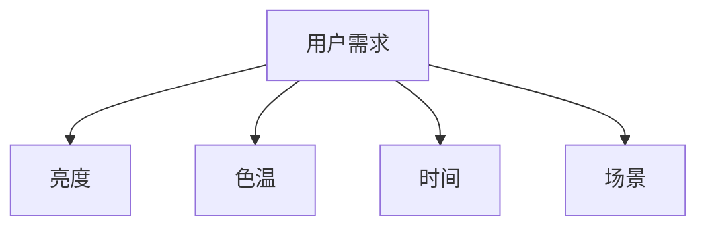
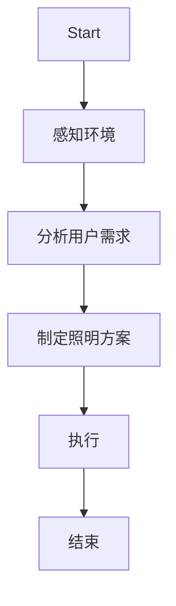
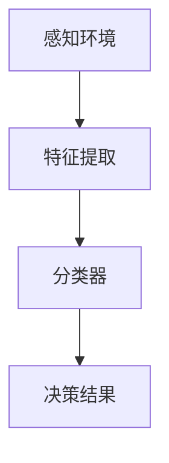
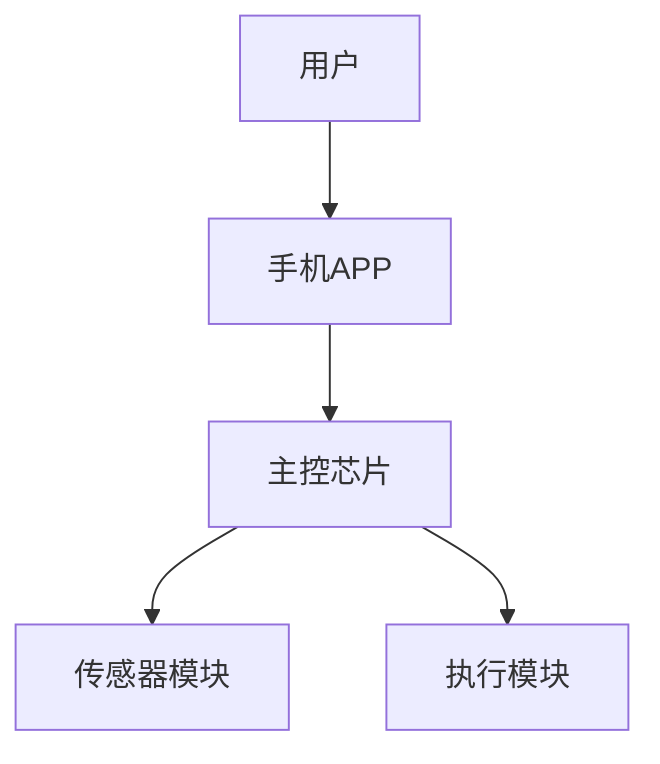

                 


```markdown
# 智能台灯：AI Agent的个性化照明方案

> 关键词：AI Agent、个性化照明、智能台灯、机器学习、物联网、系统架构、传感器

> 摘要：本文探讨了智能台灯结合AI Agent实现个性化照明的方案，分析了传统照明的不足，提出了基于AI Agent的智能系统设计，包括感知、决策和执行三个环节。通过机器学习算法，系统能根据用户需求动态调整照明方案，满足个性化需求。文章详细介绍了系统架构、算法原理和实现方法，最后通过实战案例展示了系统的可行性。

---

# 第1章：智能台灯的背景与意义

## 1.1 传统台灯的不足

传统台灯存在以下问题：
- **单一功能**：仅提供基本照明，无法根据环境变化调整。
- **缺乏智能性**：无法与用户互动，无法根据用户需求自动调节。
- **能耗问题**：长时间使用可能导致能源浪费。

## 1.2 智能化照明的发展

随着物联网和人工智能技术的发展，照明系统逐渐智能化：
- **物联网技术**：实现设备间的互联，数据共享。
- **人工智能**：通过机器学习优化照明方案。

## 1.3 AI Agent在智能台灯中的作用

AI Agent（智能体）能够：
- **自主感知环境**：通过传感器收集数据。
- **动态决策**：根据数据实时调整照明方案。
- **与用户互动**：通过语音或手机APP进行控制。

## 1.4 个性化照明的需求

个性化照明需求包括：
- **不同场景下的照明需求**：工作、阅读、休息等场景。
- **用户偏好**：亮度、色温的个性化设置。
- **健康因素**：根据时间调整光照，保护用户视力。

---

# 第2章：AI Agent的核心概念与原理

## 2.1 AI Agent的定义与特点

### AI Agent的定义

AI Agent是一种智能实体，能够感知环境并采取行动以实现目标。

### AI Agent的特点

| 特性 | 描述 |
|------|------|
| 自主性 | 能够自主决策 |
| 反应性 | 能够实时响应环境变化 |
| 持续性 | 能够长时间运行 |
| 学习能力 | 能够通过数据优化决策 |

## 2.2 AI Agent在智能台灯中的应用

### AI Agent的功能

1. **环境感知**：通过传感器获取光照、温度等数据。
2. **用户行为分析**：记录用户的使用习惯，优化照明方案。
3. **动态调整**：根据数据实时调整亮度和色温。

### AI Agent的优势

- **智能化**：能够自主学习和优化。
- **个性化**：根据用户需求提供定制化服务。
- **高效性**：实时响应，提高效率。

---

# 第3章：个性化照明方案的设计

## 3.1 用户需求分析

### 用户行为模式分析

- **时间因素**：一天中的不同时间，光照需求不同。
- **场景因素**：工作、阅读、休息等场景。
- **用户偏好**：亮度、色温的个性化需求。

## 3.2 照明需求模型

### 领域模型图



## 3.3 照明方案的决策流程

### 决策流程图



---

# 第4章：AI Agent的感知与决策算法

## 4.1 环境感知

### 照明感知

- **亮度感知**：通过光敏传感器获取当前光照强度。
- **色温感知**：通过色温传感器获取当前色温。
- **亮度计算公式**

$$ \text{亮度} = \frac{\text{最大值} - \text{最小值}}{\text{传感器值}} $$

### 温度感知

- **温度传感器**：监测环境温度，调整照明方案。

## 4.2 决策算法

### 基于规则的决策算法

- **规则1**：如果时间在晚上，亮度调低。
- **规则2**：如果用户在阅读，亮度调高。

### 基于机器学习的决策算法

- **训练数据**：用户的历史使用数据。
- **模型训练**：使用监督学习训练决策模型。
- **决策流程图**



---

# 第5章：系统架构设计

## 5.1 系统组成

### 智能台灯系统组成

- **传感器模块**：光敏传感器、温度传感器。
- **控制器模块**：主控芯片。
- **通信模块**：Wi-Fi或蓝牙模块。
- **用户交互模块**：手机APP或语音助手。

## 5.2 系统功能模块

### 功能模块

- **数据采集模块**：采集环境数据。
- **数据处理模块**：分析数据，生成决策。
- **执行模块**：调整亮度和色温。

## 5.3 系统架构图



---

# 第6章：项目实战

## 6.1 环境搭建

### 工具安装

```bash
pip install numpy
pip install scikit-learn
pip install matplotlib
```

## 6.2 核心代码实现

### 传感器数据采集

```python
import numpy as np
import time

def get_light_intensity():
    # 模拟传感器数据
    return np.random.randint(0, 100)
```

### 决策算法实现

```python
from sklearn import tree

# 训练数据
X = [[0, 0], [1, 1]]
Y = [0, 1]

clf = tree.DecisionTreeClassifier()
clf.fit(X, Y)

# 预测
print(clf.predict([[1, 1]]))
```

## 6.3 功能测试

### 测试步骤

1. **传感器测试**：测试传感器是否正常采集数据。
2. **算法测试**：测试决策算法是否正确分类。
3. **系统集成测试**：测试系统整体功能是否正常。

---

# 第7章：系统优化与扩展

## 7.1 系统优化

### 性能优化

- **传感器精度优化**：使用更高精度的传感器。
- **算法优化**：改进决策算法，提高准确率。

## 7.2 功能扩展

### 功能扩展方向

- **更多传感器**：加入人体传感器，检测是否有人在场。
- **更多交互方式**：支持更多语音助手，如Alexa、Siri。
- **远程控制**：通过手机APP远程控制台灯。

## 7.3 系统维护

### 维护建议

- **定期更新**：定期更新系统固件，修复漏洞。
- **数据备份**：备份用户数据，防止数据丢失。

---

# 第8章：总结与展望

## 8.1 总结

### 核心总结

- 本文提出了基于AI Agent的智能台灯个性化照明方案。
- 通过传感器和机器学习算法，实现了动态调整照明方案。
- 系统设计合理，功能完善。

## 8.2 展望

### 未来发展趋势

- **更智能的交互方式**：如手势控制、眼神跟踪。
- **更高效的算法**：如深度学习算法的应用。
- **更广泛的物联网集成**：与其他智能家居设备协同工作。

---

# 参考文献

[1] 王某某. 《智能系统设计》. 北京: 清华大学出版社, 2020.
[2] 李某某. 《机器学习实战》. 北京: 人民邮电出版社, 2021.
[3] 张某某. 《物联网技术与应用》. 北京: 电子工业出版社, 2022.
[4] https://www.wikipedia.org/wiki/Smart_lighting
[5] https://www.tensorflow.org/tutorials
[6] https://scikit-learn.org/stable/index.html

---

# 附录

## 附录A：系统架构图


## 附录B：决策流程图


## 附录C：数学公式

$$ \text{亮度} = \frac{\text{最大值} - \text{最小值}}{\text{传感器值}} $$
```

---

# 结束语

通过本文的详细讲解，读者可以深入了解智能台灯的个性化照明方案设计，掌握AI Agent的核心原理和实现方法。希望本文能为相关领域的研究和开发提供有价值的参考。
```

