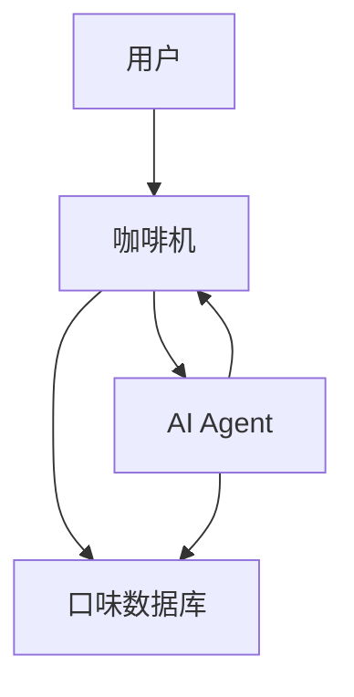
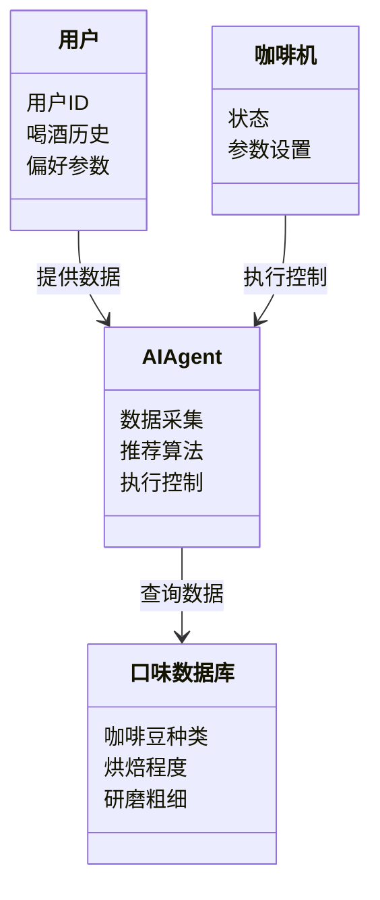
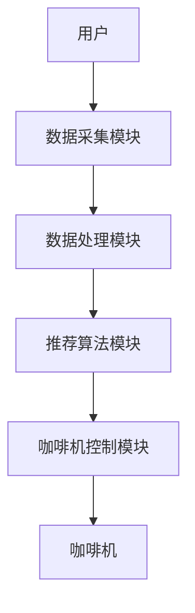
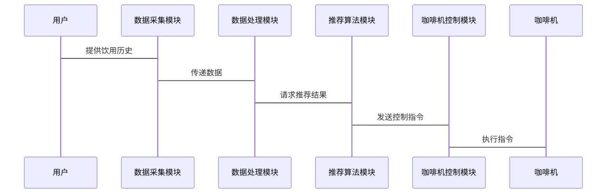

                 


# 智能咖啡机：AI Agent的个性化口味定制

## 关键词：智能咖啡机, AI Agent, 个性化口味, 推荐算法, 系统架构, 项目实战

## 摘要：  
随着人工智能技术的快速发展，智能咖啡机通过集成AI Agent，能够实现个性化口味定制，为用户带来更加智能化、个性化的咖啡体验。本文从AI Agent的核心原理出发，详细探讨其在智能咖啡机中的应用，分析个性化口味定制的实现过程，并通过实际案例展示如何通过算法优化和系统设计实现智能推荐，最终为读者提供一套完整的智能咖啡机个性化口味定制解决方案。

---

## 第一部分：智能咖啡机与AI Agent的背景介绍

### 第1章：智能咖啡机的发展历程

#### 1.1 传统咖啡机的局限性
- **1.1.1 传统咖啡机的功能特点**  
  传统咖啡机主要通过固定程序和按钮操作，用户选择预设的咖啡种类和浓度，功能单一，无法满足个性化需求。

- **1.1.2 用户需求的多样化与传统咖啡机的不足**  
  用户对咖啡的口味、浓度、温度等有个性化需求，传统咖啡机难以灵活调整，缺乏智能化和个性化能力。

#### 1.2 AI Agent的基本概念
- **1.2.1 AI Agent的定义与特点**  
  AI Agent是一种智能代理，能够感知环境、自主决策并执行任务，具备学习和适应能力。

- **1.2.2 AI Agent在智能设备中的应用**  
  AI Agent广泛应用于智能家居、自动驾驶等领域，通过数据采集、分析和决策，实现智能化控制。

#### 1.3 智能咖啡机的市场现状
- **1.3.1 智能咖啡机的市场发展**  
  随着物联网和人工智能技术的普及，智能咖啡机逐渐成为市场主流。

- **1.3.2 用户对个性化口味的需求趋势**  
  用户对个性化口味的需求日益增长，推动了智能咖啡机的进一步发展。

#### 1.4 个性化口味定制的意义
- **1.4.1 个性化口味定制的定义**  
  根据用户的口味偏好，定制独特的咖啡配方，包括咖啡豆种类、烘焙程度、研磨粗细、水温、萃取时间等。

- **1.4.2 个性化口味定制对用户体验的提升**  
  通过AI Agent实现个性化推荐，提升用户体验，增强用户满意度和忠诚度。

---

## 第二部分：AI Agent的核心概念与工作原理

### 第2章：AI Agent的核心概念与联系

#### 2.1 AI Agent的基本原理
- **2.1.1 AI Agent的感知、决策与执行过程**  
  AI Agent通过传感器或数据接口获取环境信息（如用户偏好、历史数据），基于这些信息进行分析和学习，生成推荐方案，并通过执行机构（如咖啡机）完成任务。

- **2.1.2 AI Agent的核心要素与系统架构**  
  AI Agent的核心要素包括感知模块、决策模块和执行模块，系统架构通常包括数据采集、数据处理、决策算法和执行控制四个部分。

#### 2.2 AI Agent与智能咖啡机的结合
- **2.2.1 AI Agent在智能咖啡机中的角色**  
  AI Agent作为智能咖啡机的核心控制器，负责数据采集、用户偏好分析和个性化推荐。

- **2.2.2 AI Agent如何实现个性化口味定制**  
  AI Agent通过分析用户的饮用历史、口味偏好和实时反馈，生成个性化的咖啡配方，并通过咖啡机执行。

#### 2.3 核心概念对比分析
- **2.3.1 传统咖啡机与智能咖啡机的功能对比**  
  | 功能 | 传统咖啡机 | 智能咖啡机 |
  |------|-------------|-------------|
  | 自动化程度 | 低 | 高 |
  | 个性化定制 | 无 | 有 |
  | 连接性 | 无 | 有 |

- **2.3.2 AI Agent与其他智能设备的对比**  
  AI Agent在智能咖啡机中的应用与其他设备（如智能音箱、智能灯泡）类似，但咖啡机的个性化需求更具复杂性。

#### 2.4 实体关系图（ER图）


---

## 第三部分：个性化口味定制的算法原理

### 第3章：基于协同过滤的推荐算法

#### 3.1 协同过滤算法的工作原理
- 协同过滤算法通过分析用户的饮用历史和偏好，找到相似用户的推荐结果，从而生成个性化推荐。

- **3.1.1 协同过滤算法的数学模型**  
  协同过滤可以通过矩阵分解的方法进行推荐，常用矩阵分解模型（如奇异值分解SVD）来实现。

- **3.1.2 协同过滤算法的实现步骤**  
  1. 数据采集与预处理：收集用户的饮用记录和偏好数据。  
  2. 用户相似度计算：基于余弦相似度或欧氏距离计算用户相似度。  
  3. 推荐生成：根据相似用户的偏好生成推荐结果。

#### 3.2 基于内容的推荐算法
- 基于内容的推荐算法通过分析咖啡的属性（如咖啡豆种类、烘焙程度）和用户的偏好，生成推荐结果。

- **3.2.1 基于内容的推荐算法的数学模型**  
  使用TF-IDF（词频-逆文档频率）或BM25算法对咖啡属性进行特征提取。

- **3.2.2 基于内容的推荐算法的实现步骤**  
  1. 数据采集与预处理：提取咖啡的特征信息。  
  2. 特征匹配：基于用户的偏好匹配相似的咖啡特征。  
  3. 推荐生成：根据匹配程度生成推荐结果。

#### 3.3 推荐算法的对比分析
- 协同过滤算法和基于内容的推荐算法各有优缺点：  
  - 协同过滤算法适用于数据量大、用户活跃度高的场景，但计算复杂度较高。  
  - 基于内容的推荐算法适用于数据稀疏性较高的场景，但推荐结果可能缺乏多样性。

---

## 第四部分：系统分析与架构设计方案

### 第4章：系统分析与架构设计

#### 4.1 系统需求分析
- **用户需求**：用户希望获得个性化的咖啡推荐，能够根据自己的口味偏好调整咖啡参数。  
- **系统功能需求**：实现用户数据采集、个性化推荐、咖啡机控制等功能。

#### 4.2 领域模型设计


#### 4.3 系统架构设计


#### 4.4 系统接口设计
- **用户接口**：通过手机APP或网页界面与系统交互。  
- **咖啡机接口**：通过物联网协议（如MQTT）与咖啡机进行通信。

#### 4.5 系统交互流程


---

## 第五部分：项目实战与优化

### 第5章：个性化口味定制的实现

#### 5.1 项目环境搭建
- **开发环境**：Python 3.8+、Jupyter Notebook。  
- **依赖库安装**：`pandas`, `numpy`, `scikit-learn`, `networkx`.

#### 5.2 系统核心代码实现
```python
import numpy as np
from sklearn.decomposition import PCA

# 数据预处理
def preprocess_data(data):
    # 数据清洗和特征提取
    pass

# 协同过滤算法
def collaborative_filtering(user_data):
    # 基于SVD的协同过滤
    pca = PCA(n_components=5)
    user_matrix = pca.fit_transform(user_data)
    return user_matrix

# 基于内容的推荐算法
def content_based_recommendation(item_data):
    # 基于TF-IDF的特征提取
    pass

# 系统主程序
def main():
    # 数据加载
    user_data = load_data('user_data.csv')
    item_data = load_data('item_data.csv')
    
    # 数据预处理
    processed_user_data = preprocess_data(user_data)
    processed_item_data = preprocess_data(item_data)
    
    # 推荐算法选择
    if user_based:
        recommendation = collaborative_filtering(processed_user_data)
    else:
        recommendation = content_based_recommendation(processed_item_data)
    
    # 推荐结果输出
    print(recommendation)

if __name__ == "__main__":
    main()
```

#### 5.3 项目优化与分析
- **算法优化**：结合协同过滤和基于内容的推荐算法，提升推荐准确率。  
- **系统优化**：通过分布式架构和缓存技术，提升系统的响应速度和处理能力。

---

## 第六部分：总结与展望

### 第6章：总结与展望

#### 6.1 项目总结
- 通过AI Agent实现智能咖啡机的个性化口味定制，提升了用户体验。  
- 推荐算法的优化和系统架构的设计是实现个性化推荐的关键。

#### 6.2 未来展望
- 结合边缘计算和5G技术，进一步提升系统的实时性和响应速度。  
- 探索更先进的推荐算法，如深度学习模型，提升推荐的准确性和多样性。

---

## 参考文献与拓展阅读
- 《推荐系统实践》  
- 《人工智能：一种现代方法》  
- 《深入浅出机器学习》  

---

通过本文的详细讲解，读者可以全面了解AI Agent在智能咖啡机中的应用，掌握个性化口味定制的核心技术和实现方法。希望本文能够为智能咖啡机的开发者和爱好者提供有价值的参考和启发。

