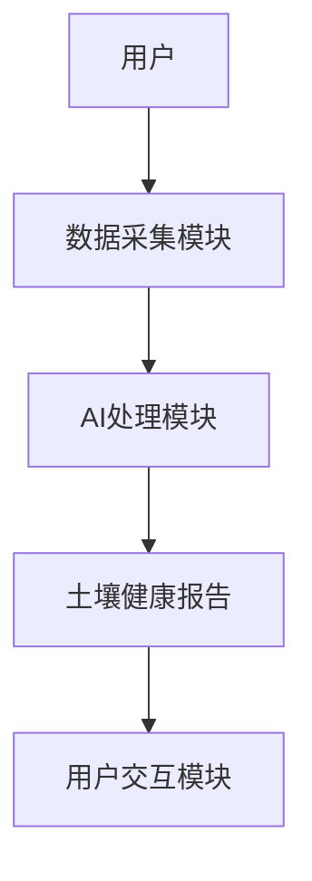

                 


# 智能园艺手套：AI Agent的土壤状况检测

## 关键词：智能园艺手套，AI Agent，土壤检测，机器学习，传感器技术

## 摘要：  
本文介绍了一款创新的智能园艺手套，它利用AI Agent技术实时检测土壤状况，包括pH值、湿度和养分含量等关键指标。通过结合传感器技术和机器学习算法，该手套能够为用户提供精准的土壤健康数据，帮助优化植物生长环境。本文详细阐述了AI Agent的核心原理、算法模型、系统架构以及实际应用案例，为园艺爱好者和农业科技开发者提供了深入的技术解析和实践指导。

---

## 第一部分：智能园艺手套的背景与应用

### 第1章：智能园艺手套的背景与应用

#### 1.1 智能园艺手套的背景

现代园艺正在经历一场技术革命，传统的园艺工具逐渐被智能化设备所取代。智能园艺手套作为一种创新的园艺辅助工具，结合了人工智能（AI）和物联网（IoT）技术，能够实时监测土壤的健康状况。这一技术的应用不仅提高了园艺效率，还为植物的精准种植提供了科学依据。

#### 1.2 土壤检测的重要性

土壤是植物生长的基础，其健康状况直接影响植物的生长发育。传统的土壤检测方法通常依赖实验室分析，耗时长且成本高。通过智能园艺手套，用户可以随时随地获取土壤的实时数据，从而实现精准施肥、浇水和病虫害防治。

---

## 第二部分：AI Agent的核心概念与原理

### 第2章：AI Agent的基本原理

#### 2.1 AI Agent的定义与特点

AI Agent是一种能够感知环境并采取行动以实现目标的智能实体。与传统算法相比，AI Agent具有以下特点：
- **自主性**：能够在没有人工干预的情况下独立运行。
- **反应性**：能够实时感知环境变化并做出响应。
- **目标导向**：通过优化目标函数来实现最佳性能。

#### 2.2 土壤检测的原理

智能园艺手套通过内置的传感器采集土壤数据，这些数据包括：
- **pH值**：反映土壤的酸碱度。
- **湿度**：土壤的含水量。
- **养分含量**：如氮、磷、钾等元素的含量。

这些数据通过AI Agent进行分析，生成土壤健康报告，并为用户提供种植建议。

---

## 第三部分：算法原理与数学模型

### 第3章：土壤检测的算法原理

#### 3.1 数据采集与预处理

**3.1.1 数据采集方法**

传感器采集的数据可能包含噪声，需要进行预处理。以下是数据预处理的步骤：

1. **数据清洗**：去除异常值和缺失值。
2. **特征提取**：提取与土壤健康相关的特征，如平均值、标准差等。

#### 3.2 机器学习模型的训练

**3.2.1 数据集的构建与划分**

- **训练集**：用于模型训练。
- **验证集**：用于模型调优。
- **测试集**：用于模型评估。

**3.2.2 模型选择与训练**

选择合适的机器学习模型，如支持向量机（SVM）或随机森林（Random Forest），并进行训练。

**3.2.3 模型评估与优化**

通过准确率、召回率等指标评估模型性能，并进行优化。

---

## 第四部分：系统架构与设计

### 第4章：智能园艺手套的系统架构

#### 4.1 系统功能设计

智能园艺手套的主要功能模块包括：
- **数据采集模块**：采集土壤数据。
- **AI处理模块**：分析土壤数据并生成报告。
- **用户交互模块**：显示检测结果并提供种植建议。

#### 4.2 系统架构设计

以下是系统的架构图：



---

## 第五部分：项目实战与实现

### 第5章：环境安装与代码实现

#### 5.1 环境搭建

安装必要的库：
```bash
pip install numpy scikit-learn matplotlib
```

#### 5.2 核心代码实现

以下是土壤检测的核心代码：

```python
import numpy as np
from sklearn import datasets
from sklearn.model_selection import train_test_split
from sklearn.svm import SVC

# 数据预处理
def preprocess(data):
    # 删除异常值
    cleaned_data = data[~np.isnan(data)]
    # 标准化
    from sklearn.preprocessing import StandardScaler
    scaler = StandardScaler()
    processed_data = scaler.fit_transform(cleaned_data)
    return processed_data

# 模型训练
def train_model(X, y):
    model = SVC()
    model.fit(X, y)
    return model

# 主函数
def main():
    # 数据加载
    soil_data = datasets.load_boston()  # 示例数据集
    X = soil_data.data
    y = soil_data.target

    # 数据预处理
    processed_X = preprocess(X)

    # 数据划分
    X_train, X_test, y_train, y_test = train_test_split(processed_X, y, test_size=0.2)

    # 模型训练
    model = train_model(X_train, y_train)

    # 模型评估
    accuracy = model.score(X_test, y_test)
    print(f"模型准确率：{accuracy}")

if __name__ == "__main__":
    main()
```

---

## 第六部分：优化与总结

### 第6章：优化与总结

#### 6.1 性能优化

- **算法优化**：尝试不同的机器学习算法，如XGBoost或神经网络。
- **数据优化**：增加数据量，提高模型的泛化能力。

#### 6.2 未来展望

智能园艺手套的应用前景广阔。未来，可以进一步集成更多传感器，如温度和光照传感器，提供更全面的土壤健康监测。

---

通过本文的详细讲解，读者可以深入了解智能园艺手套的工作原理和技术实现。无论是园艺爱好者还是农业科技开发者，都可以从中学到实用的技术知识，并将其应用于实际场景中。

