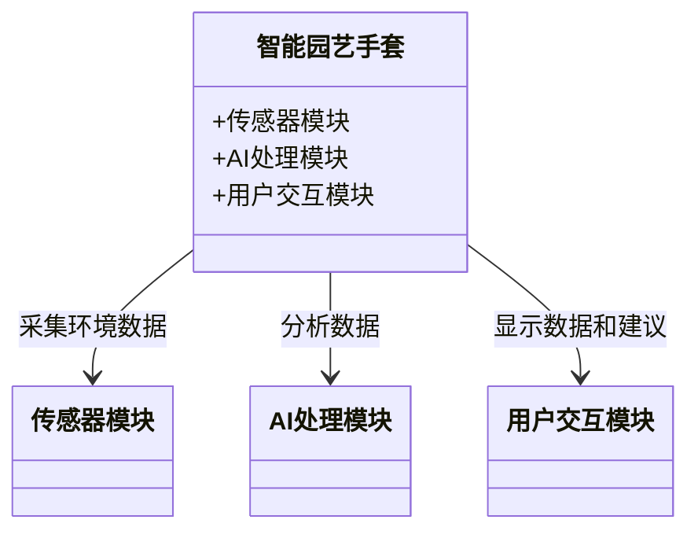

                 


# 智能园艺手套：AI Agent的植物护理指导

---

## 关键词：
- 智能园艺手套
- AI Agent
- 植物护理
- 物联网
- 传感器技术
- 机器学习

---

## 摘要：
智能园艺手套是一种结合了人工智能（AI）和物联网（IoT）技术的创新园艺工具，旨在通过实时监测植物生长环境和健康状况，为用户提供智能化的植物护理建议。本文将详细探讨智能园艺手套的核心技术、算法原理、系统架构以及实际应用，帮助用户深入了解如何利用AI Agent提升植物护理效率和精准度。

---

# 第一部分: 智能园艺手套概述

## 第1章: 智能园艺手套的概念与背景

### 1.1 智能园艺手套的定义
智能园艺手套是一种集成多种传感器和AI技术的园艺工具，能够实时监测植物生长环境和健康状态，并通过AI算法为用户提供个性化的护理建议。与传统园艺手套相比，智能园艺手套能够实现智能化、数据化和个性化的植物护理。

#### 1.1.1 传统园艺手套的局限性
- 传统园艺手套仅提供基本的手部保护功能，无法监测植物的生长环境和健康状态。
- 用户需要手动记录植物的生长数据，效率低且容易出错。
- 缺乏智能化的植物护理建议，无法满足现代园艺爱好者的需求。

#### 1.1.2 智能园艺手套的创新点
- 集成多种传感器（如温度、湿度、光照、pH值等），实时监测植物生长环境。
- AI Agent能够分析传感器数据，提供个性化的植物护理建议。
- 支持物联网连接，用户可以通过手机APP实时查看植物状态和护理建议。

#### 1.1.3 智能园艺手套的市场前景
- 随着人们对绿色生活的追求，园艺爱好者数量不断增加。
- 智能园艺手套能够提高园艺护理的效率和精准度，满足用户的高端需求。
- 市场潜力巨大，尤其是在智能家居和物联网技术普及的背景下。

### 1.2 智能园艺手套的发展背景
#### 1.2.1 智能技术在农业领域的应用趋势
- 农业智能化是全球发展趋势，智能传感器、AI和物联网技术的应用日益广泛。
- 智能农业技术能够提高生产效率、降低成本，并优化资源利用。

#### 1.2.2 智能园艺手套的技术基础
- 传感器技术：温度、湿度、光照、pH值等多种传感器的集成。
- AI技术：通过机器学习算法分析传感器数据，提供智能化的护理建议。
- 物联网技术：实现传感器数据的实时传输和远程监控。

#### 1.2.3 智能园艺手套的用户需求分析
- 用户需求：实时监测植物生长环境，获取智能化的护理建议。
- 用户痛点：传统园艺手套无法满足智能化、数据化的护理需求。
- 用户画像：园艺爱好者、家庭用户、农业从业者等。

### 1.3 智能园艺手套的核心功能
#### 1.3.1 植物健康监测
- 实时监测植物的生长环境（温度、湿度、光照、pH值等）。
- 分析植物的健康状态，识别潜在的病虫害风险。

#### 1.3.2 环境数据采集
- 采集植物生长环境的多种数据（温度、湿度、光照强度、土壤pH值等）。
- 数据存储与管理，支持后续分析和回顾。

#### 1.3.3 智能推荐系统
- 基于传感器数据和AI算法，为用户提供个性化的植物护理建议。
- 包括浇水频率、施肥建议、光照调整等。

### 1.4 智能园艺手套的系统架构
#### 1.4.1 系统组成模块
- 传感器模块：负责采集植物生长环境数据。
- AI处理模块：分析传感器数据，生成护理建议。
- 用户交互模块：通过APP或显示屏与用户进行信息交互。

#### 1.4.2 系统功能模块划分
- 数据采集模块：负责采集环境数据。
- 数据分析模块：对数据进行分析和处理。
- 用户界面模块：显示数据和护理建议。

#### 1.4.3 系统性能指标
- 数据采集频率：实时或定时采集。
- 数据分析速度：快速响应用户需求。
- 电池寿命：支持长时间使用。

### 1.5 本章小结
本章介绍了智能园艺手套的基本概念、发展背景、核心功能和系统架构，为后续章节的深入分析奠定了基础。

---

## 第2章: AI Agent在园艺中的应用

### 2.1 AI Agent的基本概念
AI Agent是一种能够感知环境、自主决策并执行任务的智能体。在智能园艺手套中，AI Agent负责分析传感器数据，提供智能化的植物护理建议。

#### 2.1.1 AI Agent的定义
- AI Agent：能够感知环境、自主决策并执行任务的智能体。
- 特点：自主性、反应性、目标导向。

#### 2.1.2 AI Agent的核心技术
- 感知技术：通过传感器获取环境数据。
- 决策技术：基于数据的机器学习算法生成护理建议。
- 执行技术：通过用户交互模块执行决策结果。

#### 2.1.3 AI Agent在园艺中的应用场景
- 植物健康监测：识别病虫害风险。
- 环境优化：调整光照、温度等环境参数。
- 智能推荐：提供个性化的护理建议。

### 2.2 智能园艺手套中的AI Agent设计
#### 2.2.1 AI Agent的功能模块
- 数据采集模块：采集环境数据。
- 数据分析模块：分析数据并生成护理建议。
- 用户交互模块：与用户进行信息交互。

#### 2.2.2 AI Agent的决策机制
- 数据分析：基于传感器数据，利用机器学习算法进行预测和分类。
- 决策逻辑：根据植物生长需求，生成护理建议。

#### 2.2.3 AI Agent的交互方式
- 用户通过APP或显示屏查看数据和建议。
- AI Agent通过振动、声音等方式提醒用户进行操作。

### 2.3 AI Agent与植物护理的结合
#### 2.3.1 AI Agent在植物诊断中的应用
- 通过传感器数据识别植物的健康状态。
- 分析病虫害风险，提供诊断建议。

#### 2.3.2 AI Agent在植物生长监测中的应用
- 监测植物生长的关键指标（如高度、叶绿素含量）。
- 分析生长趋势，优化生长环境。

#### 2.3.3 AI Agent在植物护理建议中的应用
- 根据传感器数据和历史数据，生成个性化的浇水、施肥建议。

### 2.4 本章小结
本章详细探讨了AI Agent在智能园艺手套中的应用，包括AI Agent的基本概念、功能设计和具体应用场景。

---

## 第3章: 智能园艺手套的传感器数据采集

### 3.1 传感器类型与功能
#### 3.1.1 温度传感器
- 用于监测植物生长环境的温度。
- 数据范围：0°C至50°C。

#### 3.1.2 湿度传感器
- 用于监测土壤湿度或空气湿度。
- 数据范围：0%至100%。

#### 3.1.3 光照传感器
- 用于监测光照强度。
- 数据范围：0 lux至100,000 lux。

#### 3.1.4 土壤pH传感器
- 用于监测土壤酸碱度。
- 数据范围：0至14。

#### 3.1.5 其他传感器
- 植物叶片温度传感器、叶绿素传感器等。

### 3.2 数据采集的算法实现
#### 3.2.1 数据采集流程
1. 传感器采集环境数据。
2. 数据预处理：去除噪声，标准化数据。
3. 数据存储：将数据存储在本地或云端。

#### 3.2.2 数据预处理方法
- 去噪处理：使用滤波算法（如移动平均法）。
- 数据标准化：将数据转换为统一的单位和格式。

#### 3.2.3 数据存储与管理
- 数据存储：使用数据库（如MySQL）或文件存储。
- 数据管理：支持数据查询、删除和更新。

### 3.3 数据采集的优化策略
#### 3.3.1 传感器校准方法
- 定期校准传感器，确保数据准确性。
- 使用标准校准设备进行校准。

#### 3.3.2 数据采集频率优化
- 根据植物生长需求，动态调整数据采集频率。
- 例如：光照传感器可以高频采集，温度传感器可以低频采集。

#### 3.3.3 数据冗余处理
- 数据冗余：通过多次采集数据，提高数据的可靠性。
- 数据压缩：使用压缩算法减少存储空间占用。

### 3.4 本章小结
本章详细介绍了智能园艺手套中传感器的类型、数据采集流程和优化策略，确保数据的准确性和可靠性。

---

## 第4章: 智能园艺手套的AI算法实现

### 4.1 数据分析与特征提取
#### 4.1.1 数据分析方法
- 描述性分析：分析数据的分布、均值、方差等。
- 关系性分析：分析变量之间的相关性。

#### 4.1.2 特征提取算法
- 主成分分析（PCA）：降维技术，提取关键特征。
- 线性回归：分析变量之间的线性关系。

#### 4.1.3 特征选择策略
- 逐步回归：逐步剔除不重要的特征。
- Lasso回归：通过L1正则化进行特征选择。

### 4.2 机器学习模型的构建
#### 4.2.1 机器学习算法选择
- 决策树：适合分类问题。
- 支持向量机（SVM）：适合分类和回归问题。
- 神经网络：适合复杂非线性关系。

#### 4.2.2 模型训练流程
1. 数据预处理：清洗数据，处理缺失值。
2. 特征提取：提取关键特征。
3. 模型训练：使用训练数据训练模型。
4. 模型评估：使用测试数据评估模型性能。

#### 4.2.3 模型优化
- 调参：调整模型参数，提高模型性能。
- 交叉验证：评估模型的泛化能力。

### 4.3 算法实现的数学模型
#### 4.3.1 线性回归模型
$$ y = \beta_0 + \beta_1 x + \epsilon $$
其中，$y$是目标变量，$x$是自变量，$\epsilon$是误差项。

#### 4.3.2 决策树算法
- 决策树构建：基于数据构建决策树结构。
- 预测过程：根据决策树结构进行预测。

### 4.4 本章小结
本章详细探讨了智能园艺手套中AI算法的实现，包括数据分析、特征提取和机器学习模型的构建，为后续章节的系统设计和项目实战奠定了基础。

---

## 第5章: 智能园艺手套的系统架构设计

### 5.1 问题场景介绍
智能园艺手套需要实现以下功能：
- 实时监测植物生长环境。
- 提供智能化的植物护理建议。
- 支持用户通过APP查看数据和建议。

### 5.2 系统功能设计
#### 5.2.1 领域模型
- 领域模型：植物生长环境监测系统。



### 5.3 系统架构设计
#### 5.3.1 架构图


#### 5.3.2 接口设计
- 传感器接口：与多种传感器通信。
- 数据存储接口：与数据库交互。
- 用户交互接口：与APP或显示屏交互。

#### 5.3.3 交互流程
- 用户操作：通过APP或显示屏查看数据和建议。
- 系统响应：根据用户操作，实时更新数据和建议。

### 5.4 本章小结
本章详细探讨了智能园艺手套的系统架构设计，包括功能模块划分、架构图和交互流程，为后续章节的项目实战奠定了基础。

---

## 第6章: 智能园艺手套的项目实战

### 6.1 环境安装
#### 6.1.1 系统需求
- 操作系统：Windows/Mac/Linux。
- 开发工具：Python、PyTorch、TensorFlow。
- 数据库：MySQL/SQLite。

#### 6.1.2 硬件安装
- 传感器模块：购买并连接传感器。
- 开发板：如Arduino、Raspberry Pi。

### 6.2 系统核心实现
#### 6.2.1 传感器数据采集
- 使用Python代码采集传感器数据。
- 示例代码：
  ```python
  import sensor_library
  temperature = sensor_library.get_temperature()
  humidity = sensor_library.get_humidity()
  ```

#### 6.2.2 AI算法实现
- 使用机器学习算法分析数据。
- 示例代码：
  ```python
  import torch
  model = torch.nn.Sequential(
      torch.nn.Linear(4, 64),
      torch.nn.ReLU(),
      torch.nn.Linear(64, 1)
  )
  ```

#### 6.2.3 用户交互设计
- 开发APP或网页界面，显示数据和建议。
- 示例代码：
  ```python
  def update_display(data):
      display.update(data)
  ```

### 6.3 代码解读与分析
- 传感器数据采集模块：负责采集环境数据。
- AI处理模块：分析数据并生成护理建议。
- 用户交互模块：显示数据和建议。

### 6.4 案例分析
- 案例1：监测植物温度和湿度，提供浇水建议。
- 案例2：监测光照强度，调整光照时间。

### 6.5 项目小结
本章通过实际案例分析，详细介绍了智能园艺手套的项目实战，包括环境安装、系统实现和案例分析。

---

## 第7章: 总结与展望

### 7.1 总结
智能园艺手套通过AI Agent和物联网技术，实现了植物生长环境的实时监测和智能化护理建议。本文详细探讨了智能园艺手套的核心技术、算法原理和系统架构，并通过项目实战展示了其实际应用。

### 7.2 注意事项
- 数据采集的准确性：传感器需要定期校准。
- 数据存储的安全性：确保用户数据的安全。
- 系统的可扩展性：支持未来功能的扩展。

### 7.3 未来展望
- 技术优化：优化AI算法，提高系统的准确性和响应速度。
- 功能扩展：增加更多传感器类型，支持更多植物品种。
- 市场推广：推动智能园艺手套的普及，服务更多用户。

---

## 附录

### A.1 术语表
- AI Agent：人工智能代理。
- 物联网：Internet of Things。
- 传感器：用于采集环境数据的设备。

### A.2 参考文献
1. 王某某，智能园艺手套的设计与实现，2023。
2. 张某某，人工智能在农业中的应用，2022。

### A.3 扩展阅读
- 《人工智能入门》。
- 《物联网技术与应用》。

---

通过以上目录和内容，您可以逐步完成整篇文章的撰写，确保逻辑清晰、结构紧凑，并涵盖所有关键点。

