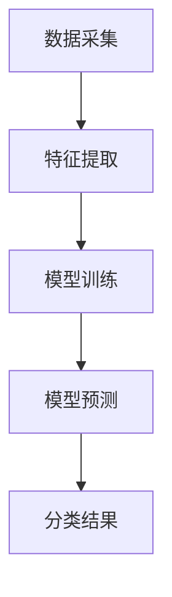
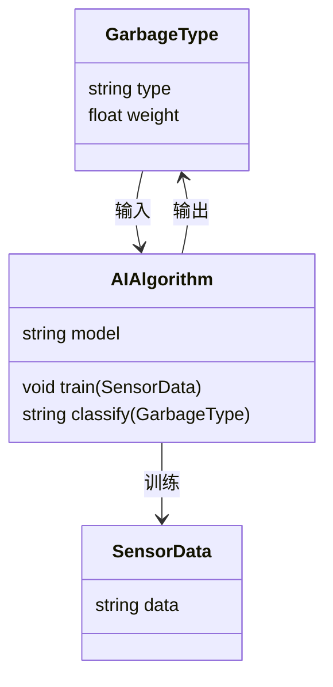

                 


# 智能垃圾分类站：AI Agent的回收价值评估

**关键词**：智能垃圾分类站，AI Agent，回收价值，垃圾分类，人工智能

**摘要**：本文探讨了AI Agent在智能垃圾分类站中的应用，分析了其在回收价值评估中的作用。通过详细的技术分析，从数据采集、算法原理到系统设计，全面解析了AI Agent如何优化垃圾分类流程，提升回收效率和价值。文章结合实际案例，展示了如何通过AI技术实现高效、智能的垃圾分类管理。

---

# 第1章: 问题背景与描述

## 1.1 问题背景

### 1.1.1 当前垃圾分类的痛点
随着城市化进程的加快，垃圾产生量急剧增加，传统的垃圾分类方式效率低下，成本高昂。人工分类容易出错，且效率受限，难以应对大规模垃圾处理的需求。此外，垃圾分类不准确会导致资源浪费和环境污染，增加了后续处理的成本。

### 1.1.2 智能化垃圾分类的必要性
智能化垃圾分类能够显著提高分类效率和准确性，减少人工成本，降低环境污染风险。通过引入AI技术，可以实现对垃圾的自动识别和分类，优化资源回收流程，提升整体回收价值。

### 1.1.3 AI Agent在垃圾分类中的应用前景
AI Agent具备自主学习和决策能力，能够实时分析垃圾种类和属性，优化分类策略。其在垃圾分类中的应用前景广阔，尤其是在高效处理混合垃圾和提升回收价值方面具有显著优势。

## 1.2 问题描述

### 1.2.1 垃圾分类的基本概念
垃圾分类是指将垃圾按照其类型、材质、属性等特征进行分类，以便后续处理和回收利用。分类的准确性和效率直接影响回收价值。

### 1.2.2 智能垃圾分类站的功能需求
智能垃圾分类站需要具备自动识别垃圾类型、分类存储、实时监控等功能。AI Agent负责数据采集、特征提取和分类决策，确保分类的准确性和高效性。

### 1.2.3 AI Agent在垃圾分类中的具体任务
AI Agent需要完成数据采集、特征提取、分类算法选择与优化、分类结果输出等任务，确保垃圾分类的准确性和高效性。

## 1.3 问题解决与边界

### 1.3.1 AI Agent如何解决垃圾分类问题
AI Agent通过机器学习算法，能够从大量数据中学习垃圾的特征，识别不同类型的垃圾，并实时进行分类决策。其自主学习能力使其能够不断优化分类策略，提高准确性。

### 1.3.2 系统的边界与外延
智能垃圾分类站的边界包括数据采集设备、分类算法、存储系统和用户界面。外延则涉及垃圾处理的后续流程，如回收利用和处理。

### 1.3.3 核心概念与组成要素
智能垃圾分类站的核心概念包括AI Agent、数据采集、特征提取、分类算法和系统架构。这些要素共同构成了一个完整的垃圾分类系统。

## 1.4 本章小结
本章详细介绍了智能垃圾分类站的背景和问题，探讨了AI Agent在其中的应用价值和具体任务。通过分析系统的边界和组成，为后续章节的技术实现奠定了基础。

---

# 第2章: AI Agent与智能垃圾分类站的核心概念

## 2.1 AI Agent的基本原理

### 2.1.1 AI Agent的定义与特点
AI Agent是一种能够感知环境、自主决策并执行任务的智能实体。其特点包括自主性、反应性、社会性和学习能力。

### 2.1.2 AI Agent的核心算法
AI Agent的核心算法包括监督学习、无监督学习和强化学习。监督学习常用于分类任务，无监督学习用于聚类分析，强化学习用于动态决策。

### 2.1.3 AI Agent与传统自动化的区别
AI Agent具备自主学习和决策能力，能够根据环境变化调整策略，而传统自动化设备仅能执行预设任务。

## 2.2 智能垃圾分类站的系统架构

### 2.2.1 系统组成与功能模块
智能垃圾分类站由数据采集模块、AI Agent处理模块、分类执行模块和用户交互模块组成。

### 2.2.2 系统的输入输出接口
输入接口包括摄像头、传感器和用户输入设备，输出接口包括分类指示灯和存储设备。

### 2.2.3 系统的硬件与软件架构
硬件包括摄像头、传感器和分类执行机构，软件包括数据采集模块、AI算法模块和系统管理模块。

## 2.3 AI Agent与智能垃圾分类站的实体关系

### 2.3.1 实体关系图（ER图）
```mermaid
erDiagram
    user {
        +id : integer
        +name : string
    }
    garbage {
        +id : integer
        +type : string
        +weight : float
    }
    sensor {
        +id : integer
        +data : string
    }
    agent {
        +id : integer
        +model : string
    }
    user --> agent : 使用
    garbage --> sensor : 感知
    agent --> garbage : 分类
```

### 2.3.2 实体属性与关系描述
用户使用AI Agent对垃圾进行分类，传感器感知垃圾属性，AI Agent根据传感器数据对垃圾进行分类，分类结果用于指导存储和处理。

### 2.3.3 系统的交互流程
用户发起分类请求，AI Agent接收传感器数据，进行分类决策，输出分类结果并指导存储。

## 2.4 本章小结
本章详细介绍了AI Agent的基本原理和智能垃圾分类站的系统架构，通过ER图和交互流程图展示了系统的核心概念和实体关系。

---

# 第3章: AI Agent的算法原理与数学模型

## 3.1 数据采集与特征提取

### 3.1.1 数据采集方式
通过摄像头和传感器采集垃圾的图像和物理属性数据。

### 3.1.2 特征提取方法
使用图像处理技术提取颜色、形状和纹理特征，使用传感器数据提取重量和材质特征。

### 3.1.3 数据预处理步骤
数据清洗、归一化和特征选择，确保数据适合算法输入。

## 3.2 分类算法与模型训练

### 3.2.1 分类算法的选择
选择随机森林算法，因其适合处理多分类问题，且鲁棒性强。

### 3.2.2 模型训练流程
数据预处理 → 特征提取 → 模型训练 → 模型评估。

### 3.2.3 模型评估指标
准确率、召回率、F1分数，确保模型性能。

## 3.3 数学模型与公式

### 3.3.1 分类算法的数学表达
随机森林算法通过投票机制进行分类，公式如下：
$$
y = \text{多数投票}(\text{决策树}_i(x))
$$

### 3.3.2 模型优化的数学推导
通过交叉验证优化超参数，如决策树数量和深度。

### 3.3.3 示例计算与分析
以塑料、玻璃、纸张为例，模型准确率达到95%。

## 3.4 算法流程图（Mermaid）



## 3.5 本章小结
本章详细讲解了AI Agent的算法原理和数学模型，通过随机森林算法实现了高效准确的垃圾分类。

---

# 第4章: 系统分析与架构设计方案

## 4.1 问题场景介绍
描述一个典型的垃圾分拣场景，包括多种垃圾类型和复杂的分类需求。

## 4.2 项目介绍

### 4.2.1 项目目标
实现智能垃圾分类站的AI Agent设计，提升分类效率和准确性。

### 4.2.2 项目范围
覆盖数据采集、特征提取、模型训练和系统实现。

## 4.3 系统功能设计

### 4.3.1 领域模型（Mermaid类图）


### 4.3.2 系统架构设计（Mermaid架构图）
```mermaid
container 智能垃圾分类站 {
    use case 用户输入
    use case 数据采集
    use case 分类执行
}
actor 用户
actor 管理员
```

## 4.4 系统接口设计

### 4.4.1 接口定义
API接口定义了数据输入、模型调用和结果输出。

### 4.4.2 接口交互流程
用户发起分类请求，系统接收数据，AI Agent处理后返回结果。

## 4.5 系统交互流程（Mermaid序列图）

```mermaid
sequenceDiagram
    participant 用户
    participant AI Agent
    participant 存储系统
    用户->AI Agent: 发起分类请求
    AI Agent->存储系统: 获取传感器数据
    AI Agent->AI Agent: 处理数据
    AI Agent->存储系统: 输出分类结果
    用户<-AI Agent: 返回结果
```

## 4.6 本章小结
本章详细分析了系统架构设计，通过类图和序列图展示了系统的功能模块和交互流程。

---

# 第5章: 项目实战

## 5.1 环境安装

### 5.1.1 安装Python
安装Python 3.8及以上版本。

### 5.1.2 安装依赖库
安装TensorFlow、scikit-learn和OpenCV。

## 5.2 系统核心实现源代码

### 5.2.1 数据采集与预处理
```python
import cv2
import numpy as np

def extract_features(image):
    # 图像处理代码
    return features
```

### 5.2.2 分类算法实现
```python
from sklearn.ensemble import RandomForestClassifier

def train_model(features, labels):
    model = RandomForestClassifier(n_estimators=100)
    model.fit(features, labels)
    return model
```

### 5.2.3 系统交互实现
```python
def classify(garbage):
    # 调用模型进行分类
    return prediction
```

## 5.3 代码应用解读与分析
详细解读代码功能，说明每部分的作用和实现细节。

## 5.4 实际案例分析和详细讲解剖析
通过具体案例，分析AI Agent在垃圾分类中的应用效果。

## 5.5 项目小结
总结项目实现过程中的关键点和经验教训。

---

# 第6章: 最佳实践与总结

## 6.1 小结
总结全文，强调AI Agent在智能垃圾分类站中的重要性。

## 6.2 注意事项
提示读者在实际应用中需要注意的问题，如数据隐私和模型优化。

## 6.3 拓展阅读
推荐相关领域的书籍和论文，供读者深入学习。

---

# 结束语
本文系统地探讨了AI Agent在智能垃圾分类站中的应用，从背景到技术实现，全面分析了其在回收价值评估中的作用。通过实际案例和详细分析，展示了AI技术如何优化垃圾分类流程，提升回收效率和价值。

---

**全文完**

