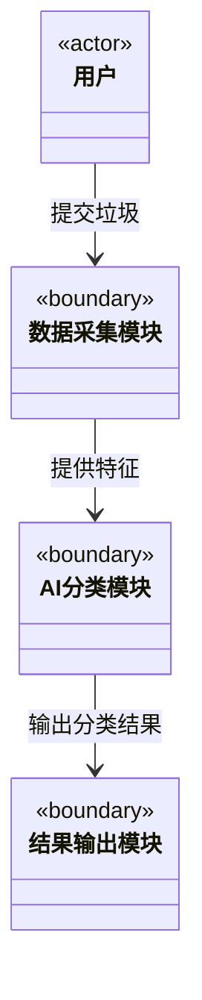
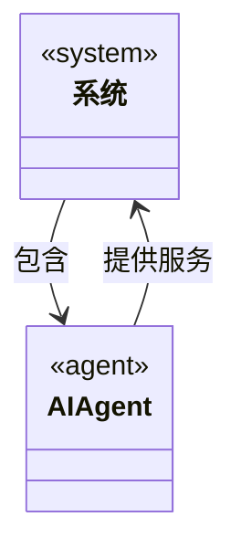
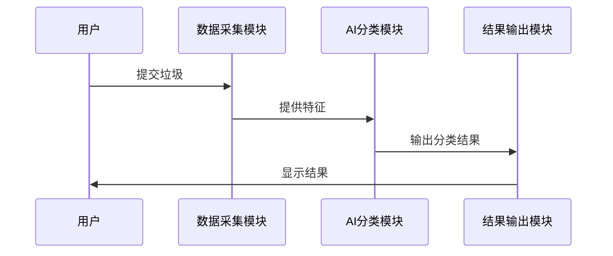

                 


```markdown
# 智能垃圾分类系统：AI Agent的环保教育助手

## 关键词：智能垃圾分类，AI Agent，环保教育，机器学习，系统设计，项目实战

## 摘要：本文详细介绍了智能垃圾分类系统的设计与实现，探讨了AI Agent在垃圾分类中的应用，结合环保教育的需求，分析了系统的架构设计、算法原理及项目实战，旨在为读者提供一个全面的解决方案。

---

# 第1章: 智能垃圾分类系统背景与必要性

## 1.1 垃圾分类的背景与现状
### 1.1.1 垃圾分类的重要性
- 当前全球垃圾处理的现状
- 垃圾分类对环境保护的意义
- 中国垃圾分类政策的实施进展

### 1.1.2 垃圾分类的痛点
- 传统垃圾分类的效率低下
- 人工分类的高成本与低准确性
- 垃圾分类知识普及不足的问题

## 1.2 AI Agent在垃圾分类中的应用
### 1.2.1 AI Agent的基本概念
- 人工智能代理的定义与分类
- AI Agent的核心功能与特点

### 1.2.2 AI Agent在垃圾分类中的作用
- 自动化分类的优势
- AI Agent如何提高分类准确率
- AI Agent在教育中的辅助作用

## 1.3 智能垃圾分类系统的必要性
### 1.3.1 提高分类效率
- AI Agent如何优化分类流程
- 自动化系统的成本优势

### 1.3.2 促进环保教育
- 系统如何辅助用户学习垃圾分类知识
- AI Agent在环保宣传中的作用

### 1.3.3 智能垃圾分类系统的整体框架
- 系统的组成部分与功能模块
- 系统设计的边界与外延

---

# 第2章: AI Agent与智能垃圾分类系统的核心概念

## 2.1 AI Agent的基本原理
### 2.1.1 AI Agent的核心属性
- 感知能力
- 决策能力
- 执行能力
- 学习能力

### 2.1.2 AI Agent的功能特征对比表
| 功能特性 | 传统分类系统 | AI Agent分类系统 |
|----------|--------------|------------------|
| 分类速度 | 较慢          | 快               |
| 准确率   | 低           | 高               |
| 成本     | 高           | 低               |

### 2.1.3 AI Agent的ER实体关系图
```mermaid
er
actor: 用户
agent: AI分类代理
class: 垃圾分类结果
rule: 分类规则
```

## 2.2 智能垃圾分类系统的设计概念
### 2.2.1 系统的基本组成
- 数据采集模块
- AI分类模块
- 结果输出模块
- 用户交互模块

### 2.2.2 系统的功能模型


## 2.3 AI Agent与垃圾分类系统的关联
### 2.3.1 AI Agent的角色定位
- 数据接收与处理
- 分类决策
- 结果反馈

### 2.3.2 系统设计的概念结构


---

# 第3章: 智能垃圾分类系统的算法原理

## 3.1 垃圾分类算法的核心原理
### 3.1.1 垃圾分类的主要算法
- 支持向量机（SVM）
- K近邻算法（KNN）
- 决策树（CART）

### 3.1.2 算法选择的依据
- 数据特征的维度
- 分类的准确率要求
- 计算资源的限制

## 3.2 支持向量机（SVM）的实现原理
### 3.2.1 SVM的基本原理


### 3.2.2 SVM的数学模型
$$ \text{目标函数} \quad \frac{1}{2}\|w\|^2 $$
$$ \text{约束条件} \quad y_i(w \cdot x_i + b) \geq 1 $$
$$ \text{拉格朗日乘子法} \quad L = \frac{1}{2}\|w\|^2 + \sum \alpha_i (1 - y_i(w \cdot x_i + b)) $$

### 3.2.3 SVM算法的Python实现
```python
from sklearn import svm
# 初始化模型
model = svm.SVC(kernel='rbf', gamma='auto')
# 训练模型
model.fit(X_train, y_train)
# 预测
y_pred = model.predict(X_test)
```

## 3.3 垃圾分类算法的优化与调优
### 3.3.1 参数调整
- 核函数的选择
- gamma参数的调节
- C参数的优化

### 3.3.2 算法性能评估
- 准确率、召回率、F1值
- ROC曲线与AUC值

---

# 第4章: 智能垃圾分类系统的架构设计

## 4.1 系统架构的整体设计
### 4.1.1 系统的功能模块划分
- 数据采集模块
- 分类处理模块
- 用户交互模块
- 系统管理模块

### 4.1.2 系统架构的分层设计


## 4.2 系统接口与交互设计
### 4.2.1 数据接口设计
- 数据输入接口
- 数据输出接口
- 数据存储接口

### 4.2.2 用户交互流程


---

# 第5章: 智能垃圾分类系统的项目实战

## 5.1 项目环境的安装与配置
### 5.1.1 环境搭建
- Python版本要求
- 第三方库的安装（如scikit-learn、TensorFlow）

### 5.1.2 数据集的准备
- 数据获取与预处理
- 数据集的划分（训练集、测试集）

## 5.2 系统核心功能的实现
### 5.2.1 数据采集模块的实现
```python
import cv2
def capture_image():
    cap = cv2.VideoCapture(0)
    ret, frame = cap.read()
    if ret:
        cv2.imwrite("input.jpg", frame)
    cap.release()
```

### 5.2.2 AI分类模块的实现
```python
from sklearn import svm
def classify_image():
    # 加载模型
    model = svm.SVC(kernel='rbf', gamma='auto')
    model.fit(X_train, y_train)
    # 分类
    prediction = model.predict([image_features])
    return prediction
```

## 5.3 系统功能的测试与优化
### 5.3.1 功能测试
- 单元测试
- 集成测试

### 5.3.2 性能优化
- 算法优化
- 系统调优

## 5.4 项目实战案例分析
### 5.4.1 实际场景分析
- 典型案例的分析与解决

### 5.4.2 系统运行结果解读
- 分类准确率的分析
- 系统性能的评估

---

# 第6章: 智能垃圾分类系统的最佳实践

## 6.1 项目小结
### 6.1.1 项目成果总结
- 系统实现的功能
- 达到的效果

### 6.1.2 经验与教训
- 开发中的问题与解决方案
- 系统设计中的注意事项

## 6.2 项目注意事项
### 6.2.1 系统维护
- 系统更新与维护
- 数据更新策略

### 6.2.2 环保教育的持续性
- 如何持续提供环保教育
- 系统的用户教育功能设计

## 6.3 项目拓展与延伸
### 6.3.1 系统功能的扩展
- 新功能的开发
- 系统的模块化扩展

### 6.3.2 技术的前沿探索
- 最新AI技术的应用
- 新算法的研究与应用

---

# 总结

智能垃圾分类系统的开发与应用，不仅提高了垃圾分类的效率，还为环保教育提供了新的途径。通过AI Agent的应用，系统实现了高效、准确的垃圾分类，同时帮助用户学习环保知识。未来，随着AI技术的不断发展，智能垃圾分类系统将更加智能化、人性化，为环境保护事业做出更大的贡献。
```

