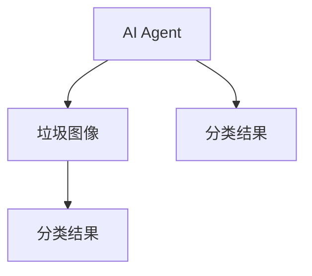
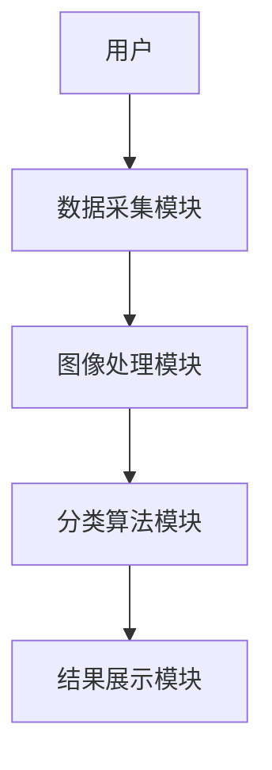
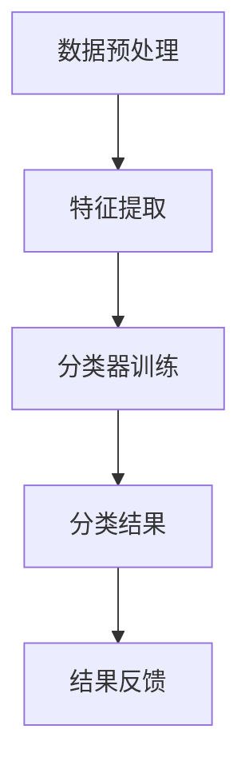
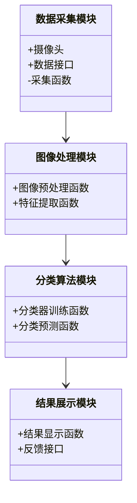

                 


```markdown
# 智能垃圾分类：AI Agent的识别系统

> 关键词：智能垃圾分类，AI Agent，图像识别，机器学习，深度学习

> 摘要：本文详细探讨了基于AI Agent的智能垃圾分类系统，从问题背景、核心概念到算法原理、系统架构，再到项目实战和总结，全面解析了该系统的实现过程和应用价值。

---

## 第1章: 问题背景与描述

### 1.1 问题背景

#### 1.1.1 垃圾分类的重要性
随着城市化进程的加快，垃圾产生量急剧增加，垃圾分类成为解决环境污染和资源利用的重要手段。智能垃圾分类通过AI技术实现高效、准确的分类，有助于提高资源利用率和环境保护效果。

#### 1.1.2 传统垃圾分类的挑战
传统垃圾分类依赖人工操作，存在效率低、误差大、成本高等问题。人工分类容易受到疲劳、注意力等因素的影响，导致分类准确率不稳定。

#### 1.1.3 AI Agent在垃圾分类中的应用优势
AI Agent能够通过图像识别和机器学习技术，快速、准确地识别垃圾种类，减少人工干预，提高分类效率和准确性。

### 1.2 问题描述

#### 1.2.1 智能垃圾分类的定义
智能垃圾分类是指利用AI技术，通过图像识别和分类算法，自动识别垃圾种类并进行分类的过程。

#### 1.2.2 系统目标与功能
- **目标**：实现对垃圾的自动识别和分类。
- **功能**：
  - 数据采集：通过摄像头或传感器获取垃圾图像。
  - 图像处理：对图像进行预处理和特征提取。
  - 分类算法：利用机器学习模型对垃圾进行分类。
  - 结果展示：将分类结果反馈给用户或相关设备。

#### 1.2.3 系统边界与外延
系统边界包括数据采集模块、图像处理模块、分类算法模块和结果展示模块。外延部分涉及数据存储、系统管理、用户界面设计等。

---

## 第2章: 核心概念与联系

### 2.1 AI Agent的基本原理

#### 2.1.1 AI Agent的定义
AI Agent是一种智能体，能够感知环境、做出决策并执行动作。在垃圾分类中，AI Agent通过感知垃圾图像，做出分类决策，并执行分类动作。

#### 2.1.2 AI Agent的核心要素
- **感知**：通过摄像头获取垃圾图像。
- **决策**：利用机器学习模型进行分类。
- **执行**：将分类结果传递给后续系统或设备。

#### 2.1.3 AI Agent与智能垃圾分类的结合
AI Agent在垃圾分类中的应用，实现了从图像采集到分类结果输出的全自动化过程。

### 2.2 实体关系图



---

## 第3章: 系统核心概念与联系

### 3.1 系统核心要素

#### 3.1.1 数据采集模块
- **功能**：通过摄像头采集垃圾图像。
- **输入**：垃圾图像。
- **输出**：结构化数据。

#### 3.1.2 图像处理模块
- **功能**：对图像进行预处理和特征提取。
- **输入**：原始图像。
- **输出**：特征向量。

#### 3.1.3 分类算法模块
- **功能**：利用机器学习模型进行垃圾分类。
- **输入**：特征向量。
- **输出**：分类结果。

#### 3.1.4 结果展示模块
- **功能**：将分类结果展示给用户或相关设备。
- **输入**：分类结果。
- **输出**：用户界面或反馈信号。

### 3.2 核心概念属性对比

| 核心要素 | 输入 | 输出 | 功能 |
|----------|------|------|------|
| 数据采集模块 | 垃圾图像 | 结构化数据 | 获取垃圾图像信息 |
| 图像处理模块 | 原始图像 | 特征向量 | 提取图像特征 |
| 分类算法模块 | 特征向量 | 分类结果 | 输出分类结果 |
| 结果展示模块 | 分类结果 | 用户界面 | 展示分类结果 |

---

## 第4章: 核心概念与系统架构

### 4.1 系统架构图



---

## 第5章: 算法原理与数学模型

### 5.1 AI Agent的算法流程



### 5.2 支持向量机（SVM）数学模型

支持向量机的目标函数为：
$$ \min_{w,b,\xi} \frac{1}{2}||w||^2 + C \sum_{i=1}^{n} \xi_i $$
约束条件为：
$$ y_i (w \cdot x_i + b) \geq 1 - \xi_i $$
$$ \xi_i \geq 0 $$

其中，$w$是权重向量，$b$是偏置项，$C$是惩罚参数，$\xi_i$是松弛变量。

---

## 第6章: 系统分析与架构设计方案

### 6.1 系统功能设计



### 6.2 系统架构图


### 6.3 系统接口设计

- **数据采集模块接口**：
  - 输入：垃圾图像。
  - 输出：结构化数据。
- **分类算法模块接口**：
  - 输入：特征向量。
  - 输出：分类结果。

### 6.4 系统交互流程图


---

## 第7章: 项目实战

### 7.1 环境安装

```bash
pip install tensorflow numpy opencv-python
```

### 7.2 核心代码实现

```python
import cv2
import numpy as np
from tensorflow import keras

# 数据预处理
def preprocess_image(image):
    # 调整图像尺寸
    image = cv2.resize(image, (224, 224))
    # 转换为张量
    image = np.expand_dims(image, axis=0)
    return image

# 特征提取
def extract_features(image):
    # 使用预训练的卷积神经网络提取特征
    model = keras.models.load_model('pretrained_model.h5')
    features = model.predict(image)
    return features

# 分类器训练
def train_classifier(features, labels):
    # 使用支持向量机进行分类
    clf = SVC()
    clf.fit(features, labels)
    return clf

# 分类预测
def predict_class(image, clf):
    features = extract_features(image)
    prediction = clf.predict(features)
    return prediction
```

### 7.3 实际案例分析

假设我们有一个包含可回收物、湿垃圾、干垃圾和有害垃圾的数据集。系统通过摄像头采集图像，经过预处理和特征提取后，利用训练好的分类器进行分类，并将结果展示给用户。

---

## 第8章: 总结与展望

### 8.1 总结

本文详细介绍了基于AI Agent的智能垃圾分类系统的实现过程，从问题背景到系统架构，再到项目实战，全面解析了系统的各个部分。通过AI技术的应用，实现了高效、准确的垃圾分类，为环境保护和资源利用提供了有力支持。

### 8.2 展望

未来，随着AI技术的不断发展，智能垃圾分类系统将更加智能化和高效化。可能的研究方向包括：
- 提高模型的分类准确率。
- 优化系统的响应速度。
- 扩展系统的应用场景。

---

## 参考文献

[1] LeCun Y, Bengio Y, Hinton G. Deep learning[M]. Nature, 2015, 521(7552): 436-444.
[2] Bishop C M. Pattern recognition and machine learning[M]. Springer, 2006.
[3] 垃圾分类相关文献（可根据实际需求补充）

---

通过本文的分析和讲解，读者可以深入了解基于AI Agent的智能垃圾分类系统的实现过程和应用价值。希望本文能为相关领域的研究和实践提供有益的参考。
```

