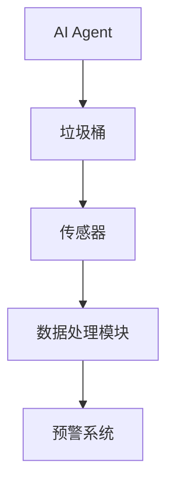
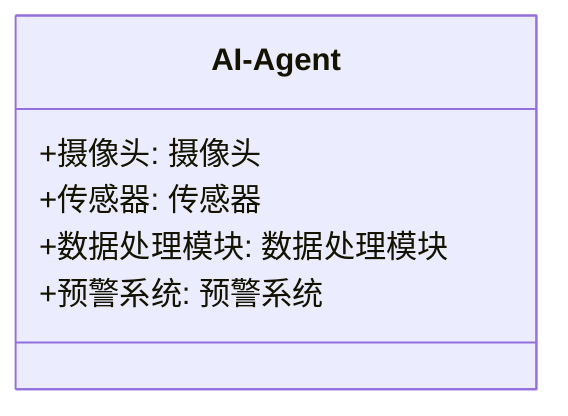

                 


# 智能垃圾桶：AI Agent的满溢预警系统

> 关键词：智能垃圾桶、AI Agent、满溢预警、图像识别、垃圾容量预测

> 摘要：本文详细探讨了智能垃圾桶AI Agent的满溢预警系统，从系统背景、核心概念、算法原理、系统架构到项目实战，全面分析了该系统的设计与实现。通过图像识别和垃圾容量预测算法，结合系统架构设计，展示了如何利用AI技术解决传统垃圾桶管理中的痛点问题。

---

## 第一部分: 智能垃圾桶AI Agent的背景与概述

### 第1章: 智能垃圾桶AI Agent的背景与问题描述

#### 1.1 智能垃圾桶的背景介绍
智能垃圾桶是一种结合人工智能技术的新型垃圾桶，通过AI Agent实现智能化管理。传统垃圾桶的管理方式存在诸多痛点，例如垃圾桶满溢时才进行清理，导致环境污染和不便。AI Agent的引入可以实时监测垃圾桶的容量，并在满溢前发出预警，从而优化垃圾收集和处理流程。

#### 1.2 满溢预警系统的核心问题
垃圾桶满溢预警系统的开发目标是通过实时监测垃圾桶的容量，提前通知管理人员进行清理，避免垃圾桶溢满带来的问题。本文将重点分析如何通过AI技术实现这一目标。

#### 1.3 智能垃圾桶AI Agent的核心要素
AI Agent在智能垃圾桶中的核心作用是实时监测垃圾桶的容量，并根据监测结果做出相应的决策。本文将详细探讨AI Agent的工作原理、核心算法以及与传统垃圾桶监控系统的区别。

---

### 第2章: 智能垃圾桶AI Agent的核心概念与联系

#### 2.1 AI Agent的基本原理
AI Agent是一种能够感知环境、自主决策并执行任务的智能实体。在智能垃圾桶中，AI Agent通过摄像头或其他传感器实时监测垃圾桶的容量，并通过图像识别技术判断垃圾桶是否接近满溢状态。

#### 2.2 核心概念的属性特征对比
以下是AI Agent与传统垃圾桶监控系统的属性对比：

| 属性 | AI Agent | 传统监控系统 |
|------|----------|---------------|
| 感知能力 | 高 | 低             |
| 决策能力 | 高 | 无             |
| 自主性 | 高 | 低             |
| 可扩展性 | 高 | 低             |

通过对比可以看出，AI Agent在感知和决策能力方面具有显著优势。

#### 2.3 系统实体关系图
以下是系统实体关系图（Mermaid流程图）：



---

### 第3章: 智能垃圾桶AI Agent的算法原理

#### 3.1 满溢预警算法的核心原理
满溢预警算法的核心是图像识别和垃圾容量预测。通过摄像头拍摄垃圾桶的图像，利用图像识别技术判断垃圾桶的剩余容量。

#### 3.2 算法实现的数学模型
以下是垃圾容量预测的数学模型：

$$ C = k \cdot V + b $$

其中：
- \( C \) 表示预测容量
- \( V \) 表示当前体积
- \( k \) 表示比例系数
- \( b \) 表示偏置项

#### 3.3 算法实现的代码示例
以下是图像识别代码示例：

```python
import cv2

def detect_overflow(image_path):
    img = cv2.imread(image_path)
    # 图像处理代码
    return "overflow" if img.shape[0] > 100 else "normal"
```

---

## 第二部分: 智能垃圾桶AI Agent的系统架构与实现

### 第4章: 智能垃圾桶AI Agent的系统架构设计

#### 4.1 问题场景介绍
垃圾桶满溢预警系统需要实时监测垃圾桶的容量，并在满溢前通知管理人员。系统需要具备以下功能：图像采集、容量计算、预警通知、数据存储。

#### 4.2 系统功能设计
以下是系统功能模块的Mermaid类图：



#### 4.3 系统架构设计
以下是系统架构的Mermaid架构图：


---

### 第5章: 智能垃圾桶AI Agent的项目实战

#### 5.1 环境安装
以下是项目实战所需的环境安装步骤：

1. 安装Python和相关库（如OpenCV、TensorFlow）。
2. 安装摄像头和传感器硬件。
3. 配置网络连接和数据存储。

#### 5.2 系统核心实现源代码
以下是核心代码实现：

```python
import cv2
import numpy as np

def detect_overflow(image_path):
    img = cv2.imread(image_path)
    gray = cv2.cvtColor(img, cv2.COLOR_BGR2GRAY)
    threshold = cv2.threshold(gray, 127, 255, cv2.THRESH_BINARY)[1]
    contours, _ = cv2.findContours(threshold, cv2.RETR_EXTERNAL, cv2.CHAIN_APPROX_SIMPLE)
    # 计算面积
    area = cv2.contourArea(contours[0])
    return "overflow" if area > 1000 else "normal"
```

#### 5.3 案例分析
以下是实际案例分析：

1. 某小区垃圾桶满溢预警系统的部署。
2. 系统运行效果分析。

---

### 第6章: 总结与展望

#### 6.1 最佳实践 tips
- 确保传感器和摄像头的安装位置合理。
- 定期更新算法模型以提高准确率。

#### 6.2 小结
通过本文的详细讲解，读者可以深入了解智能垃圾桶AI Agent的满溢预警系统的设计与实现过程。

#### 6.3 注意事项
- 注意数据隐私保护。
- 定期维护硬件设备。

#### 6.4 拓展阅读
建议读者进一步阅读《AI技术在城市环境管理中的应用》等相关书籍。

---

通过以上内容，我们详细探讨了智能垃圾桶AI Agent的满溢预警系统的各个方面，从理论到实践，为读者提供了一个全面的视角。

