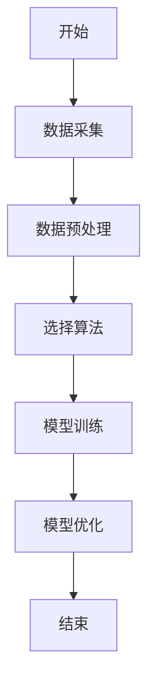
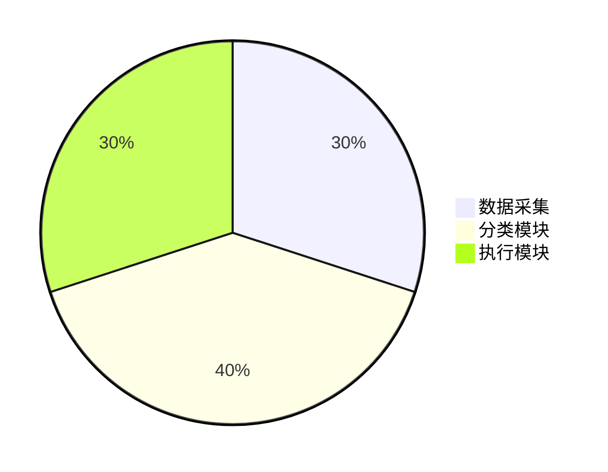

                 


# 智能垃圾桶：AI Agent的自动分类系统

## 关键词：
智能垃圾桶, AI Agent, 自动分类系统, 图像识别, 机器学习, 垃圾分类

## 摘要：
本文探讨了AI Agent在智能垃圾桶中的应用，详细分析了自动分类系统的算法原理和系统架构。通过图像识别和机器学习技术，AI Agent能够高效地进行垃圾分类。文章结合实际案例，展示了系统的实现过程，并提出了优化建议。

---

## 第1章：智能垃圾桶与AI Agent概述

### 1.1 智能垃圾桶的定义与背景
智能垃圾桶是一种结合了人工智能技术的垃圾分类设备，能够自动识别和分类垃圾。随着环保意识的增强和AI技术的发展，智能垃圾桶在现代城市中扮演着越来越重要的角色。

#### 1.1.1 垃圾分类的现状与挑战
传统的人工垃圾分类效率低下，且容易出错。智能垃圾桶通过AI技术，能够显著提高分类效率和准确性。

#### 1.1.2 AI技术在垃圾分类中的应用前景
AI技术，特别是图像识别和机器学习，为智能垃圾桶提供了强大的技术支持。未来，智能垃圾桶将成为智慧城市建设的重要组成部分。

#### 1.1.3 智能垃圾桶的定义与特点
智能垃圾桶是一种集成了AI Agent的设备，能够通过图像识别技术自动分类垃圾。其特点包括高效率、高准确性和智能化。

### 1.2 AI Agent的基本概念
AI Agent是一种能够感知环境并自主决策的智能体，能够帮助智能垃圾桶实现自动分类功能。

#### 1.2.1 什么是AI Agent
AI Agent是人工智能代理的简称，能够通过传感器和算法感知环境，并根据任务需求自主决策。

#### 1.2.2 AI Agent的核心功能与属性
- **感知能力**：通过摄像头和传感器获取环境信息。
- **决策能力**：基于获取的信息做出分类决策。
- **自主学习**：通过机器学习算法优化分类模型。

#### 1.2.3 AI Agent在智能垃圾桶中的作用
AI Agent负责图像识别和分类决策，确保垃圾能够准确分类。

### 1.3 本章小结
智能垃圾桶结合AI Agent，能够高效、准确地进行垃圾分类。AI Agent的核心功能包括感知、决策和自主学习。

---

## 第2章：AI Agent与自动分类系统的核心原理

### 2.1 AI Agent的核心原理
AI Agent通过感知环境、分析数据并做出决策来实现垃圾分类。

#### 2.1.1 AI Agent的感知与决策机制
AI Agent通过摄像头采集垃圾图像，利用图像识别技术进行分析，然后根据分析结果做出分类决策。

#### 2.1.2 AI Agent的自主学习能力
通过机器学习算法，AI Agent能够不断优化分类模型，提高分类准确率。

#### 2.1.3 AI Agent与智能垃圾桶的结合
AI Agent作为智能垃圾桶的核心模块，负责图像识别和分类决策。

### 2.2 自动分类系统的原理
自动分类系统基于图像识别和机器学习技术，实现垃圾的自动分类。

#### 2.2.1 图像识别与分类算法
图像识别技术用于提取垃圾特征，分类算法用于根据特征进行分类。

#### 2.2.2 数据采集与处理流程
- **数据采集**：通过摄像头采集垃圾图像。
- **数据预处理**：对图像进行归一化处理，提取特征。
- **分类模型训练**：使用深度学习算法训练分类模型。

#### 2.2.3 分类模型的训练与优化
- **训练过程**：使用标注数据训练分类模型。
- **优化方法**：通过调整模型参数和优化算法提高分类准确率。

---

## 第3章：算法原理与实现

### 3.1 分类算法的选择与实现
选择合适的分类算法是实现智能垃圾桶的关键。

#### 3.1.1 支持向量机（SVM）与卷积神经网络（CNN）
- **SVM**：适用于小规模数据，分类准确率高。
- **CNN**：适用于大规模数据，分类效果更优。

#### 3.1.2 算法实现步骤
1. 数据预处理：归一化和特征提取。
2. 模型训练：选择合适的算法训练分类模型。
3. 模型优化：调整参数和优化算法。

#### 3.1.3 算法流程图


### 3.2 数学模型与公式
分类模型的数学表达式如下：
$$ y = f(x) $$
其中，$x$是输入特征，$y$是输出类别。

---

## 第4章：系统架构与设计

### 4.1 系统架构设计
智能垃圾桶的系统架构包括数据采集模块、分类模块和执行模块。

#### 4.1.1 系统架构图


#### 4.1.2 功能模块设计
- **数据采集模块**：负责采集垃圾图像。
- **分类模块**：负责图像识别和分类。
- **执行模块**：负责将垃圾送入对应的收集容器。

---

## 第5章：项目实战与实现

### 5.1 环境安装与配置
- **Python环境**：安装Python 3.8及以上版本。
- **依赖库安装**：使用pip安装OpenCV、TensorFlow等库。

### 5.2 核心代码实现
以下是垃圾分类系统的Python代码示例：
```python
import cv2
import tensorflow as tf

# 数据预处理
def preprocess_image(image_path):
    image = cv2.imread(image_path)
    image = cv2.resize(image, (224, 224))
    image = image / 255.0
    return image

# 分类模型加载
model = tf.keras.models.load_model('garbage_classifier.h5')

# 图像分类
def classify_garbage(image_path):
    preprocessed_image = preprocess_image(image_path)
    prediction = model.predict(tf.expand_dims(preprocessed_image, axis=0))
    return prediction.argmax(axis=-1)[0]

# 示例
classify_garbage('garbage_image.jpg')
```

### 5.3 代码解读与分析
- **数据预处理**：将图像归一化并调整大小。
- **模型加载**：加载训练好的分类模型。
- **图像分类**：对图像进行分类并返回结果。

### 5.4 案例分析与优化
通过实际案例分析，优化分类模型的准确率和运行效率。

---

## 第6章：最佳实践与总结

### 6.1 小结
智能垃圾桶通过AI Agent实现了高效的垃圾分类，显著提高了分类准确率和效率。

### 6.2 注意事项
- 数据质量对分类准确率影响较大，需确保数据标注的准确性。
- 模型优化需要不断调整参数和算法，以提高分类效果。

### 6.3 未来展望
未来，智能垃圾桶将更加智能化，结合物联网技术实现远程监控和管理。

### 6.4 扩展阅读
推荐阅读《深度学习实战》和《机器学习入门》等书籍，深入了解AI技术的应用。

---

通过以上章节的详细讲解，智能垃圾桶的AI Agent自动分类系统的核心原理和实现方法已清晰呈现。希望本文能为相关领域的研究和实践提供有价值的参考。

