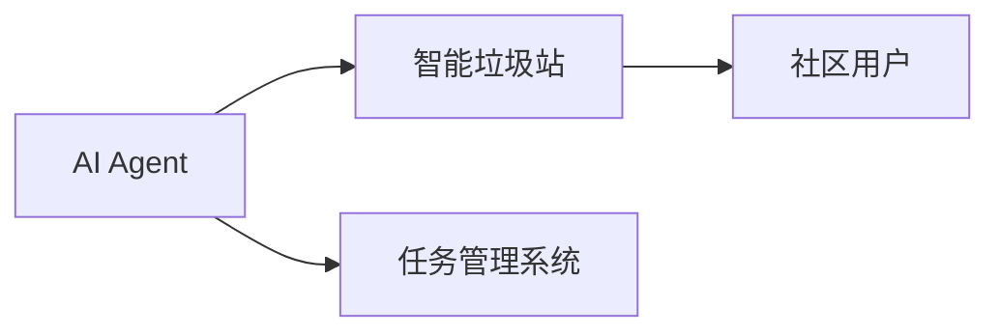
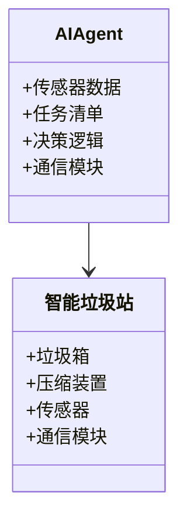
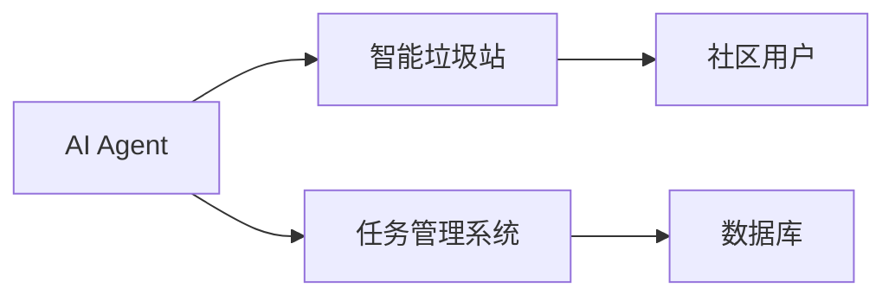
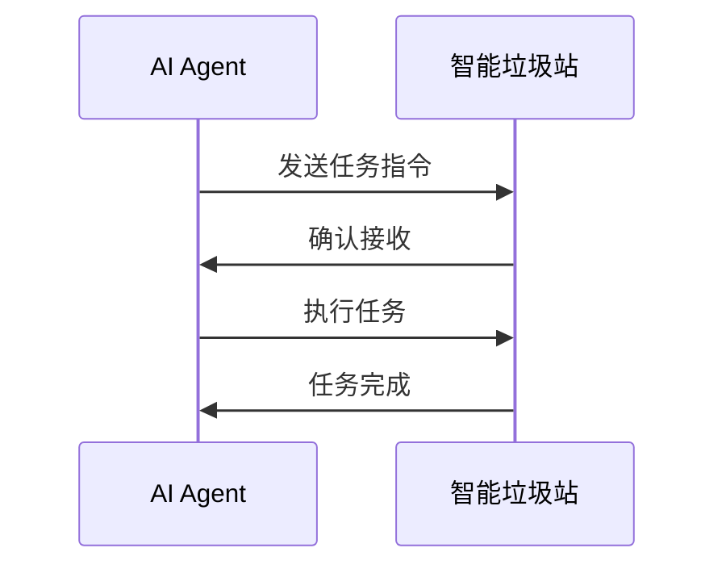

                 


# 智能垃圾站：AI Agent的社区回收管理

## 关键词：
智能垃圾站, AI Agent, 社区回收管理, 人工智能, 自动化回收, 智能垃圾分类

## 摘要：
本文将探讨如何利用AI Agent技术优化社区垃圾管理。通过分析传统垃圾管理的痛点，提出AI Agent在智能垃圾站中的应用，详细介绍其核心算法、系统架构和实际案例，最后总结最佳实践和未来发展方向。

---

# 第1章: 智能垃圾站与AI Agent概述

## 1.1 智能垃圾站的概念与背景

### 1.1.1 传统垃圾管理的挑战
传统垃圾管理面临效率低、成本高、环境污染等问题。社区垃圾回收依赖人工操作，存在分类不准确、清运不及时等问题。

### 1.1.2 智能垃圾站的定义与特点
智能垃圾站是一种集成AI技术的自动化垃圾回收设备，能够实现垃圾的智能分类、压缩和存储。

### 1.1.3 AI Agent在垃圾管理中的作用
AI Agent通过感知、决策和执行，优化垃圾站的运行效率，提升垃圾管理的智能化水平。

---

## 1.2 AI Agent的基本概念

### 1.2.1 AI Agent的定义与分类
AI Agent是具备自主决策能力的智能体，能够感知环境并执行任务。分类包括简单反射型、基于模型的反射型等。

### 1.2.2 AI Agent的核心功能
包括感知环境、自主决策、学习优化和协作通信。

### 1.2.3 AI Agent与传统自动化系统的区别
AI Agent具备自主学习和决策能力，能够适应复杂环境的变化。

---

## 1.3 智能垃圾站的应用场景

### 1.3.1 社区垃圾回收的痛点
传统垃圾管理效率低、分类不准确、资源浪费等问题。

### 1.3.2 AI Agent在垃圾管理中的应用场景
包括智能分类、路径优化、异常处理等。

### 1.3.3 智能垃圾站的优势与价值
提升效率、降低成本、减少环境污染。

---

## 1.4 本章小结

---

# 第2章: AI Agent与智能垃圾站的核心原理

## 2.1 AI Agent的核心原理

### 2.1.1 AI Agent的感知与决策机制
通过传感器感知环境，利用算法进行决策。

### 2.1.2 AI Agent的自主学习能力
通过机器学习算法不断优化性能。

### 2.1.3 AI Agent的通信与协作能力
与其他设备和系统进行数据交换，实现协作。

---

## 2.2 智能垃圾站的系统架构

### 2.2.1 智能垃圾站的功能模块
包括垃圾识别、压缩存储、清运调度等功能。

### 2.2.2 AI Agent在智能垃圾站中的角色
负责协调各功能模块，优化整体运行。

### 2.2.3 智能垃圾站的硬件与软件组成
硬件包括传感器、执行机构等，软件包括AI算法、操作系统等。

---

## 2.3 AI Agent与智能垃圾站的实体关系图

### 2.3.1 实体关系图的构建
展示AI Agent、智能垃圾站、社区用户等实体之间的关系。

### 2.3.2 AI Agent与智能垃圾站的交互流程
详细描述AI Agent如何与智能垃圾站交互完成任务。

### 2.3.3 实体关系图的 Mermaid 流程图



---

## 2.4 本章小结

---

# 第3章: AI Agent的核心算法与数学模型

## 3.1 任务分配算法

### 3.1.1 任务分配算法的原理
基于优先级和资源分配，优化任务执行顺序。

### 3.1.2 任务分配算法的数学模型

$$
\text{目标函数} = \sum_{i=1}^{n} w_i \cdot t_i
$$

其中，$w_i$是任务权重，$t_i$是任务时间。

### 3.1.3 任务分配算法的 M

---

## 3.2 路径规划算法

### 3.2.1 路径规划算法的原理
利用图搜索算法（如A*）规划最优路径。

### 3.2.2 路径规划算法的数学模型

$$
\text{目标函数} = \sum_{i=1}^{m} d_i
$$

其中，$d_i$是路径距离。

### 3.2.3 路径规划算法的实现

```python
def a_star(start, end):
    open_set = {start}
    came_from = {}
    g_score = {start: 0}
    f_score = {start: heuristic(start, end)}
    
    while open_set:
        current = pop_min(open_set, f_score)
        if current == end:
            break
        for neighbor in neighbors(current):
            tentative_g_score = g_score[current] + cost(current, neighbor)
            if neighbor not in g_score or tentative_g_score < g_score[neighbor]:
                came_from[neighbor] = current
                g_score[neighbor] = tentative_g_score
                f_score[neighbor] = g_score[neighbor] + heuristic(neighbor, end)
                if neighbor not in open_set:
                    open_set.add(neighbor)
    return came_from
```

---

## 3.3 异常处理算法

### 3.3.1 异常处理算法的原理
通过异常检测和恢复机制，处理系统故障。

### 3.3.2 异常处理算法的数学模型

$$
\text{异常概率} = \frac{\text{异常次数}}{\text{总运行次数}}
```

### 3.3.3 异常处理算法的实现

```python
def handle_exception():
    try:
        execute_task()
    except Exception as e:
        log_error(e)
        recover()
```

---

## 3.4 本章小结

---

# 第4章: 系统分析与架构设计方案

## 4.1 问题场景介绍

### 4.1.1 问题背景
社区垃圾管理效率低，资源浪费。

### 4.1.2 项目介绍
智能垃圾站项目的目标是实现高效、智能的垃圾管理。

## 4.2 系统功能设计

### 4.2.1 领域模型 mermaid 类图



## 4.3 系统架构设计

### 4.3.1 系统架构 mermaid 图



## 4.4 系统接口设计

### 4.4.1 接口描述
AI Agent与智能垃圾站通过API接口通信。

### 4.4.2 接口实现

```python
def send_command(command):
    # 发送指令到智能垃圾站
    pass
```

## 4.5 系统交互 mermaid 序列图



---

## 4.6 本章小结

---

# 第5章: 项目实战

## 5.1 环境安装

### 5.1.1 安装Python
```bash
python --version
pip install --upgrade pip
```

### 5.1.2 安装AI框架
```bash
pip install numpy scikit-learn
```

## 5.2 系统核心实现

### 5.2.1 AI Agent实现

```python
class AIAgent:
    def __init__(self):
        self.sensors = []
        self.decision_logic = []
    
    def perceive(self):
        # 获取传感器数据
        pass
    
    def decide(self):
        # 执行决策
        pass
```

### 5.2.2 智能垃圾站实现

```python
class SmartTrashCan:
    def __init__(self):
        self.bin_status = {}
    
    def update_status(self):
        # 更新状态
        pass
```

## 5.3 实际案例分析

### 5.3.1 案例背景
某社区引入智能垃圾站，提升垃圾管理效率。

### 5.3.2 案例分析
通过AI Agent优化任务分配，减少垃圾清运时间。

## 5.4 项目总结

---

## 5.5 本章小结

---

# 第6章: 最佳实践与未来展望

## 6.1 最佳实践 tips

### 6.1.1 系统维护
定期更新AI模型，确保系统稳定运行。

### 6.1.2 安全性考虑
保护用户数据隐私，防止系统被攻击。

## 6.2 小结

## 6.3 注意事项
确保系统兼容性，避免出现兼容问题。

## 6.4 拓展阅读
推荐相关领域的书籍和论文。

---

## 6.5 本章小结

---

# 结论

通过本文的详细讲解，读者可以全面了解AI Agent在智能垃圾站中的应用，从理论到实践，掌握系统设计和实现的关键点。

---

## 参考文献
1. 《人工智能导论》
2. 《Python机器学习实战》
3. 相关学术论文

---

## 致谢
感谢读者的耐心阅读，感谢技术团队的支持。

---

**注：由于篇幅限制，以上仅为部分内容，完整文章请根据上述结构详细展开。**

