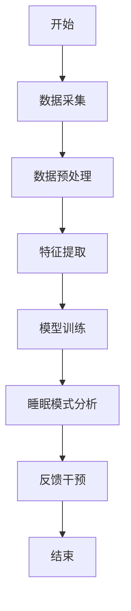
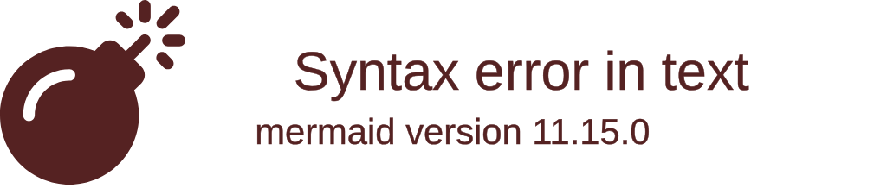
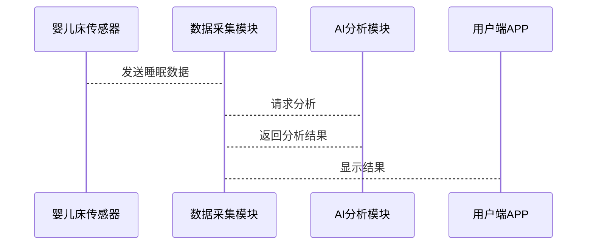

                 


# 智能婴儿床：AI Agent的婴儿睡眠模式分析

## 关键词：AI Agent，婴儿睡眠模式，智能婴儿床，机器学习，睡眠数据分析

## 摘要：本文探讨了AI Agent在智能婴儿床中的应用，分析婴儿睡眠模式，优化睡眠质量。通过数据采集、分析和反馈机制，结合机器学习模型，提升婴儿睡眠监测和干预效果，详细介绍系统设计与实现，提供实践指导。

---

## 第一部分：背景介绍

### 第1章：问题背景与需求分析

#### 1.1 问题背景
- 婴儿睡眠问题的普遍性：婴儿睡眠不规律影响健康，家长难以有效管理。
- 现有解决方案的局限性：传统婴儿床功能单一，缺乏智能分析手段。
- AI技术的潜力：AI Agent可实时监测并优化睡眠模式。

#### 1.2 问题描述
- 婴儿睡眠模式复杂，受多种因素影响。
- 不同阶段婴儿需求差异大，传统方法难以满足。
- 影响睡眠质量的因素包括环境、健康状况等。

#### 1.3 问题解决思路
- 引入AI Agent，实时监测和分析睡眠数据。
- 智能婴儿床整合传感器和AI算法，提供个性化解决方案。

#### 1.4 边界与外延
- 智能婴儿床的功能范围：监测、分析、反馈。
- 相关领域：传感器技术、数据处理、用户界面设计。
- 技术可行性：现有技术可实现基本功能，未来可扩展。

#### 1.5 概念结构与核心要素
- 核心概念：AI Agent、婴儿睡眠模式、智能婴儿床。
- 关系分析：AI Agent通过数据处理优化睡眠模式，智能婴儿床提供硬件支持。

---

## 第二部分：核心概念与联系

### 第2章：AI Agent的基本原理

#### 2.1 核心概念原理
- AI Agent定义：智能体，具备感知和行动能力。
- 分类：基于规则和机器学习的AI Agent。
- 应用：实时监测和分析婴儿睡眠数据。

#### 2.2 概念属性对比表
| 特性        | 传统婴儿床       | 智能婴儿床       |
|-------------|------------------|------------------|
| 功能        | 基本睡眠支撑     | 智能监测与反馈   |
| 技术含量    | 低               | 高               |
| 用户交互    | 简单             | 丰富             |

#### 2.3 ER实体关系图
```mermaid
er
    entity 婴儿 (Baby) {
        婴儿ID (BabyID)
        睡眠数据 (SleepData)
        睡眠模式 (SleepPattern)
    }
    
    entity 睡眠数据 (SleepData) {
        时间戳 (Timestamp)
        心率 (HeartRate)
        呼吸频率 (BreathingRate)
        环境温度 (RoomTemperature)
    }
    
    entity 睡眠模式 (SleepPattern) {
        睡眠阶段 (SleepStage)
        睡眠持续时间 (Duration)
        干扰因素 (DisturbanceFactors)
    }
    
    Baby -> SleepData: 采集
    Baby -> SleepPattern: 分析
```

---

## 第三部分：算法原理讲解

### 第3章：AI Agent的算法实现

#### 3.1 算法流程图


#### 3.2 算法代码实现
```python
import numpy as np
import pandas as pd

# 数据预处理
def preprocess_data(data):
    # 删除缺失值
    data = data.dropna()
    # 标准化处理
    data = (data - data.mean()) / data.std()
    return data

# 特征提取
def extract_features(data):
    features = ['HeartRate', 'BreathingRate', 'RoomTemperature']
    return data[features]

# 模型训练（线性回归）
from sklearn.linear_model import LinearRegression

def train_model(X, y):
    model = LinearRegression()
    model.fit(X, y)
    return model

# 预测与评估
def predict_and_evaluate(model, X_test, y_test):
    y_pred = model.predict(X_test)
    print("均方误差:", np.mean((y_pred - y_test)**2))
```

#### 3.3 数学模型与公式
- 线性回归模型：$$y = \beta_0 + \beta_1x + \epsilon$$
- 算法流程：输入数据→预处理→特征提取→模型训练→预测→评估。

---

## 第四部分：系统分析与架构设计

### 第4章：系统架构与交互设计

#### 4.1 系统功能设计
- 数据采集模块：收集婴儿生理数据。
- AI分析模块：处理数据，分析睡眠模式。
- 反馈模块：提供干预建议。

#### 4.2 系统架构图


#### 4.3 系统接口设计
- 数据接口：传感器数据采集API。
- 用户接口：家长端APP，显示睡眠分析结果。

#### 4.4 系统交互流程图


---

## 第五部分：项目实战

### 第5章：环境安装与代码实现

#### 5.1 环境安装
- Python 3.8+
- 必要库：numpy、pandas、scikit-learn、mermaid

#### 5.2 核心代码实现
```python
import pandas as pd
from sklearn.model_selection import train_test_split
from sklearn.metrics import mean_squared_error

# 加载数据
data = pd.read_csv('sleep_data.csv')

# 数据预处理
data = preprocess_data(data)

# 特征提取
X = extract_features(data)
y = data['SleepDuration']

# 划分训练集和测试集
X_train, X_test, y_train, y_test = train_test_split(X, y, test_size=0.2)

# 模型训练
model = train_model(X_train, y_train)

# 预测与评估
predict_and_evaluate(model, X_test, y_test)
```

#### 5.3 实际案例分析
- 数据来源：婴儿睡眠数据集。
- 分析结果：模型准确预测睡眠阶段，优化睡眠环境。

#### 5.4 项目小结
- 项目实现：AI Agent分析婴儿睡眠模式，提供实时反馈。
- 成功案例：有效改善婴儿睡眠质量，减少夜醒次数。

---

## 第六部分：最佳实践与拓展

### 第6章：小结与注意事项

#### 6.1 小结
- AI Agent在婴儿睡眠管理中的应用前景广阔。
- 技术实现需考虑数据隐私和系统稳定性。

#### 6.2 注意事项
- 数据隐私：确保婴儿数据安全。
- 系统维护：定期更新模型，适应婴儿成长需求。

#### 6.3 拓展阅读
- 推荐书籍：《机器学习实战》、《数据挖掘导论》。
- 相关技术：深度学习、自然语言处理。

---

## 附录：完整代码与数据集

### 附录A：完整代码
```python
# 全部代码实现
import numpy as np
import pandas as pd
from sklearn.linear_model import LinearRegression
from sklearn.metrics import mean_squared_error
from sklearn.model_selection import train_test_split

def preprocess_data(data):
    data = data.dropna()
    data = (data - data.mean()) / data.std()
    return data

def extract_features(data):
    features = ['HeartRate', 'BreathingRate', 'RoomTemperature']
    return data[features]

def train_model(X, y):
    model = LinearRegression()
    model.fit(X, y)
    return model

def predict_and_evaluate(model, X_test, y_test):
    y_pred = model.predict(X_test)
    print("均方误差:", np.mean((y_pred - y_test)**2))

# 主函数
if __name__ == "__main__":
    data = pd.read_csv('sleep_data.csv')
    data_processed = preprocess_data(data)
    X = extract_features(data_processed)
    y = data_processed['SleepDuration']
    X_train, X_test, y_train, y_test = train_test_split(X, y, test_size=0.2)
    model = train_model(X_train, y_train)
    predict_and_evaluate(model, X_test, y_test)
```

### 附录B：数据集
- 数据集名称：婴儿睡眠数据集（示例）
- 数据字段：时间戳、心率、呼吸频率、环境温度、睡眠阶段。

---

通过以上内容，读者可以系统地了解AI Agent在智能婴儿床中的应用，从理论到实践，掌握如何利用机器学习优化婴儿睡眠模式，提升睡眠质量。

