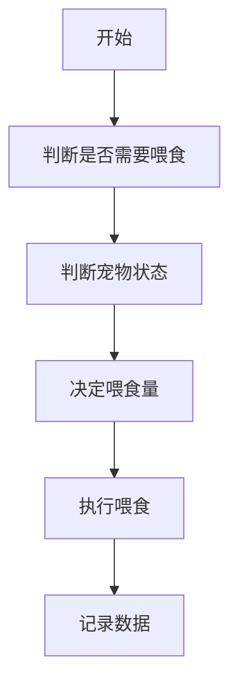
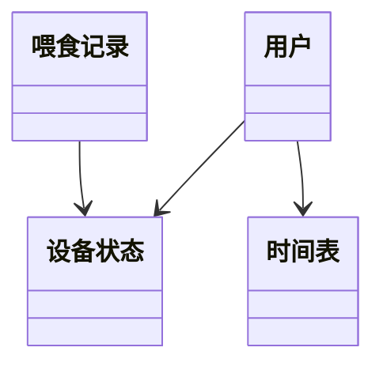
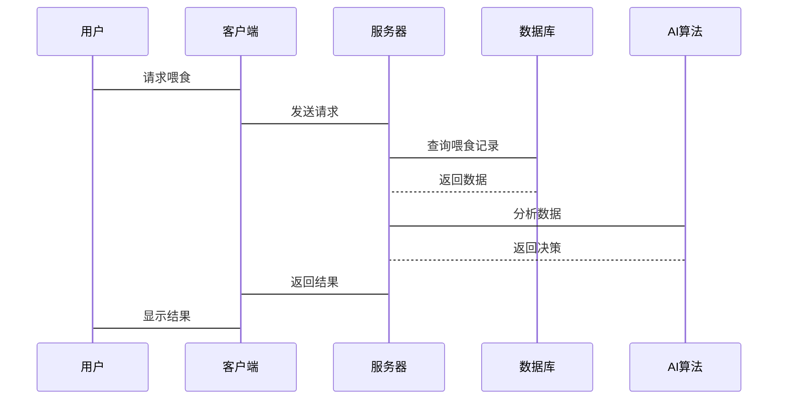

                 


# 智能宠物喂食器：AI Agent的宠物饮食管理

> 关键词：智能宠物喂食器，AI Agent，物联网，宠物健康管理，智能喂食系统

> 摘要：本文详细介绍了智能宠物喂食器的设计与实现，结合AI Agent和物联网技术，探讨其在宠物饮食管理中的应用。通过分析系统架构、算法原理、项目实战等，为读者提供从理论到实践的全面指导。

---

# 第一部分: 智能宠物喂食器的背景与概念

## 第1章: 智能宠物喂食器的背景介绍

### 1.1 问题背景与问题描述

#### 1.1.1 宠物喂食管理的痛点
现代宠物主人面临诸多喂食管理的问题，例如：
- **喂食时间不规律**：主人无法实时监控宠物的喂食情况。
- **饮食健康问题**：不同宠物有不同的饮食需求，主人难以精准控制。
- **设备操作复杂**：传统喂食器功能单一，缺乏智能化。

#### 1.1.2 智能喂食器的必要性
智能宠物喂食器通过AI Agent和物联网技术，能够实现：
- **定时喂食**：主人可以远程设置喂食时间。
- **精准控制**：根据宠物的健康状况调整喂食量。
- **数据追踪**：记录宠物的饮食数据，帮助主人了解宠物的健康状况。

#### 1.1.3 AI Agent在宠物喂食管理中的应用
AI Agent通过实时数据采集、分析和决策，能够自动调整喂食计划，确保宠物的饮食健康。

### 1.2 问题解决与边界定义

#### 1.2.1 智能宠物喂食器的解决方案
- 利用AI Agent实现智能决策。
- 通过物联网技术实现设备远程控制。

#### 1.2.2 系统边界与功能范围
- **核心功能**：定时喂食、健康数据分析。
- **辅助功能**：用户界面、数据存储与分析。

#### 1.2.3 与现有技术的对比分析
- **传统喂食器**：功能单一，缺乏智能化。
- **智能喂食器**：结合AI和物联网，功能丰富，智能化程度高。

### 1.3 概念结构与核心要素

#### 1.3.1 核心概念的组成
- **AI Agent**：实现智能决策的核心。
- **物联网设备**：实现远程控制的基础。
- **数据存储与分析**：支撑智能化决策的数据基础。

#### 1.3.2 系统的核心要素分析
- **传感器**：采集宠物的健康数据。
- **执行机构**：实现喂食动作。
- **AI算法**：分析数据并做出决策。

#### 1.3.3 智能宠物喂食器的边界与外延
- **边界**：仅限于宠物喂食管理。
- **外延**：可扩展至宠物健康管理的其他方面。

## 第2章: 核心概念与技术联系

### 2.1 AI Agent的基本原理

#### 2.1.1 AI Agent的定义与特征
- **定义**：AI Agent是一种能够感知环境并做出决策的智能实体。
- **特征**：自主性、反应性、目标导向。

#### 2.1.2 AI Agent的核心算法
- **状态识别与判断**：通过传感器数据识别宠物的状态。
- **喂食时间的智能决策**：基于宠物状态和历史数据做出决策。

### 2.2 物联网技术在智能喂食器中的应用

#### 2.2.1 物联网的基本概念
- **定义**：物联网是通过设备和互联网实现物体间互联的技术。
- **应用场景**：智能宠物喂食器中的设备远程控制。

#### 2.2.2 物联网在智能喂食器中的具体应用
- **远程控制**：通过手机APP远程启动喂食器。
- **数据传输**：传感器数据实时传输到云端。

### 2.3 核心概念的对比分析

#### 2.3.1 AI Agent与传统喂食器的对比
- **传统喂食器**：功能单一，无法智能决策。
- **智能喂食器**：结合AI Agent，能够智能决策。

#### 2.3.2 物联网技术与AI Agent的对比
- **物联网技术**：注重设备连接和数据传输。
- **AI Agent**：注重数据分析和智能决策。

### 2.4 ER实体关系图

```mermaid
er
  actor: 用户
  entity: 喂食记录
  entity: 宠物信息
  entity: 用户信息
  entity: 时间表
  entity: 设备状态
  relationship: 用户 - 管理 - 设备状态
  relationship: 用户 - 设置 - 时间表
  relationship: 宠物 - 关联 - 喂食记录
```

---

# 第二部分: 算法原理与数学模型

## 第3章: 算法原理与数学模型

### 3.1 AI Agent的核心算法

#### 3.1.1 状态识别与判断
- **算法流程**：
  1. 采集宠物的状态数据。
  2. 通过机器学习模型进行状态识别。

#### 3.1.2 喂食时间的智能决策
- **算法流程**：
  1. 根据宠物状态和历史数据，计算最佳喂食时间。

#### 3.1.3 系统的自我学习机制
- **算法流程**：
  1. 收集喂食后的反馈数据。
  2. 更新机器学习模型。

### 3.2 算法流程图



### 3.3 数学模型与公式

#### 3.3.1 状态识别的数学模型
$$
P(\text{饥饿}) = \frac{\text{活动量} + \text{时间间隔}}{2}
$$

#### 3.3.2 喂食时间的计算公式
$$
T = \text{上次喂食时间} + \text{喂食间隔}
$$

---

# 第三部分: 系统分析与架构设计

## 第4章: 系统分析与架构设计

### 4.1 问题场景介绍

#### 4.1.1 项目介绍
- **项目目标**：设计一个智能宠物喂食器，实现AI Agent的宠物饮食管理。

#### 4.1.2 系统功能设计
- **核心功能**：定时喂食、健康数据分析。
- **辅助功能**：用户界面、数据存储与分析。

### 4.2 领域模型类图



### 4.3 系统架构设计


### 4.4 系统接口设计

#### 4.4.1 API接口
- **获取设备状态**：`GET /api/device/status`
- **设置喂食时间**：`POST /api/feed/schedule`

### 4.5 系统交互序列图



---

# 第四部分: 项目实战

## 第5章: 项目实战

### 5.1 环境安装

#### 5.1.1 安装Python环境
- 使用Anaconda安装Python 3.8及以上版本。

#### 5.1.2 安装依赖库
```bash
pip install flask numpy pandas
```

### 5.2 系统核心实现源代码

#### 5.2.1 AI算法实现
```python
def decide_feed量(weight, activity):
    if weight < 10:
        return 10
    elif weight < 20:
        return 20
    else:
        return activity
```

#### 5.2.2 数据库实现
```python
import sqlite3

conn = sqlite3.connect('feed.db')
cursor = conn.cursor()
cursor.execute('''
    CREATE TABLE feed_record (
        id INTEGER PRIMARY KEY AUTOINCREMENT,
        time TEXT,
        amount INTEGER
    )
'')
```

### 5.3 代码应用解读与分析

#### 5.3.1 算法解读
- **AI算法**：根据宠物的重量和活动量决定喂食量。
- **数据库**：存储喂食记录，用于后续分析。

### 5.4 实际案例分析

#### 5.4.1 案例分析
- **案例1**：宠物体重为15kg，活动量为中等，喂食量为20g。
- **案例2**：宠物体重为30kg，活动量为高，喂食量为30g。

### 5.5 项目小结

#### 5.5.1 项目总结
- **核心实现**：AI算法和数据库实现。
- **成功经验**：实现了智能喂食管理。
- **改进方向**：优化AI算法，增加更多传感器。

---

# 第五部分: 最佳实践与扩展阅读

## 第6章: 最佳实践

### 6.1 小结

#### 6.1.1 系统设计总结
- **模块划分**：清晰的模块划分有助于系统维护。
- **数据管理**：高效的数据库设计能够提升系统性能。

### 6.2 注意事项

#### 6.2.1 开发注意事项
- **代码规范**：保持代码的可读性和可维护性。
- **测试充分**：确保系统在各种情况下都能正常运行。

### 6.3 拓展阅读

#### 6.3.1 推荐书籍
- 《人工智能：一种现代方法》
- 《物联网技术及应用》

---

# 结语

智能宠物喂食器通过AI Agent和物联网技术的结合，为宠物主人提供了便捷的喂食管理方案。从系统设计到项目实现，本文为读者提供了全面的指导。希望本文能够为读者在智能宠物喂食器的设计与实现方面提供有价值的参考。

