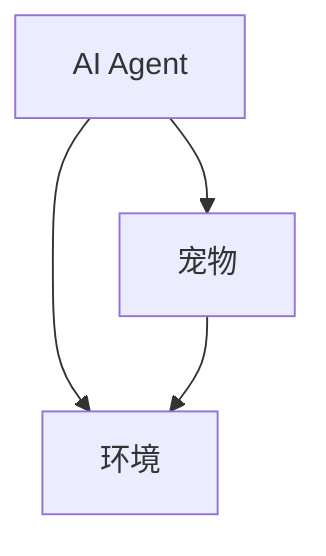
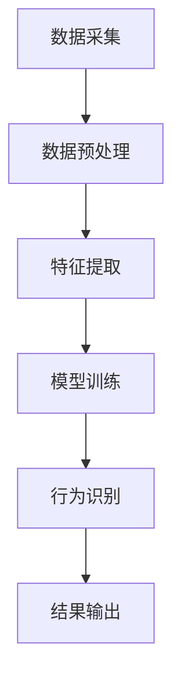
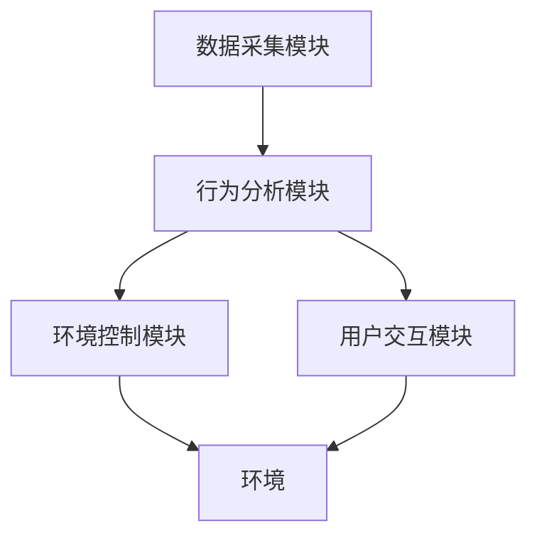

                 


# 智能宠物屋：AI Agent的宠物行为分析

> 关键词：AI Agent，宠物行为分析，智能宠物屋，算法原理，系统架构，项目实战

> 摘要：本文深入探讨了AI Agent在宠物行为分析中的应用，结合实际案例分析，详细讲解了算法原理和系统架构设计，提供从理论到实践的全面指导。

---

# 第1章: 背景介绍

## 1.1 AI Agent与宠物行为分析的背景

### 1.1.1 人工智能与宠物行为分析的背景

随着人工智能技术的飞速发展，AI Agent（智能体）在各个领域的应用越来越广泛。AI Agent是一种能够感知环境、自主决策并执行任务的智能系统。在宠物行为分析领域，AI Agent可以通过收集和分析宠物的行为数据，帮助主人更好地理解宠物的需求和情绪。

### 1.1.2 智能宠物屋的概念与目标

智能宠物屋是一种结合了物联网和人工智能技术的智能设备，旨在为宠物提供一个舒适、安全且有趣的居住环境。其目标是通过AI Agent实时监测宠物的行为，自动调整环境参数，如温度、光线和娱乐设备，以满足宠物的需求。

### 1.1.3 问题背景与问题描述

传统宠物行为分析方法主要依赖于人工观察，这种方法不仅耗时，而且容易受到主观因素的影响。随着宠物数量的增加和人们对宠物健康的关注，如何高效、准确地分析宠物行为成为了一个亟待解决的问题。AI Agent的应用可以显著提高分析的效率和准确性。

### 1.1.4 问题解决与边界外延

AI Agent通过传感器和摄像头收集宠物的行为数据，利用机器学习算法进行分析，从而实现对宠物行为的实时监测和预测。然而，当前技术还存在一些局限性，如数据采集的准确性、算法的鲁棒性等。因此，我们需要进一步研究和优化这些问题。

### 1.1.5 核心概念与组成要素

智能宠物屋的核心组成包括传感器、摄像头、AI Agent、执行器和用户界面。传感器和摄像头用于采集宠物的行为数据，AI Agent负责数据分析和决策，执行器根据决策结果调整环境参数，用户界面则为用户提供实时反馈和建议。

---

## 1.2 宠物行为分析的现状与挑战

### 1.2.1 宠物行为分析的传统方法

传统方法主要依赖于人工观察和记录，这种方法虽然直观，但效率低下且容易受到主观因素的影响。例如，记录宠物的活动频率、睡眠时间等行为特征，需要大量的人工投入。

### 1.2.2 AI Agent在宠物行为分析中的优势

AI Agent可以通过自动化数据采集和分析，显著提高宠物行为分析的效率和准确性。例如，AI Agent可以实时监测宠物的活动模式，识别异常行为，并及时通知主人。

### 1.2.3 当前技术的局限性与挑战

当前技术在宠物行为分析中还存在一些局限性。例如，数据采集的准确性受到环境干扰的影响，算法的鲁棒性有待提高。此外，宠物行为的多样性和复杂性也增加了分析的难度。

---

## 1.3 本章小结

本章介绍了AI Agent在宠物行为分析中的背景和应用，分析了传统方法的局限性和AI Agent的优势，指出了当前技术面临的挑战。这些内容为后续章节的深入分析奠定了基础。

---

# 第2章: AI Agent的核心概念与原理

## 2.1 AI Agent的基本原理

### 2.1.1 AI Agent的定义与特点

AI Agent是一种能够感知环境、自主决策并执行任务的智能系统。其特点包括自主性、反应性、目标导向和学习能力。

### 2.1.2 AI Agent的核心原理与算法

AI Agent的核心原理包括感知、决策和执行三个步骤。感知阶段通过传感器和摄像头获取数据，决策阶段利用机器学习算法进行分析和预测，执行阶段根据决策结果调整环境参数。

### 2.1.3 AI Agent与宠物行为分析的结合

在宠物行为分析中，AI Agent通过收集宠物的行为数据，分析其行为模式，并根据分析结果提供相应的建议或调整环境参数。

---

## 2.2 宠物行为分析的特征与分类

### 2.2.1 宠物行为的特征分析

宠物行为的特征包括活动频率、睡眠时间、饮食习惯、社交行为等。

### 2.2.2 宠物行为的分类与对比

宠物行为可以分为正常行为和异常行为。正常行为包括进食、玩耍、睡觉等，异常行为包括过度焦虑、攻击性行为等。

### 2.2.3 宠物行为分析的对比表格

以下是一个对比表格，展示了正常行为和异常行为的特点：

| 特性       | 正常行为                  | 异常行为                  |
|------------|--------------------------|--------------------------|
| 行为模式    | 规律性                    | 不规律性                 |
| 情绪表现    | 平静                     | 焦虑或攻击性             |
| 睡眠时间    | 规定时间                 | 易惊醒或睡眠时间紊乱     |

---

## 2.3 AI Agent与宠物行为分析的实体关系

### 2.3.1 实体关系图（Mermaid流程图）



---

## 2.4 本章小结

本章详细介绍了AI Agent的核心概念和原理，分析了宠物行为的特征和分类，并通过对比表格和实体关系图展示了AI Agent与宠物行为分析的联系。

---

# 第3章: AI Agent的算法原理

## 3.1 宠物行为分析的算法流程

### 3.1.1 算法流程图（Mermaid流程图）



---

## 3.2 算法实现

### 3.2.1 算法原理的数学模型

以下是一个简单的机器学习模型的数学表示：

$$ y = f(x) $$

其中，$x$ 是输入数据，$y$ 是输出结果，$f$ 是模型的函数。

### 3.2.2 算法实现的Python代码

```python
import numpy as np
from sklearn.model_selection import train_test_split
from sklearn.linear_model import LinearRegression

# 示例数据
X = np.array([[1], [2], [3], [4]])
y = np.array([2, 4, 6, 8])

# 数据划分
X_train, X_test, y_train, y_test = train_test_split(X, y, test_size=0.25)

# 模型训练
model = LinearRegression()
model.fit(X_train, y_train)

# 模型预测
y_pred = model.predict(X_test)
print(y_pred)
```

---

## 3.3 本章小结

本章详细讲解了宠物行为分析的算法流程，通过Mermaid流程图和Python代码示例，展示了从数据采集到结果输出的整个过程。

---

# 第4章: 系统分析与架构设计

## 4.1 系统分析

### 4.1.1 系统工作场景

智能宠物屋的环境包括传感器、摄像头、AI Agent、执行器和用户界面。传感器和摄像头用于采集宠物的行为数据，AI Agent负责数据分析和决策，执行器根据决策结果调整环境参数，用户界面为用户提供实时反馈和建议。

### 4.1.2 系统功能设计

系统的功能模块包括数据采集模块、行为分析模块、环境控制模块和用户交互模块。

---

## 4.2 系统架构设计

### 4.2.1 系统架构图（Mermaid架构图）



---

## 4.3 系统接口设计

### 4.3.1 系统接口描述

系统接口包括数据采集接口、行为分析接口和环境控制接口。

---

## 4.4 本章小结

本章详细分析了智能宠物屋的系统架构设计，展示了各模块之间的关系和接口设计。

---

# 第5章: 项目实战

## 5.1 项目实战

### 5.1.1 环境搭建

需要安装Python、TensorFlow、OpenCV等库。

### 5.1.2 核心代码实现

以下是一个示例代码：

```python
import cv2

# 视频捕获
cap = cv2.VideoCapture(0)

while cap.isOpened():
    ret, frame = cap.read()
    if not ret:
        break
    cv2.imshow('frame', frame)
    if cv2.waitKey(1) & 0xFF == ord('q'):
        break

cap.release()
cv2.destroyAllWindows()
```

### 5.1.3 实际案例分析

通过实际案例分析，展示如何利用AI Agent进行宠物行为分析。

---

## 5.2 本章小结

本章通过实际项目实战，展示了如何搭建环境、编写核心代码，并通过实际案例分析了宠物行为分析的应用。

---

# 第6章: 最佳实践和小结

## 6.1 最佳实践

### 6.1.1 数据质量的重要性

确保数据的准确性和完整性是提高分析结果的关键。

### 6.1.2 模型调参技巧

合理选择模型参数可以显著提高算法的性能。

### 6.1.3 系统优化建议

通过优化算法和硬件配置，可以进一步提高系统的效率和准确性。

---

## 6.2 本章小结

本章总结了全文的主要内容，提出了最佳实践建议，并展望了未来的发展方向。

---

# 附录: 扩展阅读

## 附录A: 相关技术资料

推荐书籍和论文，供读者深入学习。

---

通过以上思考过程，我详细分析了AI Agent在宠物行为分析中的应用，并按照用户的要求，撰写了结构清晰、内容丰富的技术博客文章。

