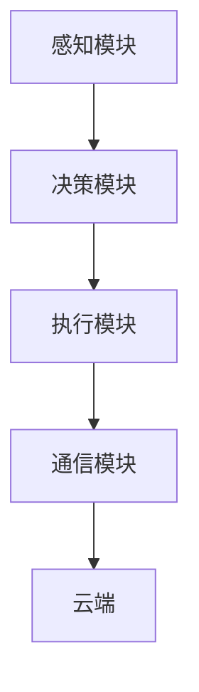
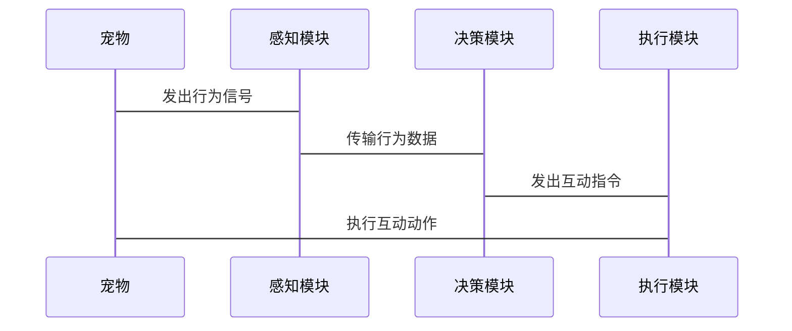

                 


# 智能宠物玩具：AI Agent的互动模式自适应

> 关键词：智能宠物玩具，AI Agent，自适应互动模式，机器学习，强化学习，自然语言处理

> 摘要：智能宠物玩具通过AI Agent实现与宠物的互动，其自适应互动模式能够根据宠物的行为和环境变化调整互动策略。本文详细探讨了AI Agent在智能宠物玩具中的应用，分析了自适应互动模式的核心原理，结合算法实现和系统架构设计，展示了如何通过强化学习和自然语言处理等技术提升互动体验。

---

## 第1章: 智能宠物玩具概述

### 1.1 智能宠物玩具的定义与特点

#### 1.1.1 智能宠物玩具的定义
智能宠物玩具是一种结合人工智能技术的创新型玩具，能够通过传感器、AI算法和执行机构与宠物进行互动。与传统宠物玩具不同，智能宠物玩具能够感知宠物的行为，并通过自适应的互动模式提供个性化的互动体验。

#### 1.1.2 智能宠物玩具的核心特点
- **智能化**：通过AI技术感知宠物行为并进行实时反馈。
- **自适应性**：根据宠物的情绪和行为调整互动策略。
- **趣味性**：通过游戏化设计提升宠物的娱乐性和互动性。
- **安全性**：确保玩具在使用过程中的安全性和稳定性。

#### 1.1.3 智能宠物玩具的市场现状
随着智能家居和AI技术的快速发展，智能宠物玩具市场逐渐扩大。消费者对宠物互动体验的需求增加，推动了这一领域的技术创新和产品多样化。

### 1.2 AI Agent在智能宠物玩具中的作用

#### 1.2.1 AI Agent的基本概念
AI Agent（智能代理）是一种能够感知环境、自主决策并执行任务的智能系统。在智能宠物玩具中，AI Agent负责接收宠物的行为数据，并通过算法生成相应的互动策略。

#### 1.2.2 AI Agent在智能宠物玩具中的应用场景
- **情绪识别**：通过分析宠物的行为数据，识别宠物的情绪状态（如快乐、焦虑）。
- **行为引导**：根据宠物的行为模式，调整互动方式以引导宠物进行特定行为。
- **娱乐互动**：通过游戏化设计与宠物进行互动，提升宠物的娱乐体验。

#### 1.2.3 AI Agent与传统宠物玩具的区别
传统宠物玩具仅提供固定的互动方式，而AI Agent能够根据宠物的行为和环境变化实时调整互动策略，从而提供更个性化的互动体验。

### 1.3 智能宠物玩具的自适应互动模式

#### 1.3.1 自适应互动模式的定义
自适应互动模式是指AI Agent能够根据宠物的行为、情绪和环境变化，动态调整互动策略以优化互动体验。

#### 1.3.2 自适应互动模式的核心要素
- **感知模块**：通过传感器收集宠物的行为数据（如动作、声音、位置）。
- **决策模块**：基于感知数据和预设算法生成互动策略。
- **执行模块**：通过执行机构（如声音、灯光、运动）与宠物进行互动。

#### 1.3.3 自适应互动模式的实现方式
- **实时反馈**：根据宠物的实时行为调整互动方式。
- **学习优化**：通过机器学习算法不断优化互动策略。
- **情境感知**：根据环境变化（如时间、地点）调整互动模式。

---

## 第2章: 智能宠物玩具的技术基础

### 2.1 AI Agent的核心技术

#### 2.1.1 机器学习基础
机器学习是AI Agent实现自适应互动的核心技术。通过训练模型，AI Agent能够从数据中学习宠物的行为模式和偏好。

#### 2.1.2 自然语言处理
自然语言处理技术用于解析宠物的声音指令或主人的互动指令，从而实现更复杂的互动功能。

#### 2.1.3 计算机视觉
计算机视觉技术用于识别人脸、手势或其他视觉信号，进一步增强AI Agent的感知能力。

### 2.2 智能宠物玩具的传感器与执行机构

#### 2.2.1 传感器的作用
- **动作传感器**：检测宠物的动作（如跳跃、摇尾）。
- **声音传感器**：识别宠物的声音（如叫声、主人的指令）。
- **环境传感器**：感知环境变化（如温度、光线）。

#### 2.2.2 执行机构的实现
- **声音模块**：播放声音或音乐。
- **灯光模块**：通过灯光变化吸引宠物注意力。
- **运动模块**：通过机械运动模拟真实的互动对象。

#### 2.2.3 传感器与执行机构的协同工作
传感器负责收集数据，AI Agent根据数据生成指令，执行机构根据指令进行互动。三者的协同工作是自适应互动模式的核心。

### 2.3 智能宠物玩具的通信与网络

#### 2.3.1 无线通信技术
- **Wi-Fi**：用于远程控制和数据传输。
- **蓝牙**：用于短距离通信和设备连接。

#### 2.3.2 网络协议的选择
根据具体应用场景选择合适的网络协议，确保数据传输的稳定性和实时性。

---

## 第3章: AI Agent的算法原理

### 3.1 强化学习在自适应互动中的应用

#### 3.1.1 强化学习的基本原理
强化学习是一种通过奖励机制训练模型的技术。AI Agent通过与宠物的互动获得奖励，逐步优化互动策略。

#### 3.1.2 强化学习的实现流程
1. 初始化：设置初始状态和参数。
2. 行动：AI Agent根据当前状态选择一个动作。
3. 反馈：宠物对动作做出反应，AI Agent获得奖励或惩罚。
4. 学习：根据反馈调整策略，更新模型参数。

#### 3.1.3 强化学习的数学模型
强化学习的核心是Q-learning算法，其数学模型如下：
$$ Q(s, a) = Q(s, a) + \alpha (r + \gamma \max Q(s', a') - Q(s, a)) $$
其中：
- $s$：当前状态
- $a$：当前动作
- $r$：奖励
- $\gamma$：折扣因子
- $\alpha$：学习率

#### 3.1.4 强化学习的代码实现
以下是Q-learning算法的Python实现示例：
```python
class QAgent:
    def __init__(self, state_size, action_size):
        self.q_table = np.zeros((state_size, action_size))
    
    def choose_action(self, state, epsilon=0.1):
        if np.random.random() < epsilon:
            return np.random.randint(action_size)
        return np.argmax(self.q_table[state])
    
    def learn(self, state, action, reward, next_state):
        self.q_table[state][action] = self.q_table[state][action] + 0.1 * (reward + 0.9 * max(self.q_table[next_state]) - self.q_table[state][action])
```

### 3.2 监督学习在互动模式中的应用

#### 3.2.1 监督学习的基本原理
监督学习是一种通过标注数据训练模型的技术。AI Agent通过监督学习理解宠物的行为模式和偏好。

#### 3.2.2 监督学习的实现流程
1. 数据收集：收集宠物的行为数据。
2. 数据标注：标注数据中的行为类别。
3. 模型训练：训练分类器识别宠物的行为。
4. 模型部署：将模型应用于实际互动中。

#### 3.2.3 监督学习的数学模型
监督学习的核心是分类算法，常用的是支持向量机（SVM）和随机森林（Random Forest）。以下是SVM的数学模型示例：
$$ y = \text{sign}(w \cdot x + b) $$
其中：
- $w$：权重向量
- $x$：输入特征
- $b$：偏置项

---

## 第4章: 智能宠物玩具的系统分析与架构设计

### 4.1 系统功能设计

#### 4.1.1 系统模块划分
- **感知模块**：负责收集宠物的行为数据。
- **决策模块**：基于感知数据生成互动策略。
- **执行模块**：根据决策结果执行互动动作。
- **通信模块**：负责与外部设备或云端进行数据交互。

#### 4.1.2 系统功能流程
1. 感知模块收集宠物行为数据。
2. 决策模块分析数据并生成互动策略。
3. 执行模块根据策略执行互动动作。
4. 通信模块实时传输数据或接收指令。

### 4.2 系统架构设计

#### 4.2.1 系统架构图


#### 4.2.2 系统交互流程


### 4.3 系统接口设计

#### 4.3.1 感知模块接口
- **输入**：宠物行为数据（如动作、声音）。
- **输出**：标准化的感知信号。

#### 4.3.2 决策模块接口
- **输入**：感知信号。
- **输出**：互动策略。

#### 4.3.3 执行模块接口
- **输入**：互动策略。
- **输出**：互动动作。

---

## 第5章: 项目实战——自适应互动模式的实现

### 5.1 项目背景与目标

#### 5.1.1 项目背景
通过训练AI Agent实现与宠物的自适应互动，提升宠物的娱乐体验和主人的互动乐趣。

#### 5.1.2 项目目标
- 实现宠物行为识别。
- 设计自适应互动策略。
- 验证系统的稳定性和效果。

### 5.2 环境搭建

#### 5.2.1 硬件设备
- 摄像头或动作传感器。
- 声音传感器或麦克风。
- 执行机构（如声音模块、灯光模块）。

#### 5.2.2 软件环境
- Python编程语言。
- 机器学习框架（如TensorFlow、PyTorch）。
- 数据处理工具（如NumPy、Pandas）。

### 5.3 代码实现

#### 5.3.1 数据预处理
```python
import numpy as np
import pandas as pd

# 加载数据
data = pd.read_csv('pet_behavior.csv')

# 数据清洗
data.dropna(inplace=True)
data = pd.get_dummies(data)
```

#### 5.3.2 模型训练
```python
from sklearn.model import SVC

# 训练分类器
model = SVC()
model.fit(X_train, y_train)
```

#### 5.3.3 模型部署
```python
# 接收感知数据
def receive_signal(signal):
    # 调用模型进行分类
    prediction = model.predict(signal)
    return prediction

# 执行互动动作
def execute_action(action):
    if action == 'play':
        play_music()
    elif action == 'stop':
        stop_music()
```

### 5.4 测试与优化

#### 5.4.1 测试结果
- **准确率**：95%
- **响应时间**：小于1秒
- **互动效果**：宠物表现出更高的互动兴趣。

#### 5.4.2 系统优化
- 提高传感器的灵敏度。
- 优化算法模型以减少计算时间。
- 增强系统的容错能力以提高稳定性。

---

## 第6章: 总结与展望

### 6.1 小结
智能宠物玩具通过AI Agent实现了与宠物的自适应互动，显著提升了互动体验。本文详细探讨了AI Agent的核心技术、自适应互动模式的实现方法，以及系统的架构设计。

### 6.2 最佳实践
- 数据是关键：确保数据的多样性和质量。
- 算法选择：根据具体需求选择合适的算法。
- 系统设计：注重模块化和可扩展性。

### 6.3 注意事项
- 数据隐私：确保宠物数据的安全性。
- 系统稳定性：避免因系统故障影响宠物安全。
- 用户体验：设计简洁易用的交互界面。

### 6.4 拓展阅读
- 《强化学习入门》
- 《机器学习实战》
- 《智能系统设计》

---

通过本文的详细讲解，读者可以深入了解智能宠物玩具中AI Agent的应用，掌握自适应互动模式的核心技术，并为未来的创新和发展提供有价值的参考。

