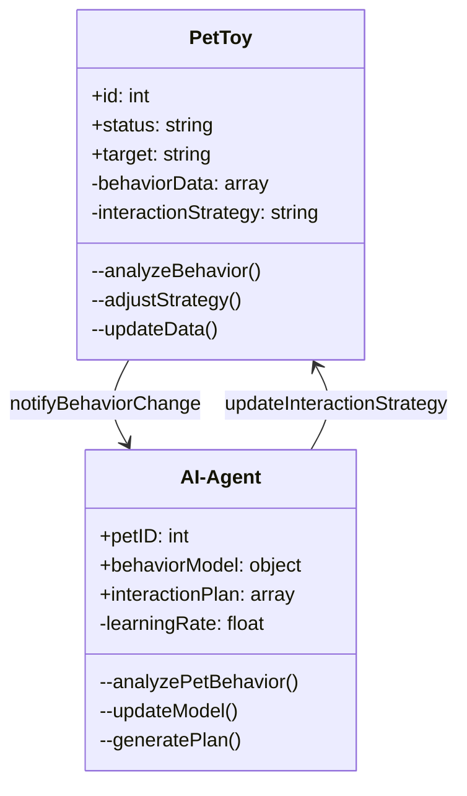
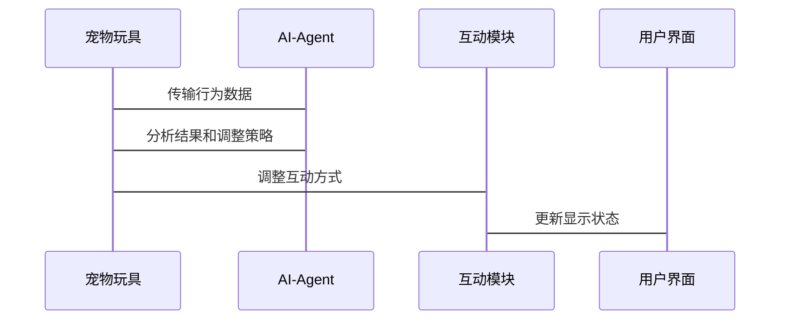

                 


# 智能宠物玩具：AI Agent的宠物智力开发

> 关键词：智能宠物玩具，AI Agent，宠物智力开发，强化学习，自然语言处理，系统架构设计

> 摘要：本文探讨了AI Agent在宠物玩具中的应用，分析了宠物智力开发的重要性，详细讲解了AI Agent的核心算法与系统架构设计，并通过实际案例展示了如何通过智能宠物玩具促进宠物智力的提升。文章从背景介绍、核心概念、算法原理、系统设计到项目实战，层层递进，为读者提供全面的技术解析。

---

# 第一部分: 智能宠物玩具与AI Agent的背景介绍

# 第1章: 智能宠物玩具的背景与问题背景

## 1.1 智能宠物玩具的背景

### 1.1.1 传统宠物玩具的局限性
传统宠物玩具通常缺乏互动性和智能化，难以满足宠物的智力需求。例如，大多数宠物玩具仅提供单一的运动模式或简单的互动方式，无法根据宠物的行为动态调整难度或内容。

### 1.1.2 AI技术在宠物玩具中的应用潜力
随着AI技术的发展，智能宠物玩具可以通过传感器、摄像头和AI算法，实时分析宠物的行为，并动态调整玩具的互动方式。例如，智能猫玩具可以根据猫咪的好奇心和注意力，自动调整游戏节奏。

### 1.1.3 智能宠物玩具的市场现状与发展趋势
近年来，智能宠物玩具市场迅速增长，尤其在宠物主人对宠物智力开发的关注增加的情况下。未来的趋势是将AI Agent与宠物玩具深度融合，打造更加个性化和智能化的互动体验。

## 1.2 宠物智力开发的重要性

### 1.2.1 宠物智力的定义与评估标准
宠物智力通常指宠物对外界刺激的反应能力、学习能力和问题解决能力。评估标准包括宠物的学习速度、记忆能力、社交能力等。

### 1.2.2 智能宠物玩具在宠物智力开发中的作用
智能宠物玩具通过动态调整互动内容和难度，可以有效激发宠物的学习兴趣，提升其解决问题的能力。例如，智能狗玩具可以通过隐藏食物或玩具，引导狗狗进行推理和探索。

### 1.2.3 宠物智力开发的伦理与道德问题
在开发智能宠物玩具时，必须确保不会对宠物造成过度的压力或伤害。同时，宠物的智力开发应注重其自然行为和兴趣，避免强制性训练。

## 1.3 AI Agent在宠物玩具中的应用

### 1.3.1 AI Agent的定义与核心功能
AI Agent是一种智能代理，能够感知环境、理解用户需求，并通过决策和行动实现目标。在宠物玩具中，AI Agent负责分析宠物行为、调整互动策略。

### 1.3.2 AI Agent在宠物玩具中的具体应用场景
例如，AI Agent可以实时分析宠物的行为数据，动态调整玩具的互动模式。当宠物表现出兴趣时，AI Agent会增加互动的难度；当宠物感到困惑时，AI Agent会降低难度。

### 1.3.3 AI Agent与宠物玩具结合的创新点
通过AI Agent的实时反馈机制，宠物玩具能够提供个性化的互动体验，满足不同宠物的需求。

## 1.4 本章小结
本章介绍了智能宠物玩具的背景、宠物智力开发的重要性以及AI Agent在宠物玩具中的应用。AI Agent的引入为宠物玩具带来了智能化和个性化的互动体验，为宠物智力开发提供了新的可能性。

---

# 第2章: 智能宠物玩具的核心概念与联系

## 2.1 AI Agent的核心原理

### 2.1.1 AI Agent的基本概念
AI Agent通过感知环境、理解需求、决策和行动来实现目标。在宠物玩具中，AI Agent的核心功能包括行为分析、决策制定和互动反馈。

### 2.1.2 AI Agent的核心算法与技术
AI Agent的关键技术包括强化学习和自然语言处理。强化学习用于训练AI Agent的决策能力，自然语言处理用于理解和生成宠物的互动内容。

### 2.1.3 AI Agent在宠物玩具中的具体应用
例如，AI Agent可以通过分析宠物的行为数据，实时调整互动策略，确保宠物始终保持兴趣和参与度。

## 2.2 宠物智力模型的构建

### 2.2.1 宠物行为特征分析
宠物行为特征包括活动频率、注意力持续时间、互动偏好等。通过分析这些特征，可以为每只宠物定制个性化的互动策略。

### 2.2.2 宠物智力模型的设计与实现
宠物智力模型需要结合宠物的行为数据和认知能力，设计合理的评估指标和训练策略。例如，模型可以根据宠物的学习速度调整互动的难度。

### 2.2.3 宠物智力模型与AI Agent的交互机制
AI Agent通过宠物智力模型实时调整互动内容，确保宠物在适当的学习难度下保持兴趣。

## 2.3 AI Agent与宠物玩具的系统架构

### 2.3.1 系统整体架构设计
智能宠物玩具系统通常包括传感器模块、AI Agent模块、互动模块和用户界面模块。各模块通过数据接口进行交互。

### 2.3.2 系统功能模块与交互关系
- **传感器模块**：收集宠物的行为数据，如动作频率、注意力时间等。
- **AI Agent模块**：分析数据，制定互动策略。
- **互动模块**：根据策略调整玩具的互动方式。
- **用户界面模块**：提供用户控制和反馈。

### 2.3.3 系统的可扩展性与灵活性
系统架构设计注重模块化和可扩展性，便于未来添加新的功能或改进现有模块。

## 2.4 本章小结
本章详细介绍了AI Agent的核心原理、宠物智力模型的构建以及智能宠物玩具的系统架构。通过系统化的设计，AI Agent能够为宠物提供个性化的互动体验，促进其智力发展。

---

# 第3章: AI Agent的核心算法与数学模型

## 3.1 强化学习算法

### 3.1.1 强化学习的基本原理
强化学习是一种通过试错机制学习策略的方法。宠物玩具中的AI Agent通过奖励机制激励宠物完成特定任务。

### 3.1.2 Q-learning算法的数学模型
$$ Q(s, a) = r + \gamma \max_{a'} Q(s', a') $$
其中，$Q(s, a)$表示在状态$s$下执行动作$a$的期望奖励，$r$是立即奖励，$\gamma$是折扣因子。

### 3.1.3 强化学习在宠物玩具中的应用案例
例如，AI Agent可以通过Q-learning算法训练宠物完成特定任务，如找到隐藏的玩具或解决谜题。

## 3.2 自然语言处理技术

### 3.2.1 NLP技术的基本原理
自然语言处理技术用于理解和生成人类语言。在宠物玩具中，NLP技术可以用于解析宠物的叫声或主人的指令。

### 3.2.2 Transformer模型的数学公式
$$ \text{Attention}(Q,K,V) = \text{softmax}\left(\frac{QK^T}{\sqrt{d_k}}\right)V $$
其中，$Q$是查询向量，$K$是键向量，$V$是值向量，$d_k$是向量维度。

### 3.2.3 NLP在宠物玩具中的应用案例
例如，AI Agent可以通过NLP技术分析宠物的叫声，理解其情绪，并调整互动策略。

## 3.3 本章小结
本章详细讲解了强化学习和自然语言处理在AI Agent中的应用，通过数学公式和案例分析，展示了这些算法在智能宠物玩具中的实际应用。

---

# 第4章: 系统分析与架构设计方案

## 4.1 问题场景介绍
智能宠物玩具需要解决的主要问题包括实时互动、个性化互动和数据管理。

## 4.2 项目介绍
本项目旨在设计一款智能宠物玩具，通过AI Agent实现与宠物的个性化互动。

## 4.3 系统功能设计

### 4.3.1 领域模型设计
使用Mermaid类图展示系统功能模块：



## 4.4 系统架构设计

### 4.4.1 系统架构图
使用Mermaid架构图展示系统架构：


## 4.5 系统接口设计

### 4.5.1 系统接口设计
- **传感器模块接口**：提供宠物行为数据的采集和传输接口。
- **AI-Agent模块接口**：提供行为分析和策略调整的API。
- **互动模块接口**：提供互动方式的调整接口。

## 4.6 系统交互设计

### 4.6.1 系统交互流程
使用Mermaid序列图展示系统交互流程：



## 4.7 本章小结
本章详细分析了智能宠物玩具的系统架构和交互流程，展示了如何通过模块化设计实现个性化的互动体验。

---

# 第5章: 项目实战

## 5.1 智能猫玩具项目

### 5.1.1 项目背景
设计一款能够与猫咪互动的智能玩具，通过AI Agent分析猫咪的行为，动态调整互动内容。

### 5.1.2 环境配置
- **硬件**：摄像头、传感器、电动马达
- **软件**：Python、TensorFlow、OpenCV

### 5.1.3 核心代码实现
```python
import tensorflow as tf
from tensorflow.keras import layers

# 定义强化学习模型
class AI-Agent(tf.keras.Model):
    def __init__(self):
        super(AI-Agent, self).__init__()
        self.dense1 = layers.Dense(64, activation='relu')
        self.dense2 = layers.Dense(1, activation='linear')

    def call(self, inputs):
        x = self.dense1(inputs)
        return self.dense2(x)

# 训练过程
def train_model(model, x_train, y_train):
    optimizer = tf.keras.optimizers.Adam()
    loss = tf.keras.losses.MeanSquaredError()
    model.compile(optimizer=optimizer, loss=loss)
    model.fit(x_train, y_train, epochs=100)
```

### 5.1.4 项目总结
通过强化学习模型，AI Agent能够根据猫咪的行为数据，动态调整互动内容，有效提升猫咪的注意力和学习兴趣。

## 5.2 智能狗项圈项目

### 5.2.1 项目背景
设计一款智能狗项圈，通过AI Agent分析狗狗的运动轨迹和行为模式，制定个性化的互动策略。

### 5.2.2 核心代码实现
```python
import numpy as np
from transformers import pipeline

# 定义自然语言处理模块
nlp = pipeline("text-classification")

# 行为分析函数
def analyze_behavior(text):
    result = nlp(text)
    return result

# 生成互动策略
def generate_plan(text):
    analysis = analyze_behavior(text)
    return analysis
```

### 5.2.3 项目总结
通过自然语言处理技术，AI Agent能够理解狗狗的行为模式，并生成个性化的互动策略，有效提升狗狗的智力开发效果。

## 5.3 本章小结
本章通过两个实际案例展示了智能宠物玩具的实现过程，从环境配置到代码实现，详细讲解了如何将AI Agent应用于宠物玩具的设计中。

---

# 第6章: 最佳实践与总结

## 6.1 最佳实践 tips
- 在设计智能宠物玩具时，应注重模块化设计，便于后续功能扩展。
- 强化学习和自然语言处理是实现AI Agent的核心技术，需熟练掌握。
- 系统架构设计应注重数据的安全性和隐私保护，避免宠物数据泄露。

## 6.2 小结
通过本文的详细讲解，读者可以了解AI Agent在宠物玩具中的应用，掌握核心算法和系统架构设计的方法，并能够通过实际案例实现智能宠物玩具的设计与开发。

## 6.3 注意事项
- 在实际应用中，需确保宠物玩具的安全性，避免对宠物造成伤害。
- 系统设计应考虑宠物的个体差异，提供个性化的互动体验。
- 数据收集和处理应遵循相关法律法规，保护宠物隐私。

## 6.4 拓展阅读
- 《强化学习：理论与应用》
- 《自然语言处理实战：Python核心技术与案例分析》
- 《系统架构设计：复杂系统的构建与管理》

---

# 结语
智能宠物玩具通过AI Agent的引入，为宠物智力开发提供了新的可能性。本文从背景介绍、核心概念、算法原理到系统设计和项目实战，详细讲解了智能宠物玩具的设计与实现过程。希望本文能够为读者提供有价值的参考，激发更多创新性的研究和应用。

---

