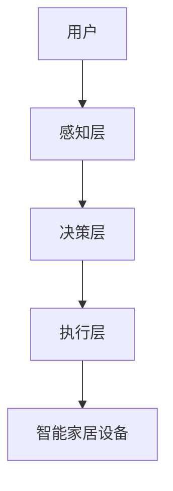
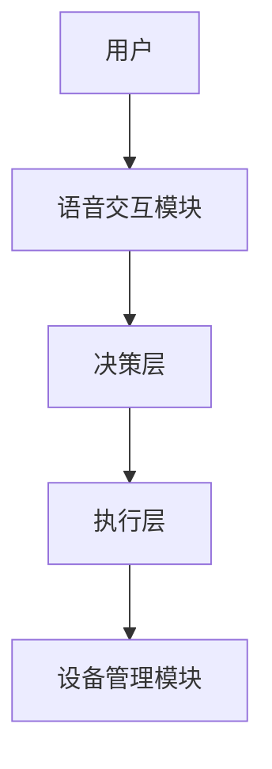
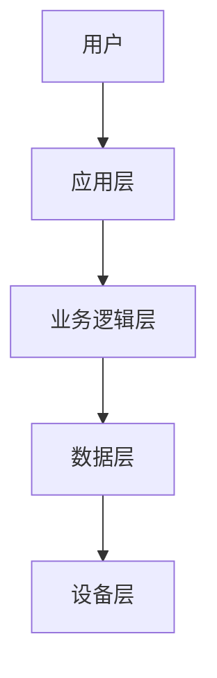

                 


# 目录大纲：智能家居AI Agent：打造智能生活管家

---

## 第一部分: 智能家居AI Agent基础

### 第1章: 智能家居与AI Agent概述

#### 1.1 智能家居的概念与现状
- 1.1.1 智能家居的定义
  - 智能家居的定义和范围
  - 智能家居的核心技术
- 1.1.2 智能家居的发展历程
  - 智能家居的历史演变
  - 技术进步对智能家居的影响
- 1.1.3 当前智能家居的市场现状
  - 市场规模和增长趋势
  - 主流产品和品牌分析

#### 1.2 AI Agent的基本概念
- 1.2.1 什么是AI Agent
  - AI Agent的定义和特征
  - AI Agent与传统软件的区别
- 1.2.2 AI Agent的核心特征
  - 智能性、自主性、反应性、社交性
- 1.2.3 AI Agent与智能家居的结合
  - 智能家居中AI Agent的应用场景
  - AI Agent在智能家居中的角色和功能

#### 1.3 智能家居AI Agent的优势与挑战
- 1.3.1 AI Agent在智能家居中的优势
  - 提高生活便利性
  - 实现设备协同工作
- 1.3.2 当前存在的主要挑战
  - 数据隐私问题
  - 技术标准化问题
  - 用户接受度和使用习惯问题
- 1.3.3 未来的发展趋势
  - 技术融合趋势
  - 用户体验优化趋势

### 第2章: 智能家居AI Agent的核心概念与联系

#### 2.1 AI Agent的核心原理
- 2.1.1 感知层
  - 数据采集与处理
  - 常见的感知设备及其功能
- 2.1.2 决策层
  - 算法处理与决策
  - 决策逻辑的设计与优化
- 2.1.3 执行层
  - 系统执行与反馈
  - 执行过程中的异常处理

#### 2.2 核心概念对比表
| 概念       | 描述                                   | 示例                         |
|------------|--------------------------------------|------------------------------|
| 感知层     | 数据采集与处理                       | 智能音箱接收语音指令         |
| 决策层     | 算法处理与决策                       | 根据用户需求调用相应服务     |
| 执行层     | 系统执行与反馈                       | 调整智能家居设备状态         |

#### 2.3 实体关系图


---

## 第二部分: 智能家居AI Agent的算法原理

### 第3章: 自然语言处理在AI Agent中的应用

#### 3.1 自然语言处理（NLP）的核心算法
- 3.1.1 分词算法
  - 基于统计的分词方法
  - 基于规则的分词方法
- 3.1.2 语法分析
  - 依存句法分析
  - 语法树的构建
- 3.1.3 情感分析
  - 基于词袋模型的情感分类
  - 基于深度学习的情感分析

#### 3.2 基于NLP的意图识别
- 3.2.1 意图识别的流程
  - 文本预处理
  - 模型训练与测试
- 3.2.2 意图识别的数学模型
  - 朴素贝叶斯模型
  - 支持向量机（SVM）模型
- 3.2.3 案例分析
  - 用户指令“打开客厅灯”的处理流程

### 第4章: 强化学习在AI Agent中的应用

#### 4.1 强化学习的基本原理
- 4.1.1 强化学习的定义
  - 奖励机制
  - 状态空间和动作空间
- 4.1.2 Q-learning算法
  - Q值更新公式
  - 探索与利用策略
- 4.1.3 策略梯度方法
  - 策略梯度的数学表达

#### 4.2 在智能家居中的应用
- 4.2.1 设备控制的优化
  - 自动调节室内温度
  - 智能选择最优设备组合
- 4.2.2 用户习惯的学习与适应
  - 基于强化学习的用户行为建模
  - 动态调整系统响应策略

#### 4.3 实验分析
- 4.3.1 不同算法的性能对比
  - Q-learning与策略梯度方法的效果对比
- 4.3.2 实验结果与优化建议
  - 算法参数的调整
  - 系统性能的提升策略

---

## 第三部分: 智能家居AI Agent的系统架构设计

### 第5章: 智能家居AI Agent的系统分析

#### 5.1 系统功能需求分析
- 5.1.1 用户需求分析
  - 基础功能需求
  - 高级功能需求
- 5.1.2 功能模块划分
  - 语音交互模块
  - 设备控制模块
  - 数据管理模块
- 5.1.3 系统功能流程图


#### 5.2 系统性能需求分析
- 5.2.1 响应时间要求
  - 语音交互的延迟控制
  - 设备控制的实时性
- 5.2.2 系统可扩展性
  - 模块化设计
  - 扩展新设备的接口设计
- 5.2.3 系统安全性
  - 数据加密与保护
  - 权限管理

### 第6章: 智能家居AI Agent的架构设计

#### 6.1 系统架构设计
- 6.1.1 分层架构
  - 数据层
  - 业务逻辑层
  - 表示层
- 6.1.2 微服务架构
  - 服务划分与交互
  - 服务间的通信机制
- 6.1.3 混合架构
  - 结合分层和微服务的优点

#### 6.2 系统架构图


#### 6.3 系统接口设计
- 6.3.1 API设计
  - RESTful API
  - WebSocket实时通信
- 6.3.2 接口文档
  - API的输入输出定义
  - 接口的版本控制

### 第7章: 智能家居AI Agent的交互设计

#### 7.1 人机交互界面设计
- 7.1.1 用户界面设计
  - 移动端App设计
  - 智能音箱的交互设计
- 7.1.2 交互流程设计
  - 用户发起指令
  - 系统处理并反馈结果

#### 7.2 交互逻辑设计
- 7.2.1 语音识别流程
  - 语音采集与预处理
  - 语音识别与理解
- 7.2.2 反馈机制设计
  - 多模态反馈（语音、文字、灯光）
  - 错误处理与重试机制

---

## 第四部分: 智能家居AI Agent的项目实战

### 第8章: 智能家居AI Agent的环境搭建与核心代码实现

#### 8.1 环境搭建
- 8.1.1 开发工具安装
  - Python、Jupyter Notebook
  - 虚拟环境配置（如virtualenv）
- 8.1.2 开发框架选择
  - 深度学习框架（如TensorFlow、PyTorch）
  - 自然语言处理库（如spaCy、NLTK）
- 8.1.3 依赖库安装
  - pip install numpy
  - pip install scikit-learn
  - pip install transformers

#### 8.2 核心代码实现
- 8.2.1 语音识别模块
  - 使用Kaldi或Snowboy进行语音识别
  - 代码示例：
    ```python
    import speech_recognition as sr
    r = sr.Recognizer()
    audio_file = sr.AudioFile("input.wav")
    with audio_file as source:
        audio = r.record(source)
    try:
        text = rrecognize_google(audio, language='zh-CN')
        print(text)
    except Exception as e:
        print("Error:", str(e))
    ```

- 8.2.2 意图识别模块
  - 使用预训练的BERT模型进行文本分类
  - 代码示例：
    ```python
    from transformers import BertTokenizer, BertModel
    tokenizer = BertTokenizer.from_pretrained('bert-base-chinese')
    model = BertModel.from_pretrained('bert-base-chinese')
    inputs = tokenizer("打开客厅灯", return_tensors='np')
    outputs = model(**inputs)
    last_layer = outputs.last_hidden_state[:, 0, :]
    pooled_output = last_layer.mean(dim=1)
    print(pooled_output)
    ```

- 8.2.3 设备控制模块
  - 使用MQTT协议与智能家居设备通信
  - 代码示例：
    ```python
    import paho.mqtt.client as mqtt
    def on_connect(client, userdata, rc):
        print("Connected with result code " + str(rc))
    client = mqtt.Client()
    client.on_connect = on_connect
    client.connect("localhost", 1883)
    client.publish("home/lights", "on")
    ```

#### 8.3 代码解读与分析
- 8.3.1 语音识别模块
  - 音频文件的读取与预处理
  - 调用Google语音识别API
  - 错误处理与反馈
- 8.3.2 意图识别模块
  - 文本的分词与向量化
  - 模型的加载与推理
  - 池化操作与结果输出
- 8.3.3 设备控制模块
  - MQTT协议的配置与连接
  - 发布设备控制指令
  - 订阅设备状态反馈

#### 8.4 项目实战案例分析
- 8.4.1 案例背景
  - 模拟用户通过语音指令控制智能灯泡
- 8.4.2 实现步骤
  - 语音识别：用户说“打开客厅灯”
  - 意图识别：识别出用户的意图是打开灯
  - 设备控制：通过MQTT协议发送指令到智能灯泡
  - 状态反馈：灯泡状态变为“开”

#### 8.5 项目小结
- 8.5.1 项目实现的关键点
  - 语音识别的准确率优化
  - 意图识别模型的训练与调优
  - 设备控制的稳定性与可靠性
- 8.5.2 可能遇到的问题与解决方案
  - 网络问题：本地搭建MQTT代理服务器
  - 设备兼容性问题：支持多种设备协议的适配

---

## 第五部分: 智能家居AI Agent的未来趋势与最佳实践

### 第9章: 智能家居AI Agent的未来发展趋势

#### 9.1 技术融合趋势
- 9.1.1 AI与物联网的深度融合
  - 边缘计算与AI的结合
  - 更智能的设备协同工作
- 9.1.2 多模态交互技术的发展
  - 视觉、听觉、触觉的多模态交互
  - 更自然的人机交互方式
- 9.1.3 5G技术的应用
  - 高速、低延迟的网络支持
  - 实现实时的高清视频交互

#### 9.2 用户体验优化趋势
- 9.2.1 个性化服务
  - 根据用户的习惯提供定制化服务
  - 动态调整系统行为
- 9.2.2 系统的可解释性
  - 提供透明的决策过程
  - 解释AI的决策逻辑
- 9.2.3 安全与隐私保护
  - 数据加密与安全传输
  - 用户隐私的严格保护

#### 9.3 市场与生态建设
- 9.3.1 开源社区的发展
  - 开源项目的兴起与应用
  - 社区贡献与协作
- 9.3.2 产业链的整合
  - 系统集成商的角色
  - 设备厂商的合作与竞争
- 9.3.3 商业模式的创新
  - 付费订阅模式
  - 数据变现的探索

### 第10章: 智能家居AI Agent的最佳实践

#### 10.1 技术层面的建议
- 10.1.1 算法优化
  - 使用更高效的算法结构
  - 优化模型的训练效率
- 10.1.2 系统架构优化
  - 微服务架构的优化
  - 系统的可扩展性设计
- 10.1.3 数据处理优化
  - 数据的高效存储与检索
  - 数据的实时分析与处理

#### 10.2 应用层面的建议
- 10.2.1 用户体验优化
  - 提供更人性化的交互界面
  - 支持多种交互方式
- 10.2.2 设备管理优化
  - 设备的自动发现与配置
  - 设备的远程监控与维护
- 10.2.3 安全与隐私保护
  - 数据加密与安全传输
  - 用户权限的严格管理

#### 10.3 业务层面的建议
- 10.3.1 产品定位与市场细分
  - 针对不同用户群体设计产品
  - 提供差异化服务
- 10.3.2 服务模式创新
  - 从产品销售到服务订阅
  - 提供增值服务与附加功能
- 10.3.3 售后服务与支持
  - 提供7x24小时的在线支持
  - 建立用户反馈机制

---

## 第六部分: 附录

### 附录A: 术语表
- AI Agent
- 智能家居
- 自然语言处理
- 强化学习
- 微服务架构

### 附录B: 工具安装指南
- Python安装与配置
- 虚拟环境的使用
- 开发框架的安装与配置

### 附录C: 参考文献
- 国内外相关研究文献
- 技术博客与开发者文档
- 开源项目的代码仓库

---

# 总结

智能家居AI Agent作为智能生活的核心枢纽，正在逐步改变我们的生活方式。通过本文的详细讲解，我们不仅了解了智能家居AI Agent的核心概念与技术实现，还通过实际案例展示了其在现实中的应用场景。未来，随着技术的不断进步和应用场景的拓展，智能家居AI Agent将变得更加智能、便捷和安全，为用户带来更加舒适和高效的生活体验。

