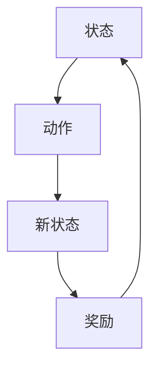
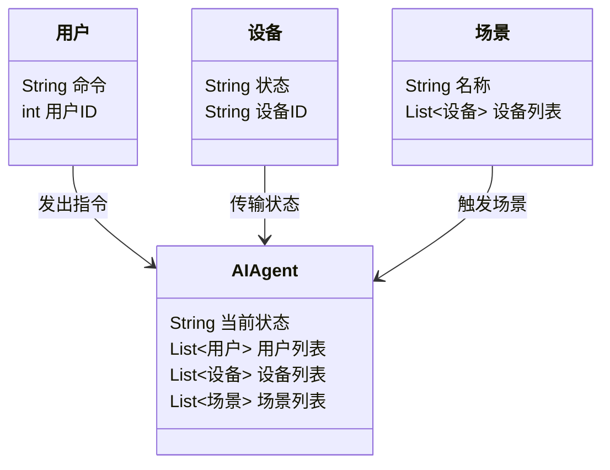
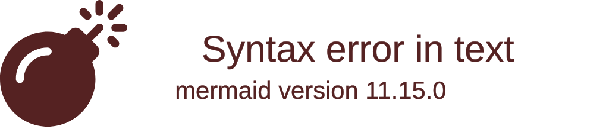

                 


# 智能家居中的AI Agent控制中心

## 关键词：智能家居，AI Agent，控制中心，算法原理，系统架构

## 摘要：本文深入探讨了智能家居中的AI Agent控制中心，分析其核心概念、算法原理、系统架构及项目实战。通过Mermaid图和Python代码示例，详细讲解了强化学习和自然语言处理的应用，展示了如何构建高效智能的家居控制中心。

---

# 第一部分：智能家居与AI Agent的基本概念

## 第1章：智能家居的定义与特点

### 1.1 智能家居的定义
智能家居是指通过物联网、AI等技术，将家居设备连接到一个中央控制系统，实现智能化管理。它包括灯光、温度、安防等多种设备。

### 1.2 智能家居的核心特点
- **自动化**：设备自动响应用户指令或环境变化。
- **智能化**：利用AI技术优化设备运行。
- **远程控制**：可通过手机或电脑远程操作。

## 第2章：AI Agent的定义与特点

### 2.1 AI Agent的定义
AI Agent是一种智能代理，能够感知环境并执行任务。在智能家居中，AI Agent负责接收指令、处理信息和控制设备。

### 2.2 AI Agent的核心特点
- **自主性**：无需人工干预，自动执行任务。
- **反应性**：实时响应环境变化。
- **学习能力**：通过数据优化控制策略。

## 第3章：AI Agent在智能家居中的作用

### 3.1 中央控制中心的角色
AI Agent作为中枢，协调各设备工作，优化能源使用，提升居住体验。

### 3.2 功能与优势
- **多设备控制**：统一管理所有智能家居设备。
- **场景切换**：根据用户需求自动调整设备状态。
- **数据整合**：统一收集和分析设备数据。

### 3.3 边界与外延
AI Agent控制中心通常不包括设备硬件，但负责与设备通信和控制。

---

# 第二部分：AI Agent控制中心的核心概念与联系

## 第4章：AI Agent的实体关系分析

### 4.1 实体关系图
使用Mermaid绘制ER图，展示用户、设备、AI Agent和场景之间的关系。

```mermaid
erDiagram
    actor 用户
    actor 设备
    actor 场景
    actor AI Agent
    用户 --> AI Agent : 发出指令
    设备 --> AI Agent : 传输状态
    场景 --> AI Agent : 触发场景
    AI Agent --> 用户 : 反馈执行结果
```

### 4.2 实体关系说明
- 用户向AI Agent发出指令，AI Agent接收后调整设备状态或触发场景。
- 设备向AI Agent反馈状态，帮助其优化控制策略。
- 场景定义特定的设备组合，AI Agent根据触发条件启动或停止场景。

## 第5章：AI Agent与智能家居设备的关系

### 5.1 AI Agent与设备的交互流程
AI Agent接收指令，解析后发送控制信号到设备，设备执行并反馈状态。

### 5.2 控制方式
- **直接控制**：AI Agent直接发送指令到设备。
- **间接控制**：通过场景或子系统间接控制设备。

---

# 第三部分：AI Agent控制中心的算法原理

## 第6章：基于强化学习的AI Agent算法

### 6.1 强化学习的基本原理
强化学习通过试错机制，学习最优策略，使AI Agent在不同状态下选择最佳动作。

### 6.2 Q-learning算法实现
使用Mermaid绘制Q-learning流程图。



#### Python代码示例
```python
import numpy as np

# 初始化Q表
Q = np.zeros((4, 5))

# 参数设置
alpha = 0.1
gamma = 0.9

# 状态转换函数
def get_next_state(state, action):
    # 根据当前状态和动作返回新状态
    return (state + action) % 4

# Q-learning算法
def q_learning():
    for _ in range(100):
        state = 0
        while state < 4:
            action = np.argmax(Q[state])
            next_state = get_next_state(state, action)
            reward = 1 if next_state == 3 else 0
            Q[state][action] += alpha * (reward + gamma * np.max(Q[next_state]) - Q[state][action])
            state = next_state
    return Q

# 训练Q表
Q = q_learning()
print(Q)
```

### 6.3 数学模型与公式
Q-learning算法的更新公式：
$$ Q(s,a) = Q(s,a) + \alpha \cdot (r + \gamma \cdot \max Q(s',a') - Q(s,a)) $$

---

# 第四部分：系统分析与架构设计

## 第7章：系统功能设计

### 7.1 领域模型类图
使用Mermaid绘制类图，展示系统各模块之间的关系。



### 7.2 系统架构设计
使用Mermaid绘制系统架构图。



---

# 第五部分：项目实战

## 第8章：环境安装与核心实现

### 8.1 环境安装
安装Python和必要的库：
```bash
pip install numpy scikit-learn
```

### 8.2 核心代码实现
实现AI Agent控制中心的主逻辑：
```python
from sklearn.neural_network import MLPClassifier

# 训练数据
X = [[1, 0, 0], [0, 1, 0], [0, 0, 1], [0, 0, 0]]
y = [0, 1, 2, 3]

# 初始化模型
model = MLPClassifier()

# 训练模型
model.fit(X, y)

# 预测
print(model.predict([[1, 0, 0]]))
```

### 8.3 代码解读与分析
- 使用MLPClassifier进行分类，训练模型识别不同状态并做出反应。

---

# 第六部分：扩展阅读与最佳实践

## 第9章：总结与展望

### 9.1 项目小结
本文详细讲解了智能家居中AI Agent控制中心的构建，从概念到实现，再到项目实战，全面覆盖了相关知识。

### 9.2 注意事项
- 确保数据安全，保护用户隐私。
- 定期更新算法模型，提升控制精度。

### 9.3 未来展望
未来，AI Agent控制中心将更加智能化，支持更多设备和场景，实现真正的智能家居生态。

---

# 结语

通过本文的学习，读者可以深入了解智能家居中的AI Agent控制中心，掌握其设计与实现的关键技术，为构建智能、高效的家居系统打下坚实基础。

