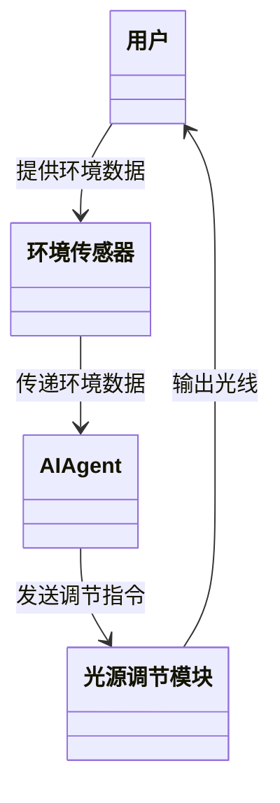
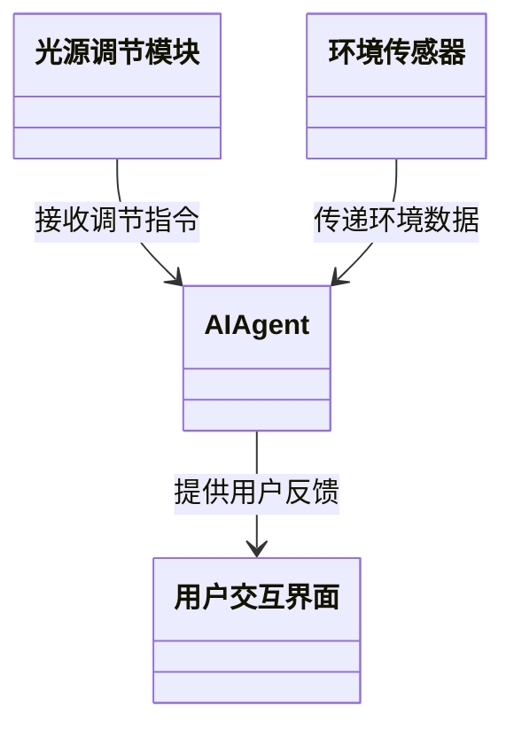
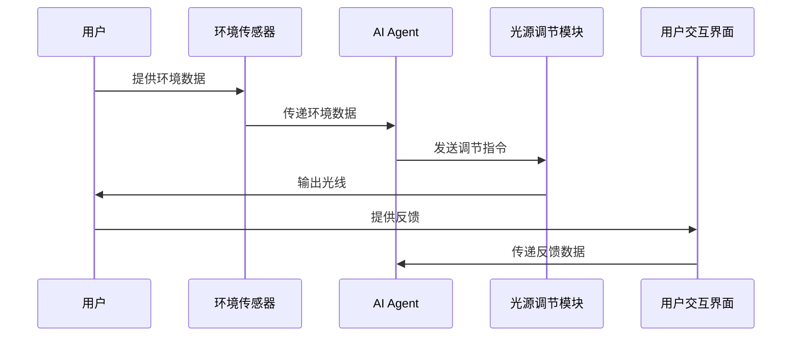

                 


# 智能工作台灯：AI Agent的照明优化与护眼模式

> 关键词：智能台灯，AI Agent，照明优化，护眼模式，光线调节，健康照明

> 摘要：本文深入探讨了智能工作台灯的设计与实现，结合AI Agent技术，分析了其在照明优化与护眼模式中的应用。通过详细的技术分析和系统设计，展示了如何利用AI技术提升照明系统的智能化水平，确保用户在不同场景下的视觉舒适性与健康。

---

## 第一部分: 背景介绍与核心概念

### 第1章: 智能工作台灯的发展背景

#### 1.1 传统台灯的局限性
##### 1.1.1 照明效率低下
传统台灯的光源设计存在诸多问题。例如，大多数台灯使用的是单一色温的LED灯泡，无法根据环境光线自动调节亮度和色温，导致在不同光照条件下，用户的眼睛容易疲劳。此外，传统台灯的光线分布不均匀，容易造成视觉盲区，影响工作效率。

##### 1.1.2 光源对眼睛的影响
长时间使用传统台灯容易导致眼睛疲劳、视力下降等问题。研究表明，蓝光波长的光对眼睛的伤害较大，尤其是在夜晚使用高色温的光源会抑制褪黑激素的分泌，影响睡眠质量。

##### 1.1.3 使用场景的多样性
现代工作场景多样化，用户在不同的时间、地点和环境下使用台灯的需求也不同。例如，在办公室需要高强度的专注照明，在家庭环境中需要柔和的光线，在夜间需要低光但舒适的光源。传统台灯无法满足这些多样化的需求。

#### 1.2 AI Agent技术的引入
##### 1.2.1 AI Agent的基本概念
AI Agent（人工智能代理）是指能够感知环境、做出决策并执行动作的智能实体。它可以自主地完成任务，无需人工干预。AI Agent的核心能力包括感知、推理、决策和执行。

##### 1.2.2 AI Agent在智能设备中的应用
AI Agent在智能家居、智能安防、智能医疗等领域有广泛应用。通过AI Agent技术，设备可以实时感知环境变化，自主调整工作状态，为用户提供更智能、更便捷的服务。

##### 1.2.3 AI Agent的优势与特点
AI Agent的优势在于其智能化和自主性。它能够通过传感器实时采集环境数据，结合预设的算法模型，快速做出最优决策，并通过执行机构实现目标。与传统设备相比，AI Agent能够显著提升设备的智能化水平，优化用户体验。

#### 1.3 照明与健康的关联
##### 1.3.1 照明对眼睛的影响
光线的亮度、色温和照射角度都会对眼睛产生重要影响。例如，过强的光线会刺眼，过弱的光线会导致疲劳，而蓝光波长的光更容易导致眼睛疲劳和视力下降。

##### 1.3.2 不同场景下的光线需求
在不同的场景下，光线的需求也不同。例如，在办公场景中，需要高强度、均匀分布的光线以提高工作效率；在阅读场景中，需要柔和、稳定的光线以保护眼睛；在夜间场景中，需要低亮度、低色温的光线以减少对睡眠的影响。

##### 1.3.3 护眼模式的重要性
护眼模式是一种通过调节光线的亮度、色温和照射角度，以减少眼睛疲劳的照明模式。它是智能台灯的重要功能之一，能够显著提升用户体验，尤其适合长时间使用电子设备的用户。

---

### 第2章: 智能工作台灯的核心概念

#### 2.1 AI Agent在智能台灯中的作用
##### 2.1.1 AI Agent的定义与功能
在智能台灯中，AI Agent负责感知环境光线变化、分析用户需求，并通过调节光源参数来实现最优的照明效果。它能够根据用户的行为模式和环境条件，动态调整台灯的亮度、色温和照射角度。

##### 2.1.2 AI Agent与智能台灯的结合
AI Agent通过集成光线传感器、人体传感器和环境数据采集器，实时感知用户的行为和环境条件。例如，当用户开始工作时，AI Agent会自动调整光线亮度；当用户休息时，AI Agent会降低光线亮度，营造舒适的休息环境。

##### 2.1.3 AI Agent的核心算法
AI Agent的核心算法包括光线感知算法、用户行为分析算法和光线调节算法。这些算法通过协同工作，实现智能台灯的自主调节功能。

#### 2.2 照明优化的数学模型
##### 2.2.1 照明强度的计算公式
照明强度的计算公式如下：
$$ I = k \cdot (L + D) $$
其中，\( I \) 表示最终的照明强度，\( L \) 表示环境光照强度，\( D \) 表示用户需求光照强度，\( k \) 是一个比例常数。

##### 2.2.2 光源色温的调节算法
光源色温的调节算法基于用户的行为模式和环境条件。例如，当用户处于工作状态时，AI Agent会将色温调整为冷色调以提高专注力；当用户处于休息状态时，AI Agent会将色温调整为暖色调以营造舒适的氛围。

##### 2.2.3 光照均匀性的数学模型
光照均匀性的数学模型如下：
$$ U = \frac{\sum_{i=1}^{n} I_i}{n} $$
其中，\( U \) 表示光照均匀性，\( I_i \) 表示第 \( i \) 个区域的光照强度，\( n \) 表示区域总数。

#### 2.3 护眼模式的设计原理
##### 2.3.1 蓝光过滤技术
蓝光过滤技术通过调整光源的色温，减少蓝光的输出，从而降低蓝光对眼睛的伤害。例如，当用户在夜间使用台灯时，AI Agent会自动开启蓝光过滤模式，将色温调整为暖色调。

##### 2.3.2 调节频率与亮度
护眼模式通过调节光源的闪烁频率和亮度，减少眼睛疲劳。例如，AI Agent会将光源的闪烁频率调整为50Hz以上，避免人眼感知到频闪。

##### 2.3.3 个性化护眼方案
个性化护眼方案基于用户的行为习惯和健康数据，提供定制化的护眼模式。例如，用户可以设置不同的护眼模式，根据自己的需求调整光线参数。

---

### 第3章: 智能工作台灯的核心算法

#### 3.1 光线感知与环境适应
##### 3.1.1 光线传感器的工作原理
光线传感器通过检测环境中的光线强度，将数据传递给AI Agent。AI Agent根据光线强度，调整光源的亮度和色温。

##### 3.1.2 环境光线的采集与分析
AI Agent通过光线传感器采集环境光线数据，并结合用户的行为模式，分析用户的光线需求。例如，当用户处于阅读状态时，AI Agent会增加光线亮度；当用户处于休息状态时，AI Agent会降低光线亮度。

##### 3.1.3 光线调节的反馈机制
光线调节的反馈机制通过实时监测用户的行为和环境条件，动态调整光源参数。例如，当用户的眼睛长时间处于疲劳状态时，AI Agent会触发护眼模式，自动调整光线参数。

#### 3.2 AI Agent的决策算法
##### 3.2.1 基于机器学习的决策模型
AI Agent的决策模型基于机器学习算法，通过训练数据学习用户的行为模式和环境条件。例如，AI Agent可以通过监督学习算法，学习用户的光照偏好。

##### 3.2.2 照度优化的数学公式
照度优化的数学公式如下：
$$ I_{\text{opt}} = \argmin_{I} \left( \sum_{i=1}^{n} (I_i - I_{\text{target}})^2 \right) $$
其中，\( I_{\text{opt}} \) 表示优化后的光照强度，\( I_{\text{target}} \) 表示目标光照强度。

##### 3.2.3 多目标优化算法
多目标优化算法通过同时优化多个目标函数，实现最优的光源调节。例如，AI Agent可以通过多目标优化算法，在满足亮度、色温和照射角度等多个约束条件下，实现最优的光源调节。

#### 3.3 执行与反馈机制
##### 3.3.1 光源调节的执行流程
光源调节的执行流程包括：采集环境数据、分析用户需求、计算最优参数、调整光源参数和反馈执行结果。

##### 3.3.2 用户反馈的采集与处理
用户反馈的采集与处理通过传感器和用户输入设备完成。例如，用户可以通过触摸屏或语音指令，调整光源参数。

##### 3.3.3 系统的自适应优化
系统的自适应优化通过不断学习用户的反馈数据，优化光源调节算法。例如，AI Agent可以通过强化学习算法，不断优化光源调节策略，提升用户体验。

---

## 第四章: 系统分析与架构设计

### 4.1 问题场景介绍
智能工作台灯需要在不同的场景下，动态调节光源参数，满足用户的多样化需求。例如，在办公场景中，需要高强度的专注照明；在阅读场景中，需要柔和的护眼照明；在夜间场景中，需要低亮度的舒适照明。

### 4.2 项目介绍
本项目旨在设计一款基于AI Agent的智能工作台灯，通过实时感知环境光线和用户行为，动态调节光源参数，实现最优的照明效果。项目的核心目标包括：提高照明效率、保护用户视力、优化用户体验。

### 4.3 系统功能设计
#### 4.3.1 领域模型
领域模型展示了系统的核心功能模块及其交互关系。如下图所示：



#### 4.3.2 系统架构设计
系统架构设计展示了系统的整体结构和模块之间的关系。如下图所示：



#### 4.3.3 系统交互设计
系统交互设计展示了用户与系统之间的交互流程。如下图所示：



---

## 第五章: 项目实战

### 5.1 环境安装
为了实现智能工作台灯的功能，需要安装以下环境和工具：
- Python编程语言
- OpenCV库用于图像处理
- TensorFlow框架用于机器学习
- Raspberry Pi单片机用于硬件控制
- 光线传感器、LED光源和其他硬件设备

### 5.2 核心实现
以下是光源调节模块的核心实现代码：

```python
import cv2
import numpy as np
from tensorflow import keras

class LightAdjuster:
    def __init__(self):
        self.sensor = cv2.VideoCapture(0)
        self.model = keras.models.load_model('light_model.h5')
    
    def get_light_level(self):
        ret, frame = self.sensor.read()
        if not ret:
            return 0
        gray = cv2.cvtColor(frame, cv2.COLOR_BGR2GRAY)
        brightness = np.mean(gray)
        return int(brightness)
    
    def adjust_light(self, target_brightness):
        current_brightness = self.get_light_level()
        adjustment = target_brightness - current_brightness
        if adjustment > 0:
            # Increase brightness
            pass
        else:
            # Decrease brightness
            pass

# 示例用法
light_adjuster = LightAdjuster()
target_brightness = 120
light_adjuster.adjust_light(target_brightness)
```

### 5.3 案例分析
假设用户在夜间使用台灯，AI Agent会自动开启护眼模式，将光源色温调整为暖色调，并减少蓝光输出。同时，AI Agent会根据用户的阅读习惯，动态调整光线亮度，确保用户阅读舒适。

---

## 第六章: 最佳实践与小结

### 6.1 小结
通过本文的分析与实践，我们深入探讨了智能工作台灯的设计与实现。基于AI Agent技术，智能工作台灯能够根据环境光线和用户需求，动态调节光源参数，显著提升用户的视觉舒适性和工作效率。

### 6.2 注意事项
在实际应用中，需要注意以下几点：
1. 确保光线传感器的准确性，避免因传感器误差导致的调节误差。
2. 定期更新AI Agent的算法模型，提升系统的自适应能力。
3. 提供用户友好的交互界面，方便用户调整和设置光源参数。

### 6.3 拓展阅读
对于感兴趣的技术细节，读者可以进一步阅读以下资料：
- 《基于AI的智能设备设计》
- 《机器学习在光照调节中的应用》
- 《人体工学与照明设计》

---

通过本文的深入分析，我们展示了如何利用AI技术提升照明系统的智能化水平，为用户创造更舒适、更健康的照明环境。未来，随着AI技术的不断发展，智能工作台灯将具备更多功能，为用户带来更优质的服务。

