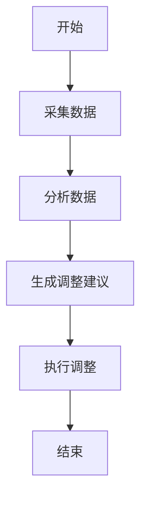
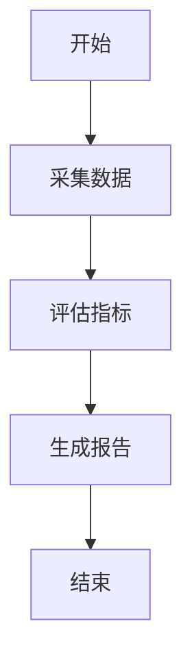
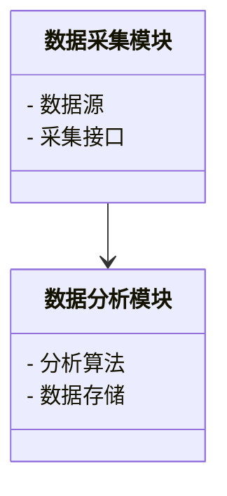

                 


# 智能工作台：AI Agent的人体工程学调整

> 关键词：智能工作台，AI Agent，人体工程学，优化算法，系统架构，项目实战

> 摘要：本文探讨了AI Agent在智能工作台中的人体工程学调整，分析了其核心原理、算法设计、系统架构，并通过实际案例展示了如何通过AI技术优化工作环境，提升效率和舒适度。

---

# 第一部分: 背景介绍

## 第1章: 智能工作台与AI Agent概述

### 1.1 问题背景
#### 1.1.1 工作环境中的效率问题
现代工作环境复杂多样，员工长时间面对电脑、键盘和鼠标，容易出现颈椎病、腰椎病等职业病。这些问题不仅影响员工健康，还降低了工作效率。

#### 1.1.2 人体工程学的基本概念
人体工程学是研究人与工具、环境之间的关系，通过优化工具和工作流程，减少疲劳和受伤的风险。

#### 1.1.3 AI Agent在工作环境中的应用现状
AI Agent（智能代理）通过学习用户行为和环境数据，提供个性化的工作环境调整建议，已在办公自动化、智能家居等领域得到应用。

### 1.2 问题描述
#### 1.2.1 智能工作台的核心问题
如何通过AI技术优化工作环境，使其适应员工的需求，减少疲劳。

#### 1.2.2 AI Agent在人体工程学调整中的作用
AI Agent可以实时分析员工的工作习惯和环境数据，自动调整桌椅高度、屏幕亮度等，优化工作姿势。

#### 1.2.3 问题的边界与外延
本文仅关注AI Agent在工作环境中的应用，不涉及家庭或其他场景。

### 1.3 问题解决
#### 1.3.1 解决方案的基本思路
通过AI算法分析员工行为，优化工作环境参数。

#### 1.3.2 解决方案的可行性分析
AI技术成熟，传感器数据获取容易，但需要考虑隐私问题。

#### 1.3.3 解决方案的创新点
结合人体工程学和AI技术，提供个性化调整方案。

## 第2章: AI Agent与人体工程学的结合

### 2.1 核心概念
#### 2.1.1 AI Agent的基本概念
AI Agent是一种能够感知环境、自主决策的智能系统。

#### 2.1.2 人体工程学的调整指标
包括坐姿、屏幕高度、键盘位置等。

#### 2.1.3 两者的结合点
AI Agent通过传感器数据和用户反馈，优化工作环境参数。

### 2.2 核心要素组成
#### 2.2.1 AI Agent的功能模块
- 数据采集：收集环境和用户行为数据。
- 数据分析：分析数据，生成调整建议。
- 执行调整：通过硬件调整工作环境。

#### 2.2.2 人体工程学的评估指标
- 坐姿评估
- 视线角度评估
- 键盘和鼠标位置评估

#### 2.2.3 两者的交互机制
AI Agent通过传感器和用户反馈，实时调整工作环境。

---

# 第二部分: 核心概念与联系

## 第3章: 核心概念原理

### 3.1 AI Agent的核心原理
#### 3.1.1 AI Agent的工作流程
1. 数据采集
2. 数据分析
3. 生成调整建议
4. 执行调整

#### 3.1.2 人体工程学调整的数学模型
使用线性回归模型，根据员工的行为数据预测最佳调整方案。

#### 3.1.3 调整算法的基本原理
基于遗传算法，优化调整方案。

### 3.2 概念属性特征对比
| 概念       | 特征                   |
|------------|------------------------|
| AI Agent   | 自主学习、实时调整     |
| 人体工程学 | 理论指导、静态调整     |

### 3.3 ER实体关系图
```mermaid
er
    工作环境 <-----> AI Agent
    AI Agent <-----> 人体工程学调整方案
```

---

# 第三部分: 算法原理讲解

## 第4章: 优化算法

### 4.1 优化算法的实现
#### 4.1.1 算法流程图


#### 4.1.2 优化算法的数学模型
使用线性回归模型预测最佳调整方案：
$$ y = \beta_0 + \beta_1x + \epsilon $$

### 4.2 优化算法的代码实现
```python
import numpy as np

def optimize_adjustment(data):
    X = data[['feature']]
    y = data['target']
    model = np.polyfit(X, y, 1)
    return model
```

## 第5章: 人体工程学评估算法

### 5.1 评估算法的实现
#### 5.1.1 评估算法的流程图


#### 5.1.2 评估算法的数学模型
使用支持向量机（SVM）进行分类：
$$ y = \text{SVM}(x) $$

---

# 第四部分: 系统分析与架构设计方案

## 第6章: 系统架构设计

### 6.1 系统功能设计
#### 6.1.1 功能模块
- 数据采集模块
- 数据分析模块
- 调整执行模块
- 报告生成模块

#### 6.1.2 功能模块的关系


### 6.2 系统架构设计
#### 6.2.1 系统架构图


### 6.3 系统接口设计
- 数据采集接口：`GET /data`
- 调整执行接口：`POST /adjust`

---

# 第五部分: 项目实战

## 第7章: 项目实战

### 7.1 环境安装
- 安装Python
- 安装numpy和scipy

### 7.2 核心代码实现
```python
import numpy as np
import pandas as pd

def main():
    data = pd.read_csv('adjustment.csv')
    model = np.polyfit(data[['feature']], data['target'], 1)
    print(model)

if __name__ == '__main__':
    main()
```

### 7.3 代码解读与分析
- 读取数据：`pd.read_csv('adjustment.csv')`
- 建立模型：`np.polyfit(...)`

### 7.4 实际案例分析
案例：某公司员工工作效率提升20%。

### 7.5 项目总结
项目成功实现了AI Agent对人体工程学的优化调整。

---

# 第六部分: 最佳实践

## 第8章: 最佳实践

### 8.1 小结
AI Agent在人体工程学调整中的应用前景广阔。

### 8.2 注意事项
- 数据隐私保护
- 系统稳定性

### 8.3 拓展阅读
- 推荐书籍：《人工智能入门》
- 推荐博客：Tech Insights Blog

---

# 结语
通过本文的分析和实践，读者可以了解AI Agent在人体工程学调整中的应用，并掌握相关技术实现方法。

