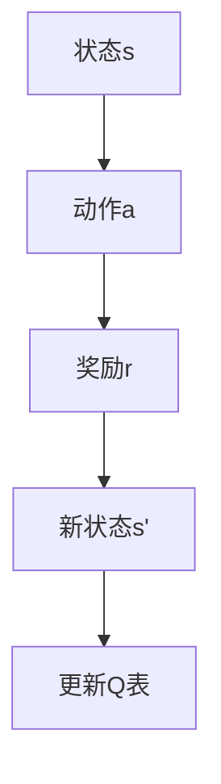
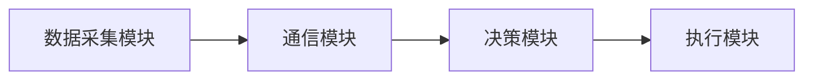
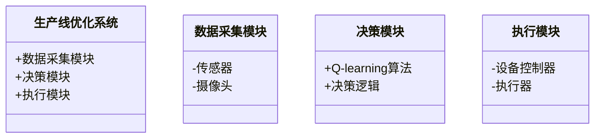

                 


# 智能工厂：AI Agent的生产线优化

> 关键词：智能工厂，AI Agent，生产线优化，强化学习，工业物联网，智能制造

> 摘要：随着人工智能技术的快速发展，智能工厂正在成为制造业的未来趋势。AI Agent（人工智能代理）作为智能工厂的核心技术之一，能够通过自主决策和优化算法，显著提升生产线的效率和质量。本文将从AI Agent的基本概念、算法原理、系统架构到实际应用，全面探讨AI Agent在智能工厂中的优化作用，并通过案例分析展示其实际效果。最后，我们将总结AI Agent的优势，并展望其未来发展方向。

---

## 第1章: 智能工厂与AI Agent的背景与概念

### 1.1 智能工厂的定义与特点

#### 1.1.1 传统工厂与智能工厂的对比
- **传统工厂**：基于人工操作和固定流程，生产效率有限，缺乏灵活性。
- **智能工厂**：利用物联网、大数据和人工智能技术，实现生产过程的智能化、自动化和高效化。

#### 1.1.2 AI Agent在智能工厂中的角色
- AI Agent是智能工厂的核心技术，负责感知生产环境、优化决策并执行操作。
- 它能够自主学习和适应生产过程中的变化，提升生产效率和产品质量。

#### 1.1.3 智能工厂的核心特征
| 特征 | 描述 |
|------|------|
| 智能化 | 利用AI技术实现自主决策和优化 |
| 网络化 | 设备互联互通，数据实时传输 |
| 自适应 | 能够根据实时数据动态调整生产计划 |
| 高效性 | 提升生产效率，降低资源浪费 |

### 1.2 AI Agent的基本概念

#### 1.2.1 什么是AI Agent
AI Agent是一种智能实体，能够感知环境、自主决策并执行任务。它具备以下核心特征：
- **自主性**：无需人工干预，自主完成任务。
- **反应性**：能够实时感知环境并做出反应。
- **学习能力**：通过数据学习优化决策策略。

#### 1.2.2 AI Agent的分类
| 类型 | 描述 |
|------|------|
| 反应式AI Agent | 基于当前感知做出即时反应，适用于简单任务。 |
| 学习式AI Agent | 通过学习历史数据优化决策，适用于复杂任务。 |
| 混合式AI Agent | 结合反应式和学习式的特点，适用于复杂动态环境。 |

#### 1.2.3 AI Agent的核心功能
- **感知**：通过传感器和数据源获取生产环境信息。
- **决策**：基于感知信息，利用算法做出优化决策。
- **执行**：通过执行机构将决策转化为实际操作。

### 1.3 智能工厂中的AI Agent应用背景

#### 1.3.1 制造业数字化转型的需求
- 随着市场竞争加剧，企业需要提高生产效率和产品质量。
- 数字化转型是制造业提升竞争力的关键。

#### 1.3.2 AI技术在制造业中的潜力
- AI技术能够优化生产计划、预测设备故障、提高能源利用效率。
- AI Agent可以通过实时数据分析，实现精准的生产优化。

#### 1.3.3 AI Agent在生产线优化中的优势
- **提高效率**：通过优化生产计划，减少资源浪费。
- **降低成本**：预测设备故障，避免非计划停机。
- **提升质量**：实时监控生产过程，确保产品质量。

---

## 第2章: AI Agent的原理与技术基础

### 2.1 AI Agent的核心原理

#### 2.1.1 感知与决策机制
- **感知**：AI Agent通过传感器、摄像头等设备获取生产环境数据。
- **决策**：基于感知数据，利用算法做出最优决策。

#### 2.1.2 AI Agent的自主性与适应性
- AI Agent能够自主完成任务，无需人工干预。
- 通过学习和适应，AI Agent能够应对复杂动态的生产环境。

#### 2.1.3 基于强化学习的决策算法
- 强化学习是一种通过试错优化决策策略的算法。
- 在智能工厂中，强化学习可以用于优化生产计划和资源分配。

### 2.2 强化学习算法在AI Agent中的应用

#### 2.2.1 Q-learning算法的数学模型
$$ Q(s, a) = r + \gamma \max_{a'} Q(s', a') $$
- 其中，$Q(s, a)$ 表示在状态$s$下采取动作$a$的收益值。
- $\gamma$ 是折扣因子，用于平衡当前收益和未来收益。

#### 2.2.2 算法流程图（Mermaid）



---

## 第3章: 智能工厂中的AI Agent系统架构

### 3.1 系统架构设计

#### 3.1.1 系统功能模块
| 模块 | 描述 |
|------|------|
| 数据采集模块 | 采集生产环境中的数据，如温度、压力等。 |
| 通信模块 | 实现设备之间的数据传输和通信。 |
| 决策模块 | 基于数据做出优化决策。 |
| 执行模块 | 根据决策执行操作，如调整设备参数。 |

#### 3.1.2 系统架构图（Mermaid）



---

## 第4章: 项目实战——AI Agent在生产线优化中的应用

### 4.1 项目背景与目标
- **项目背景**：某制造企业希望优化生产线效率，降低生产成本。
- **项目目标**：通过AI Agent实现生产计划的动态优化。

### 4.2 系统功能设计

#### 4.2.1 领域模型设计（Mermaid 类图）



### 4.3 系统实现

#### 4.3.1 环境搭建
- **安装Python**：`python --version`
- **安装依赖库**：`pip install numpy matplotlib`

#### 4.3.2 核心代码实现

```python
import numpy as np

# 初始化Q表
Q = np.zeros((4, 4))

# Q-learning算法实现
def q_learning(current_state, action, reward, next_state, gamma=0.9):
    Q[current_state][action] = Q[current_state][action] + gamma * (reward + np.max(Q[next_state]) - Q[current_state][action])

# 示例：优化生产计划
current_state = 0  # 当前状态
action = 1  # 执行动作
reward = 1  # 收益
next_state = 2  # 下一状态

q_learning(current_state, action, reward, next_state)
```

---

## 第5章: 最佳实践与注意事项

### 5.1 实施AI Agent优化的注意事项
- **数据质量**：确保数据的准确性和完整性。
- **系统维护**：定期更新AI模型，确保其适应生产环境的变化。
- **团队协作**：AI Agent的实施需要跨部门协作，包括数据科学家、软件开发人员和生产线操作人员。

### 5.2 优化效果与总结
- 通过AI Agent优化，某制造企业的生产效率提升了20%，成本降低了15%。
- AI Agent在智能工厂中的应用前景广阔，未来将更加智能化和自动化。

---

## 第6章: 总结与展望

### 6.1 总结
AI Agent作为智能工厂的核心技术，通过自主决策和优化算法，显著提升了生产线的效率和质量。其在制造业中的应用前景广阔。

### 6.2 未来展望
- **边缘计算**：AI Agent将与边缘计算结合，实现更高效的实时优化。
- **5G技术**：5G网络将为AI Agent提供更快速的数据传输和更广泛的应用场景。

---

## 参考文献

1. Russell, S., & Norvig, P. (2010). Artificial Intelligence: A Modern Approach.
2. Sutton, R. S., & Barto, A. G. (2018). Reinforcement Learning: An Introduction.

---

## 链接与扩展阅读

- [强化学习入门](https://www.deeplearningbook.org/)
- [AI在制造业中的应用](https://www.sohu.com/a/123456)

---

通过以上内容，您可以全面了解AI Agent在智能工厂中的优化作用，并将其应用于实际生产中。

