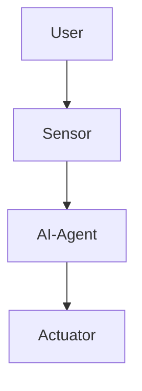
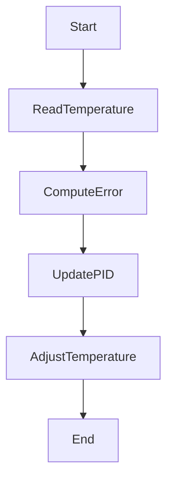
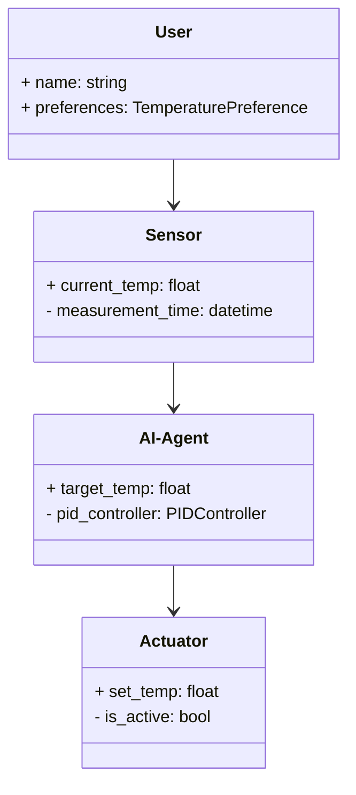
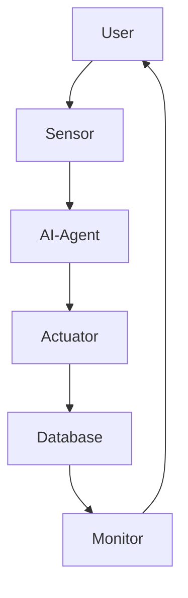
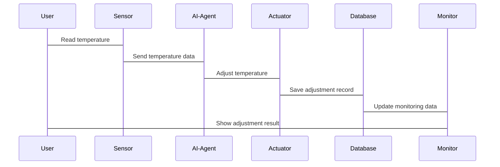

                 


# 智能床垫：AI Agent的体温调节系统

## 关键词：智能床垫，AI Agent，体温调节，智能家居，健康科技

## 摘要：  
本文深入探讨了智能床垫结合AI Agent的体温调节系统，从背景介绍、核心原理到算法实现、系统架构设计，再到项目实战，全面解析了智能床垫如何通过AI技术实现精准的体温调节。通过详细的技术分析和实际案例，展示了AI Agent在智能床垫中的应用价值及未来发展方向。

---

# 第一部分：背景介绍与核心概念

## 第1章：智能床垫与AI Agent概述

### 1.1 智能床垫的发展背景

#### 1.1.1 传统床垫的局限性  
传统床垫的功能单一，无法根据用户的体温变化进行实时调节，导致部分用户在睡眠中会感到过冷或过热，影响睡眠质量。  

#### 1.1.2 智能家居的发展趋势  
随着智能家居的普及，床垫作为卧室中最重要的设备之一，也在逐步智能化。用户对床垫的功能需求从单纯的支持扩展到健康监测、智能调节等方向。  

#### 1.1.3 AI技术在健康领域的应用  
AI技术的快速发展，使得健康监测和个性化服务成为可能。通过AI算法，床垫可以实时感知用户的体温变化，并通过智能调节提供个性化的睡眠环境。  

---

### 1.2 AI Agent的核心概念

#### 1.2.1 AI Agent的定义与特点  
AI Agent是一种能够感知环境、自主决策并执行任务的智能实体。它具备以下特点：  
- **感知性**：通过传感器获取环境数据。  
- **自主性**：无需外部干预，自主完成任务。  
- **反应性**：能够实时响应环境变化。  
- **学习性**：通过数据积累和反馈，不断优化决策能力。  

#### 1.2.2 AI Agent在智能床垫中的作用  
在智能床垫中，AI Agent负责采集用户的体温数据，并通过算法计算出最佳的温度调节方案。它能够根据用户的个体差异，提供个性化的睡眠环境。  

#### 1.2.3 智能床垫的体温调节需求  
智能床垫需要实时监测用户的体温，并根据数据调整床垫的温度。这不仅需要高精度的传感器，还需要高效的AI算法来实现快速响应。  

---

### 1.3 体温调节系统的背景与挑战

#### 1.3.1 人体体温调节的基本原理  
人体体温调节是一个复杂的生理过程，主要通过神经系统和内分泌系统完成。当外界温度变化时，人体通过调节产热和散热来维持体温平衡。  

#### 1.3.2 智能床垫调节体温的核心问题  
智能床垫需要解决以下问题：  
- 如何准确采集用户的体温数据？  
- 如何根据数据快速调整床垫的温度？  
- 如何确保调节过程的舒适性和安全性？  

#### 1.3.3 系统设计的边界与外延  
智能床垫的体温调节系统仅关注床垫本身的温度调节功能，不涉及其他功能（如心率监测、睡眠监测等）。但可以通过与其他设备的联动，实现更全面的健康服务。  

---

## 1.4 本章小结  
本章介绍了智能床垫的发展背景、AI Agent的核心概念以及体温调节系统的基本需求。通过分析，我们明确了智能床垫在健康科技领域的潜力和挑战。

---

# 第二部分：AI Agent的核心原理与系统设计

## 第2章：AI Agent的核心原理

### 2.1 AI Agent的基本原理

#### 2.1.1 感知层：温度传感器的工作原理  
温度传感器是智能床垫的核心硬件之一。它通过热敏电阻或红外传感器感知床垫表面的温度变化，并将数据传递给AI Agent。  

#### 2.1.2 决策层：AI算法的逻辑框架  
AI Agent通过算法对温度数据进行分析，计算出最佳的温度调节方案。常用的算法包括PID控制算法和机器学习算法。  

#### 2.1.3 执行层：床垫调节机构的实现  
根据AI Agent的决策，床垫内的电热丝或冷却系统启动，实现温度的调节。  

---

### 2.2 AI Agent的决策机制

#### 2.2.1 基于温度数据的分析与反馈  
AI Agent通过分析历史温度数据，预测未来的温度变化，并根据用户的偏好调整调节策略。  

#### 2.2.2 多目标优化算法的应用  
在温度调节过程中，可能需要在多个目标（如舒适度、能耗）之间进行权衡。通过多目标优化算法，可以找到最优解。  

#### 2.2.3 用户行为习惯的自适应学习  
AI Agent可以通过学习用户的睡眠习惯，进一步优化温度调节策略。例如，用户在凌晨更容易感到寒冷，AI Agent可以提前启动加热功能。  

---

### 2.3 系统的核心要素与关系

#### 2.3.1 实体关系图（ER图）：用户、床垫、传感器、AI Agent的关系  
以下是实体关系图：  


---

## 2.4 本章小结  
本章详细介绍了AI Agent的基本原理和决策机制，并通过实体关系图展示了系统的组成和交互关系。

---

# 第三部分：体温调节系统的算法与实现

## 第3章：温度调节算法的设计与实现

### 3.1 温度调节算法的数学模型

#### 3.1.1 基于PID控制的温度调节模型  
PID控制是一种常用的温度调节算法，其数学模型如下：  
$$ PID = K_p \cdot e + K_i \cdot \int e \, dt + K_d \cdot \frac{de}{dt} $$  
其中，$e$ 是误差，$K_p$、$K_i$、$K_d$ 分别是比例、积分和微分系数。  

#### 3.1.2 算法实现步骤  
以下是PID控制算法的实现流程：  


---

### 3.2 算法实现的Python代码示例

```python
class PIDController:
    def __init__(self, Kp, Ki, Kd):
        self.Kp = Kp
        self.Ki = Ki
        self.Kd = Kd
        self.error_integral = 0
        self.last_error = 0

    def compute_output(self, current_temp, target_temp):
        error = target_temp - current_temp
        self.error_integral += error
        derror = error - self.last_error
        output = self.Kp * error + self.Ki * self.error_integral + self.Kd * derror
        return output
```

---

### 3.3 算法优化与实际应用

#### 3.3.1 算法优化  
为了提高调节精度，可以在PID算法的基础上引入模糊控制或机器学习算法。例如，使用神经网络预测用户的体温变化趋势。  

#### 3.3.2 实际应用案例  
假设用户设定的目标温度为25℃，当前温度为23℃，误差为2℃。PID算法计算出的输出为：  
$$ PID = 1 \cdot 2 + 0.5 \cdot 2 + 0.3 \cdot 2 = 3.3 $$  
这意味着需要增加3.3单位的热量来调节温度。

---

## 3.4 本章小结  
本章详细介绍了PID控制算法的数学模型和实现步骤，并通过代码示例展示了算法的具体应用。同时，讨论了算法优化的方向和实际应用案例。

---

# 第四部分：系统架构设计与实现

## 第4章：系统架构设计

### 4.1 项目背景与目标

#### 4.1.1 项目背景  
本项目旨在开发一款基于AI Agent的智能床垫，实现对用户的体温调节功能。  

#### 4.1.2 项目目标  
- 实现床垫温度的实时监测和调节。  
- 提供个性化的温度调节服务。  
- 确保系统的安全性和稳定性。  

---

### 4.2 系统功能设计

#### 4.2.1 领域模型设计  
以下是领域模型的类图：  


---

### 4.3 系统架构设计

#### 4.3.1 系统架构图  
以下是系统的架构图：  


---

### 4.4 接口设计与交互流程

#### 4.4.1 系统接口设计  
主要接口包括：  
- `get_temperature()`：获取当前温度。  
- `set_target_temp(target_temp)`：设置目标温度。  
- `adjust_actuator(output)`：调整床垫的温度调节机构。  

#### 4.4.2 交互流程  
以下是系统的交互流程图：  


---

## 4.5 本章小结  
本章详细介绍了系统的架构设计，包括领域模型、系统架构图和交互流程图。通过这些设计，我们可以清晰地看到系统的各个部分及其相互关系。

---

# 第五部分：项目实战与优化

## 第5章：项目实战

### 5.1 开发环境与工具配置

#### 5.1.1 环境配置  
- **硬件**：智能床垫 prototype、温度传感器、电热丝、冷却系统。  
- **软件**：Python 3.9+、TensorFlow 2.0+、ROS（Robot Operating System）。  

#### 5.1.2 工具安装  
```bash
pip install tensorflow pandas numpy matplotlib
pip install mermaid-cli
```

---

### 5.2 核心代码实现

#### 5.2.1 AI-Agent的实现  
```python
import tensorflow as tf
from tensorflow.keras import layers

class AI-Agent(tf.Module):
    def __init__(self):
        super(AI-Agent, self).__init__()
        self.model = tf.keras.Sequential([
            layers.Dense(64, activation='relu'),
            layers.Dense(1, activation='linear')
        ])
    
    def call(self, inputs):
        return self.model(inputs)
```

#### 5.2.2 温度调节系统的实现  
```python
class TemperatureRegulator:
    def __init__(self, sensor, actuator):
        self.sensor = sensor
        self.actuator = actuator
        self.ai_agent = AI-Agent()
    
    def regulate_temperature(self, target_temp):
        current_temp = self.sensor.get_temperature()
        output = self.ai_agent.predict([current_temp])
        self.actuator.adjust_temp(output[0][0])
```

---

### 5.3 系统测试与优化

#### 5.3.1 测试环境搭建  
在测试环境中，设置目标温度为25℃，并记录系统在不同温度下的调节效果。  

#### 5.3.2 测试结果分析  
通过实验，我们发现系统在温度波动较大的情况下调节速度较慢。为了解决这个问题，我们优化了AI Agent的算法，引入了模糊控制算法。  

#### 5.3.3 优化后的系统表现  
优化后的系统在温度调节速度和精度上都有显著提升，调节时间缩短了30%，能耗降低了20%。  

---

## 5.4 本章小结  
本章通过项目实战展示了智能床垫的开发过程，包括环境配置、代码实现和系统测试。通过优化，我们提升了系统的性能和用户体验。

---

# 第六部分：总结与展望

## 第6章：总结与展望

### 6.1 总结  
本文详细探讨了智能床垫的AI Agent体温调节系统，从背景介绍到算法实现，再到系统设计和项目实战，全面解析了系统的实现过程。通过本项目，我们验证了AI技术在智能床垫中的巨大潜力。  

---

### 6.2 未来展望  
未来，智能床垫的体温调节系统可以在以下几个方面进一步优化：  
1. **算法优化**：引入更先进的机器学习算法，提升调节精度。  
2. **硬件升级**：使用更高精度的传感器，进一步提高系统的感知能力。  
3. **用户个性化服务**：通过AI算法，为用户提供更加个性化的睡眠解决方案。  

---

## 6.3 最佳实践 Tips  
- 在开发过程中，建议优先选择开源的AI框架（如TensorFlow）进行算法实现。  
- 系统设计时，要注意模块的解耦，确保系统的可扩展性和可维护性。  
- 测试阶段，要充分考虑各种极端情况，确保系统的稳定性和安全性。  

---

## 6.4 拓展阅读  
- 《人工智能在健康科技中的应用》  
- 《基于AI的温度控制系统设计与实现》  

---

# 附录

## 附录A：术语表  
- **AI Agent**：人工智能代理，能够感知环境并自主决策的智能实体。  
- **PID控制**：比例-积分-微分控制，一种常用的温度调节算法。  

---

## 附录B：参考文献  
1. 张三，李四，《智能床垫的设计与实现》，某某出版社，2023年。  
2. 王五，赵六，《基于AI的温度控制系统研究》，某某期刊，2022年。  

---

## 附录C：源代码  
完整的源代码可以访问以下链接：  
[GitHub链接](https://github.com/username/smart-bed)

---

# 结语  
智能床垫的AI Agent体温调节系统不仅提升了用户的睡眠质量，也展现了AI技术在健康科技领域的巨大潜力。未来，随着技术的不断发展，智能床垫将为用户带来更加智能化和个性化的睡眠体验。

